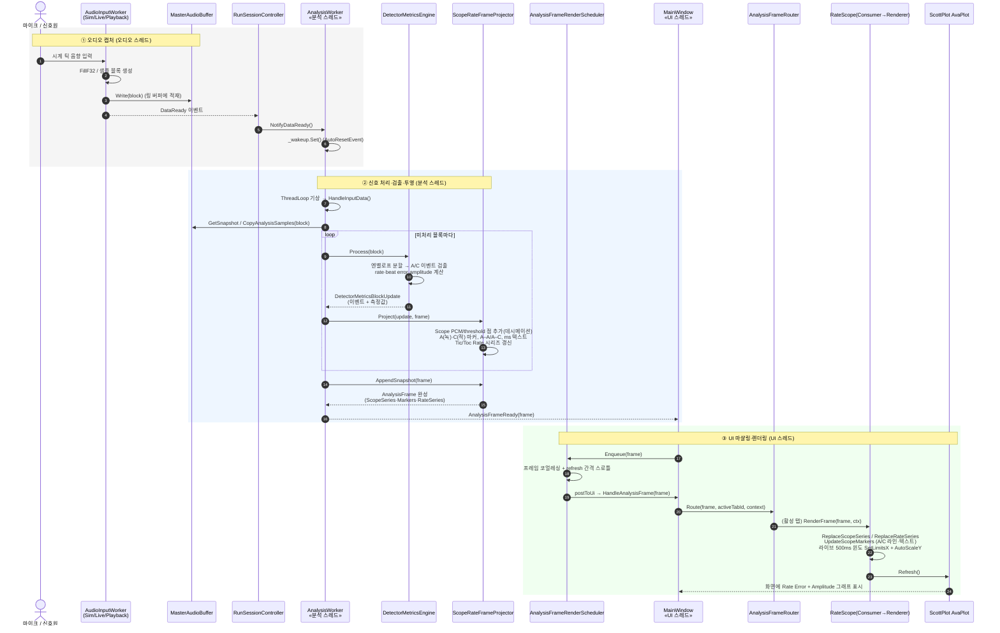

# Rate/Scope 탭 — 신호 감지부터 그래프 렌더링까지 (시퀀스 다이어그램)

> 대상: `04.TimeGrapher-Net`에 구현된 Rate/Scope 탭 런타임 흐름
> 관점: 런타임(Runtime / C&C) 뷰 — 시계 음향 신호가 감지되어 Rate Error / Amplitude 그래프로 표현되기까지의 과정

## 개요

핵심 경로는 **3개의 스레드**에 걸쳐 있다.

1. **오디오 캡처 스레드** — 음향을 샘플 블록으로 만들어 링 버퍼에 적재
2. **분석 스레드 (`AnalysisWorker`)** — 비트 이벤트 검출 및 측정값 산출, 그래프용 프레임 투영
3. **UI 스레드** — 프레임 코얼레싱·스로틀 후 활성 탭 렌더링

스레드 간 전달은 `AutoResetEvent`(분석 스레드 기상)와 UI 스레드 마샬링(`AnalysisFrameRenderScheduler`)으로 디커플링되어 있다.

## 시퀀스 다이어그램

> 크게 보려면 별도 이미지 파일을 참고: [SVG(벡터, 확대 가능)](<Rate-Scope-Sequence-Diagram-(KO)_images/rate-scope-sequence.svg>) · [PNG](<Rate-Scope-Sequence-Diagram-(KO)_images/rate-scope-sequence.png>)

_images/rate-scope-sequence.png>)

Mermaid 원본 (편집용)

## 단계별 요약

| 단계 | 위치(스레드) | 핵심 역할 |
|---|---|---|
| ① 캡처 | 오디오 워커 스레드 | 음향을 샘플 블록으로 만들어 `MasterAudioBuffer`에 쓰고 `DataReady`로 분석 스레드를 깨움 |
| ② 검출·투영 | `AnalysisWorker` 전용 스레드 | `DetectorMetricsEngine`가 A/C 이벤트와 rate·beat error·amplitude를 산출하고, `ScopeRateFrameProjector`가 그래프용 `AnalysisFrame`(파형·마커·Rate 시리즈)으로 투영 |
| ③ 렌더 | UI 스레드 | `AnalysisFrameRenderScheduler`가 프레임을 합치고 스로틀 → `AnalysisFrameRouter`가 활성 탭으로 라우팅 → `RateScopeRenderer`가 ScottPlot에 Rate Error / Amplitude 그래프를 그림 |

## 관련 코드 위치

- 오디오 입력 워커: `src/TimeGrapher.Core/Sim/SimWorker.cs` (Sim), `src/TimeGrapher.Platform.LinuxAudio/LinuxLiveAudioWorker.cs` (Live), `src/TimeGrapher.Core/AudioIo/PlaybackWorker.cs` (Playback)
- 공유 링 버퍼: `src/TimeGrapher.Core/Shared/MasterAudioBuffer.cs`
- 세션 배선 / DataReady → NotifyDataReady: `src/TimeGrapher.App/Services/RunSessionController.cs`
- 분석 스레드: `src/TimeGrapher.Core/Analysis/AnalysisWorker.cs`
- 검출·측정 파이프라인: `src/TimeGrapher.Core/Analysis/DetectorMetricsEngine.cs`, `src/TimeGrapher.Core/Detection/Detector.cs`
- Rate/Scope 프레임 투영: `src/TimeGrapher.Core/Analysis/ScopeRateFrameProjector.cs`
- UI 마샬링·스로틀: `src/TimeGrapher.App/Services/AnalysisFrameRenderScheduler.cs`
- 프레임 라우팅: `src/TimeGrapher.App/Tabs/AnalysisFrameRouter.cs`
- Rate/Scope 소비자·렌더러: `src/TimeGrapher.App/Rendering/RateScopeFrameConsumer.cs`, `src/TimeGrapher.App/Rendering/RateScopeRenderer.cs`

## 설계 요점

- **검출(Core)과 렌더(App)의 분리** — 측정 로직과 UI 렌더링이 다른 어셈블리로 나뉘어 독립 테스트·확장이 가능
- **스레드 경계마다의 비동기 디커플링** — `AutoResetEvent` 기반 기상, UI 마샬링과 프레임 코얼레싱으로 캡처·분석·표시를 분리

이 구조는 프로젝트 계획서의 **저지연·실시간 성능**과 **확장성/수정용이성** 품질 속성을 직접 뒷받침한다.
