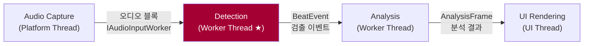
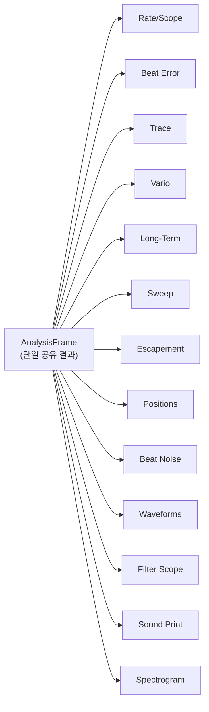
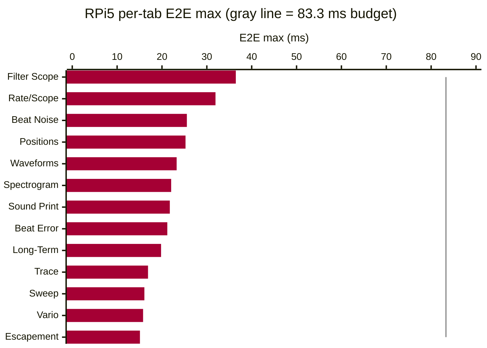

# TimeGrapher 최종 발표 스크립트 (한국어) — Part 2: 발표

> **Team 5 · TimeGrapherNet** — 최종 LG SW Architect 발표 (20분)
> 형식: **[발표자]** 한국어 대사 + **[지시문]** 동작 지시.
>
> 슬라이드 스토리: QA 정의 + 달성 (Area 3·4) → 아키텍처 해법 (Area 4·5) → Extensibility (Area 5) → AI Feature (Area 2·7) → Lessons Learned (Area 7)

---

## 발표 타임라인

| # | 슬라이드 | 시간 | 채우는 Rubric |
|---|---|---|---|
| 표지 | TimeGrapher & 팀 소개 | 0:30 | — |
| 1-1 | UI 캡처 | 0:30 | — |
| 1-2 | 전체 아키텍처 개요 | 0:30 | — |
| 2-1 | 최우선 QA: Accuracy | 2:30 | **Area 3 (20점)** |
| 2-2 | 두 번째 QA: Performance (Latency) | 2:30 | **Area 3·4 (20·25점)** |
| 2-3 | 아키텍처 해법 & 실측 근거 | 3:00 | **Area 4·5 (25·20점)** |
| 3 | Extensibility (Modifiability) | 2:30 | **Area 5 (20점)** |
| 4 | AI Feature | 2:00 | **Area 2·7 (25·15점)** |
| 5-1 | Lessons Learned: Agentic Engineering | 2:00 | **Area 7 (15점)** |
| 5-2 | Lessons Learned: 강점·한계·결론 | 1:00 | **Area 7 (15점)** |

---

# PART 2 — 발표 (20분)

---

## 표지

**[지시문]** 팀 이름과 프로젝트 제목 슬라이드.

**[발표자]**
> "안녕하십니까, 저희는 팀 5입니다. 저희 프로젝트 TimeGrapher를 발표하겠습니다."

---

## 슬라이드 1-1. UI 캡처 (0:30)

**[지시문]** TimeGrapher UI 캡처 이미지 슬라이드.

**[슬라이드 비주얼 — TimeGrapher UI 캡처]**

**[발표자]**
> "오전 데모에서 보셨던 멋진 데모 기억하시나요? 우리의 TimeGrapher는 화면에 보이는 UI 캡처와 같이 사용자에게 직관적인 진단 정보를 제공합니다."

---

## 슬라이드 1-2. 전체 아키텍처 개요 (0:30)

**[지시문]** 좌측에 전체 Overview 아키텍처 다이어그램(그림 0), 우측에 배포 구성도 슬라이드.

**[슬라이드 비주얼 — 그림 0: 전체 아키텍처 개요]**

**[발표자]**
> "왼쪽의 그림은 시스템이 어떻게 구성되고 데이터가 흐르는지 보여주는 전체 Overview 아키텍처입니다. 오른쪽의 그림은 우리의 시스템이 어떻게 배포되는지를 간단히 보여줍니다. 이 구조가 어떻게 저희의 품질 목표를 달성하는지 지금부터 설명합니다."

---

## 슬라이드 2-1. 최우선 QA: Accuracy (2:30)
> ▣ RUBRIC: **Area 3 — Quality Attribute Tradeoff Discussion (20점)** — 주요 QA 식별 5점 / accuracy 최우선 입증 5점

**[지시문]** QAS-1 정의 + Verify 실험 결과 + Weishi 비교 표 + Core.Detection 메커니즘 다이어그램(그림 1) 슬라이드.

**[슬라이드 비주얼 — 그림 1: Core.Detection 정확도 메커니즘]**

**[슬라이드 비주얼 — 정확성 근거]**

| # | 근거 유형 | 내용 | 허용 기준 | 상태 |
|---|---|---|---|---|
| 1 | **두 시스템 비교** | TimeGrapher vs Weishi Timegrapher — 같은 시계 | Rate ±1 s/d · Amplitude ±1° · Beat Error ±0.1 ms | Pass |
| 2 | **자동화 검증 (Verify)** | CI 매 변경마다 합성 픽스처 vs 검출 BPH/이벤트 | ±1.0 s/d @ ≥1,000 박자 (QAS-1) | Pass |
| 3 | **테스트 스위트** | Core + App + Platform 전계층 | 0 실패 | 933 통과 |

**[발표자]**
> "프로젝트를 시작할 때 Dan, Steve와 논의하면서 **정확도(Accuracy)**를 가장 중요한 품질속성으로 정했습니다. 시계 측정기는 정확한 측정이 전부니까요. 측정값이 틀리면 다른 기능이 아무리 좋아도 의미가 없습니다.
>
> 저희가 정의한 QAS-1은 이렇습니다. 깨끗한 기준 입력에서 1,000박자 이상에 걸쳐 known reference 대비 ±1.0 s/d 이내. 그리고 결과적으로 이 목표를 달성했습니다.
>
> 확인을 위해 두 가지 실험을 했습니다. 하나는 시뮬레이션 신호를 이용한 Verify 실험입니다. 합성 픽스처와 검출 결과를 대조하는데, CI 매 변경마다 자동으로 검증됩니다. 또 하나는 실물 Weishi Timegrapher 기준기와 같은 시계를 동시에 측정해서 수치를 비교했는데, 레이트, 진폭, 비트 에러 모두 허용오차 이내로 일치했습니다.
>
> 이 정확도를 달성하기 위해 그림 1처럼 Core.Detection에 네 가지 신호처리 블록을 구현했습니다. **서브샘플 보간**으로 192kHz에서 정수 샘플보다 훨씬 정밀한 타이밍을 뽑아내고, **적응형 노이즈 바닥**으로 주변 소음 수준을 자동 추적합니다. **PLL 유도 게이팅**은 박자 리듬을 예측해서 예상 범위 밖의 신호를 노이즈로 걸러내고, **레짐 가드**는 연속 3회 동일한 변화가 있을 때만 측정값을 갱신합니다.
>
> 그런데 이 알고리즘 블록들이 추가됐다는 말은 처리 시간이 길어진다는 뜻이고, 저희가 두 번째로 중요하게 정의한 QA인 Performance와 충돌합니다."

---

## 슬라이드 2-2. 두 번째 QA: Performance (Latency) (2:30)
> ▣ RUBRIC: **Area 3 (20점)** — 트레이드오프 설명 5점 / 달성·한계 5점 · **Area 4 (25점)** — 저지연 6점

**[지시문]** QAS-2 정의, 83.3 ms 근거, E2E 지연 측정 결과 표 슬라이드.

**[슬라이드 비주얼 — EXP-02 결과 표 (Pi 5, 캡처→분석→화면 E2E)]**

| 날짜 | 조건 | 입력 | E2E 최악 | 예산 | 예산 사용률 | Drop | Miss | 결과 |
|:---|:---|:---|---:|---:|---:|---:|---:|:---|
| 2026-06-11 | 21600 BPH @ 48 kHz | Simulation | 41.975 ms | 166.667 ms | 25.2% | 0 | 0 | **Pass** |
| 2026-06-11 | 21600 BPH @ 48 kHz | Playback | 43.939 ms | 166.667 ms | 26.4% | 0 | 0 | **Pass** |
| 2026-06-11 | 21600 BPH @ 48 kHz | Live | 40.378 ms | 166.667 ms | 24.2% | 0 | 0 | **Pass** |
| 2026-06-11 | 43200 BPH @ 192 kHz | Simulation | 34.003 ms | 83.333 ms | 40.8% | 0 | 0 | **Pass** |
| 2026-06-11 | 43200 BPH @ 192 kHz | Playback | 34.562 ms | 83.333 ms | 41.5% | 0 | 0 | **Pass** |
| **2026-06-21** | **43200 BPH @ 192 kHz** | **Simulation** | **36.46 ms** | **83.333 ms** | **43.8%** | **0** | **0** | **Pass** |

**[발표자]**
> "저희 QAS-2는 이렇습니다. 최악의 경우 E2E 지연이 한 박자 주기 이내, 43200 BPH에서는 83.3 ms.
>
> 83.3 ms가 어떻게 나온 수치냐면, 저희가 지원하는 최고 속도인 43200 BPH에서 한 박자는 딱 83.3 ms입니다. 디스플레이가 한 박자 이상 뒤처지면 실시간 측정의 의미가 없어지거든요. 그래서 이 값을 지연 예산으로 정했습니다.
>
> 이 목표도 달성했습니다. Pi 5에서 각 그래프마다 캡처에서 처리까지, 처리에서 화면까지, 전체 E2E를 각각 측정했습니다. 모든 실행에서 Drop 0, Miss 0, 결과 Pass였고, 최악값도 예산의 43.8% 수준에 불과했습니다.
>
> 정리하면, Accuracy와 Performance, 두 핵심 QA가 서로 충돌하는 상황이었습니다. Accuracy를 높이려면 신호처리 블록이 늘어나고, 그러면 지연이 늘어나니까요. 이 둘을 동시에 만족시키는 아키텍처가 필요했습니다."

---

## 슬라이드 2-3. 아키텍처 해법 & 실측 근거 (3:00)
> ▣ RUBRIC: **Area 4 (25점)** — Pi 실시간 8점 / 정확성 6점 / 근거 5점 · **Area 5 (20점)** — modular, separates concerns 6점

**[지시문]** 그림 0(전체 아키텍처), 그림 2(파이프-앤-필터), 그림 3(AnalysisFrame 팬아웃), 탭별 E2E 차트 슬라이드.

**[슬라이드 비주얼 — 그림 0: 전체 아키텍처 개요 (스레드 분리)]**

**[슬라이드 비주얼 — 그림 2: 파이프-앤-필터 패턴]**

**[슬라이드 비주얼 — 그림 3: 단일 AnalysisFrame → 13개 디스플레이 팬아웃]**

**[슬라이드 비주얼 — 탭별 E2E 최악값 (RPi5, 43200@192k Sim, 회색 선 = 83.3 ms 예산)]**

**[발표자]**
> "Accuracy와 Performance를 동시에 달성하기 위한 아키텍처 해법은 세 가지입니다.
>
> 첫 번째는 **스레드 분리**입니다. 그림 0처럼 오디오 캡처, Detection, Analysis, UI 렌더링을 각각 독립적인 스레드로 분리했습니다. Detection 워커는 최고 우선순위 스레드로 동작하기 때문에, UI가 느려져도 신호 처리에 전혀 영향을 주지 않습니다.
>
> 두 번째는 **파이프-앤-필터 패턴**입니다. 그림 2처럼 오디오 입력부터 검출, 분석까지 각 단계가 concurrent하게 동작합니다. 여기서 중요한 결정이 하나 있었는데, Detection과 Metrics는 의도적으로 하나의 동기 핫패스로 유지했습니다. 이 둘을 완전히 분리하면 큐잉 오버헤드가 생겨서 83.3 ms 예산을 초과하거든요. 이게 Modifiability와 Latency 사이의 의식적인 트레이드오프였습니다.
>
> 세 번째는 **단일 AnalysisFrame 공유**입니다. 그림 3처럼 분석 결과를 하나의 AnalysisFrame에 담아서 13개 디스플레이가 모두 공유합니다. 각 그래프가 따로 계산할 필요가 없으니 CPU 낭비가 없고, 모든 디스플레이가 같은 데이터를 쓰니 불일치도 구조적으로 불가능합니다.
>
> 실제로 13개 탭 각각의 실행 시간을 측정했습니다. 가장 느린 Filter Scope가 36.46 ms, 가장 빠른 Escapement가 15.09 ms, 13개 탭 모두 83.3 ms 예산 이내였고, Drop 0, Miss 0이었습니다."

---

## 슬라이드 3. Extensibility (Modifiability) (2:30)
> ▣ RUBRIC: **Area 5 — Extensibility (20점)**: supports adding new displays with limited redesign (6점) + explains future requirements/enhancements (4점) + understandable/maintainable (4점)

**[지시문]** 그림 3(AnalysisFrame 팬아웃) + 그림 4(모듈 구조 뷰) + 새 탭 추가 레시피 슬라이드.

**[슬라이드 비주얼 — 그림 4: 프로젝트 모듈 구조]**

**[슬라이드 비주얼 — 새 디스플레이 추가 4단계 레시피]**

**[발표자]**
> "세 번째로 중요하게 정의한 QA는 Modifiability입니다. 시나리오는, 새 그래프, 필터, 측정은 기존 모듈을 최대 1개만 건드린다는 것입니다.
>
> 이렇게 정한 이유는 단순합니다. 짧은 기간에 많은 기능을 구현해야 했거든요. 하나 추가할 때마다 기존 코드를 많이 건드려야 한다면 13개 디스플레이를 다 만드는 게 불가능했을 겁니다.
>
> 이를 위한 구조적 결정이 두 가지였습니다. 첫 번째는 **Core 의존성 제거**입니다. Core가 UI나 OS에 전혀 의존하지 않습니다. 덕분에 기존 코드에서 GUI 레이어가 음성 신호를 직접 처리하던 성능 문제가 해결됐고, 분석 엔진이 UI 변경으로부터 완전히 분리됐습니다. 두 번째는 **단일 AnalysisFrame 팬아웃**입니다. 모든 디스플레이가 같은 AnalysisFrame을 소비하니까, 새 디스플레이를 추가해도 분석 로직은 건드릴 필요가 없습니다.
>
> 실제로 새 그래프를 추가할 때 네 곳만 건드립니다. AnalysisFrame에 속성 하나, AnalysisWorker에 할당 한 줄, App.Rendering 폴더에 렌더러 파일 하나, InfoTabCatalog에 등록 한 줄. 라우팅 인프라가 자동으로 인식하고, 기존 Detection·Metrics·Imaging은 전혀 건드리지 않습니다. 13개 탭 전부 이 방식으로 만들었습니다.
>
> 미래 요구사항도 마찬가지입니다. 새 OS를 지원하려면 Platform 어셈블리 하나만 추가하면 되고, 새 입력 소스는 IAudioInputWorker 구현체 하나면 됩니다. 그리고 CI가 Core의 무의존성을 매 커밋마다 자동으로 검사해서, 이 경계가 깨지면 빌드가 실패합니다."

---

## 슬라이드 4. AI Feature (2:00)
> ▣ RUBRIC: **Area 2 (25점)** — AI Feature · **Area 7 (15점)** — Use of AI in Building the Software

**[지시문]** 그림 0(전체 아키텍처에서 AI 컴포넌트 강조) 슬라이드.

**[슬라이드 비주얼 — 그림 0: 전체 아키텍처 — AI 컴포넌트 위치]**

**[발표자]**
> "저희 TimeGrapher에는 두 가지 AI 기능이 들어가 있습니다.
>
> 첫 번째는 **신호 품질 분류기**입니다. Analysis 경로 안에 위치하고, SNR, 피크 마진, 노이즈 바닥, 인터벌 지터 같은 8개 신호 특성을 받아서 현재 신호 상태를 Good, Noisy, WeakSignal, Unstable 네 가지로 분류합니다. Raspberry Pi 5에서 ONNX 모델이 온디바이스로 동작합니다. 중요한 점은 이 분류기가 자문 역할만 한다는 겁니다. 박자 이벤트를 생성하거나 타이밍을 바꿀 수 없도록 아키텍처로 막혀 있어서, 모델이 틀려도 측정값에는 영향을 줄 수 없습니다.
>
> 두 번째는 **LLM 기반 시계 진단 기능**입니다. 사용자가 UI에서 진단을 요청하면, UI가 AWS에 구현한 API 서버를 호출합니다. API 서버가 외부 서비스인 Gemini를 호출해서 측정 데이터를 분석하고, 시계 상태 진단 결과를 반환합니다. 온디바이스에서 복잡한 도메인 지식을 처리하는 대신 외부 LLM을 활용한 구조입니다."

---

## 슬라이드 5-1. Lessons Learned: Agentic Engineering (2:00)
> ▣ RUBRIC: **Area 7 — Use of AI in Building the Software (15점)** — 설명 5점 / 사려깊은 활용 5점

**[발표자]**
> "마지막으로 이번 프로젝트에서 배운 점들을 공유드리겠습니다. 저희는 Gen AI를 통한 **Agentic Engineering**을 적극적으로 활용했습니다.
>
> 그냥 AI에게 코드를 짜달라고 하는 게 아니라, AI가 저희 팀 방식을 따르도록 두 가지 메커니즘을 만들었습니다.
>
> **AGENTS.md**에는 프로젝트 규칙, 커밋 형식, 아키텍처 원칙을 정의했습니다. 모든 AI 세션이 이 컨텍스트에서 시작하기 때문에 AI가 저희 컨벤션을 자연스럽게 따릅니다. **DocRules.md**는 강의 자료에서 가져온 문서 품질 기준입니다. AI가 문서를 작성하면 이 기준으로 검토하고, 검토 결과를 다시 AI에게 전달해서 개선하는 루프를 돌렸습니다.
>
> 이 구조 덕분에 최종 결정은 항상 사람이 했고, AI는 저희 프로세스의 한 부분으로 동작했습니다.
>
> 활용 영역은 다섯 가지입니다. 첫째, **베이스 코드 변환** — Qt/C++ 코드를 C# 관용구로 변환하는 작업에 활용했고, Verify와 테스트로 정확성을 확인했습니다. 둘째, **코드 구현** — 렌더러, 테스트 픽스처, 버퍼 풀 같은 반복 구현을 AI와 함께 작성하고 사람이 검토했습니다. 셋째, **CI/CD 파이프라인** 설계와 자동화. 넷째, **933개 테스트 생성**. 다섯째, **문서 번역** — 아키텍처 문서와 발표 스크립트의 한국어·영어 버전을 AI로 초안 작성 후 DocRules.md 기준으로 검토·수정했습니다."

---

## 슬라이드 5-2. Lessons Learned: 강점·한계·결론 (1:00)
> ▣ RUBRIC: **Area 7 (15점)** — 강점·한계·위험 5점

**[발표자]**
> "이 과정에서 배운 점들입니다.
>
> 가장 큰 **강점**은 생산성이었습니다. AI 덕분에 소규모 팀이 대형 실시간 앱 포팅, 온디바이스 분류기 추가, 빌드/테스트/릴리스 자동화를 모두 해낼 수 있었습니다. AGENTS.md와 DocRules.md로 제어했기 때문에 개인 즉흥 프롬프팅이 아닌 일관된 팀 프로세스로 운영됐습니다.
>
> **한계**도 분명히 있었습니다. 출력물을 꼼꼼히 검토해야 했고, 프로젝트 맥락을 완전히 이해하지 못해서 그럴듯하지만 틀린 제안을 하기도 했습니다. 로컬 환경이나 브랜치 상태를 실수하는 경우도 있었고, 깊은 설계 의도는 사람이 직접 채워야 했습니다.
>
> 결론적으로, **저희는 AI를 확인이 필요한 빠른 협력자로 대했습니다 — 권위자가 아닌.**"

---

## 결론 (0:30)

**[발표자]**
> "요약하면, Accuracy와 Performance라는 두 핵심 QA를 동시에 달성하기 위해 스레드 분리와 파이프-앤-필터 아키텍처를 설계했고, Core 무의존 구조 덕분에 13개 디스플레이를 효율적으로 구현했습니다. TinyML 신호 품질 분류기와 LLM 기반 진단이라는 두 AI 기능을 통합했으며, Agentic Engineering으로 소규모 팀이 대형 실시간 프로젝트를 완수할 수 있었습니다. 감사합니다. 질문 있으시면 기꺼이 받겠습니다."

---

## 부록 C. 예상 Q&A

| 질문 | 핵심 답변 |
|---|---|
| "정확도를 어떻게 보장했나?" | 두 계층: **아키텍처**는 QAS-1 목표를 정의하고 Verify 모듈로 헤드리스 검증을 가능하게 함; **Core.Detection 구현**이 실제로 달성 — 서브샘플 보간, 적응형 노이즈 바닥, PLL 유도 게이팅, 레짐 가드. Weishi 비교 + Verify adverse 수치로 입증. |
| "83.3 ms는 어떻게 나온 수치인가?" | 43200 BPH = 초당 12박자 = 한 박자 83.3 ms. 디스플레이가 한 박자 이상 뒤처지지 않으려면 E2E ≤ 83.3 ms. 지원 최고 BPH 기준 최악값으로 정의. |
| "Accuracy와 Latency 트레이드오프를 어떻게 해결했나?" | 스레드 분리 + 파이프-앤-필터로 Detection을 최고 우선순위 스레드에서 독립 실행. Detection+Metrics는 의도적으로 단일 핫패스 유지 — 완전한 파이프라인 분리는 큐잉 오버헤드가 예산 초과. |
| "새 그래프를 추가하려면?" | AnalysisFrame 속성 1개 + AnalysisWorker 할당 1줄 + App.Rendering 렌더러 파일 1개 + InfoTabCatalog 등록 1줄. 기존 모듈 불변. CI가 경계 강제. |
| "LLM 진단 기능의 응답 속도는?" | API 서버 → Gemini 왕복이므로 네트워크 지연이 있습니다. 실시간 측정 경로(83.3 ms 예산)와 완전히 분리된 별도 기능으로, 측정 정확도에 영향을 주지 않습니다. |
| "TinyML 분류기가 틀리면?" | 분류기는 자문(advisory)만 합니다 — 이벤트 생성·retiming·BPH 수정이 아키텍처로 차단되어 있어 측정값에 영향을 줄 수 없습니다. |
| "MVVM은 완전한가?" | 완전한 교과서식 MVVM이라고 과장하지 않습니다. View/ViewModel/Model 분리와 ViewModel testability가 방향이고, 일부 lifecycle은 code-behind에 남아 있습니다. |
| "CI/CD로 정확도를 검증한다고 했는데?" | CI/CD는 개선 방법이지 애플리케이션 자체가 아닙니다. 정확도 주장은 runtime 설계 선택 + Weishi 비교 + 반복 측정이 먼저. Verify/CI는 그 정확도가 회귀하지 않게 막는 supporting evidence입니다. |

---

## 부록 D. 슬라이드 ↔ SW Architecture 문서 근거

| 슬라이드 | 문서 근거 | 핵심 한 줄 |
|---|---|---|
| 2-1. Accuracy | 2-Architectural-Drivers.md (QAS-1), 4-Planned-Experiments.md (EXP-06) | QAS-1: ≥1,000박자에서 ±1.0 s/d. Weishi 비교 + Verify로 입증. |
| 2-2. Performance | 2-Architectural-Drivers.md (QAS-2), 4-Planned-Experiments.md (EXP-02) | QAS-2: 43200 BPH에서 E2E ≤ 83.3 ms. EXP-02 결과 43.8% 예산 사용. |
| 2-3. 아키텍처 | ADR-001, ADR-002, 5-Architectural-View.md | 스레드 분리 + 파이프-앤-필터 + 단일 AnalysisFrame 팬아웃. |
| 3. Extensibility | ADR-002, ADR-003, 5-Architectural-View.md | Core 무의존; 새 그래프 ≤1 기존 모듈 변경; CI 경계 강제. |
| 4. AI Feature | ADR-004, EXP-04 | TinyML: 자문 전용, 이벤트 생성 차단. LLM: AWS API → Gemini 진단. |
| 5. Agentic Engineering | ADR-004, R-17/R-18 | AI는 유용하지만 확인 필요: AGENTS.md + DocRules.md로 제어, 사람이 최종 판단. |
