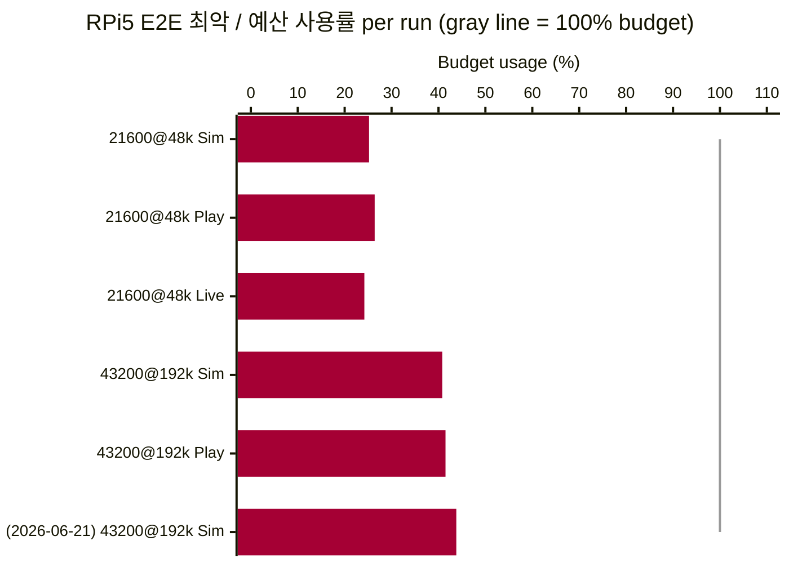
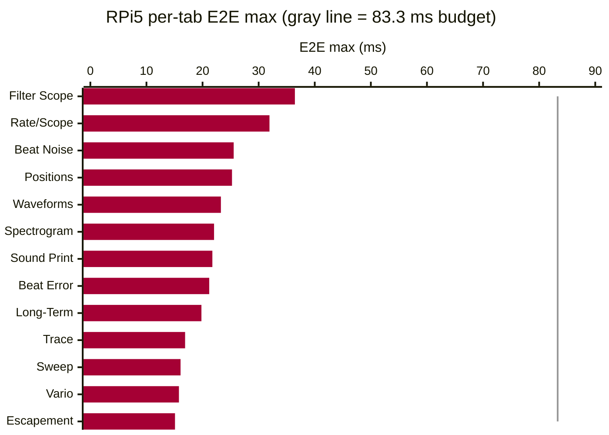
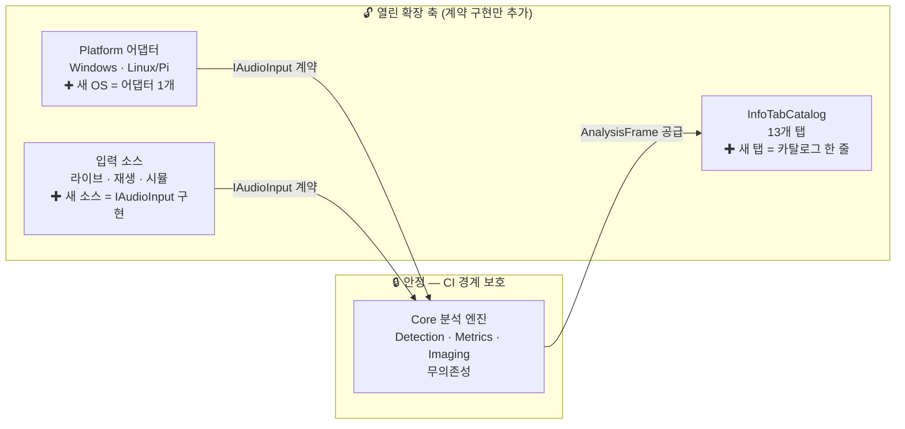

# TimeGrapher 최종 발표 스크립트 (한국어) — Part 2: 발표

> **Team 5 · TimeGrapherNet** — 최종 LG SW Architect 발표 (20분)
> 형식: **[발표자]** 한국어 대사 + **[지시문]** 동작 지시.
>
> 슬라이드 스토리: QA 정의 (Area 3) → 성능 근거 (Area 4) → 아키텍처 (Area 5) → AI 활용 (Area 7) → UI Enhancement (Area 2·6)

---

## 발표 타임라인

| # | 슬라이드 | 시간 | 채우는 Rubric |
|---|---|---|---|
| 1 | 타이틀 & 구현 표면 | 0:45 | — |
| 2 | 품질속성 & 트레이드오프 (accuracy 최우선) | 4:30 | **Area 3 (20점)** |
| 3 | 성능·지연·정확성 근거 (Pi 5 실측) | 4:30 | **Area 4 (25점)** |
| 4 | 아키텍처 & 확장성: Layers · Core 무의존 · CI 경계 · 새 그래프 추가 | 4:30 | **Area 5 (20점)** |
| 5 | AI 활용 (TinyML + 개발 전반) | 3:30 | **Area 7 (15점)** |
| 6 | UI Enhancement (SoundPrint · Rate/Scope · GUI) | 1:30 | Area 2·6 |
| 7 | 클로징 & Q&A | 0:45 | — |

---

# PART 2 — 발표 (20분)

---

## 슬라이드 1. 타이틀 & 구현 표면 (0:45)

**[지시문]** TimeGrapher UI 캡처 이미지 슬라이드. 슬라이드 하단에 **ADR-001 유첨** 표기 (기술 선택 근거 문서).

**[발표자]**
> "저희는 팀 5입니다. 저희의 TimeGrapher는 오전에 데모에서 보셨던 것과 같이, 라이브, 재생, 시뮬레이션 입력을 갖추고 있으며, 13개의 측정 디스플레이를 모두 제공합니다.
>
> 저희는 기존의 basecode를 C#으로 변환하였는데, 그 이유는 팀 역량, 단일 코드베이스 이식성, 라이선스 유연성입니다. Performance 위험은 실험으로 예산 내임을 먼저 확인했고, 그 수치는 이후 발표에서 보여드리겠습니다."

---

## 슬라이드 2. 품질속성 & 트레이드오프 (4:30)
> ▣ RUBRIC: **Area 3 — Quality Attribute Tradeoff Discussion (20점)**
> 주요 QA 식별 5점 / 트레이드오프 설명 5점 / accuracy 최우선 입증 5점 / 달성·한계 5점

### 2-1. 주요 QA 식별 (5점)

**[지시문]** QAS 우선순위 슬라이드.

**[발표자]**
> "우리는 여섯 가지 품질 속성을 정의했고, 각 품질 속성의 우선순위는 번호 순서와 같습니다. 프로젝트 초반에 Dan과 Steve와의 논의를 통해 **정확도(Accuracy)**를 최우선으로 확정했습니다. 시계 측정기의 유일한 존재 이유는 정확한 측정이고, 측정값이 틀리면 다른 모든 기능은 의미를 잃습니다. 그 다음은 성능/지연, 신뢰성, 일관성, 수정 용이성, 사용성 순입니다. 이것들을 각각 측정 가능한 시나리오로 변환했습니다. 저희가 정의한 품질속성 시나리오는 화면에 보이는 것과 같습니다.
>
> QAS-1 (정확도): 깨끗한 기준 입력에서 ≥1,000 박자에 걸쳐 known reference 대비 ±1.0 s/d 이내.
> QAS-2 (지연): 최악의 경우 E2E 지연은 한 박자 주기 이내 — 43200 BPH에서 83.3 ms.
> QAS-3 (신뢰성): SNR ≥ 30 dB에서 ≥1,000 박자에 걸쳐 검출률 ≥ 95%, 표시 레이트 오차 ≤ 3 s/d; 임계값 이하에서는 '신호 약함' 표시.
> QAS-4 (일관성): 같은 프레임의 모든 디스플레이는 하나의 소스 데이터 세트에서 나와야 하며, 불일치가 0이어야 합니다.
> QAS-5 (수정 용이성): 새 그래프, 필터, 측정은 기존 모듈을 ≤1개만 건드립니다.
> QAS-6 (사용성): Pi 1280×800 화면에서 2.9mm 글자 높이, 9mm 터치 영역."

---

### 2-2. Accuracy를 최우선으로 둔 증거 (5점)

**[지시문]** QAS-1 목표 + Verify 모듈 + Core.Detection 구현 전술 슬라이드.

**[슬라이드 비주얼]**

**[발표자]**
> "정확도는 저희의 최우선 품질속성입니다. 아키텍처는 이 목표를 정밀하게 **정의**하고 **검증 가능**하게 만들었고, 실제 달성은 Core.Detection 구현이 담당합니다.
>
> **아키텍처 레벨:** QAS-1이 목표를 정의합니다 — 깨끗한 입력에서 ≥1,000박자에 걸쳐 known reference 대비 ±1.0 s/d 이내. **Verify 모듈**이 이를 모든 CI 변경마다 헤드리스로 검증합니다 — known timing reference를 가진 합성 픽스처에 직접 Core를 실행합니다. **Core가 무의존성**이기 때문에 UI나 플랫폼 간섭 없이 완전한 격리 상태로 테스트할 수 있습니다.
>
> **구현 레벨:** 그 목표의 실제 달성은 Core.Detection이 담당합니다. 핵심 메커니즘은 **서브샘플 보간** — A 이벤트는 선형, C 이벤트는 포물선 — 으로, 192 kHz에서 정수 샘플 해상도보다 훨씬 정밀한 이벤트 타이밍을 산출합니다. 이를 둘러싸는 방어 전술: 침묵 샘플의 75번째 백분위수로 노이즈 바닥을 추적하는 **적응형 노이즈 바닥**, lock 후 예측된 박자 창 밖의 onset 교차를 거부하는 **PLL 유도 게이팅**, 그리고 3회 연속 조건이 충족될 때만 리셋하는 **레짐 가드** — 단일 충격으로 lock이 날아가지 않습니다.
>
> 이 메커니즘들은 선택적 토글이 아닙니다 — 항상 켜져 있는 기본 검출 동작입니다. **아키텍처가 기준을 설정하고 CI로 강제하며, 구현이 그 기준을 달성합니다.**"

---

### 2-3. 트레이드오프 설명 (5점)

**[지시문]** 트레이드오프 표 슬라이드.

**[발표자]**
> "품질 속성들은 서로 경쟁했고, 모든 선택은 의도적이었습니다.
>
> **QAS-1(정확도) vs QAS-2(지연)**: 정확도를 위해 지연을 일부 수용했습니다. BPH와 레이트를 보고하기 전 더 긴 워밍업 — 초기에 잘못된 수치를 보여주지 않기 위해. 또한 192 kHz 고샘플레이트는 더 정밀한 타임스탬프 해상도를 주지만 박자당 CPU 비용이 높아집니다 — Pi에서도 예산 내에 있음을 검증한 후 수용했습니다.
>
> **QAS-5(수정 용이성) vs QAS-1(정확도)/QAS-2(지연)**: 입력·분석·렌더링·기록을 워커 경계에서 분리해 수정 용이성을 높였지만, 검출기와 메트릭스는 의도적으로 **하나의 동기 핫패스**로 유지했습니다. 완전한 파이프-앤-필터로 모든 단계를 분리하면 각 단계의 큐잉이 박자 주기 예산을 소모해 지연과 정확도 모두를 위협합니다. 수정 용이성과 정확도·지연 사이의 핵심 트레이드오프입니다.
>
> **QAS-1(정확도) 보호 vs QAS-2(지연) 시각화 응답성**: 시스템이 마감 기한을 초과하면 *시각화 먼저* 저하됩니다 — 최신 우선 렌더링이 중간 프레임을 건너뛰지만 — **측정값은 절대 드롭하거나 보간하지 않습니다**. 수치를 보호하고 그림을 희생합니다.
>
> **QAS-3(신뢰성) vs QAS-1(정확도)**: 노이즈 환경에서 검출률(QAS-3)을 높이려면 임계값을 낮춰야 하지만, 그러면 가짜 박자가 들어와 정확도(QAS-1)가 떨어집니다. PLL 게이팅과 레짐 가드가 이 긴장을 관리하는 구현 전술입니다. TinyML 분류기도 이 트레이드오프를 다루지만, 이벤트를 생성하거나 재타이밍할 수 없도록 **아키텍처로 제한**했습니다 — 모델이 틀려도 타이밍 락을 깰 수 없습니다."

---

### 2-4. 달성한 것과 남은 한계 (5점)

**[발표자]**
> "**달성한 것:**
> QAS-1 (정확도): 깨끗한 시뮬레이션 입력에서 ±1.0 s/d 이내 — 통과.
> QAS-2 (지연): 43200 BPH / 192 kHz에서 최악의 경우 E2E 36.46 ms — 83.3 ms 예산의 44%. 13개 탭 전체에서 Drop 0 / Miss 0 — 통과.
> QAS-3 (신뢰성): 적응형 노이즈 바닥, PLL 유도 게이팅, 레짐 가드, TinyML 분류기 구현. Verify `--adverse` 모드에서 노이즈·임펄스·이득 단계 시나리오 검증 통과.
> QAS-4 (일관성): 단일 AnalysisFrame 구조로 같은 프레임 내 불일치 0 — 설계상 보장.
> QAS-5 (수정 용이성): 13개 탭 전부 InfoTabCatalog 패턴으로 추가. 탭당 기존 모듈 ≤1개 변경.
> QAS-6 (사용성): 2.9mm 글자 높이, 9mm 터치 영역 — App.axaml에 중앙화하고 Pi 터치스크린에서 확인.
>
> **남은 한계:**
> QAS-1: 시뮬레이션과 Verify 픽스처에서는 통과했지만, 실물 Weishi 기준기와 같은 시계를 직접 측정해 수치가 일치하는지 보는 것이 최종 현실 검증입니다 — 이 결과는 슬라이드 3에서 보여드립니다.
> QAS-3: TinyML 분류기는 통합되어 실행 중이지만, 다양한 시계 종류와 실제 저SNR 환경에서 얼마나 잘 분류하는지는 아직 충분히 검증하지 못했습니다.
> 이 한계를 밝히는 이유는, 솔직한 평가가 위험이 사라진 척하는 것보다 더 강한 아키텍처 평가이기 때문입니다."

---

## 슬라이드 3. 성능·지연·정확성 근거 (4:00)
> ▣ RUBRIC: **Area 4 — Performance, Latency, Correctness (25점)**
> Pi 실시간 8점 / 저지연 6점 / 정확성 6점 / 근거 5점

**[발표자]** *(슬라이드 2에서 이어서)*
> "QAS를 정의하고 트레이드오프를 살펴봤습니다. 이제 실제로 이 목표들을 달성했는지, Pi 5 실측 수치로 확인하겠습니다."

### 3-1. Pi 5 실시간 + 저지연

**[지시문]** EXP-02 Results 표를 직접 인용한 슬라이드.

**[슬라이드 비주얼 — EXP-02 결과 표 (Pi 5, 캡처→분석→화면 E2E)]**

| 날짜 | 조건 | 입력 | E2E 최악 | 예산 | 예산 사용률 | Drop | Miss | 결과 |
|:---|:---|:---|---:|---:|---:|---:|---:|:---|
| 2026-06-11 | 21600 BPH @ 48 kHz | Simulation | 41.975 ms | 166.667 ms | 25.2% | 0 | 0 | **Pass** |
| 2026-06-11 | 21600 BPH @ 48 kHz | Playback | 43.939 ms | 166.667 ms | 26.4% | 0 | 0 | **Pass** |
| 2026-06-11 | 21600 BPH @ 48 kHz | Live | 40.378 ms | 166.667 ms | 24.2% | 0 | 0 | **Pass** |
| 2026-06-11 | 43200 BPH @ 192 kHz | Simulation | 34.003 ms | 83.333 ms | 40.8% | 0 | 0 | **Pass** |
| 2026-06-11 | 43200 BPH @ 192 kHz | Playback | 34.562 ms | 83.333 ms | 41.5% | 0 | 0 | **Pass** |
| **2026-06-21** | **43200 BPH @ 192 kHz** | **Simulation** | **36.46 ms** | **83.333 ms** | **43.8%** | **0** | **0** | **Pass** |

**[슬라이드 비주얼 — 예산 대비 사용률 (회색 선 = 100% 예산)]**

**[슬라이드 비주얼 — 탭별 E2E 최악값 (RPi5, 43200@192k Sim, 회색 선 = 83.3 ms 예산)]**

**[발표자]**
> "Pi 5에서 실제 엔드투엔드 지연 시간을 측정했습니다 — 캡처에서 처리, 출력까지 — 앱 자체 로그에서. 슬라이드는 EXP-02를 직접 인용합니다:
>
> 21600 BPH / 48 kHz: 최악의 경우 E2E 43.9 ms, 166.7 ms 예산 대비 26.4%.
> 43200 BPH / 192 kHz: 최악의 경우 E2E 36.5 ms, 83.3 ms 예산 대비 43.8%.
> 최근 전체 탭 측정 (2026-06-21): 36.46 ms, 같은 예산 — 여전히 43.8%.
> 모든 실행: Drop 0, Miss 0, 결과 Pass.
>
> 탭별: Filter Scope가 36.46 ms로 가장 느립니다. Escapement가 15.09 ms로 가장 빠릅니다. 13개 탭 모두 예산 내. 핵심 메커니즘: **최신 우선 스케줄러**가 오래된 프레임을 큐에 쌓는 대신 버려서, 백로그가 쌓이지 않습니다."

---

### 3-2. 정확성 + 근거

**[지시문]** 두 시스템 비교 수치 표와 Verify 통과 캡처 슬라이드.

**[슬라이드 비주얼 — 정확성 근거 3계층]**

| # | 근거 유형 | 내용 | 허용 기준 | 상태 |
|---|---|---|---|---|
| 1 | **두 시스템 비교** | TimeGrapher vs Weishi Timegrapher — 같은 시계 | Rate ±1 s/d · Amplitude ±1° · Beat Error ±0.1 ms | Pass |
| 2 | **자동화 검증 (Verify)** | CI 매 변경마다 합성 픽스처 vs 검출 BPH/이벤트 | ±1.0 s/d @ ≥1,000 박자 (QAS-1) | Pass |
| 3 | **테스트 스위트** | Core + App + Platform 전계층 | 0 실패 | 933 통과 |

**[발표자]**
> "정확성에 대해 세 가지 근거가 있습니다:
>
> 1. **두 시스템 비교** — 같은 시계를 TimeGrapher와 Weishi Timegrapher 기준기로 측정. 레이트, 진폭, 비트 에러가 Witschi 등급 허용오차 내에서 일치합니다: ±1 s/d, ±1°, ±0.1 ms. 충분히 감긴 시계로 여러 번 측정해도 일관되게 유지.
>
> 2. **자동화된 검증** — Verify 콘솔이 CI의 모든 변경마다 검출된 BPH와 이벤트 수준의 정밀도/재현율을 실측 픽스처와 대조합니다. 약신호, 노이즈, 충격 폭풍, 게인 단계 같은 불리한 시나리오가 거기서 게이팅됩니다.
>
> 3. **테스트 스위트** — Core, App, Platform 레이어 전체에서 **933개 테스트** 통과.
>
> 종합하면: 라이브 측정값이 기준기와 일치하고, 검출기가 알려진 신호에 대해 자동으로 확인되며, 전체가 회귀 방지됩니다."

---

## 슬라이드 4. 아키텍처 & 확장성 (4:30)
> ▣ RUBRIC: **Area 5 — Extensibility: modular, separates concerns (6점) + supports adding new displays with limited redesign (6점) + understandable/maintainable (4점)**

**[지시문]** Layer 다이어그램 + module-uses 뷰 + 4단계 확장성 레시피 슬라이드.

**[슬라이드 비주얼 — 레이어 구조 (3개 계층, 단방향 의존성)]**

**[슬라이드 비주얼 — 프로젝트 모듈 의존성 (App · Core · Platform · Verify)]**

**[발표자]** *(슬라이드 3에서 이어서)*
> "이 수치들이 가능했던 이유를 아키텍처 관점에서 설명합니다.
>
> 아키텍처는 세 개의 레이어입니다. **Core**는 분석 엔진 — 검출, 측정, 이미지 생성, 시뮬레이터 — 이며 UI나 OS에 대한 **의존성이 없습니다**. **App**은 Avalonia UI입니다. **Platform** 어셈블리는 각 OS의 마이크 스택을 감쌉니다. 의존성은 아래 방향으로만: App과 Platform 모두 Core에 의존하고, 반대는 없습니다.
>
> 이 경계는 다이어그램에 그치지 않습니다 — **CI가 강제합니다**. Core가 UI, Platform, 오디오 타입을 임포트하면 테스트가 빌드를 실패시킵니다. 아키텍처 규칙이 주석이 아닌 실패하는 테스트입니다.
>
> 세 가지 입력 — 라이브 마이크, WAV 재생, 시뮬레이터 — 이 모두 하나의 작은 인터페이스를 구현합니다. Core는 그 계약만 알기 때문에 새 입력이나 OS 백엔드가 엔진을 건드리지 않고 끼워집니다. 그리고 같은 프레임 팬아웃이 13개 디스플레이 투어를 가능하게 합니다: Rate/Scope, Beat Error, Trace, Vario, Long-Term, Sweep, Escapement, Positions, Beat Noise, Waveforms, Filter Scope, Sound Print, Spectrogram은 같은 측정 분석 프레임 위의 다른 뷰들입니다 — 별개로 경쟁하는 계산기가 아닙니다."

**[발표자] (QAS 추적성)**
> "이 구조의 각 경계는 특정 QAS에서 동기화됩니다:
> **Core 무의존성 → QAS-1**: Verify 모듈이 Core를 격리 상태로 직접 실행해 정확도를 헤드리스로 검증합니다. 아키텍처는 정확도를 달성하지 않지만, 달성했는지 검증 가능하게 만듭니다.
> **워커 파이프-앤-필터 → QAS-2**: 오디오 처리와 렌더링이 분리됩니다. 렌더링은 탭이 선택될 때만 발생 — 13개 탭 전체를 동시에 처리하지 않습니다.
> **단일 AnalysisFrame → QAS-4**: 모든 디스플레이가 같은 소스 객체에서 파생되므로 불일치가 구조적으로 불가능합니다.
> **InfoTabCatalog 패턴 → QAS-5**: 새 탭은 카탈로그 1줄 + 렌더러 파일 추가로, 기존 분석 모듈을 건드리지 않습니다.
> **App.axaml 중앙 테마 → QAS-6**: 폰트와 터치 정책이 한 곳에 있어, 유지보수 중 우발적 변경을 코드 수준에서 방지합니다."

**[슬라이드 비주얼 — 새 디스플레이 추가 4단계 레시피]**

**[슬라이드 비주얼 — 워커 수준 파이프-앤-필터 (입력 → 분석 → 렌더링 분리)]**

**[발표자] (확장성 — 새 그래프를 추가할 때 실제로 어떻게 되는가)**
> "왜 '제한적인 변경'인지 구체 예시로 설명합니다.
>
> **예시 1: Spectrogram 탭 추가.** STFT 결과를 AnalysisFrame에 이미지로 담으려면 네 곳만 건드립니다. Core.Shared의 AnalysisFrame에 `SpectrogramImage` 속성 하나, Core.Analysis의 AnalysisWorker에서 그 속성을 채우는 할당 한 줄, App.Rendering에 새 `SpectrogramRenderer.cs` 파일 하나, App.Tabs의 InfoTabCatalog에 카탈로그 등록 한 줄. 라우팅 인프라가 자동으로 인식합니다 — 기존 Detection, Metrics, Imaging 모듈은 **전혀 건드리지 않습니다**.
>
> **예시 2: Watch Health Radar 탭 추가.** AnalysisFrame에 Positions 데이터가 이미 있었습니다. 이 경우 새 속성 추가도 필요 없었습니다 — 기존 필드를 레이더 차트로 렌더링하는 `RadarRenderer.cs` 신규 파일과 카탈로그 등록 한 줄, 두 곳만으로 완성했습니다.
>
> 이것이 **아키텍처가 QAS-5를 보장하는 방식**입니다: 새 그래프는 기존 분석 모듈을 최대 1개만 건드립니다. 13개 탭 전부가 이 패턴으로 만들어졌습니다."

**[슬라이드 비주얼 — 열린 확장 축 vs 닫힌 안정 축]**

**[발표자] (미래 요구사항 지원 — 구조가 어떻게 열려 있는가)**
> "이 구조가 미래 요구사항을 어떻게 수용하는지 세 가지 시나리오로 설명합니다.
>
> **새 OS 포팅**: Platform 어셈블리 하나만 추가합니다 — Core와 App은 전혀 건드리지 않습니다. 동일한 IAudioInput 계약을 구현하면 됩니다. 지금도 Windows와 Linux(Pi)가 이 방식으로 공존합니다.
>
> **새 입력 소스 (네트워크 스트림, BLE 센서 등)**: 마찬가지로 IAudioInput 구현체 하나만 추가합니다. Core는 계약만 알기 때문에 어디서 오는 신호인지 모릅니다.
>
> **새 측정 알고리즘 또는 필터**: Core.Detection 또는 Core.Metrics 내부에서 변경합니다. CI가 Core의 무의존성을 감시하므로, 알고리즘 변경이 UI나 Platform 계층으로 새어 나가면 빌드가 실패합니다.
>
> 요약: 열린 축(새 탭·입력·플랫폼)은 계약 구현 추가로 확장하고, 닫힌 축(Core 분석 엔진)은 CI로 격리가 보장됩니다."

**[슬라이드 비주얼 — Core 내부 모듈 의존성 (단일 책임, 계층 내 흐름)]**

**[발표자] (코드 구조의 가독성 & 유지보수성)**
> "코드 구조가 왜 이해하기 쉽고 유지보수하기 쉬운지 네 가지 근거:
>
> 첫째, **ADR 문서화** — ADR-001부터 ADR-004까지, 모든 주요 설계 결정은 맥락·대안·이유가 기록된 ADR에 남습니다. 새 팀원이 '왜 이런 구조인가'를 코드만 보지 않아도 이해할 수 있습니다.
>
> 둘째, **CI가 아키텍처 경계를 기계적으로 강제** — Core에 UI 타입이 임포트되면 빌드가 실패합니다. 주석이나 컨벤션이 아니라 실패하는 테스트가 경계를 지킵니다.
>
> 셋째, **ViewModelPurityTests** — ViewModel에 Avalonia 타입이 들어오면 CI에서 감지합니다. MVVM 경계가 코드 수준에서 자동 검증됩니다.
>
> 넷째, **InfoTabCatalog 패턴** — 어떤 탭이 있고 무엇을 렌더링하는지가 카탈로그 한 곳에서 선언됩니다. 새 팀원이 '이 탭은 어디 있나'를 찾을 때 여기 한 곳만 보면 됩니다.
>
> 다섯째, **IAudioInput 인터페이스** — Core가 입력 소스에 대해 아는 것은 이 인터페이스뿐입니다. 새 팀원이 '오디오 입력이 어떻게 들어오나'를 이해하려면 이 계약 하나만 읽으면 됩니다. 라이브 마이크·WAV 재생·시뮬레이터가 모두 같은 계약을 구현하기 때문에, 입력을 교체·추가할 때도 Core를 읽지 않아도 됩니다."

**[발표자] (정직성 포인트)**
> "저희는 패턴을 정직하게 평가했습니다. MVVM은 부분적입니다 — 시작/중지 생명주기가 여전히 code-behind에 있습니다 — DSP 체인도 구조는 파이프-앤-필터이지만 내부는 단일 동기 스레드입니다. 패턴이 완전히 적용된 곳과 부분적으로 적용된 곳을 정확히 아는 것이 이 과목에서 배운 부분입니다."

---

## 슬라이드 5. AI 활용 (3:30)
> ▣ RUBRIC: **Area 7 — Use of AI in Building the Software (15점)**
> 설명 5점 / 사려깊은 활용 5점 / 강점·한계·위험 5점

### 5-1. AI 도구 사용 설명 (5점)

**[발표자]**
> "저희의 AI 활용 방식은 **에이전틱 엔지니어링** — AI를 팀 개발 프로세스 안에 통제된 방식으로 포함시키는 것이었습니다. 개인의 즉흥적인 프롬프팅이 아니라, 두 가지 메커니즘으로 AI가 저희 팀의 convention을 따르도록 만들었습니다.
>
> **AGENTS.md**: 프로젝트 규칙, 커밋 형식, 아키텍처 원칙을 정의합니다. 모든 AI 세션은 이 컨텍스트에서 시작합니다.
> **DocRules.md**: 강의 자료에서 가져온 문서 품질 기준입니다. AI가 문서를 작성하면 이 기준으로 검토하고, 그 검토 결과를 AI에게 다시 전달해 개선합니다.
>
> 이 구조 덕분에 AI는 저희 팀의 convention을 따르고, 최종 결정은 항상 사람이 내렸습니다.
>
> 활용 영역은 네 가지입니다. **베이스 코드 변환** — Qt/C++ DSP 로직·이벤트 검출·오디오 버퍼를 C# 관용구(Span\<T\>, Channel, IDisposable)로 변환. **CI/CD 파이프라인** 설계와 자동화. **933개 테스트** 생성. 그리고 **제품 기능** — TimeGrapher.Inference는 Pi 온디바이스에서 실행되는 ONNX 신호 품질 분류기로, 아키텍처 제약으로 이벤트 생성·재타이밍·BPH 동기화를 건드릴 수 없습니다."

---

### 5-2. 사려깊은 활용 (5점)

**[발표자]**
> "**리뷰 루프**: AI가 초안을 작성하면 강의 자료(DocRules.md)를 기준으로 검토하고, 그 검토 결과를 AI에게 다시 전달해 개선합니다. 속도를 잃지 않으면서 품질을 유지하는 방법이었습니다.
>
> **구체적 예 1: C++ → C# 베이스 코드 변환.** 기존 Qt/C++ 구현을 C#으로 옮기는 작업이 이 프로젝트에서 가장 큰 초기 리스크였습니다. DSP 로직, 이벤트 검출 알고리즘, 오디오 버퍼 관리가 모두 C++로 작성되어 있었습니다. 저희는 AI에게 C++ 파일을 컨텍스트로 제공하고, .NET 8 관용구(Span\<T\>, ArrayPool, Channel)로 직접 변환을 요청했습니다. 단순 문법 변환이 아니라 **언어 관용구까지 바꾸는 변환**이었습니다 — C++의 포인터 산술을 Span으로, RAII를 IDisposable로, Qt 시그널을 C# 이벤트로. 이 변환 결과를 저희가 직접 검토했고, Verify 픽스처와 933개 테스트가 변환 후에도 동일하게 통과하는지로 정확성을 확인했습니다. **AI는 반복 작업을 빠르게 처리했고, 사람이 의미적 정확성을 보증했습니다.**
>
> **구체적 예 2: 파이프-앤-필터 결정.** UI 스레드가 스펙트로그램 계산 중 멈추고 있었습니다. Claude에 병목을 설명하고 Bass, Clements & Kazman의 SAP에서 관련 패턴을 제안해달라고 했습니다. 생산자-소비자 + 최신 우선 스케줄러를 제안했고, 책의 품질 속성 분석에 대조해 검증하고 구현했습니다. EXP-03이 UI 스레드가 완전히 분리되었음을 확인합니다.
>
> **구체적 예 3: ViewModel 순도 테스트.** 'ViewModel에 Avalonia 없음' 제약을 기계적으로 강제하는 방법을 물었습니다. Claude가 리플렉션 기반 테스트를 제안했고, ViewModelPurityTests로 구현해 모든 CI 푸시마다 실행됩니다.
>
> AI 출력은 항상 실행 가능한 증거로 확인했습니다: 테스트, CI 작업, Verify 픽스처, ADR, Pi 실측."

---

### 5-3. 강점·한계·위험 (5점)

**[발표자]**
> "솔직하게, 강점, 한계, 위험에 대해:
>
> **강점**: AI 활용이 팀 개발 프로세스 안에 통제된 방식으로 포함되었습니다 — 개인의 즉흥적 프롬프팅이 아닌, AGENTS.md와 DocRules.md로 제어된 팀 convention. AI가 규칙을 따르고, 최종 결정은 사람이 내렸습니다. 덕분에 소규모 팀이 대형 실시간 앱을 포팅하고, 온디바이스 분류기를 추가하고, 빌드/테스트/릴리스 워크플로를 자동화할 수 있었습니다.
>
> **한계**: 과도한 출력물을 꼼꼼히 검토해야 했습니다. 더 구체적으로: 프로젝트 맥락을 완전히 이해하지 못하고, 그럴듯하지만 틀린 제안을 할 수 있으며, 작동 여부는 결국 테스트해야 합니다. 로컬 환경과 브랜치 상태를 실수할 수 있고, 문서 품질은 좋아지지만 깊은 설계 의도는 사람이 채워야 합니다. UI/UX 판단은 반복 피드백이 필요합니다.
>
> **위험**: 실시간, 정확도 중요 시스템에서 그럴듯하지만 틀린 AI 변경이 조용히 타이밍을 해칠 수 있습니다. 저희 완화 방법은 구조적이었습니다: 분류기 경로가 타이밍을 소유할 수 없고, CI가 아키텍처 경계를 강제하고, Verify가 불리한 신호를 게이팅하고, 사람 검토가 생성된 코드를 확인합니다. **저희는 AI를 확인이 필요한 빠른 협력자로 대했습니다 — 권위자가 아닌.**"

---

## 슬라이드 6. UI Enhancement (1:30)
> ▣ RUBRIC: Area 2 (SoundPrint·Rate/Scope 개선) · Area 6 (GUI Modifications)

**[지시문]** UI 개선 요약 슬라이드. SoundPrint 마커 오버레이 스크린샷, 상태바, 연결 복구 배너를 보여준다.

**[발표자]**
> "마지막으로 사용자가 실제로 마주하는 UI 개선 사항입니다. 요구사항 기반 개선 세 가지와, 요구사항 외 자체 추가 두 가지입니다.
>
> **SoundPrint 개선 (Area 2):** A와 C 이벤트 마커를 스크롤 엔벌로프 이미지 위에 영구 오버레이로 표시합니다. 마커 배치는 신호와 동일한 샘플-투-컬럼 매핑을 사용해 픽셀 단위로 정렬됩니다 — 근사치가 아닙니다. 100 ms 주기로 발행되어 Pi에서도 반응성이 유지됩니다. 탭 전환 없이 여기서 직접 검출 정확도를 시각적으로 확인할 수 있습니다.
>
> **Rate/Scope 개선 (Area 2):** 설정 가능한 측정 창 선택기와 피크 홀드 표시기 추가. 10초 히스토리를 유지하며 고정된 포인트 예산 내에서만 렌더링합니다 — 창을 고정하고 검사해도 측정이 끊기지 않습니다.
>
> **GUI 구조 개선 (Area 6):** QAS-6 달성 — 터치 영역 최소 9 mm, 글자 높이 최소 2.9 mm. 세 가지 핵심 수치(레이트·비트에러·진폭)는 모든 탭에서 상단 상태바에 항상 표시. 덜 사용하는 컨트롤은 Settings 창으로 분리. 마이크 연결 해제 시 깔끔한 상태 복구 — 재연결하면 자동 감지. Beat-synchronized 표시: A/C 이벤트가 매 사이클 같은 상대 위치에 배치되어 불규칙한 타이밍이 위치 편차로 즉시 시각화됩니다.
>
> **다크 모드 (요구사항 외 추가):** 시스템 테마를 따르는 다크·라이트 전환을 구현했습니다. 시계 측정 환경은 어두운 작업장이 많아 장시간 사용 시 눈 피로를 줄이는 실용적 필요에서 추가했습니다. App.axaml 중앙 테마 구조 덕분에 색상 팔레트를 한 곳에서 교체하는 것으로 모든 탭에 일관되게 적용됩니다.
>
> **User Manual (요구사항 외 추가):** 앱 내 사용자 매뉴얼을 추가했습니다. 탭별 측정값의 의미, 포지션 테스트 절차, 이상값 해석 가이드를 앱 안에서 바로 볼 수 있습니다. 시계 수리 도메인 지식이 없는 사용자가 앱만으로 측정을 완료할 수 있도록 하는 것이 목표였습니다."

---

## 슬라이드 7. 클로징 & Q&A (0:45)

**[발표자]**
> "요약하면: 12개의 필수 디스플레이를 갖추고 정확도를 최우선으로 하며, Pi 5에서 측정된 지연과 두 시스템 비교로 검증된 실행 중인 시계 측정 애플리케이션; 모듈식이고, 이식 가능하며, CI로 강제된 아키텍처; 그리고 AI를 신호 품질 분류기를 통해 제품에서, 그리고 검증된 자동화를 통해 개발 과정에서 모두 활용했습니다. 감사합니다 — 질문은 기꺼이 받겠습니다."

---

## 부록 C. 예상 Q&A

| 질문 | 핵심 답변 |
|---|---|
| "정확도를 어떻게 보장했나?" | 두 계층: **아키텍처**는 QAS-1 목표를 정의하고 Verify 모듈로 헤드리스 검증을 가능하게 함; **Core.Detection 구현**이 실제로 달성 — 서브샘플 보간, 적응형 노이즈 바닥, PLL 유도 게이팅, 레짐 가드. Weishi 비교 + Verify adverse 수치로 입증. |
| "QAS가 아키텍처 결정과 어떻게 연결되나?" | Core 무의존 → QAS-1 검증가능성, 파이프-앤-필터 → QAS-2 성능, 단일 AnalysisFrame → QAS-4 일관성, InfoTabCatalog → QAS-5 수정용이성, App.axaml 중앙화 → QAS-6 사용성. |
| "지연이 정말 실시간인가?" | EXP-02 표 그대로: 21600@48k와 43200@192k 모두 Pass, worst usage 24–44%, Drop 0 / Miss 0. |
| "두 시스템 값이 다르면?" | 차이를 숨기지 않고 원인(캘리브레이션·마이크 감쇠·필터·lift angle) 가설 제시. |
| "AI 기능이 진짜 AI인가?" | Yes. ONNX 모델이 on-device에서 동작 중이고, 데모에서 시연했다. 안전을 위해 이 경로는 이벤트 생성·retiming·BPH sync를 건드리지 못하는 구조적 제약이 있다. |
| "레이더 차트는?" | Watch Health Radar 탭에 구현. Positions와 같은 per-position 스냅샷 재사용, 카탈로그 1엔트리 + 렌더러 추가. |
| "확장성 증거?" | 새 탭 = 카탈로그 1엔트리 + consumer. Core 불변. CI가 경계 강제 → 변경 국소화. 13개 탭이 모두 이 패턴. |
| "MVVM은 완전한가?" | 완전한 교과서식 MVVM이라고 과장하지 않는다. View/ViewModel/Model 분리와 ViewModel testability가 방향이고, 일부 lifecycle은 code-behind에 남아 있다. |
| "CI/CD로 정확도를 검증한다고 했는데?" | CI/CD는 개선 방법이지 애플리케이션 자체가 아니다. 정확도 주장은 runtime 설계 선택 + Weishi 비교 + 반복 측정이 먼저. Verify/CI는 그 정확도가 회귀하지 않게 막는 supporting evidence. |

---

## 부록 D. 슬라이드 ↔ SW Architecture 문서 근거

| 슬라이드 | 문서 근거 | 핵심 한 줄 |
|---|---|---|
| 2. 품질속성 & 트레이드오프 | 2-Architectural-Drivers.md (QAS-1~6) | QAS는 측정 가능: ±1.0 s/d, ≤한 박자 주기, ≥95% 검출, 0 불일치. |
| 3. 성능·지연·정확성 | 3-Risk-Assessment.md, 4-Planned-Experiments.md | EXP-02는 R-01/R-03 해소; EXP-05는 R-04 해소; Weishi 비교는 EXP-06 해소. |
| 4. 아키텍처 & 확장성 | ADR-001, ADR-002, ADR-003, ADR-004, 5-Architectural-View.md | Core 의존성 없음; 워커 수준 파이프-앤-필터; 새 그래프/필터/측정 ≤1 기존 모듈 변경. |
| 5. AI 활용 | ADR-004, EXP-04, R-17/R-18 | AI는 유용하지만 확인 필요: 테스트/Verify/CI/사람 검토가 안전망. |
| 6. UI Enhancement | QAS-6, SoundPrint 개선 사항 | QAS-6 달성: 9 mm 터치, 2.9 mm 글자; A/C 픽셀-정렬 오버레이; unplug/replug 복구. |
