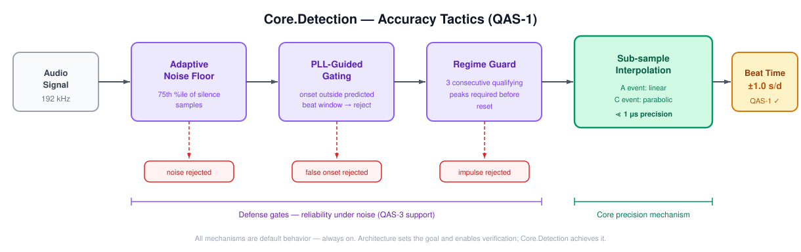
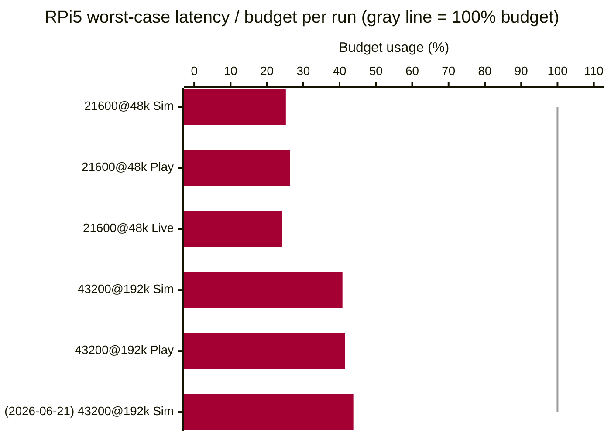
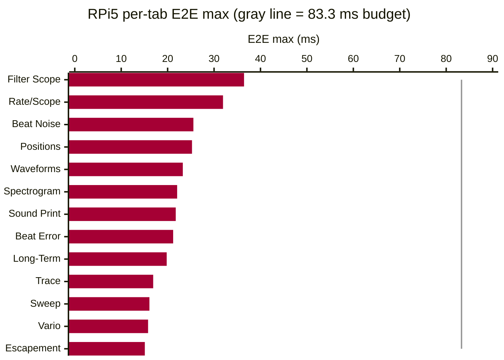
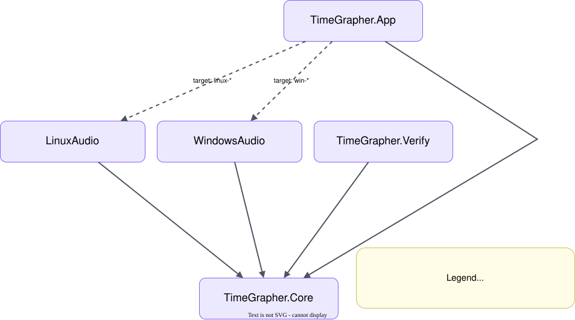
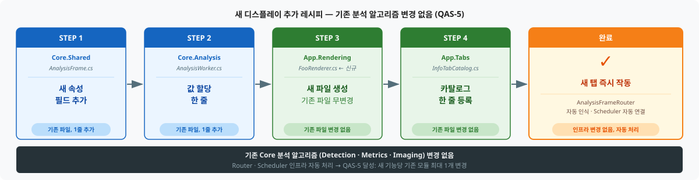
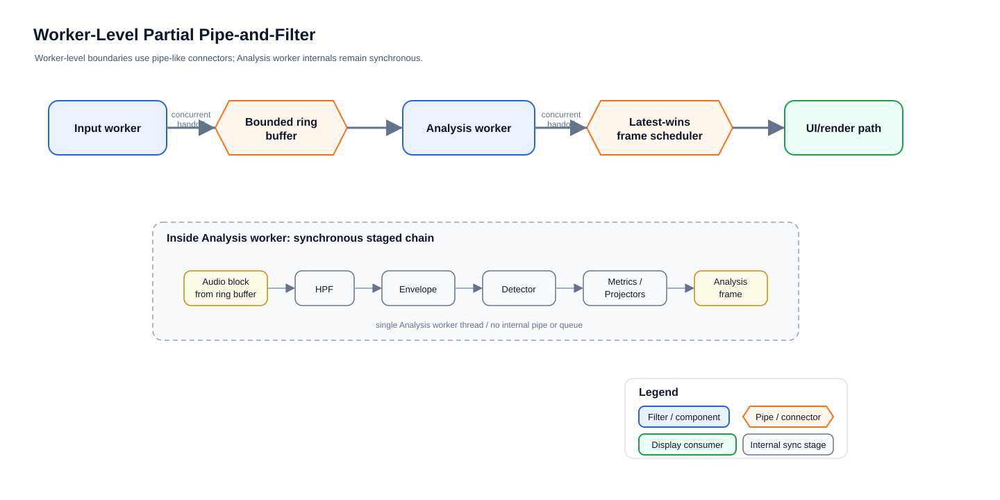
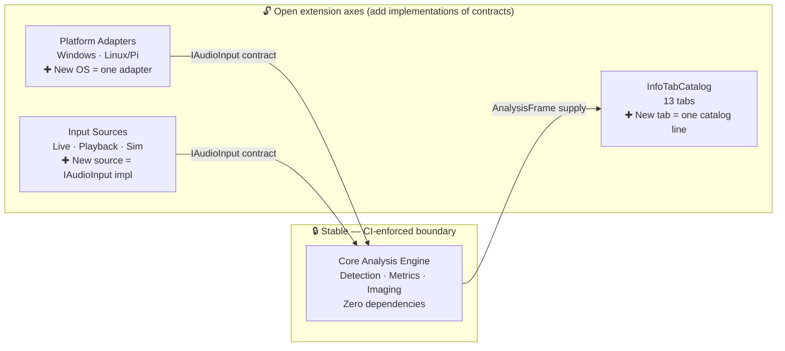
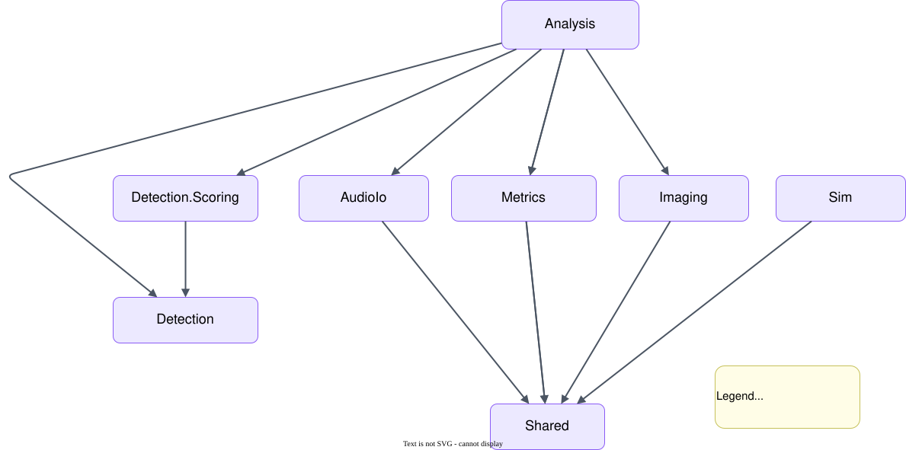

# TimeGrapher Final Presentation Script — Part 2: Presentation

> **Team 5 · TimeGrapherNet** — Final LG SW Architect Presentation (20 min)
> Format: **[Presenter]** English script (spoken directly to the evaluators) + **[Note]** action cues.
>
> Slide story: QA definition (Area 3) → Performance evidence (Area 4) → Architecture (Area 5) → AI use (Area 7) → UI Enhancement (Area 2·6)

---

## Presentation Timeline

| # | Slide | Time | Rubric |
|---|---|---|---|
| 1 | Title & Implementation Surface | 0:45 | — |
| 2 | Quality Attributes & Tradeoffs (accuracy first) | 4:30 | **Area 3 (20 pts)** |
| 3 | Performance, Latency & Correctness (Pi 5 measured) | 4:30 | **Area 4 (25 pts)** |
| 4 | Architecture & Extensibility: Layers · Core zero-dep · CI boundary · new graph walkthrough | 4:30 | **Area 5 (20 pts)** |
| 5 | Use of AI (TinyML + development) | 3:30 | **Area 7 (15 pts)** |
| 6 | UI Enhancement (SoundPrint · Rate/Scope · GUI) | 1:30 | Area 2·6 |
| 7 | Closing & Q&A | 0:45 | — |

---

# PART 2 — PRESENTATION (20 min)

---

## Slide 1. Title & Implementation Surface (0:45)

**[Note]** TimeGrapher UI screenshot slide. Add **ADR-001 attached** annotation at the bottom of the slide (technology selection rationale document).

**[Presenter]**
> "We are Team 5. As you saw in this morning's demo, our TimeGrapher has live, playback, and simulation inputs, and provides all 13 measurement displays.
>
> We converted the existing base code to C#. The reasons were team expertise, single-codebase portability, and license flexibility. The performance risk was resolved experimentally before committing — we verified the pipeline fits within budget on the Pi, and we will show you those numbers later in the presentation."

---

## Slide 2. Quality Attributes & Tradeoffs (4:30)
> ▣ RUBRIC: **Area 3 — Quality Attribute Tradeoff Discussion (20 pts)**
> Identify major QAs 5 pts / Tradeoff discussion 5 pts / Accuracy as top priority 5 pts / Achievement & limitations 5 pts

### 2-1. Major QA Identification (5 pts)

**[Note]** QAS priority slide.

**[Presenter]**
> "We defined six quality attributes, prioritized in the numbered order shown. Early in the project, through discussion with Dan and Steve, we settled on **Accuracy** as the top priority. A timegrapher's only job is to produce correct readings; if the rate is wrong, everything else is meaningless. After that: Performance/Latency, Reliability, Consistency, Modifiability, and Usability. We turned each one into a measurable scenario — the quality attribute scenarios we defined are shown on screen.
>
> QAS-1 (Accuracy): computed rate within ±1.0 s/d of a known reference over ≥1,000 consecutive beats on clean input.
> QAS-2 (Latency): worst-case E2E latency within one beat period — 83.3 ms at 43200 BPH.
> QAS-3 (Reliability): at SNR ≥ 30 dB over ≥1,000 beats, detection ≥ 95% and displayed rate within ±3 s/d of the reference; below threshold, show 'signal weak'.
> QAS-4 (Consistency): all displays in the same frame from one source data set, zero mismatches.
> QAS-5 (Modifiability): a new graph, filter, or measurement touches ≤1 existing module.
> QAS-6 (Usability): 2.9 mm letter height, 9 mm touch targets on the Pi 1280×800 screen."

---

### 2-2. Evidence That Accuracy Is the Top Priority (5 pts)

**[Note]** Layer diagram → Core.Detection accuracy mechanisms slide.

**[Slide Visual — Layer structure: Core zero dependency]**

**[Slide Visual — Core.Detection accuracy mechanisms]**

**[Presenter]**
> "Accuracy is our top-ranked quality attribute. The target is defined by QAS-1 — computed rate within ±1.0 s/d of a known reference over ≥1,000 consecutive beats on clean input. The architecture makes that target verifiable, and the actual achievement is the responsibility of the Core.Detection implementation.
>
> **Architecture level:** As shown in the layer diagram, Core is completely isolated from UI and OS. Because **Core has zero dependencies**, the **Verify module** can run Core directly in complete isolation — no UI noise, no platform interference — checking this headlessly on every CI change against synthetic fixtures with known timing references.
>
> **Implementation level:** Achieving the QAS target is Core.Detection's job. The primary mechanism is **sub-sample interpolation** — linear for A events, parabolic for C events — producing timing precision far beyond integer sample resolution at 192 kHz. Three additional mechanisms maintain this precision in real-world conditions. First, the **adaptive noise floor** — it continuously monitors the ambient noise level and adjusts the detection threshold automatically: more sensitive in a quiet room, less sensitive in a noisy one, so only the watch sounds are captured. Second, **PLL-guided gating** — once the system has learned the beat rhythm, it predicts when the next beat should arrive and locks onto that timing. Any signal outside that expected window is rejected as noise. Third, the **regime guard** — even if a bump or interference makes the beat timing look suddenly different, the system does not react immediately. It waits for three consecutive consistent beats before updating — so a single impulse cannot break that lock."

---

### 2-3. Tradeoff Discussion (5 pts)

**[Note]** Tradeoff table slide.

**[Slide Visual — Tradeoff Summary]**

| Tradeoff | Our Choice | Implementation |
|---|---|---|
| QAS-1 Accuracy vs QAS-2 Latency | Accuracy first | Accepted 192 kHz + longer warm-up — verified experimentally that pipeline fits within budget on the Pi |
| QAS-5 Modifiability vs QAS-1·2 Accuracy·Latency | Hot path stays synchronous | Input · analysis · rendering separated at worker boundaries; detector + metrics kept as a single synchronous pass |
| QAS-1 Accuracy vs QAS-2 Visual Responsiveness | Protect measurements | Visuals degrade first when behind deadline (latest-wins rendering) — measurements are never dropped |
| QAS-3 Reliability vs QAS-1 Accuracy | Accuracy first | PLL-guided gating + regime guard maintain timing lock even in noisy conditions |

**[Presenter]**
> "There were tradeoffs between quality attributes, and every choice was deliberate.
>
> **QAS-1 (Accuracy) vs. QAS-2 (Latency)**: we accepted latency costs to protect accuracy. A longer warm-up before reporting BPH means the first reading arrives later — we accept that delay to avoid showing wrong numbers early. A higher sample rate gives finer timestamp resolution but costs more CPU per beat — we support up to 192 kHz and verified it fits the budget on the Pi before committing.
>
> **QAS-5 (Modifiability) vs. QAS-1/QAS-2 (Accuracy/Latency)**: we separated input, analysis, rendering, and recording at worker boundaries to gain modifiability — but kept the detector and metrics as one **synchronous hot path**. Full pipe-and-filter between every stage would add per-stage queuing that spends the beat-period budget, threatening both latency and accuracy. That is the core tradeoff between modifiability and the top two quality attributes.
>
> **QAS-1 (Accuracy) vs. QAS-2 (Latency / visual responsiveness)**: when the system falls behind its deadline, it degrades the *visuals first* — latest-wins rendering skips intermediate frames — but it **never drops or interpolates a measurement**. We protect the number and sacrifice the picture.
>
> **QAS-3 (Reliability) vs. QAS-1 (Accuracy)**: raising detection rate under noise requires loosening the threshold — but that risks accepting false beats and hurting accuracy. PLL-guided gating and the regime guard manage this tension at the implementation level. The TinyML classifier also addresses this tradeoff, but it is **architecturally constrained**: it can veto candidates but cannot create events or re-time them — so even a wrong model cannot break the timing lock."

---

### 2-4. What Was Achieved / Limitations (5 pts)

**[Presenter]**
> "**What we achieved:**
> QAS-1 (Accuracy): rate within ±1.0 s/d on clean simulation input — passed.
> QAS-2 (Latency): worst-case E2E 36.46 ms at 43200 BPH / 192 kHz — 44% of the 83.3 ms budget. Drop 0 / Miss 0 across all 13 tabs — passed.
> QAS-3 (Reliability): adaptive noise floor, PLL-guided gating, regime guard, and TinyML classifier implemented. Verified against noise, impulse, and gain-step scenarios in Verify `--adverse` mode — passed.
> QAS-4 (Consistency): single AnalysisFrame structure guarantees zero mismatches within a frame — passed by design.
> QAS-5 (Modifiability): all 13 tabs added via InfoTabCatalog pattern, each touching ≤1 existing module — passed.
> QAS-6 (Usability): 2.9 mm letter height, 9 mm touch targets centralized in App.axaml and verified on the Pi touchscreen — passed.
>
> **Limitations that remain:**
> QAS-1: passed on simulation and Verify fixtures, but the definitive real-world check is measuring the same watch on both TimeGrapher and the Weishi reference device and confirming the numbers agree — we show that result in slide 3.
> QAS-3: the TinyML classifier is integrated and running, but how well it classifies across different watch types and real low-SNR conditions has not been fully tested yet.
> We report these limits because honest evaluation is stronger than pretending the risks have disappeared."

---

## Slide 3. Performance, Latency, and Correctness (4:30)
> ▣ RUBRIC: **Area 4 — Performance, Latency, Correctness (25 pts)**
> Pi real-time 8 pts / Low latency 6 pts / Correctness 6 pts / Evidence 5 pts

**[Presenter]** *(transition from slide 2)*
> "We've defined our quality targets and walked through the tradeoffs. Now let's look at whether we hit those targets — with measured numbers from the Pi 5."

### 3-1. Pi 5 Real-Time + Low Latency

**[Note]** Slide quoting EXP-02 Results table directly.

**[Slide Visual — EXP-02 Results (Pi 5, capture → analysis → display E2E)]**

| Date | Condition | Input | E2E worst | Budget | Worst usage | Drop | Miss | Result |
|:---|:---|:---|---:|---:|---:|---:|---:|:---|
| 2026-06-11 | 21600 BPH @ 48 kHz | Simulation | 41.975 ms | 166.667 ms | 25.2% | 0 | 0 | **Pass** |
| 2026-06-11 | 21600 BPH @ 48 kHz | Playback | 43.939 ms | 166.667 ms | 26.4% | 0 | 0 | **Pass** |
| 2026-06-11 | 21600 BPH @ 48 kHz | Live | 40.378 ms | 166.667 ms | 24.2% | 0 | 0 | **Pass** |
| 2026-06-11 | 43200 BPH @ 192 kHz | Simulation | 34.003 ms | 83.333 ms | 40.8% | 0 | 0 | **Pass** |
| 2026-06-11 | 43200 BPH @ 192 kHz | Playback | 34.562 ms | 83.333 ms | 41.5% | 0 | 0 | **Pass** |
| **2026-06-21** | **43200 BPH @ 192 kHz** | **Simulation** | **36.46 ms** | **83.333 ms** | **43.8%** | **0** | **0** | **Pass** |

**[Slide Visual — Budget usage per run (gray line = 100% budget)]**

**[Slide Visual — Per-tab E2E max (RPi5, 43200@192k Sim, gray line = 83.3 ms budget)]**

**[Presenter]**
> "We measured the real end-to-end latency on the Pi 5 — capture to processing to display — from the app's own logs. The slide quotes EXP-02 directly:
>
> At 21600 BPH / 48 kHz: worst-case E2E 43.9 ms against a 166.7 ms budget — 26.4%.
> At 43200 BPH / 192 kHz: worst-case E2E 36.5 ms against an 83.3 ms budget — 43.8%.
> Current all-tab check (2026-06-21): 36.46 ms, same budget — still 43.8%.
> Every run: Drop 0, Miss 0, Result Pass.
>
> Per-tab: Filter Scope is slowest at 36.46 ms. Escapement is fastest at 15.09 ms. All 13 tabs well inside budget. The key mechanism: the **Latest-Wins scheduler** discards stale frames rather than queuing them, so backlog never accumulates."

---

### 3-2. Correctness + Evidence

**[Note]** Two-system comparison table and Verify pass screenshot slide.

**[Slide Visual — Three-layer correctness evidence]**

| # | Evidence Type | What | Tolerance | Status |
|---|---|---|---|---|
| 1 | **Two-system comparison** | TimeGrapher vs Weishi Timegrapher — same watch | Rate ±1 s/d · Amplitude ±1° · Beat Error ±0.1 ms | Pass |
| 2 | **Automated verification (Verify)** | CI: every change, synthetic fixture vs detected BPH/events | ±1.0 s/d @ ≥1,000 beats (QAS-1) | Pass |
| 3 | **Test suite** | Core + App + Platform all layers | 0 failures | 933 passing |

**[Presenter]**
> "For correctness we have three kinds of evidence:
>
> 1. **Two-system comparison** — the same watch on TimeGrapher and the Weishi Timegrapher reference. Rate, amplitude, and beat error agree within the Witschi grade tolerance: ±1 s/d, ±1°, ±0.1 ms. Multiple readings on a consistently wound watch stayed consistent.
>
> 2. **Automated verification** — our Verify console checks detected BPH and event-level precision/recall against ground-truth fixtures in CI on every change. Adverse scenarios — weak signal, noise, impulse storms, gain steps — are gated there.
>
> 3. **Test suite** — **933 tests** pass across Core, App, and platform layers.
>
> Together: the live reading matches a reference, the detector is checked against known signals automatically, and the whole thing is regression-guarded."

---

## Slide 4. Architecture & Extensibility (4:30)
> ▣ RUBRIC: **Area 5 — Extensibility: modular, separates concerns (6 pts) + supports adding new displays with limited redesign (6 pts) + understandable/maintainable (4 pts)**

**[Note]** Layer diagram + module-uses view + 4-step extensibility recipe slide.

**[Slide Visual — Layer structure (3 layers, one-way dependencies)]**

**[Slide Visual — Project module dependencies (App · Core · Platform · Verify)]**

**[Presenter]** *(transition from slide 3)*
> "Those numbers were possible because of the architecture. Let me explain why.
>
> The architecture is three layers. **Core** is the analysis engine — detection, measurement, image generation, the simulator — and it has **zero dependencies** on UI or OS. The **App** is the Avalonia UI. The **Platform** assemblies wrap each OS's microphone stack. Dependencies only point downward: App and Platform both depend on Core, never the reverse.
>
> This boundary isn't just a diagram — **our CI enforces it**. A test fails the build if Core ever imports a UI, platform, or audio type. The architecture rule is a failing test, not a comment.
>
> All three inputs — live mic, WAV playback, and the simulator — implement one small interface. Core only knows that contract, so a new input or OS backend drops in without touching the engine. And the same frame fan-out is what makes the thirteen-display tour possible: Rate/Scope, Beat Error, Trace, Vario, Long-Term, Sweep, Escapement, Positions, Beat Noise, Waveforms, Filter Scope, Sound Print, and Spectrogram are different views over the same measured analysis frame — not separate competing calculators."

**[Presenter] (QAS traceability)**
> "Every boundary in this diagram was motivated by a specific quality requirement:
> **Core zero dependency → QAS-1**: the Verify module runs Core in complete isolation, enabling headless accuracy verification against known references — the architecture does not achieve accuracy, but it makes achievement verifiable.
> **Worker Pipe-and-Filter → QAS-2**: audio processing and rendering are separated; rendering occurs only when a tab is selected, not all thirteen simultaneously.
> **Single AnalysisFrame → QAS-4**: every display derives from the same source object — zero mismatches is structurally guaranteed.
> **InfoTabCatalog pattern → QAS-5**: a new tab requires one catalog entry and one renderer file — no existing analysis module is touched.
> **Centralized App.axaml theme → QAS-6**: font and touch policy live in one place, preventing accidental drift during maintenance."

**[Slide Visual — 4-step recipe for adding a new display]**

**[Slide Visual — Worker-level pipe-and-filter (input → analysis → rendering, separated)]**

**[Presenter] (Extensibility — what actually happens when you add a new graph)**
> "Let me make 'limited redesign' concrete with two real examples.
>
> **Example 1: Adding the Spectrogram tab.** To store an STFT result as an image in AnalysisFrame, we touched exactly four places. One new property on AnalysisFrame in Core.Shared — one struct field. One assignment in AnalysisWorker in Core.Analysis — one line. One new file, SpectrogramRenderer.cs, in App.Rendering — no existing file modified. One catalog registration in InfoTabCatalog in App.Tabs — one line. The routing infrastructure picks it up automatically. The existing Detection, Metrics, and Imaging modules were **not touched at all**.
>
> **Example 2: Adding the Watch Health Radar tab.** The Positions data was already in AnalysisFrame. In this case we didn't even need a new field — just a new RadarRenderer.cs file and one catalog line. Two touchpoints total.
>
> This is **how the architecture delivers QAS-5**: a new graph touches at most one existing module. All 13 tabs were built this way."

**[Slide Visual — Open extension axes vs. closed stable core]**

**[Presenter] (Future requirements — how the structure stays open)**
> "Three scenarios show how this structure accommodates future requirements.
>
> **New OS port**: add one Platform assembly — Core and App are untouched. Just implement the same IAudioInput contract. Windows and Linux/Pi already coexist exactly this way.
>
> **New input source (network stream, BLE sensor, etc.)**: likewise, add one IAudioInput implementation. Core only knows the contract — it doesn't care where the signal comes from.
>
> **New measurement algorithm or filter**: change inside Core.Detection or Core.Metrics. CI monitors Core's zero-dependency rule, so an algorithmic change that leaks into the UI or Platform layer fails the build.
>
> Summary: the open axes (new tabs, inputs, platforms) extend by adding contract implementations; the closed axis (Core analysis engine) is isolation-guaranteed by CI."

**[Slide Visual — Core internal module dependencies (single responsibility, intra-layer flow)]**

**[Presenter] (Code organization — readability & maintainability)**
> "Five reasons the code structure is understandable and maintainable:
>
> First, **ADR documentation** — ADR-001 through ADR-004 record every major design decision with context, alternatives considered, and rationale. A new team member can understand 'why does this look this way' without reading the code alone.
>
> Second, **CI mechanically enforces architecture boundaries** — if Core imports a UI type, the build fails. A failing test guards the boundary, not a comment or convention.
>
> Third, **ViewModelPurityTests** — if an Avalonia type enters a ViewModel, CI catches it. The MVVM boundary is automatically verified at the code level.
>
> Fourth, **InfoTabCatalog pattern** — which tabs exist and what they render is declared in one place. When a new team member asks 'where is this tab?', there is one place to look.
>
> Fifth, **IAudioInput interface** — the only thing Core knows about audio input is this interface. A new team member who wants to understand 'how does audio get in?' reads one contract. Because live mic, WAV playback, and the simulator all implement the same contract, swapping or adding an input source requires no reading of Core internals."

**[Presenter] (honesty point)**
> "We also assessed our patterns honestly. Our MVVM is partial — start/stop lifecycle still lives in code-behind — and our DSP chain is pipe-and-filter in structure but a single synchronous thread internally. Knowing exactly where a pattern is fully applied versus partially applied was part of what we learned from this course."

---

## Slide 5. Use of AI (3:30)
> ▣ RUBRIC: **Area 7 — Use of AI in Building the Software (15 pts)**
> Description 5 pts / Thoughtful use 5 pts / Strengths, limits & risks 5 pts

### 5-1. How AI Tools Were Used (5 pts)

**[Presenter]**
> "Our approach to AI was **agentic engineering** — bringing AI into the team development process in a controlled way, not as individual improvised prompting. Two mechanisms kept AI aligned with our project:
>
> **AGENTS.md** defines our project rules, commit format, and architectural principles. Every AI session starts from this context — AI follows our conventions rather than its own defaults.
> **DocRules.md**, derived from course materials, is our document quality standard. AI drafts documents; we review using this standard; the review results go back to AI for refinement.
>
> This structure means humans make all final decisions, and AI is part of our defined process — not a wildcard.
>
> Application areas — four of them. **Base code conversion**: Qt/C++ DSP logic, event detection, and audio buffer management ported to C# idioms (Span\<T\>, Channel, IDisposable). **CI/CD pipeline** design and automation. **933 test** generation. And as a **product feature**: TimeGrapher.Inference is an ONNX signal-quality classifier running on-device on the Pi — architectural constraint means it cannot create events, re-time them, or touch BPH sync."

---

### 5-2. Thoughtful Use (5 pts)

**[Presenter]**
> "**The review loop**: AI drafts → we review using DocRules.md from course materials → we feed the review back to AI for refinement. This preserved quality without sacrificing speed.
>
> **Concrete example 1: C++ → C# base code conversion.** Porting the existing Qt/C++ implementation to C# was the largest upfront risk in this project. DSP logic, event detection algorithms, and audio buffer management were all written in C++. We gave AI the C++ files as context and asked for a direct translation into .NET 8 idioms — Span\<T\>, ArrayPool, Channel. This was not a syntax translation; it was a **language-idiom translation** — pointer arithmetic to Span, RAII to IDisposable, Qt signals to C# events. We reviewed every translated output ourselves, and confirmed correctness by checking that the Verify fixtures and 933 tests still passed after each conversion block. **AI handled the repetitive heavy lifting; humans guaranteed semantic correctness.**
>
> **Concrete example 2: Pipe-and-Filter decision.** The UI thread was freezing during heavy spectrogram computation. We described the bottleneck to Claude and asked for relevant patterns from Bass, Clements & Kazman's SAP. It suggested Producer-Consumer + Latest-Wins scheduler. We validated against the book's quality-attribute analysis and implemented it. EXP-03 confirms the UI thread is now fully decoupled.
>
> **Concrete example 3: ViewModel purity test.** We asked how to enforce 'no Avalonia in ViewModel' mechanically. Claude suggested a reflection-based test. We implemented ViewModelPurityTests — it runs on every CI push.
>
> AI output was always checked by executable evidence: tests, CI jobs, Verify fixtures, ADRs, and live Pi measurements."

---

### 5-3. Strengths, Limits, and Risks (5 pts)

**[Presenter]**
> "Honestly, on strengths, limits, and risks:
>
> **Strength**: AI was included in the team development process in a controlled way — not individual improvised use. AI followed our conventions via AGENTS.md and DocRules.md; humans made all final decisions. This let a small team port a large real-time app, add an on-device classifier, and automate the build/test/release workflow.
>
> **Limits**: AI required thorough review of excessive output. More specifically: it does not fully understand project context and can make plausible-but-wrong suggestions — functionality must always be tested. It can make mistakes with local environment and branch state. Document quality improves, but deep design intent still needs humans to fill in. UI/UX judgment requires iterative feedback.
>
> **Risk**: for a real-time, accuracy-critical system, a plausible-but-wrong AI change can silently hurt timing. Our mitigation was structural: the classifier path cannot own timing, CI enforces architecture boundaries, Verify gates adverse signals, and human review checks generated code. **We treated AI as a fast collaborator that must be checked — not as an authority.**"

---

## Slide 6. UI Enhancement (1:30)
> ▣ RUBRIC: Area 2 (SoundPrint · Rate/Scope improvements) · Area 6 (GUI Modifications)

**[Note]** UI improvement summary slide. Show SoundPrint marker overlay screenshot, status bar, and disconnect recovery banner.

**[Presenter]**
> "Finally, the UI improvements the user actually encounters. Three requirements-driven enhancements, and two additions we made beyond the requirements.
>
> **SoundPrint Enhancement (Area 2):** A and C event markers displayed as permanent overlays on the scrolling envelope image. Marker placement uses the same sample-to-column mapping as the signal itself — pixel-accurate alignment, not approximated. Published on a 100 ms cadence so it stays responsive on the Pi. Detection accuracy is visually verifiable here without switching tabs.
>
> **Rate/Scope Enhancement (Area 2):** Configurable measurement window selector and peak-hold indicator. Maintains a 10-second history and renders only within a fixed point budget — freeze a window, inspect, resume without dropping measurements.
>
> **GUI Structural Improvements (Area 6):** QAS-6 achieved — touch targets minimum 9 mm, letter height minimum 2.9 mm. Three key readings (rate · beat error · amplitude) always visible in the top status bar across all tabs. Less-used controls moved to the Settings drawer. Clean state recovery on microphone disconnect — auto-detected on reconnect. Beat-synchronized display: A/C events placed at the same relative position each cycle, so irregular timing shows up immediately as positional deviation.
>
> **Dark Mode (beyond requirements):** We implemented system-theme-following dark/light switching. Watch measurement environments are often dimly lit workspaces, so reducing eye strain over long sessions was a practical need. Because all color palettes live in the centralized App.axaml theme structure, swapping the palette in one place applies consistently across all tabs.
>
> **User Manual (beyond requirements):** We added an in-app user manual. Tab-by-tab measurement explanations, position test procedures, and outlier interpretation guides are accessible directly inside the app. The goal was to let a user with no watch-repair domain knowledge complete a measurement using the app alone."

---

## Slide 7. Closing & Q&A (0:45)

**[Presenter]**
> "In short: a running watch-measurement application with twelve required displays, accuracy first, proven on the Pi 5 with measured latency and a two-system comparison; an architecture that is modular, portable, and CI-enforced; and AI used both in the product through the signal-quality classifier and in the development process through guarded automation. Thank you — we're happy to take questions."

---

## Appendix C. Anticipated Q&A

| Question | Key Answer |
|---|---|
| "How did you guarantee accuracy?" | Two levels: **architecture** defines QAS-1 target and enables headless verification via Verify module; **Core.Detection implementation** achieves it — sub-sample interpolation, adaptive noise floor, PLL-guided gating, regime guard. Weishi comparison + Verify adverse fixtures as evidence. |
| "How do QAS connect to architecture decisions?" | Core zero dependency → QAS-1 verifiability; Pipe-and-Filter → QAS-2 performance; single AnalysisFrame → QAS-4 consistency; InfoTabCatalog → QAS-5 modifiability; centralized App.axaml → QAS-6 usability. |
| "Is the latency really real-time?" | EXP-02 table verbatim: 21600@48k and 43200@192k both Pass, worst usage 24–44%, Drop 0 / Miss 0. |
| "What if the two-system values differ?" | Don't hide the difference — hypothesize causes (calibration · mic attenuation · filter · lift angle). |
| "Is the AI feature real AI?" | Yes. ONNX model running on-device, demonstrated in the demo. Architecturally constrained: cannot create events, re-time them, or touch BPH sync. |
| "What about the radar chart?" | Implemented in Watch Health Radar tab. Reuses the same per-position snapshots as Positions, one catalog entry + renderer. |
| "Evidence of extensibility?" | New tab = one catalog entry + renderer file. Core unchanged. CI enforces boundaries → changes are local. All 13 tabs follow this pattern. |
| "Is MVVM complete?" | Not claiming textbook-complete MVVM. View/ViewModel/Model separation and ViewModel testability are the direction; some lifecycle remains in code-behind. |
| "You said CI/CD verifies accuracy?" | CI/CD is the improvement process, not the application itself. The accuracy claim rests on runtime design choices + Weishi comparison + repeated measurements first. Verify/CI prevents that accuracy from regressing — supporting evidence. |

---

## Appendix D. Slides ↔ SW Architecture Document Traceability

| Slide | Document Evidence | Key One-Liner |
|---|---|---|
| 2. Quality Attributes & Tradeoffs | 2-Architectural-Drivers.md (QAS-1~6) | QAS are measurable: ±1.0 s/d, ≤one beat period, ≥95% detection, 0 display mismatches. |
| 3. Performance, Latency, Correctness | 3-Risk-Assessment.md, 4-Planned-Experiments.md | EXP-02 closes R-01/R-03; EXP-05 closes R-04; Weishi comparison closes EXP-06. |
| 4. Architecture & Extensibility | ADR-001, ADR-002, ADR-003, ADR-004, 5-Architectural-View.md | Core zero dependency; worker-level partial Pipe-and-Filter; new graph/filter/measurement ≤1 existing module changed. |
| 5. AI Use | ADR-004, EXP-04, R-17/R-18 | AI is useful but must be checked: tests/Verify/CI/human review are the safety net. |
| 6. UI Enhancement | QAS-6, SoundPrint improvements | QAS-6 achieved: 9 mm touch, 2.9 mm letter height; A/C pixel-aligned overlay; unplug/replug recovery; dark mode; in-app manual. |
