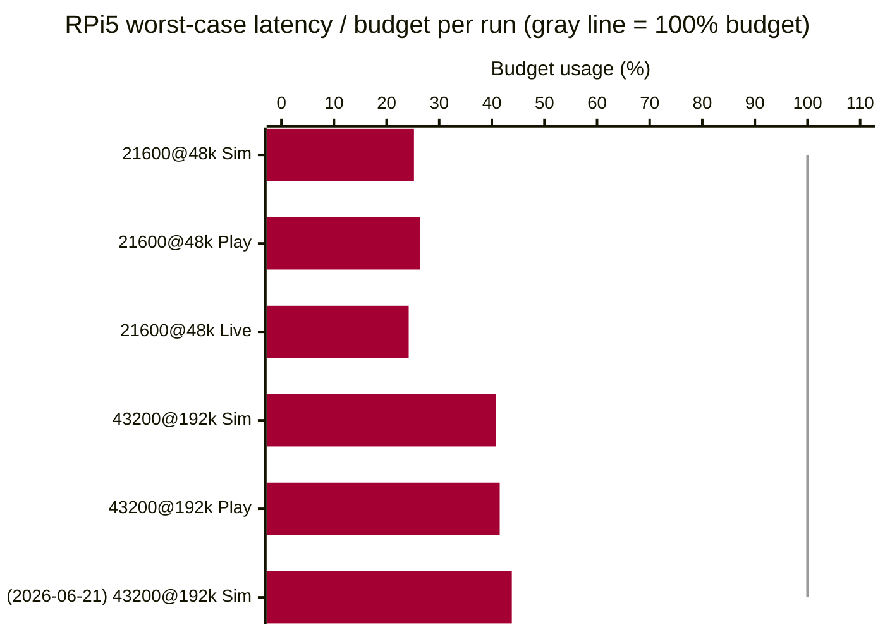
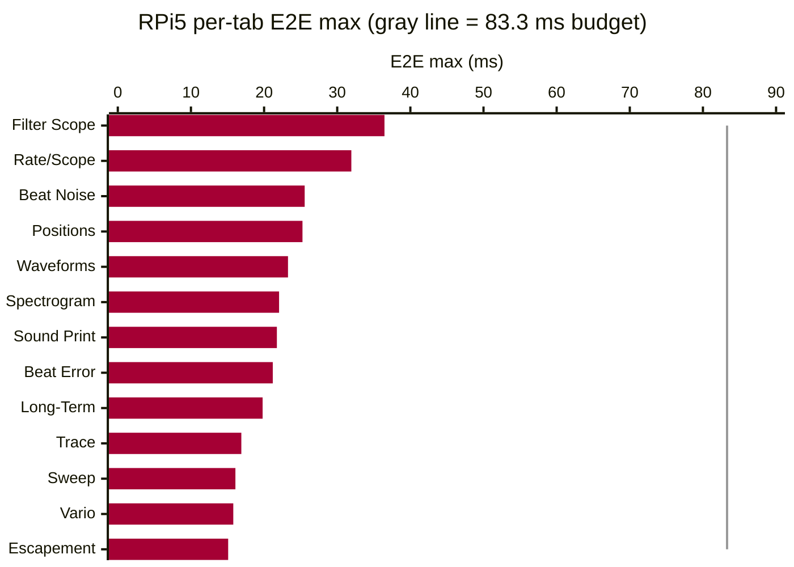

# TimeGrapher Final Presentation Script — Part 2: Presentation

> **Team 5 · TimeGrapherNet** — Final LG SW Architect Presentation (20분)
> 형식: **[Presenter]** 영어 대사(채점자에게 그대로 말하는 문장) + **[지시문]** 한국어 동작 지시.
>
> Slide story: QA definition (Area 3) → Performance evidence (Area 4) → Architecture (Area 5) → AI (Area 7) → UI Enhancement (Area 2·6)

---

## 발표 타임라인

| # | 슬라이드 | 시간 | 채우는 Rubric |
|---|---|---|---|
| 1 | 타이틀 & 구현 표면 | 0:45 | — |
| 2 | 품질속성 & 트레이드오프 (accuracy 최우선) | 4:30 | **Area 3 (20점)** |
| 3 | 성능·지연·정확성 근거 (Pi 5 실측) | 4:00 | **Area 4 (25점)** |
| 4 | 아키텍처 개요: 기술 선택 · Layers · Core 무의존 · CI 강제 경계 | 3:30 | **Area 5 (20점)** |
| 5 | 확장성 심화: 새 측정/필터/탭 추가 | 2:00 | **Area 5 (20점)** |
| 6 | AI 활용 (TinyML + 개발 전반) | 3:00 | **Area 7 (15점)** |
| 7 | UI Enhancement (SoundPrint · Rate/Scope · GUI) | 1:30 | Area 2·6 |
| 8 | 클로징 & Q&A | 0:45 | — |

---

# PART 2 — PRESENTATION (20분)

---

## Slide 1. Title & Implementation Surface (0:45)

**[Presenter]**
> "We're Team 5. TimeGrapher listens to a mechanical watch and measures its accuracy in real time. The program you just saw is not a mock-up: it has live, playback, and simulation inputs, and exposes all twelve required measurement displays — Rate/Scope, Beat Error, Trace, Vario, Long-Term, Sweep, Escapement, Positions, Beat Noise, Waveforms, Filter Scope, Sound Print, and Spectrogram.
>
> We rebuilt it from the original Qt/C++ version into **Avalonia and C# on .NET 8**, so a **single codebase** runs on both Windows and the Raspberry Pi 5."

---

## Slide 2. Quality Attributes & Tradeoffs (4:30)
> ▣ RUBRIC: **Area 3 — Quality Attribute Tradeoff Discussion (20점)**
> 주요 QA 식별 5점 / 트레이드오프 설명 5점 / accuracy 최우선 입증 5점 / 달성·한계 5점

### 2-1. Major QA Identification (5점)

**[지시문]** QAS 우선순위 슬라이드.

**[Presenter]**
> "Six quality attributes drive this system, prioritized in this order. That ordering was itself a decision — through discussion with Dan and Steve, we settled on **Accuracy** as the top priority. A timegrapher's only job is to produce correct readings; if the rate is wrong, everything else is meaningless. After that: **Performance/Latency**, **Reliability**, **Consistency**, **Modifiability**, and **Usability**. These are not generic quality words — we turned each one into a measurable scenario.
>
> QAS-1 (Accuracy): clean reference input within ±1.0 s/d of a known reference over ≥1,000 beats. QAS-2 (Latency): worst-case E2E latency within one beat period — 83.3 ms at 43200 BPH. QAS-3 (Reliability): at SNR ≥ 30 dB over ≥1,000 beats, detection ≥ 95% and displayed rate within ±3 s/d of the reference; below threshold, show 'signal weak'. QAS-4 (Consistency): all displays in the same frame from one source data set, zero mismatches. QAS-5 (Modifiability): a new graph, filter, or measurement touches ≤1 existing module. QAS-6 (Usability): 2.9 mm letter height, 9 mm touch targets on the Pi 1280×800 screen."

---

### 2-2. Evidence That Accuracy Is the Top Priority (5점)

**[지시문]** QAS-1 목표 + Verify 모듈 + Core.Detection 구현 전술 슬라이드.

**[Slide Visual]**

**[Presenter]**
> "Accuracy is our top-ranked quality attribute. The architecture was designed to define that goal precisely and make it verifiable — and the actual achievement is the responsibility of the Core.Detection implementation.
>
> **Architecture level:** QAS-1 sets the target — computed rate within ±1.0 s/d of a known reference over ≥1,000 consecutive beats on clean input. The **Verify module** checks this headlessly on every CI change, running Core directly against synthetic fixtures with known timing references. Because **Core has zero dependencies**, it can be tested in complete isolation — no UI noise, no platform interference.
>
> **Implementation level:** Achieving that target is Core.Detection's job. The key mechanism is **sub-sample interpolation** — linear for A events, parabolic for C events — producing timing precision far beyond integer sample resolution at 192 kHz. Surrounding defense tactics: an **adaptive noise floor** tracking the 75th percentile of silence samples rather than a fixed threshold; **PLL-guided gating** that rejects onset crossings outside the predicted beat window after lock; and a **regime guard** that requires three consecutive qualifying peaks before resetting state — so one impulse cannot destroy a lock.
>
> These are not optional toggles — they are the default detection behavior, always on. **The architecture sets the bar and enforces it through CI; the implementation clears it.**"

---

### 2-3. Tradeoff Discussion (5점)

**[지시문]** 트레이드오프 표 슬라이드.

**[Presenter]**
> "Quality attributes competed, and every tradeoff was deliberate.
>
> **QAS-1 (Accuracy) vs. QAS-2 (Latency)**: we accepted latency costs to protect accuracy. A longer warm-up before reporting BPH means the first reading arrives later — we accept that delay to avoid showing wrong numbers early. A higher sample rate gives finer timestamp resolution but costs more CPU per beat — we support up to 192 kHz and verified it fits the budget on the Pi before committing.
>
> **QAS-5 (Modifiability) vs. QAS-1/QAS-2 (Accuracy/Latency)**: we separated input, analysis, rendering, and recording at worker boundaries to gain modifiability — but kept the detector and metrics as one **synchronous hot path**. Full pipe-and-filter between every stage would add per-stage queuing that spends the beat-period budget, threatening both latency and accuracy. That is the core tradeoff between modifiability and the top two quality attributes.
>
> **QAS-1 (Accuracy) vs. QAS-2 (Latency / visual responsiveness)**: when the system falls behind its deadline, it degrades the *visuals first* — latest-wins rendering skips intermediate frames — but it **never drops or interpolates a measurement**. We protect the number and sacrifice the picture.
>
> **QAS-3 (Reliability) vs. QAS-1 (Accuracy)**: raising detection rate under noise requires loosening the threshold — but that risks accepting false beats and hurting accuracy. PLL-guided gating and the regime guard manage this tension at the implementation level. The TinyML classifier also addresses this tradeoff, but it is **architecturally constrained**: it can veto candidates but cannot create events or re-time them — so even a wrong model cannot break the timing lock."

---

### 2-4. What Was Achieved / Limitations (5점)

**[Presenter]**
> "**What we achieved:**
> QAS-1 (Accuracy): rate within ±1.0 s/d on clean simulation input — passed.
> QAS-2 (Latency): worst-case E2E 36.46 ms at 43200 BPH / 192 kHz — 44% of the 83.3 ms budget. Drop 0 / Miss 0 across all 13 tabs — passed.
> QAS-3 (Reliability): adaptive noise floor, PLL-guided gating, regime guard, and TinyML classifier implemented. Verified against noise, impulse, and gain-step scenarios in Verify `--adverse` mode — passed.
> QAS-4 (Consistency): single AnalysisFrame structure guarantees zero mismatches within a frame — passed by design.
> QAS-5 (Modifiability): all 13 tabs added via InfoTabCatalog pattern, each touching ≤1 existing module — passed.
> QAS-6 (Usability): 2.9 mm letter height, 9 mm touch targets centralized in App.axaml and verified on the Pi touchscreen — passed.
>
> **Limitations that remain:**
> QAS-1: passed on simulation and Verify fixtures, but the real-world validation is measuring the same watch on both TimeGrapher and the Weishi reference device and checking the numbers agree — we show that result in slide 3.
> QAS-3: the TinyML classifier is integrated and running, but how well it classifies across different watch types and real low-SNR conditions has not been fully tested yet.
> We report these limits because honest evaluation is stronger than pretending the risks have disappeared."

---

## Slide 3. Performance, Latency, and Correctness (4:00)
> ▣ RUBRIC: **Area 4 — Performance, Latency, Correctness (25점)**
> Pi 실시간 8점 / 저지연 6점 / 정확성 6점 / 근거 5점

**[Presenter]** *(transition from slide 2)*
> "We've defined our quality targets and walked through the tradeoffs. Now let's look at whether we hit those targets — with measured numbers from the Pi 5."

### 3-1. Pi 5 Real-Time + Low Latency

**[지시문]** EXP-02 Results 표를 직접 인용한 슬라이드.

**[Slide Visual — EXP-02 Results (Pi 5, capture → analysis → display E2E)]**

| Date | Condition | Input | E2E worst | Budget | Worst usage | Drop | Miss | Result |
|:---|:---|:---|---:|---:|---:|---:|---:|:---|
| 2026-06-11 | 21600 BPH @ 48 kHz | Simulation | 41.975 ms | 166.667 ms | 25.2% | 0 | 0 | **Pass** |
| 2026-06-11 | 21600 BPH @ 48 kHz | Playback | 43.939 ms | 166.667 ms | 26.4% | 0 | 0 | **Pass** |
| 2026-06-11 | 21600 BPH @ 48 kHz | Live | 40.378 ms | 166.667 ms | 24.2% | 0 | 0 | **Pass** |
| 2026-06-11 | 43200 BPH @ 192 kHz | Simulation | 34.003 ms | 83.333 ms | 40.8% | 0 | 0 | **Pass** |
| 2026-06-11 | 43200 BPH @ 192 kHz | Playback | 34.562 ms | 83.333 ms | 41.5% | 0 | 0 | **Pass** |
| **2026-06-21** | **43200 BPH @ 192 kHz** | **Simulation** | **36.46 ms** | **83.333 ms** | **43.8%** | **0** | **0** | **Pass** |

**[Slide Visual — Budget usage per run (gray line = 100% budget)]**

**[Slide Visual — Per-tab E2E max (RPi5, 43200@192k Sim, gray line = 83.3 ms budget)]**

**[Presenter]**
> "We measured the real end-to-end latency on the Pi 5 — capture to processing to display — from the app's own logs. The slide quotes EXP-02 directly:
>
> At 21600 BPH / 48 kHz: worst-case E2E 43.9 ms against a 166.7 ms budget — 26.4%.
> At 43200 BPH / 192 kHz: worst-case E2E 36.5 ms against an 83.3 ms budget — 43.8%.
> Current all-tab check (2026-06-21): 36.46 ms, same budget — still 43.8%.
> Every run: Drop 0, Miss 0, Result Pass.
>
> Per-tab: Filter Scope is slowest at 36.46 ms. Escapement is fastest at 15.09 ms. All 13 tabs well inside budget. The key mechanism: the **Latest-Wins scheduler** discards stale frames rather than queuing them, so backlog never accumulates."

---

### 3-2. Correctness + Evidence

**[지시문]** 두 시스템 비교 수치 표와 Verify 통과 캡처 슬라이드.

**[Slide Visual — Three-layer correctness evidence]**

| # | Evidence Type | What | Tolerance | Status |
|---|---|---|---|---|
| 1 | **Two-system comparison** | TimeGrapher vs Weishi Timegrapher — same watch | Rate ±1 s/d · Amplitude ±1° · Beat Error ±0.1 ms | Pass |
| 2 | **Automated verification (Verify)** | CI: every change, synthetic fixture vs detected BPH/events | ±1.0 s/d @ ≥1,000 beats (QAS-1) | Pass |
| 3 | **Test suite** | Core + App + Platform all layers | 0 failures | 933 passing |

**[Presenter]**
> "For correctness we have three kinds of evidence:
>
> 1. **Two-system comparison** — the same watch on TimeGrapher and the Weishi Timegrapher reference. Rate, amplitude, and beat error agree within the Witschi grade tolerance: ±1 s/d, ±1°, ±0.1 ms. Multiple readings on a consistently wound watch stayed consistent.
>
> 2. **Automated verification** — our Verify console checks detected BPH and event-level precision/recall against ground-truth fixtures in CI on every change. Adverse scenarios — weak signal, noise, impulse storms, gain steps — are gated there.
>
> 3. **Test suite** — **933 tests** pass across Core, App, and platform layers.
>
> Together: the live reading matches a reference, the detector is checked against known signals automatically, and the whole thing is regression-guarded."

---

## Slide 4. Architecture Overview (3:30)
> ▣ RUBRIC: **Area 5 — Extensibility: modular, separates concerns (6점) + understandable/maintainable (4점)**

**[지시문]** Layer 다이어그램 (`assets/LAYER.png` 또는 module-uses 뷰). ADR-001 기술 선택 도입부 포함.

**[Presenter]** *(transition from slide 3)*
> "Those numbers were possible because of the architecture. First, the technology choice — documented in **ADR-001** — we moved from Qt/C++ to **Avalonia and C# on .NET 8**. The drivers were team expertise (the majority of us have C# experience), single-codebase portability, and license flexibility. Rejected alternatives: Qt/C++, Electron, MAUI, Flutter. The performance risk was resolved by experiment — and those are the numbers you just saw.
>
> The architecture is three layers. **Core** is the analysis engine — detection, measurement, image generation, the simulator — and it has **zero dependencies** on UI or OS. The **App** is the Avalonia UI. The **Platform** assemblies wrap each OS's microphone stack. Dependencies only point downward: App and Platform both depend on Core, never the reverse.
>
> This boundary isn't just a diagram — **our CI enforces it**. A test fails the build if Core ever imports a UI, platform, or audio type. The architecture rule is a failing test, not a comment.
>
> All three inputs — live mic, WAV playback, and the simulator — implement one small interface. Core only knows that contract, so a new input or OS backend drops in without touching the engine. And the same frame fan-out is what makes the thirteen-display tour possible: Rate/Scope, Beat Error, Trace, Vario, Long-Term, Sweep, Escapement, Positions, Beat Noise, Waveforms, Filter Scope, Sound Print, and Spectrogram are different views over the same measured analysis frame — not separate competing calculators."

**[Presenter] (QAS traceability)**
> "Every boundary in this diagram was motivated by a specific quality requirement:
> **Core zero dependency → QAS-1**: the Verify module runs Core in complete isolation, enabling headless accuracy verification against known references — the architecture does not achieve accuracy, but it makes achievement verifiable.
> **Worker Pipe-and-Filter → QAS-2**: audio processing and rendering are separated; rendering occurs only when a tab is selected, not all thirteen simultaneously.
> **Single AnalysisFrame → QAS-4**: every display derives from the same source object — zero mismatches is structurally guaranteed.
> **InfoTabCatalog pattern → QAS-5**: a new tab requires one catalog entry and one renderer file — no existing analysis module is touched.
> **Centralized App.axaml theme → QAS-6**: font and touch policy live in one place, preventing accidental drift during maintenance."

**[Presenter] (honesty point)**
> "We also assessed our patterns honestly. Our MVVM is partial — start/stop lifecycle still lives in code-behind — and our DSP chain is pipe-and-filter in structure but a single synchronous thread internally. Knowing exactly where a pattern is fully applied versus partially applied was part of what we learned from this course."

---

## Slide 5. Extensibility Deep-Dive (2:00)
> ▣ RUBRIC: **Area 5 — supports adding new measurements/filters/graphs with limited redesign (6점)**

**[지시문]** "새 디스플레이 추가 4단계" 슬라이드. InfoTabCatalog + Frame consumer + Renderer 흐름.

**[Presenter]**
> "Adding capability is deliberately cheap. A new display is four steps:
>
> 1. Add a new property to AnalysisFrame in Core.Shared — one struct field.
> 2. Populate it in AnalysisWorker — one assignment.
> 3. Create a new Renderer class in App.Rendering — a new file, no existing file touched.
> 4. Register the tab in InfoTabCatalog — one line.
>
> The routing infrastructure — AnalysisFrameRouter and AnalysisFrameRenderScheduler — picks it up automatically. The Watch Health Radar is a live example of this pattern: a new renderer over the existing per-position snapshot, one catalog entry.
>
> The measurable target from QAS-5: a new graph or measurement should touch **at most one existing module**, with an eight person-day budget per feature. ADR-004 supports this through App, test, and Verify module separation, so six members — and AI coding assistants — can work without conflict. Because the engine is isolated and CI-locked, additions are **limited, local changes** — which is exactly what extensible architecture should mean."

---

## Slide 6. Use of AI (3:00)
> ▣ RUBRIC: **Area 7 — Use of AI in Building the Software (15점)**
> 설명 5점 / 사려깊은 활용 5점 / 강점·한계·위험 5점

### 6-1. How AI Tools Were Used (5점)

**[Presenter]**
> "Our approach to AI was **agentic engineering** — bringing AI into the team development process in a controlled way, not as individual improvised prompting. Two mechanisms kept AI aligned with our project:
>
> **AGENTS.md** defines our project rules, commit format, and architectural principles. Every AI session starts from this context — AI follows our conventions rather than its own defaults.
> **DocRules.md**, derived from course materials, is our document quality standard. AI drafts documents; we review using this standard; the review results go back to AI for refinement.
>
> This structure means humans make all final decisions, and AI is part of our defined process — not a wildcard.
>
> Application areas: **base code conversion** (Qt/C++ → .NET port), **CI/CD pipeline** design and automation, **933 test** generation. And as a **product feature**: TimeGrapher.Inference is an ONNX signal-quality classifier running on-device on the Pi — architectural constraint means it cannot create events, re-time them, or touch BPH sync."

---

### 6-2. Thoughtful Use (5점)

**[Presenter]**
> "**The review loop**: AI drafts → we review using DocRules.md from course materials → we feed the review back to AI for refinement. This preserved quality without sacrificing speed.
>
> **Concrete example 1: Pipe-and-Filter decision.** The UI thread was freezing during heavy spectrogram computation. We described the bottleneck to Claude and asked for relevant patterns from Bass, Clements & Kazman's SAP. It suggested Producer-Consumer + Latest-Wins scheduler. We validated against the book's quality-attribute analysis and implemented it. EXP-03 confirms the UI thread is now fully decoupled.
>
> **Concrete example 2: ViewModel purity test.** We asked how to enforce 'no Avalonia in ViewModel' mechanically. Claude suggested a reflection-based test. We implemented ViewModelPurityTests — it runs on every CI push.
>
> AI output was always checked by executable evidence: tests, CI jobs, Verify fixtures, ADRs, and live Pi measurements."

---

### 6-3. Strengths, Limits, and Risks (5점)

**[Presenter]**
> "Honestly, on strengths, limits, and risks:
>
> **Strength**: AI was included in the team development process in a controlled way — not individual improvised use. AI followed our conventions via AGENTS.md and DocRules.md; humans made all final decisions. This let a small team port a large real-time app, add an on-device classifier, and automate the build/test/release workflow.
>
> **Limits**: AI required thorough review of excessive output. More specifically: it does not fully understand project context and can make plausible-but-wrong suggestions — functionality must always be tested. It can make mistakes with local environment and branch state. Document quality improves, but deep design intent still needs humans to fill in. UI/UX judgment requires iterative feedback.
>
> **Risk**: for a real-time, accuracy-critical system, a plausible-but-wrong AI change can silently hurt timing. Our mitigation was structural: the classifier path cannot own timing, CI enforces architecture boundaries, Verify gates adverse signals, and human review checks generated code. **We treated AI as a fast collaborator that must be checked — not as an authority.**"

---

## Slide 7. UI Enhancement (1:30)
> ▣ RUBRIC: Area 2 (SoundPrint·Rate/Scope improvements) · Area 6 (GUI Modifications)

**[지시문]** UI 개선 요약 슬라이드. SoundPrint 마커 오버레이 스크린샷, 상태바, 연결 복구 배너를 보여준다.

**[Presenter]**
> "Finally, the UI improvements the user actually encounters. Three areas:
>
> **SoundPrint Enhancement (Area 2):** A and C event markers displayed as permanent overlays on the scrolling envelope image. Marker placement uses the same sample-to-column mapping as the signal itself — pixel-accurate alignment, not approximated. Published on a 100 ms cadence so it stays responsive on the Pi. Detection accuracy is visually verifiable here without switching tabs.
>
> **Rate/Scope Enhancement (Area 2):** Configurable measurement window selector and peak-hold indicator. Maintains a 10-second history and renders only within a fixed point budget — freeze a window, inspect, resume without dropping measurements.
>
> **GUI Structural Improvements (Area 6):** QAS-6 achieved — touch targets minimum 9 mm, letter height minimum 2.9 mm. Three key readings (rate · beat error · amplitude) always visible in the top status bar across all tabs. Less-used controls moved to the Settings drawer. Clean state recovery on microphone disconnect — auto-detected on reconnect. Beat-synchronized display: A/C events placed at the same relative position each cycle, so irregular timing shows up immediately as positional deviation."

---

## Slide 8. Closing & Q&A (0:45)

**[Presenter]**
> "In short: a running watch-measurement application with twelve required displays, accuracy first, proven on the Pi 5 with measured latency and a two-system comparison; an architecture that is modular, portable, and CI-enforced; and AI used both in the product through the signal-quality classifier and in the development process through guarded automation. Thank you — we're happy to take questions."

---

## Appendix C. Anticipated Q&A

| Question | Key Answer |
|---|---|
| "How did you guarantee accuracy?" | Two levels: **architecture** defines QAS-1 target and enables headless verification via Verify module; **Core.Detection implementation** achieves it — sub-sample interpolation, adaptive noise floor, PLL-guided gating, regime guard. Weishi comparison + Verify adverse fixtures as evidence. |
| "How do QAS connect to architecture decisions?" | Core zero dependency → QAS-1 verifiability; Pipe-and-Filter → QAS-2 performance; single AnalysisFrame → QAS-4 consistency; InfoTabCatalog → QAS-5 modifiability; centralized App.axaml → QAS-6 usability. |
| "Is the latency really real-time?" | EXP-02 table verbatim: 21600@48k and 43200@192k both Pass, worst usage 24–44%, Drop 0 / Miss 0. |
| "What if the two-system values differ?" | Don't hide the difference — hypothesize causes (calibration · mic attenuation · filter · lift angle). |
| "Is the AI feature real AI?" | Yes. ONNX model running on-device, demonstrated in the demo. Architecturally constrained: cannot create events, re-time them, or touch BPH sync. |
| "What about the radar chart?" | Implemented in Watch Health Radar tab. Reuses the same per-position snapshots as Positions, one catalog entry + renderer. |
| "Evidence of extensibility?" | New tab = one catalog entry + consumer. Core unchanged. CI enforces boundaries → changes are local. All 13 tabs follow this pattern. |
| "Is MVVM complete?" | Not claiming textbook-complete MVVM. View/ViewModel/Model separation and ViewModel testability are the direction; some lifecycle remains in code-behind. |
| "You said CI/CD verifies accuracy?" | CI/CD is the improvement process, not the application itself. The accuracy claim rests on runtime design choices + Weishi comparison + repeated measurements first. Verify/CI prevents that accuracy from regressing — supporting evidence. |

---

## Appendix D. Slides ↔ SW Architecture Document Traceability

| Slide | Document Evidence | Key One-Liner |
|---|---|---|
| 2. Quality Attributes & Tradeoffs | 2-Architectural-Drivers.md (QAS-1~6) | QAS are measurable: ±1.0 s/d, ≤one beat period, ≥95% detection, 0 display mismatches. |
| 3. Performance, Latency, Correctness | 3-Risk-Assessment.md, 4-Planned-Experiments.md | EXP-02 closes R-01/R-03; EXP-05 closes R-04; Weishi comparison closes EXP-06. |
| 4. Architecture Overview | ADR-001, ADR-002, ADR-003, 5-Architectural-View.md | Technology choice (ADR-001); Core zero dependency; worker-level partial Pipe-and-Filter. |
| 5. Extensibility Deep-Dive | QAS-5, ADR-004 | New graph/filter/measurement ≤1 existing module changed; App/test/verify split. |
| 6. AI Use | ADR-004, EXP-04, R-17/R-18 | AI is useful but checked: tests/Verify/CI/human review are the safety net. |
| 7. UI Enhancement | QAS-6, SoundPrint improvements | QAS-6 achieved: 9 mm touch, 2.9 mm letter height; A/C pixel-aligned overlay; unplug/replug recovery. |
