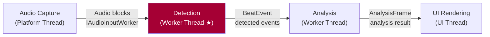
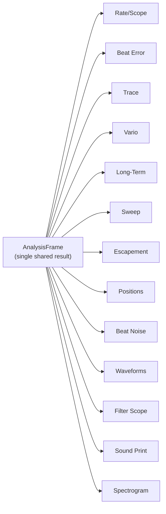
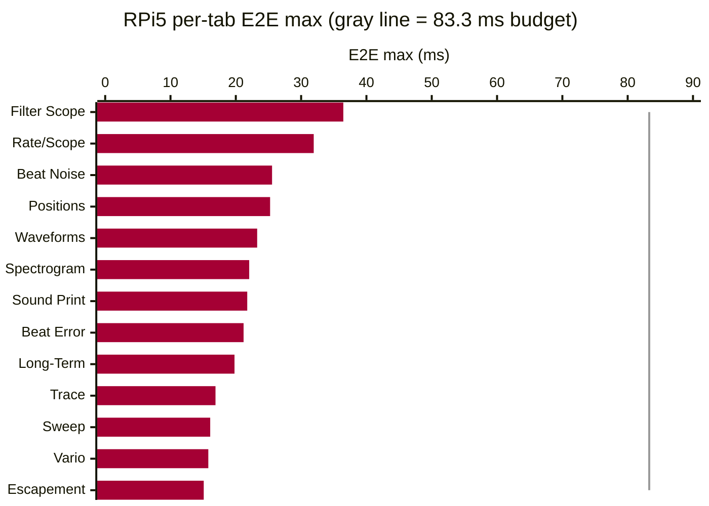

# TimeGrapher Final Presentation Script — Part 2: Presentation

> **Team 5 · TimeGrapherNet** — Final LG SW Architect Presentation (20 min)
> Format: **[Presenter]** English script (spoken directly to the evaluators) + **[Note]** action cues.
>
> Slide story: QA definition + evidence (Area 3·4) → Architecture solution (Area 4·5) → Extensibility (Area 5) → AI Feature (Area 2·7) → Lessons Learned (Area 7)

---

## Presentation Timeline

| # | Slide | Time | Rubric |
|---|---|---|---|
| Title | TimeGrapher & Team Introduction | 0:30 | — |
| 1-1 | UI Screenshot | 0:30 | — |
| 1-2 | Overall Architecture Overview | 0:30 | — |
| 2-1 | Top Priority QA: Accuracy | 2:30 | **Area 3 (20 pts)** |
| 2-2 | Second QA: Performance (Latency) | 2:30 | **Area 3·4 (20·25 pts)** |
| 2-3 | Architecture Solution | 2:30 | **Area 4·5 (25·20 pts)** |
| 2-4 | Accuracy & Performance Results | 1:00 | **Area 3·4 (20·25 pts)** |
| 3 | Extensibility (Modifiability) | 2:30 | **Area 5 (20 pts)** |
| 4 | AI Feature | 2:00 | **Area 2·7 (25·15 pts)** |
| 5-1 | Lessons Learned: Agentic Engineering | 2:00 | **Area 7 (15 pts)** |
| 5-2 | Lessons Learned: Strengths, Limits & Conclusion | 1:00 | **Area 7 (15 pts)** |

---

# PART 2 — PRESENTATION (20 min)

---

## Title Slide

**[Note]** Team name and project title slide.

**[Presenter]**
> "Good afternoon. We are Team 5, and we will now present our project: TimeGrapher."

---

## Slide 1-1. UI Screenshot (0:30)

**[Note]** TimeGrapher UI screenshot slide.

**[Slide Visual — TimeGrapher UI Screenshot]**

**[Presenter]**
> "Do you remember the impressive demo from this morning? Our TimeGrapher provides users with intuitive diagnostic information — just like the UI captures you see on screen."

---

## Slide 1-2. Overall Architecture Overview (0:30)

**[Note]** Left: overall Overview Architecture diagram (Figure 0). Right: deployment diagram.

**[Slide Visual — Figure 0: Overall Architecture Overview]**

**[Presenter]**
> "The diagram on the left shows the overall Overview Architecture — how the system is structured and how data flows through it. The diagram on the right gives a brief look at how our system is deployed. Let me now explain how this structure helps us achieve our quality targets."

---

## Slide 2-1. Top Priority QA: Accuracy (2:30)
> ▣ RUBRIC: **Area 3 — Quality Attribute Tradeoff Discussion (20 pts)** — Identify major QAs 5 pts / Accuracy as top priority 5 pts

**[Note]** QAS-1 definition + Verify experiment results + Weishi comparison table + Core.Detection mechanism diagram (Figure 1).

**[Slide Visual — Figure 1: Core.Detection Accuracy Mechanisms]**

**[Slide Visual — Three-Layer Correctness Evidence]**

| # | Evidence Type | What | Tolerance | Status |
|---|---|---|---|---|
| 1 | **Two-system comparison** | TimeGrapher vs Weishi Timegrapher — same watch | Rate ±1 s/d · Amplitude ±1° · Beat Error ±0.1 ms | Pass |
| 2 | **Automated verification (Verify)** | CI: every change, synthetic fixture vs detected BPH/events | ±1.0 s/d @ ≥1,000 beats (QAS-1) | Pass |
| 3 | **Test suite** | Core + App + Platform all layers | 0 failures | 933 passing |

**[Presenter]**
> "When we kicked off the project, we talked with Dan and Steve and decided that **Accuracy** was our number one quality attribute. A timegrapher's only job is to give you correct readings — if the rate is wrong, nothing else matters.
>
> Our QAS-1 is: computed rate within ±1.0 s/d of a known reference over 1,000 or more consecutive beats on clean input. And we hit that target.
>
> We ran two experiments to confirm it. First, a Verify experiment using simulation signals — synthetic fixtures with known timing are checked against detected results, and this runs automatically in CI on every commit. Second, we measured the same watch on both TimeGrapher and the Weishi Timegrapher reference device and compared the numbers. Rate, amplitude, and beat error all agreed within Witschi grade tolerance.
>
> To get there, [수정 필요] we built four signal-processing blocks into Core.Detection, as shown in Figure 1. **Sub-sample interpolation** — linear for A events, parabolic for C events — gives us timing precision way beyond integer sample resolution at 192 kHz. The **adaptive noise floor** keeps tracking the ambient noise level automatically. **PLL-guided gating** predicts when the next beat should arrive and throws out anything that falls outside that window. And the **regime guard** waits for three consecutive consistent readings before updating — so one stray impulse can't break the lock.
>
> But adding all those signal-processing blocks means more processing time — and that puts us in direct conflict with our second-most-important QA: Performance."

---

## Slide 2-2. Second QA: Performance (Latency) (2:30)
> ▣ RUBRIC: **Area 3 (20 pts)** — Tradeoff discussion 5 pts / Achievement & limitations 5 pts · **Area 4 (25 pts)** — Low latency 6 pts

**[Note]** QAS-2 definition, 83.3 ms rationale, E2E latency measurement results table.

**[Slide Visual — EXP-02 Results (Pi 5, capture → analysis → display E2E)]**

| Date | Condition | Input | E2E worst | Budget | Worst usage | Drop | Miss | Result |
|:---|:---|:---|---:|---:|---:|---:|---:|:---|
| 2026-06-11 | 21600 BPH @ 48 kHz | Simulation | 41.975 ms | 166.667 ms | 25.2% | 0 | 0 | **Pass** |
| 2026-06-11 | 21600 BPH @ 48 kHz | Playback | 43.939 ms | 166.667 ms | 26.4% | 0 | 0 | **Pass** |
| 2026-06-11 | 21600 BPH @ 48 kHz | Live | 40.378 ms | 166.667 ms | 24.2% | 0 | 0 | **Pass** |
| 2026-06-11 | 43200 BPH @ 192 kHz | Simulation | 34.003 ms | 83.333 ms | 40.8% | 0 | 0 | **Pass** |
| 2026-06-11 | 43200 BPH @ 192 kHz | Playback | 34.562 ms | 83.333 ms | 41.5% | 0 | 0 | **Pass** |
| **2026-06-21** | **43200 BPH @ 192 kHz** | **Simulation** | **36.46 ms** | **83.333 ms** | **43.8%** | **0** | **0** | **Pass** |

**[Presenter]**
> "Our QAS-2 is: worst-case E2E latency within one beat period — 83.3 ms at 43200 BPH.
>
> Where does 83.3 ms come from? At 43200 BPH — the fastest rate we support — one beat takes exactly 83.3 ms. If the display falls more than one beat behind, real-time monitoring loses its meaning. So we set that value as our latency budget.
>
> We hit this target too. On the Pi 5, we measured capture-to-processing, processing-to-display, and total E2E latency for every graph. Every run came back Drop 0, Miss 0, Result Pass — and the worst-case budget usage was only 43.8%.
>
> So here's the situation: Accuracy and Performance were pulling against each other. More signal-processing blocks for accuracy means more processing time, which means higher latency. We needed an architecture that could satisfy both at the same time."

---

## Slide 2-3. Architecture Solution & Measured Evidence (3:00)
> ▣ RUBRIC: **Area 4 (25 pts)** — Pi real-time 8 pts / Correctness 6 pts / Evidence 5 pts · **Area 5 (20 pts)** — modular, separates concerns 6 pts

**[Note]** Figure 0 (overall architecture), Figure 2 (pipe-and-filter), Figure 3 (AnalysisFrame fan-out), per-tab E2E chart.

**[Slide Visual — Figure 0: Overall Architecture Overview (Thread Separation)]**

**[Slide Visual — Figure 2: Pipe-and-Filter Pattern]**

**[Slide Visual — Figure 3: Single AnalysisFrame → 13-Display Fan-Out]**

**[Slide Visual — Per-Tab E2E Max (RPi5, 43200@192k Sim, gray line = 83.3 ms budget)]**

**[Presenter]**
> "Our architecture solution for satisfying both Accuracy and Performance comes in three parts.
>
> The first is **thread separation**. As shown in Figure 0, Audio Capture, Detection, Analysis, and UI Rendering each run on their own independent thread. The Detection worker runs at the highest thread priority, so even if the UI slows down, it has zero effect on signal processing.
>
> The second is the **pipe-and-filter pattern**. As shown in Figure 2, the signal flows from audio capture through detection and analysis as a concurrent pipeline — each stage runs independently. One important decision here: we kept Detection and Metrics as a single synchronous hot path on purpose. Fully separating those two would introduce queuing overhead that would eat through the 83.3 ms budget. That was a deliberate tradeoff between Modifiability and Latency.
>
> The third is the **single AnalysisFrame fan-out**. As shown in Figure 3, the final analysis result is packaged into one AnalysisFrame that all 13 displays share. No graph needs to do its own computation, so there's no CPU waste — and since all displays are reading the same data, inconsistency is structurally impossible.
>
"

---

## Slide 2-4. Accuracy & Performance Results (1:00)

**[Presenter]**
> "Accuracy result: TBD
>
> We measured the execution time for each of the 13 tabs. The slowest was Filter Scope at 36.46 ms, the fastest was Escapement at 15.09 ms. All 13 tabs came in under the 83.3 ms budget, Drop 0, Miss 0."

---

## Slide 3. Extensibility (Modifiability) (2:30)
> ▣ RUBRIC: **Area 5 — Extensibility (20 pts)**: supports adding new displays with limited redesign (6 pts) + future requirements/enhancements (4 pts) + understandable/maintainable (4 pts)

**[Note]** Figure 3 (AnalysisFrame fan-out) + Figure 4 (module structure view) + new tab recipe slide.

**[Slide Visual — Figure 4: Project Module Structure]**

**[Slide Visual — 4-Step Recipe for Adding a New Display]**

**[Presenter]**
> "Our third-most-important QA is Modifiability. The scenario: a new graph, filter, or measurement touches at most one existing module.
>
> The reason we defined it that way is straightforward — we had a lot of features to build in a short time. If every new display required touching a lot of existing code, shipping all 13 would have been impossible.
>
> Two structural decisions made this work. The first is **Core zero dependency**. Core has no dependency on UI or OS whatsoever. This solved a performance problem in the original codebase where the GUI layer was handling audio signal processing directly, and it completely isolates the analysis engine from any UI change. The second is the **single AnalysisFrame fan-out**. Since every display consumes the same AnalysisFrame, adding a new display never requires modifying the analysis logic.
>
> In practice, adding a new graph touches exactly [수정 필요] four places: one property on AnalysisFrame, one assignment in AnalysisWorker, one new renderer file in the App.Rendering folder, and one registration line in InfoTabCatalog. The routing infrastructure picks it up automatically — Detection, Metrics, and Imaging don't get touched at all. Every one of the 13 tabs was built exactly this way."

---

## Slide 4. AI Feature (2:00)
> ▣ RUBRIC: **Area 2 (25 pts)** — AI Feature · **Area 7 (15 pts)** — Use of AI in Building the Software

**[Note]** Figure 0 (overall architecture with AI components highlighted).

**[Slide Visual — Figure 0: Overall Architecture — AI Component Locations]**

**[Presenter]**
> "Our TimeGrapher has two AI features.
>
> The first is the **signal quality classifier**. It sits inside the Analysis path in Figure 0. It takes eight signal features — SNR, peak margin, noise floor, interval jitter, and others — and classifies the current signal as one of four states: Good, Noisy, WeakSignal, or Unstable. The ONNX model runs on-device on the Raspberry Pi 5. The important thing here is that this classifier is advisory only. It's architecturally blocked from creating beat events or changing timing in any way, so even if the model gets it wrong, it cannot touch the measurement values.
>
> The second is the **LLM-based watch diagnosis feature**. When the user requests a diagnosis from the UI, the UI calls an API server we built on AWS. That API server calls the external Gemini service, which analyzes the measurement data and sends back a diagnosis of the watch condition. Rather than running complex domain knowledge on-device, we used an external LLM — which lets us deliver rich diagnostic information without training a dedicated model."

---

## Slide 5-1. Lessons Learned: Agentic Engineering (2:00)
> ▣ RUBRIC: **Area 7 — Use of AI in Building the Software (15 pts)** — Description 5 pts / Thoughtful use 5 pts

**[Presenter]**
> "Finally, let me share what we learned from this project. We actively practiced **Agentic Engineering** using generative AI throughout development.
>
> Rather than just asking AI to write code on the fly, we built two mechanisms to keep AI aligned with how our team works.
>
> **AGENTS.md** defines our project rules, commit format, and architectural principles. Every AI session starts from this context, so AI naturally follows our conventions instead of making things up. **DocRules.md**, taken from course materials, is our document quality standard. AI drafts a document, we review it against this standard, and we feed the review back to AI to improve it — a loop.
>
> Thanks to this structure, humans always made the final calls, and AI operated as one part of our defined process.
>
> We applied AI across five areas. First, **base code conversion** — porting Qt/C++ to C# idioms, with correctness confirmed by Verify and tests. Second, **code implementation** — repetitive work like renderers, test fixtures, and buffer pool was AI-drafted and human-reviewed. Third, **CI/CD pipeline** design and automation. Fourth, **933 test generation**. Fifth, **document translation** — architecture documents and presentation scripts AI-drafted in both Korean and English, then reviewed and corrected against DocRules.md."

---

## Slide 5-2. Lessons Learned: Strengths, Limits & Conclusion (1:00)
> ▣ RUBRIC: **Area 7 (15 pts)** — Strengths, limits & risks 5 pts

**[Presenter]**
> "Here's what we took away from the experience.
>
> The biggest strength was productivity. AI let a small team port a large real-time app, add an on-device classifier, and automate the build/test/release workflow — all at once. Because we ran it through AGENTS.md and DocRules.md, it was a consistent team process, not individual improvised prompting.
>
> But there were clear limits too. Every output needed careful review. AI doesn't fully understand project context and can make suggestions that sound right but aren't — you always have to test. It slips up on local environment and branch state, and deep design intent still needs a human to fill in.
>
> Our takeaway: we treated AI as a fast collaborator that needs to be checked — not as an authority."

---

## Conclusion (0:30)

**[Presenter]**
> "To wrap up: we designed a thread-separated, pipe-and-filter architecture to satisfy both Accuracy and Performance at the same time. A Core zero-dependency structure let us build all 13 displays efficiently under Modifiability constraints. We integrated two AI features — a TinyML signal quality classifier and an LLM-based diagnosis via AWS and Gemini. And Agentic Engineering let a small team deliver a large real-time project. Thank you — we're happy to take questions."

---

## Appendix C. Anticipated Q&A

| Question | Key Answer |
|---|---|
| "How did you guarantee accuracy?" | Two levels: **architecture** defines QAS-1 target and enables headless verification via Verify; **Core.Detection implementation** achieves it — sub-sample interpolation, adaptive noise floor, PLL-guided gating, regime guard. Weishi comparison + Verify adverse fixtures as evidence. |
| "Where does the 83.3 ms figure come from?" | 43200 BPH = 12 beats/second = 83.3 ms per beat. E2E latency must fit within one beat period so the display does not lag behind the live signal. Defined as the worst case for our highest supported BPH. |
| "How did you resolve the Accuracy vs. Latency tradeoff?" | Thread separation + pipe-and-filter keeps Detection on a highest-priority thread isolated from UI delays. Detection + Metrics kept as one synchronous hot path — full pipeline separation would add queuing overhead that exceeds the budget. |
| "How do you add a new graph?" | One AnalysisFrame property + one AnalysisWorker assignment + one renderer file in App.Rendering + one InfoTabCatalog line. Existing modules unchanged. CI enforces the boundary. |
| "What is the LLM diagnosis response latency?" | It involves an API server round-trip to Gemini, so there is network latency. It is completely separated from the real-time measurement path (83.3 ms budget) and has no effect on measurement accuracy. |
| "What if the TinyML classifier is wrong?" | The classifier is advisory only — it is architecturally prevented from creating events, re-timing them, or modifying BPH sync. A wrong classification cannot affect measurement values. |
| "Is MVVM complete?" | Not claiming textbook-complete MVVM. View/ViewModel/Model separation and ViewModel testability are the direction; some lifecycle remains in code-behind. |
| "You said CI/CD verifies accuracy?" | CI/CD is the improvement process, not the application itself. The accuracy claim rests on runtime design choices + Weishi comparison + repeated measurements first. Verify/CI prevents that accuracy from regressing — supporting evidence. |

---

## Appendix D. Slides ↔ SW Architecture Document Traceability

| Slide | Document Evidence | Key One-Liner |
|---|---|---|
| 2-1. Accuracy | 2-Architectural-Drivers.md (QAS-1), 4-Planned-Experiments.md (EXP-06) | QAS-1: ±1.0 s/d over ≥1,000 beats. Weishi comparison + Verify confirm. |
| 2-2. Performance | 2-Architectural-Drivers.md (QAS-2), 4-Planned-Experiments.md (EXP-02) | QAS-2: E2E ≤ 83.3 ms at 43200 BPH. EXP-02 result: 43.8% budget usage. |
| 2-3. Architecture | ADR-001, ADR-002, 5-Architectural-View.md | Thread separation + pipe-and-filter + single AnalysisFrame fan-out. |
| 3. Extensibility | ADR-002, ADR-003, 5-Architectural-View.md | Core zero dependency; new graph ≤1 existing module changed; CI-enforced boundary. |
| 4. AI Feature | ADR-004, EXP-04 | TinyML: advisory only, event creation blocked. LLM: AWS API → Gemini diagnosis. |
| 5. Agentic Engineering | ADR-004, R-17/R-18 | AI is useful but must be checked: AGENTS.md + DocRules.md control, humans decide. |
