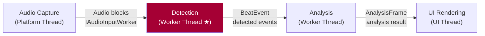
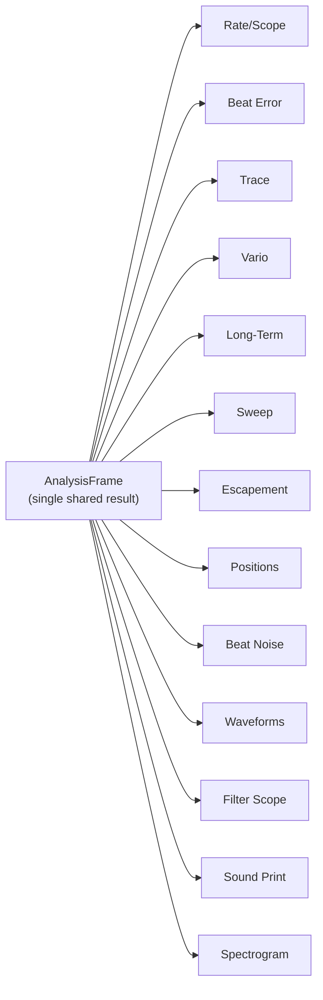
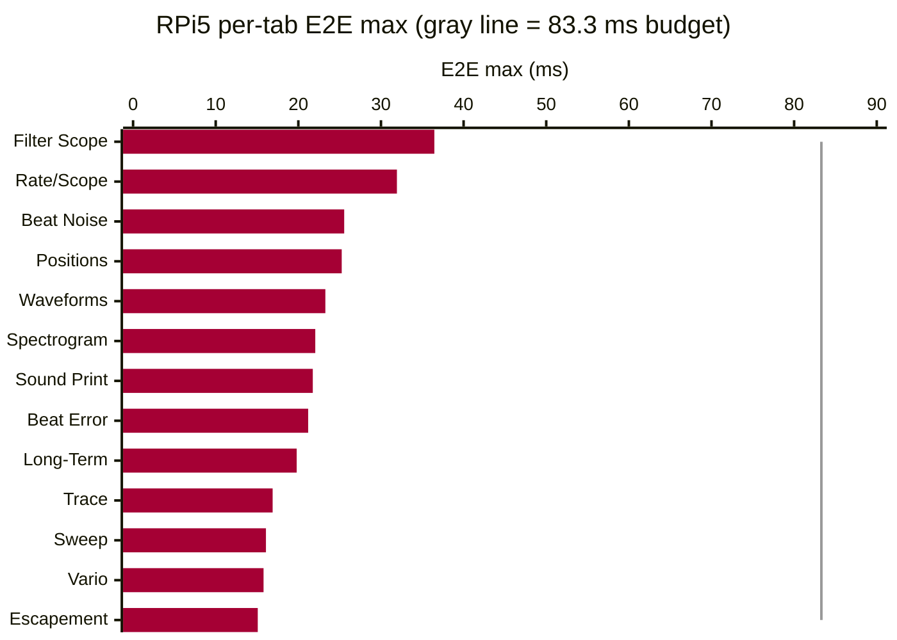

# TimeGrapher Final Presentation Script — Part 2: Presentation

> **Team 5 · TimeGrapherNet** — Final LG SW Architect Presentation (20 min)
> Format: **[Presenter]** English script (spoken directly to the evaluators) + **[Note]** action cues.
>
> Slide story: QA definition + evidence (Area 3·4) → Architecture solution (Area 4·5) → Extensibility (Area 5) → AI Feature (Area 2·7) → Lessons Learned (Area 7)

---

## Presentation Timeline

| # | Slide | Time | Rubric |
|---|---|---|---|
| Title | TimeGrapher & Team Introduction | 0:30 | — |
| 1 | UI & Architecture Overview | 1:00 | — |
| 2-1 | Top Priority QA: Accuracy | 2:30 | **Area 3 (20 pts)** |
| 2-2 | Second QA: Performance (Latency) | 2:30 | **Area 3·4 (20·25 pts)** |
| 2-3 | Architecture Solution & Measured Evidence | 3:00 | **Area 4·5 (25·20 pts)** |
| 3 | Extensibility (Modifiability) | 2:30 | **Area 5 (20 pts)** |
| 4 | AI Feature | 2:00 | **Area 2·7 (25·15 pts)** |
| 5-1 | Lessons Learned: Agentic Engineering | 2:00 | **Area 7 (15 pts)** |
| 5-2 | Lessons Learned: Strengths, Limits & Conclusion | 1:00 | **Area 7 (15 pts)** |

---

# PART 2 — PRESENTATION (20 min)

---

## Title Slide

**[Note]** Team name and project title slide.

**[Presenter]**
> "Good afternoon. We are Team 5, and we will now present our project: TimeGrapher."

---

## Slide 1. UI & Architecture Overview (1:00)

**[Note]** Left side: TimeGrapher UI screenshot. Right side: overall architecture overview diagram (Figure 0).

**[Slide Visual — TimeGrapher UI Screenshot]**

**[Slide Visual — Figure 0: Overall Architecture Overview]**

**[Presenter]**
> "As you saw in this morning's demo, our TimeGrapher has three input modes — live, playback, and simulation — and provides all 13 real-time measurement displays.
>
> On the right is the overall architecture overview. Audio input flows through Detection and Analysis and is delivered to the UI, with each function running on an independent thread. Let me explain how this structure achieves our quality targets."

---

## Slide 2-1. Top Priority QA: Accuracy (2:30)
> ▣ RUBRIC: **Area 3 — Quality Attribute Tradeoff Discussion (20 pts)** — Identify major QAs 5 pts / Accuracy as top priority 5 pts

**[Note]** QAS-1 definition + Verify experiment results + Weishi comparison table + Core.Detection mechanism diagram (Figure 1).

**[Slide Visual — Figure 1: Core.Detection Accuracy Mechanisms]**

**[Slide Visual — Three-Layer Correctness Evidence]**

| # | Evidence Type | What | Tolerance | Status |
|---|---|---|---|---|
| 1 | **Two-system comparison** | TimeGrapher vs Weishi Timegrapher — same watch | Rate ±1 s/d · Amplitude ±1° · Beat Error ±0.1 ms | Pass |
| 2 | **Automated verification (Verify)** | CI: every change, synthetic fixture vs detected BPH/events | ±1.0 s/d @ ≥1,000 beats (QAS-1) | Pass |
| 3 | **Test suite** | Core + App + Platform all layers | 0 failures | 933 passing |

**[Presenter]**
> "Early in the project, through discussion with Dan and Steve, we settled on **Accuracy** as the top priority quality attribute. A timegrapher's only job is to produce correct readings; if the rate is wrong, everything else is meaningless.
>
> Our QAS-1 is: **computed rate within ±1.0 s/d of a known reference over ≥1,000 consecutive beats on clean input.**
>
> We achieved this target. To verify it, we ran two experiments. First, a Verify experiment using simulation signals — synthetic fixtures with known timing references are checked against detected results in CI on every change, automatically. Second, we measured the same watch simultaneously on both TimeGrapher and the Weishi Timegrapher reference device and compared the outputs. Rate, amplitude, and beat error all agreed within Witschi grade tolerance.
>
> To achieve this accuracy, we implemented four signal-processing blocks in Core.Detection, as shown in Figure 1. **Sub-sample interpolation** — linear for A events, parabolic for C events — produces timing precision far beyond integer sample resolution at 192 kHz. The **adaptive noise floor** continuously tracks ambient noise levels. **PLL-guided gating** predicts when the next beat should arrive and rejects anything outside that window as noise. The **regime guard** waits for three consecutive consistent readings before updating — so a single impulse cannot break the lock.
>
> However, adding these signal-processing blocks means increased processing time — and this conflicts with our second-most-important QA: Performance."

---

## Slide 2-2. Second QA: Performance (Latency) (2:30)
> ▣ RUBRIC: **Area 3 (20 pts)** — Tradeoff discussion 5 pts / Achievement & limitations 5 pts · **Area 4 (25 pts)** — Low latency 6 pts

**[Note]** QAS-2 definition, 83.3 ms rationale, E2E latency measurement results table.

**[Slide Visual — EXP-02 Results (Pi 5, capture → analysis → display E2E)]**

| Date | Condition | Input | E2E worst | Budget | Worst usage | Drop | Miss | Result |
|:---|:---|:---|---:|---:|---:|---:|---:|:---|
| 2026-06-11 | 21600 BPH @ 48 kHz | Simulation | 41.975 ms | 166.667 ms | 25.2% | 0 | 0 | **Pass** |
| 2026-06-11 | 21600 BPH @ 48 kHz | Playback | 43.939 ms | 166.667 ms | 26.4% | 0 | 0 | **Pass** |
| 2026-06-11 | 21600 BPH @ 48 kHz | Live | 40.378 ms | 166.667 ms | 24.2% | 0 | 0 | **Pass** |
| 2026-06-11 | 43200 BPH @ 192 kHz | Simulation | 34.003 ms | 83.333 ms | 40.8% | 0 | 0 | **Pass** |
| 2026-06-11 | 43200 BPH @ 192 kHz | Playback | 34.562 ms | 83.333 ms | 41.5% | 0 | 0 | **Pass** |
| **2026-06-21** | **43200 BPH @ 192 kHz** | **Simulation** | **36.46 ms** | **83.333 ms** | **43.8%** | **0** | **0** | **Pass** |

**[Presenter]**
> "Our second-most-important QAS-2 is: **worst-case E2E latency within one beat period — 83.3 ms at 43200 BPH.**
>
> Here is how we arrived at 83.3 ms: at 43200 BPH — the highest rate we support — one beat occurs every 3,600 seconds ÷ 43,200 = 0.0833 seconds = 83.3 ms. If E2E latency exceeds one beat period, the display lags more than one beat behind the live signal, which makes real-time monitoring meaningless. We therefore defined 83.3 ms — the worst case for our highest supported BPH — as our latency budget.
>
> We achieved this target as well. To verify it, we measured capture-to-processing, processing-to-display, and total capture-to-display E2E latency for each graph on the Pi 5. Across every run: Drop 0, Miss 0, Result Pass — with a worst-case budget usage of only 43.8%.
>
> So Accuracy and Performance were in a tradeoff relationship. The signal-processing blocks needed for accuracy increase latency, while reducing latency means simplifying processing. We needed an architecture that could satisfy both simultaneously."

---

## Slide 2-3. Architecture Solution & Measured Evidence (3:00)
> ▣ RUBRIC: **Area 4 (25 pts)** — Pi real-time 8 pts / Correctness 6 pts / Evidence 5 pts · **Area 5 (20 pts)** — modular, separates concerns 6 pts

**[Note]** Figure 0 (overall architecture), Figure 2 (pipe-and-filter), Figure 3 (AnalysisFrame fan-out), per-tab E2E chart.

**[Slide Visual — Figure 0: Overall Architecture Overview (Thread Separation)]**

**[Slide Visual — Figure 2: Pipe-and-Filter Pattern]**

**[Slide Visual — Figure 3: Single AnalysisFrame → 13-Display Fan-Out]**

**[Slide Visual — Per-Tab E2E Max (RPi5, 43200@192k Sim, gray line = 83.3 ms budget)]**

**[Presenter]**
> "Our architecture solution for satisfying both Accuracy and Performance simultaneously has three parts.
>
> First, **thread separation**. As shown in Figure 0, Audio Capture, Detection, Analysis, and UI Rendering each run on independent threads. The Detection worker runs at the highest thread priority, so UI delays cannot interfere with signal processing.
>
> Second, **pipe-and-filter pattern**. As shown in Figure 2, the signal flows from audio capture through detection and analysis as a concurrent pipeline. Each stage runs independently so processing delays do not accumulate. The key decision was to keep Detection and Metrics as a single synchronous hot path — fully separating these two stages would add queuing overhead that eats into the 83.3 ms budget. That is the deliberate tradeoff between Modifiability and Latency.
>
> Third, **single AnalysisFrame fan-out**. As shown in Figure 3, the final analysis result is packaged into one AnalysisFrame that all 13 displays share. No graph needs to perform its own computation, so there is no CPU duplication — and all displays using the same data makes inconsistency structurally impossible.
>
> To confirm we met the target, we measured execution time for each of the 13 tabs. Filter Scope is the slowest at 36.46 ms; Escapement is the fastest at 15.09 ms. All 13 tabs are within the 83.3 ms budget — Drop 0, Miss 0 across all runs."

---

## Slide 3. Extensibility (Modifiability) (2:30)
> ▣ RUBRIC: **Area 5 — Extensibility (20 pts)**: supports adding new displays with limited redesign (6 pts) + future requirements/enhancements (4 pts) + understandable/maintainable (4 pts)

**[Note]** Figure 3 (AnalysisFrame fan-out) + Figure 4 (module structure view) + new tab recipe slide.

**[Slide Visual — Figure 4: Project Module Structure]**

**[Slide Visual — 4-Step Recipe for Adding a New Display]**

**[Presenter]**
> "Our third-most-important QA is Modifiability, and our scenario is: **a new graph, filter, or measurement touches ≤1 existing module.**
>
> The reason we defined it this way is simple: we had to implement many features in a short time. To deliver all 13 displays within our team size and schedule, adding one display had to leave the rest of the code untouched as much as possible.
>
> Two structural decisions enabled this. First, **Core zero dependency**. As visible in Figure 3, Core has no dependency on UI or OS. This eliminated the performance problem in the original codebase where the GUI layer was handling audio signal processing, and completely isolated the analysis engine from UI changes. Second, **single AnalysisFrame fan-out**. Because every display consumes the same AnalysisFrame, adding a new display never requires modifying the analysis logic.
>
> When new measurements, filters, graphs, or displays are needed, the structure in Figure 4 requires touching exactly four places: one property on AnalysisFrame, one assignment in AnalysisWorker, one new renderer file in the App.Rendering folder, and one registration line in InfoTabCatalog. The routing infrastructure picks it up automatically — the existing Detection, Metrics, and Imaging modules are not touched at all. All 13 tabs were built exactly this way.
>
> This structure also accommodates future requirements. Supporting a new OS means adding one Platform assembly — Core and App are untouched. Adding a new input source means adding one IAudioInputWorker implementation. CI monitors Core's zero-dependency rule on every commit, so any violation fails the build automatically."

---

## Slide 4. AI Feature (2:00)
> ▣ RUBRIC: **Area 2 (25 pts)** — AI Feature · **Area 7 (15 pts)** — Use of AI in Building the Software

**[Note]** Figure 0 (overall architecture with AI components highlighted). Show TinyML path and LLM diagnosis path as distinct components.

**[Slide Visual — Figure 0: Overall Architecture — AI Component Locations]**

**[Presenter]**
> "Our TimeGrapher has two AI features.
>
> The first is the **signal quality classifier**. It sits inside the Analysis path in Figure 0. It takes eight signal features — SNR, peak margin, noise floor, interval jitter, missed beat rate, and others — and classifies the current signal as one of four states: Good, Noisy, WeakSignal, or Unstable. The ONNX model runs on-device on the Raspberry Pi 5. This classifier is **advisory only** — it is architecturally constrained from creating beat events or altering timing, so even a wrong classification cannot affect measurement values.
>
> The second is the **LLM-based watch diagnosis feature**. When the user requests a diagnosis from the UI, the UI calls an API server we built on AWS. The API server calls the external Gemini service, which analyzes the measurement data and returns a diagnosis of the watch condition. The result is displayed back in the UI. By using an external LLM rather than an on-device model, we can deliver complex watch-domain knowledge without training a dedicated model."

---

## Slide 5-1. Lessons Learned: Agentic Engineering (2:00)
> ▣ RUBRIC: **Area 7 — Use of AI in Building the Software (15 pts)** — Description 5 pts / Thoughtful use 5 pts

**[Presenter]**
> "Finally, let me share what we learned from this project. Throughout the project, we actively practiced **Agentic Engineering** using generative AI.
>
> We used two mechanisms to keep AI aligned with our team process rather than using individual improvised prompting.
>
> **AGENTS.md** defines our project rules, commit format, and architectural principles. Every AI session starts from this context — AI follows our conventions rather than its own defaults.
> **DocRules.md**, derived from course materials, is our document quality standard. AI drafts documents; we review them against this standard; the review feedback goes back to AI for refinement.
>
> This structure ensured that humans made all final decisions and AI remained part of our defined process — not a wildcard.
>
> We applied AI across five areas:
> **① Base code conversion** — Qt/C++ DSP logic, event detection, and audio buffers ported to C# idioms (Span\<T\>, Channel, IDisposable). Correctness confirmed by Verify fixtures and test pass counts.
> **② Code implementation** — renderers, test fixtures, buffer pool, and other repetitive work drafted by AI and reviewed by us. Described the UI thread freeze to Claude, received the Producer-Consumer + Latest-Wins scheduler suggestion, validated it against the book's QA analysis, then implemented it.
> **③ CI/CD pipeline** design and automation — Core zero-dependency boundary tests and cross-platform release structure proposed and applied.
> **④ 933 test generation** — edge-case inputs near detection thresholds, ViewModelPurityTests reflection-based design.
> **⑤ Document translation** — architecture documents and presentation scripts AI-drafted in both Korean and English, reviewed and corrected against DocRules.md."

---

## Slide 5-2. Lessons Learned: Strengths, Limits & Conclusion (1:00)
> ▣ RUBRIC: **Area 7 (15 pts)** — Strengths, limits & risks 5 pts

**[Presenter]**
> "Here is what we learned from this process.
>
> **Strength**: AI let a small team port a large real-time app, add an on-device classifier, and automate the build/test/release workflow. The controlled process via AGENTS.md and DocRules.md — not individual improvised prompting — produced consistent results aligned with our team conventions.
>
> **Limits**: AI output required careful review. It does not fully understand project context and can make plausible-but-wrong suggestions — functionality must always be tested. It can make mistakes with local environment and branch state, and deep design intent still needs humans to fill in.
>
> **We treated AI as a fast collaborator that must be checked — not as an authority.**"

---

## Conclusion (0:30)

**[Presenter]**
> "In short: to satisfy both Accuracy and Performance simultaneously, we designed a thread-separated, pipe-and-filter architecture. Our Core zero-dependency structure enabled 13 displays to be built efficiently under Modifiability constraints. We integrated two AI features — a TinyML signal quality classifier and an LLM-based diagnosis via AWS and Gemini — and Agentic Engineering let a small team complete a large real-time project. Thank you — we are happy to take questions."

---

## Appendix C. Anticipated Q&A

| Question | Key Answer |
|---|---|
| "How did you guarantee accuracy?" | Two levels: **architecture** defines QAS-1 target and enables headless verification via Verify; **Core.Detection implementation** achieves it — sub-sample interpolation, adaptive noise floor, PLL-guided gating, regime guard. Weishi comparison + Verify adverse fixtures as evidence. |
| "Where does the 83.3 ms figure come from?" | 43200 BPH = 12 beats/second = 83.3 ms per beat. E2E latency must fit within one beat period so the display does not lag behind the live signal. Defined as the worst case for our highest supported BPH. |
| "How did you resolve the Accuracy vs. Latency tradeoff?" | Thread separation + pipe-and-filter keeps Detection on a highest-priority thread isolated from UI delays. Detection + Metrics kept as one synchronous hot path — full pipeline separation would add queuing overhead that exceeds the budget. |
| "How do you add a new graph?" | One AnalysisFrame property + one AnalysisWorker assignment + one renderer file in App.Rendering + one InfoTabCatalog line. Existing modules unchanged. CI enforces the boundary. |
| "What is the LLM diagnosis response latency?" | It involves an API server round-trip to Gemini, so there is network latency. It is completely separated from the real-time measurement path (83.3 ms budget) and has no effect on measurement accuracy. |
| "What if the TinyML classifier is wrong?" | The classifier is advisory only — it is architecturally prevented from creating events, re-timing them, or modifying BPH sync. A wrong classification cannot affect measurement values. |
| "Is MVVM complete?" | Not claiming textbook-complete MVVM. View/ViewModel/Model separation and ViewModel testability are the direction; some lifecycle remains in code-behind. |
| "You said CI/CD verifies accuracy?" | CI/CD is the improvement process, not the application itself. The accuracy claim rests on runtime design choices + Weishi comparison + repeated measurements first. Verify/CI prevents that accuracy from regressing — supporting evidence. |

---

## Appendix D. Slides ↔ SW Architecture Document Traceability

| Slide | Document Evidence | Key One-Liner |
|---|---|---|
| 2-1. Accuracy | 2-Architectural-Drivers.md (QAS-1), 4-Planned-Experiments.md (EXP-06) | QAS-1: ±1.0 s/d over ≥1,000 beats. Weishi comparison + Verify confirm. |
| 2-2. Performance | 2-Architectural-Drivers.md (QAS-2), 4-Planned-Experiments.md (EXP-02) | QAS-2: E2E ≤ 83.3 ms at 43200 BPH. EXP-02 result: 43.8% budget usage. |
| 2-3. Architecture | ADR-001, ADR-002, 5-Architectural-View.md | Thread separation + pipe-and-filter + single AnalysisFrame fan-out. |
| 3. Extensibility | ADR-002, ADR-003, 5-Architectural-View.md | Core zero dependency; new graph ≤1 existing module changed; CI-enforced boundary. |
| 4. AI Feature | ADR-004, EXP-04 | TinyML: advisory only, event creation blocked. LLM: AWS API → Gemini diagnosis. |
| 5. Agentic Engineering | ADR-004, R-17/R-18 | AI is useful but must be checked: AGENTS.md + DocRules.md control, humans decide. |
