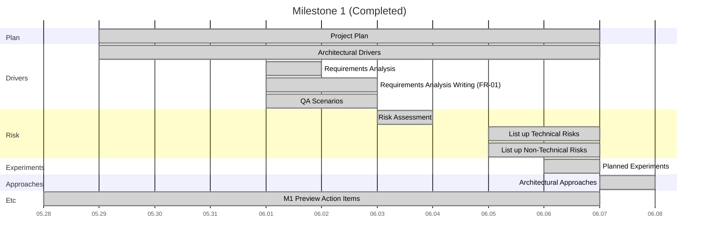
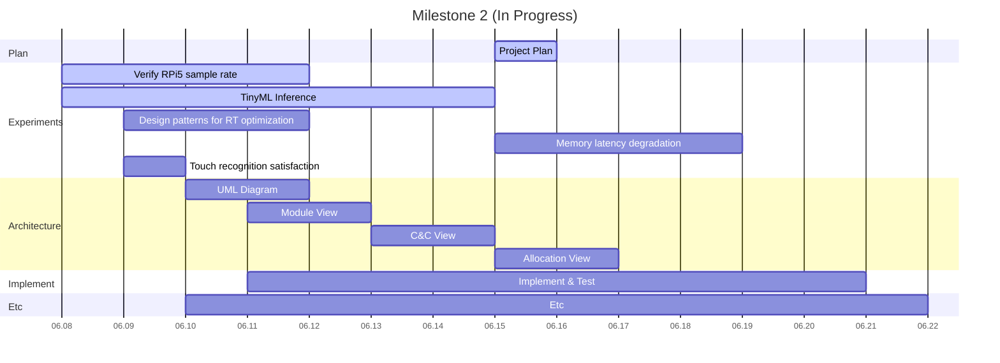
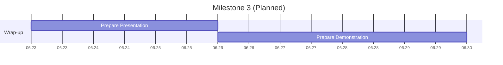
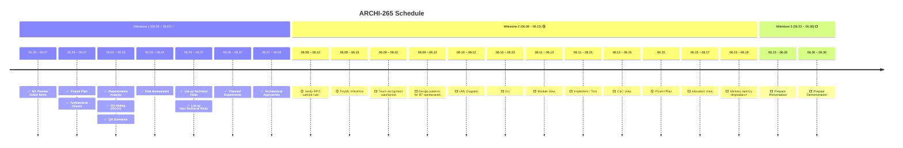

# Project Plan

## Team Roles

- **Team Lead**: Sungjun Yoon
- **System (dataflow, pipeline)**: Junsung Kim, Jongdae Baek
- **Algorithm (functionality, calculation)**: Sunyoung Oh, Junyoung Park
- **GUI**: Jaehong Oh, Sungjun Yoon

## ARCHI-265 Schedule
🔗 [Quire URL](https://quire.io/w/SUNYOUNG_OH/40?filter=all&share=ud59lcpw1fx35wkwjcub6tdurt5iyg&view=timeline)

## Legend

- 🟡 In Progress
- ⬜ Planned
- ✅ Completed

## Schedule

- ✅ **Milestone 1** — `05.29 ~ 06.07`
  - ✅ Project Plan — `05.29 ~ 06.07`
  - ✅ **Architectural Drivers** — `05.29 ~ 06.07`
    - ✅ **Requirements Analysis** — `06.01 ~ 06.02`
      - ✅ Requirements Analysis Writing (FR-01) — `06.01 ~ 06.03` _(Assigned: YUN, JunSung, Junyoung Park, D, SUNYOUNG OH, Jaehong)_
    - ✅ QA Scenarios — `06.01 ~ 06.03` _(Assigned: YUN, JunSung, Junyoung Park, D, SUNYOUNG OH, Jaehong)_
  - ✅ **Risk Assessment** — `06.03 ~ 06.04`
    - ✅ List up Technical Risks — `06.05 ~ 06.07` _(Assigned: YUN, JunSung, Junyoung Park, D, SUNYOUNG OH, Jaehong)_
    - ✅ List up Non-Technical Risks — `06.05 ~ 06.07` _(Assigned: YUN, JunSung, Junyoung Park, D, SUNYOUNG OH, Jaehong)_
  - ✅ Planned Experiments — `06.06 ~ 06.07` _(Assigned: YUN, JunSung)_
  - ✅ **Architectural Approaches** — `06.07 ~ 06.08` _(Assigned: Jaehong, D)_
    - ✅ Describe Overview-level architecture _(Assigned: YUN, JunSung, Junyoung Park, D, SUNYOUNG OH, Jaehong)_
  - ✅ **Etc** — `05.28 ~ 06.07`
    - ✅ **Milestone 1 Preview Action Items** _(Assigned: YUN, JunSung, Junyoung Park, D, SUNYOUNG OH, Jaehong)_
- 🟡 **Milestone 2** — `06.08 ~ 06.22`
  - 🟡 Project Plan — `06.15` _(Assigned: JunSung)_
  - 🟡 **Experiments/Results** — `06.08 ~ 06.17`
    - 🟡 Verify real-time processing sample rate capability on RPi5 — `06.08 ~ 06.12` _(Assigned: Junyoung Park)_
    - 🟡 TinyML Inference — `06.08 ~ 06.15` _(Assigned: Jaehong)_
    - ⬜ Propose design patterns for real-time optimization (C++ vs C#) — `06.09 ~ 06.12` _(Assigned: JunSung, Jaehong)_
    - ⬜ Memory/latency degradation during long-term execution — `06.15 ~ 06.19` _(Assigned: D)_
    - ⬜ Touch recognition satisfaction — `06.09 ~ 06.10` _(Assigned: JunSung)_
  - ⬜ **Architecture** — `06.10 ~ 06.17`
    - ⬜ UML Diagram — `06.10 ~ 06.12` _(Assigned: YUN, SUNYOUNG OH)_
    - ⬜ Module View — `06.11 ~ 06.13` _(Assigned: YUN, SUNYOUNG OH, Jaehong)_
    - ⬜ C&C View — `06.13 ~ 06.15` _(Assigned: JunSung, YUN)_
    - ⬜ Allocation View — `06.15 ~ 06.17` _(Assigned: D, Jaehong)_
  - ⬜ Implement / Test — `06.11 ~ 06.21` _(Assigned: Jaehong, Junyoung Park, D)_
  - ⬜ Etc — `06.10 ~ 06.22`
- ⬜ **Milestone 3** — `06.23 ~ 06.30`
  - ⬜ Prepare Presentation — `06.23 ~ 06.26` _(Assigned: SUNYOUNG OH, YUN)_
  - ⬜ Prepare Demonstration — `06.26 ~ 06.30` _(Assigned: Jaehong, Junyoung Park, D)_

## Gantt Chart

### Milestone 1 — `05.28 ~ 06.08`

### Milestone 2 — `06.08 ~ 06.22`

### Milestone 3 — `06.23 ~ 06.30`

## Timeline

