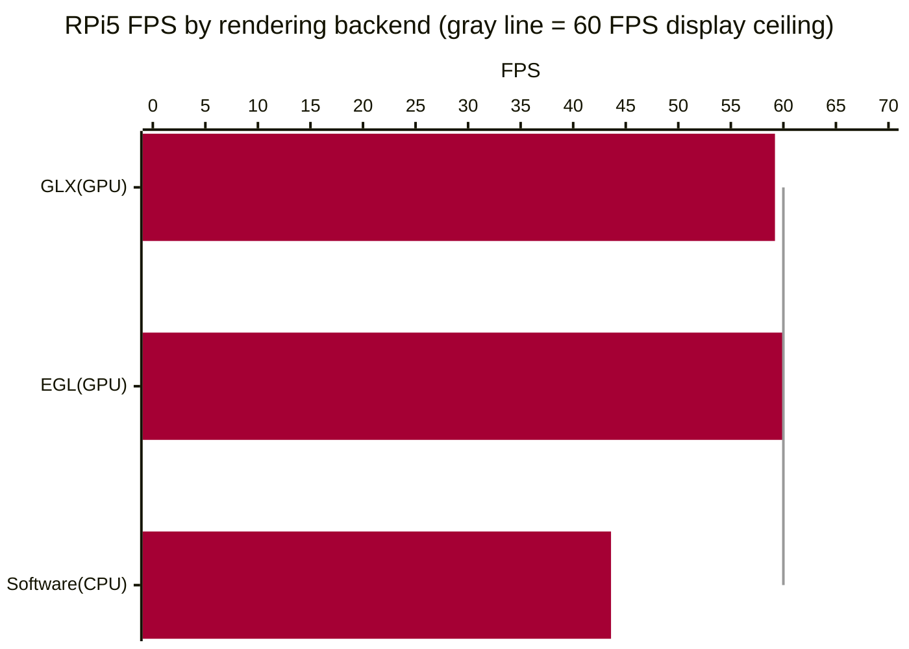
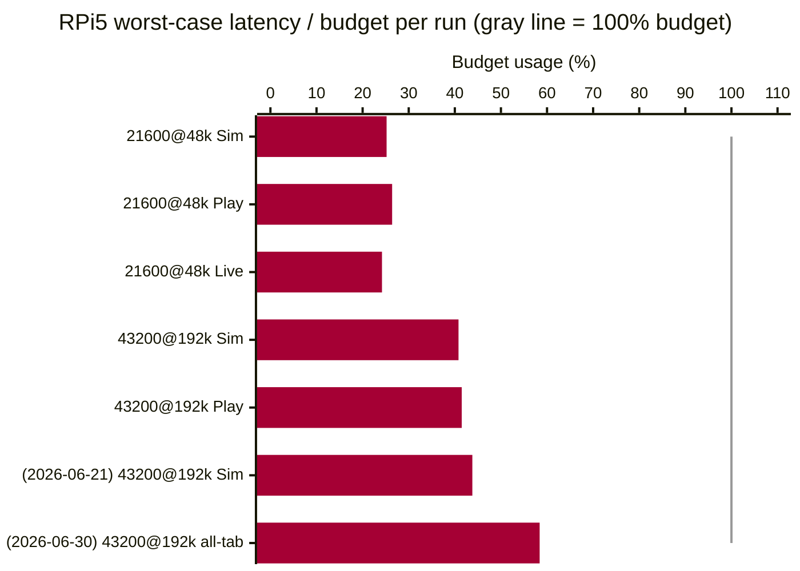
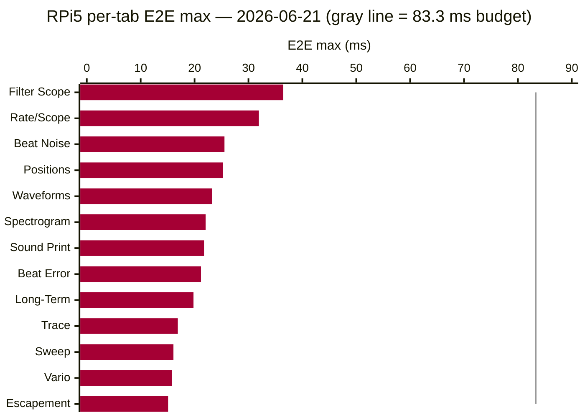
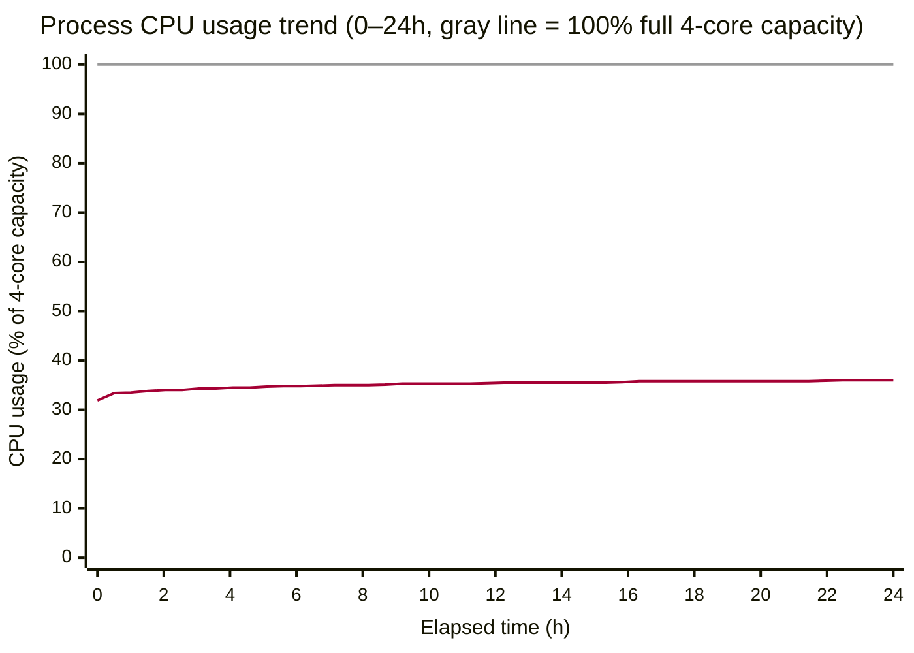
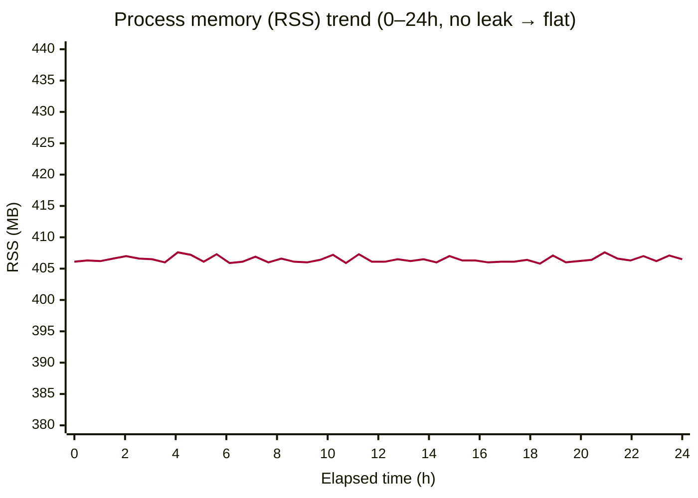
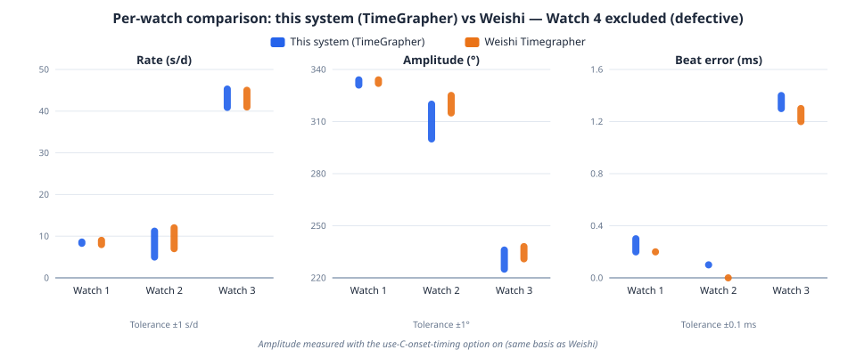

# Planned Experiments

**Contents** — [Risk-to-Experiment Map](#risk-to-experiment-map) · [EXP-01](#exp-01-avalonia-rendering-backend-on-the-rpi5) · [EXP-02](#exp-02-rpi5-real-time-sample-rate-ceiling) · [EXP-03](#exp-03-gui-real-time-rendering-design-patterns) · [EXP-04](#exp-04-on-device-tinyml-inference-feasibility) · [EXP-05](#exp-05-long-run-stability-24h) · [EXP-06](#exp-06-measurement-accuracy) · [Integrated Schedule](#integrated-schedule) · [Common Approval Criteria](#common-approval-criteria)

## Terminology

The terms used in this document are defined in the consolidated [Glossary](6-Glossary.md).

## Risk-to-Experiment Map

> Priority: **High** / **Mid** (no Low-priority experiments in this milestone).

| Experiment | Risks Addressed | Related QAS | Priority | Core Question |
|---|---|---|---|---|
| [EXP-01](#exp-01-avalonia-rendering-backend-on-the-rpi5) | [R-05](3-Risk-Assessment.md#a-real-time-performance-rpi) | [QAS-2](2-Architectural-Drivers.md#qas-2--performance-latency--from-sound-input-to-screen-display) | **High** | If we choose C#, how do we remove the Avalonia-on-RPi5 rendering risk? |
| [EXP-02](#exp-02-rpi5-real-time-sample-rate-ceiling) | [R-01](3-Risk-Assessment.md#a-real-time-performance-rpi), [R-03](3-Risk-Assessment.md#a-real-time-performance-rpi) | [QAS-2](2-Architectural-Drivers.md#qas-2--performance-latency--from-sound-input-to-screen-display) | **High** | What is the highest sample rate the RPi5 can process in real time? |
| [EXP-03](#exp-03-gui-real-time-rendering-design-patterns) | [R-02](3-Risk-Assessment.md#a-real-time-performance-rpi) | [QAS-2](2-Architectural-Drivers.md#qas-2--performance-latency--from-sound-input-to-screen-display), [QAS-5](2-Architectural-Drivers.md#qas-5--modifiability-extensibility--adding-a-new-measurementfiltergraph) | **High** | Which design patterns should we apply first to improve GUI real-time performance? |
| [EXP-04](#exp-04-on-device-tinyml-inference-feasibility) | [R-17](3-Risk-Assessment.md#f-project--process) | [QAS-2](2-Architectural-Drivers.md#qas-2--performance-latency--from-sound-input-to-screen-display), [QAS-3](2-Architectural-Drivers.md#qas-3) | Mid | Can we add TinyML inference and still hold real-time behavior and trustworthiness? |
| [EXP-05](#exp-05-long-run-stability-24h) | [R-04](3-Risk-Assessment.md#a-real-time-performance-rpi) | [QAS-2](2-Architectural-Drivers.md#qas-2--performance-latency--from-sound-input-to-screen-display) | Mid | Do memory/latency degrade over long runs? |
| [EXP-06](#exp-06-measurement-accuracy) | [R-06](3-Risk-Assessment.md#b-signal-processing--measurement-trustworthiness) | [QAS-1](2-Architectural-Drivers.md#qas-1--accuracy--from-acoustic-event-detection-to-computed-watch-metrics) | **High** | Does measurement accuracy — confirmed first on the Realistic-off simulation — agree within tolerance with the commercial Weishi Timegrapher? |

## EXP-01: Avalonia rendering backend on the RPi5

**Risks:** [R-05](3-Risk-Assessment.md#a-real-time-performance-rpi) · **QAS:** [QAS-2](2-Architectural-Drivers.md#qas-2--performance-latency--from-sound-input-to-screen-display) · **Priority:** High

### Results & Decisions

- **Decision**: keep the default (GPU-first). GPU acceleration is faster than Software.
- **Pi5 measurement**: GLX 59.2 FPS (mean 16.9 ms) · EGL 60.0 FPS (16.7 ms) · Software 43.6 FPS (22.9 ms). Both GPU backends hit the display refresh ceiling (~60 Hz, 16.7 ms vsync), and Software was slower.
- **HW acceleration confirmed**: the GL renderer logged as `V3D 7.1.10.2` (the RPi5 GPU) — not an llvmpipe fallback.

**FPS by backend (RPi5, higher is better)**

### Objective

When adopting the C# path, use a technical experiment to resolve the risk that — as in numerous Avalonia GitHub issues — a bug makes GPU-accelerated rendering on the RPi5 *slower* than even SW rendering, stuttering the real-time graphs. Core question:

- On the RPi5, is GPU-accelerated rendering (GLX/EGL) actually slower than software rendering? (Community reports: ~80 ms accelerated vs 6–12 ms software — if true, the real-time graphs stutter.)

The answer drives the design decision **"which Avalonia rendering backend to lock for RPi5 deployment."** Impact scope: app startup config and the RPi deployment guide.

**Why this experiment:** multiple community reports flag slow GPU-accelerated rendering on RPi/embedded Linux (Avalonia GitHub `#18807, #18942, #19288, #18127`), but the causes differ across reports (app-side bugs, resolution, driver path) and none measure our workload's conditions. The backend can only be fixed by measuring on the real device.

### Status

Complete

### Deliverables

- A reusable benchmark test
- Per-backend (GLX / EGL / Software) frame-time comparison table (FPS, mean, p95, p99)
- Determination of HW acceleration vs software fallback, based on the actually-active renderer
- Rendering-backend recommendation (keep the default, or force Software)

### Resources Needed

- RPi5 (monitor connected, SSH access) — shared team device
- Windows dev PC (cross-build for the RPi)
- Effort: ~1.0 person-day

### Experiment Description

1. **Build the benchmark test** — add a diagnostic measurement mode to the app: lock each rendering backend (GLX/EGL/Software) with no fallback, drive the real graph pipeline under a heavy per-frame redraw load (using a synthetic Sim signal), and collect frame intervals over a fixed window — while recording which GL renderer is actually active to tell HW acceleration from software fallback.
2. **Verify the benchmark on Windows** with a short measurement (end-to-end sanity check).
3. **Deploy to the RPi5 and measure** — run each of the three backends with a warmup followed by ~30 s of measurement.
4. **Compare results → derive the backend recommendation** — record it here and in [Risk Assessment (R-05)](3-Risk-Assessment.md#a-real-time-performance-rpi).

**Completion criteria (met):** ① all three backends measured, ② the active-renderer (HW-acceleration) status confirmed, and ③ a backend recommendation derived — all three were met, completing the experiment.

### Duration

- 6/9–6/10

### Links & References

- [Rendering-backend A/B measurement results — result_renderer.md](../../TestResult/result_renderer.md)
- Original report: [Avalonia Discussion #18807 — Poor Linux performance when using hardware acceleration](https://github.com/AvaloniaUI/Avalonia/discussions/18807)
- Related case: [Discussion #18942 — RPi high-resolution full-repaint degradation](https://github.com/AvaloniaUI/Avalonia/discussions/18942)
- [Avalonia docs — Running on RPi5 via DRM](https://docs.avaloniaui.net/docs/guides/platforms/rpi/running-on-raspbian-lite-via-drm)

## EXP-02: RPi5 real-time sample-rate ceiling

**Risks:** [R-01](3-Risk-Assessment.md#a-real-time-performance-rpi), [R-03](3-Risk-Assessment.md#a-real-time-performance-rpi) · **QAS:** [QAS-2](2-Architectural-Drivers.md#qas-2--performance-latency--from-sound-input-to-screen-display) · **Priority:** High

### Results & Decisions

- **Decision**: Base at 48 kHz, top support at 192 kHz.
- **Results**: The first 2026-06-11 measurement passed at 43200@192k Playback with 34.562 ms worst E2E latency (41.5% of budget), the 2026-06-21 current-implementation check passed with a 36.46 ms worst case (43.8% of budget), and the 2026-06-30 all-tab benchmark also passed with a 48.70 ms worst case (58.4% of budget). Therefore, 192 kHz support is confirmed within budget across the first measurement and subsequent implementation checks.
- **E2E meaning**: E2E means capture to display, the total latency from when the input sample is captured until the analysis result is shown on screen.

| Date | Condition | Input | E2E worst | Budget | Worst usage | Drop | Miss | Result |
| :--- | :--- | :--- | ---: | ---: | ---: | ---: | ---: | :--- |
| 2026-06-11 | 21600 BPH @ 48 kHz | Simulation | 41.975 ms | 166.667 ms | 25.2% | 0 | 0 | Pass |
| 2026-06-11 | 21600 BPH @ 48 kHz | Playback | 43.939 ms | 166.667 ms | 26.4% | 0 | 0 | Pass |
| 2026-06-11 | 21600 BPH @ 48 kHz | Live | 40.378 ms | 166.667 ms | 24.2% | 0 | 0 | Pass |
| 2026-06-11 | 43200 BPH @ 192 kHz | Simulation | 34.003 ms | 83.333 ms | 40.8% | 0 | 0 | Pass |
| 2026-06-11 | 43200 BPH @ 192 kHz | Playback | 34.562 ms | 83.333 ms | 41.5% | 0 | 0 | Pass |
| **2026-06-21** | **43200 BPH @ 192 kHz** | **Simulation** | **36.46 ms** | **83.333 ms** | **43.8%** | **0** | **0** | **Pass** |
| **2026-06-30** | **43200 BPH @ 192 kHz** | **Simulation (all tabs)** | **48.70 ms** | **83.333 ms** | **58.4%** | **0** | **0** | **Pass** |

### Objective

Confirm whether the input → analysis → display pipeline meets real-time requirements on the RPi5 Live environment.

- Q1. Which sample rate runs stably without block drop?
- Q2. Does worst-case total end-to-end latency stay within one beat period? (43200 BPH: 83.3 ms · 21600 BPH: 166.7 ms)

### Status

Complete

### Deliverables

- Per-condition / per-input-mode / per-platform latency comparison table (avg/p95/p99/worst)
- Block-drop / missed-beat statistics table
- Input-mode (Sim/Playback/Live) and platform (Pi/Windows) comparison table
- Sample-rate target proposal (Go/No-Go)

### Resources Needed

- 1× RPi5 (primary), Windows dev PC (reference)
- Live input (real movement + USB microphone), Playback WAV (21600 BPH from the Live recording, 43200 BPH synthetic)
- Latency/drop logging code
- Effort: 1.5 person-days

### Experiment Description

1. Measure both conditions (21600@48k, 43200@192k) across Simulation/Playback/Live — 43200 excludes Live, 5 runs per platform, on RPi5 (primary) and Windows (reference).
2. Compare total latency (avg/p95/p99/worst), block drop, and missed beat per condition / input mode / platform. Truncate to the common-minimum frame count across CSVs.
3. Judge worst-case E2E ≤ one beat period and drop=0 / miss=0 on the RPi5 (Windows is reference).

### Duration

- 6/9–6/10: Prepare instrumentation code
- 6/11: Run the QAS-2 approval matrix
- 6/12–6/13: Analyze results and derive the decisions
- 6/21: Measure 43200@192k on the current implementation
- 6/30: Measure 43200@192k all-tab benchmark on the current implementation

### Links & References

- [QAS-2 latency measurement results — result_latency.md](../../TestResult/result_latency.md)

## EXP-03: GUI real-time rendering design patterns

**Risks:** [R-02](3-Risk-Assessment.md#a-real-time-performance-rpi) · **QAS:** [QAS-2](2-Architectural-Drivers.md#qas-2--performance-latency--from-sound-input-to-screen-display), [QAS-5](2-Architectural-Drivers.md#qas-5--modifiability-extensibility--adding-a-new-measurementfiltergraph) · **Priority:** High

### Results & Decisions

- **Decision**: adopt a Pipe-and-Filter flow + concurrency tactics (Producer–Consumer · Observer · Latest-Wins · fixed buffer pool).
- **Results**: [see Results & Analysis below](#results--analysis)

**Per-tab E2E max — 2026-06-21 current-implementation check (retained historical run, lower is better, gray line = 83.3 ms budget)**

- In the 2026-06-21 run, the slowest tab (Filter Scope, 36.46 ms) sat at ~44 % of the 83.3 ms budget.

**Per-tab E2E max split (RPi5, 43200@192k Sim, 2026-06-30; bars = capture→process / process→display, gray line = 83.3 ms budget)**

```mermaid
%%{init: {"themeVariables": {"xyChart": {"plotColorPalette": "#A50034, #999999, #666666"}}}}%%
xychart-beta horizontal
    title "RPi5 per-tab E2E max — 2026-06-30 (red = capture→process, gray = process→display)"
    x-axis ["Filter Scope", "Beat Noise", "Waveforms", "Rate/Scope", "Long-Term", "Sweep", "Beat Error", "Vario", "Escapement", "Trace", "Sound Print", "Spectrogram", "Health", "Positions"]
    y-axis "Latency (ms)" 0 --> 90
    bar [42.79, 43.29, 42.95, 41.38, 41.27, 41.34, 41.07, 41.37, 41.75, 40.69, 38.56, 37.83, 37.46, 37.67]
    bar [5.91, 4.60, 4.62, 5.79, 5.78, 5.27, 4.58, 3.62, 3.16, 3.88, 5.30, 5.80, 4.37, 4.03]
    line [83.3, 83.3, 83.3, 83.3, 83.3, 83.3, 83.3, 83.3, 83.3, 83.3, 83.3, 83.3, 83.3, 83.3]
```

- Even the slowest tab (Filter Scope, 48.70 ms) sits at ~58 % of the 83.3 ms budget — all 14 tabs keep headroom.
- All tabs recorded drop 0 · miss 0.

**Measurement data (2026-06-30, RPi5, 43,200 BPH @ 192 kHz, Simulation):**

| Tab | capture→process at E2E worst (ms) | process→display at E2E worst (ms) | E2E worst (ms) | Budget usage | Frames |
| :--- | ---: | ---: | ---: | ---: | ---: |
| Filter Scope | 42.79 | 5.91 | 48.70 | 58.4% | 1250 |
| Beat Noise | 43.29 | 4.60 | 47.90 | 57.5% | 1297 |
| Waveforms | 42.95 | 4.62 | 47.57 | 57.1% | 1666 |
| Rate/Scope | 41.38 | 5.79 | 47.17 | 56.6% | 987 |
| Long-Term | 41.27 | 5.78 | 47.06 | 56.5% | 1295 |
| Sweep | 41.34 | 5.27 | 46.60 | 55.9% | 1301 |
| Beat Error | 41.07 | 4.58 | 45.65 | 54.8% | 1038 |
| Vario | 41.37 | 3.62 | 44.99 | 54.0% | 1450 |
| Escapement | 41.75 | 3.16 | 44.91 | 53.9% | 1441 |
| Trace | 40.69 | 3.88 | 44.57 | 53.5% | 1115 |
| Sound Print | 38.56 | 5.30 | 43.85 | 52.6% | 553 |
| Spectrogram | 37.83 | 5.80 | 43.63 | 52.4% | 410 |
| Health | 37.46 | 4.37 | 41.83 | 50.2% | 1571 |
| Positions | 37.67 | 4.03 | 41.70 | 50.0% | 987 |

> Values are rounded to two decimals.

### Objective

Resolve the bottleneck where, under the single-threaded synchronous call chain, processing load spilled onto the UI main thread and froze the screen. Grounded in Bass, Clements & Kazman's *Software Architecture in Practice (SAP)*, verify a pattern/tactic combination that secures real-time behavior without harming portability (Portability) or modifiability (Modifiability).

- Core questions:

- Q1. Under a 28800 BPH (125 ms per beat) load, what concurrency / data-copy structure keeps the UI thread unblocked?
- Q2. Can we eliminate LOH pollution and GC spikes caused by large-snapshot churn (Sound Print ~2.67 MB, Spectrogram ~1.92 MB)?
- Q3. What structure satisfies UI-render-cycle isolation and new-tab/graph extensibility (modifiability) at the same time?

### Status

Complete

### Deliverables

- Pipe-and-Filter data-flow centered audio analysis-to-visualization pipeline architecture definition
- Concurrency-isolation render scheduler (Latest-Wins) and data-copy buffering (fixed buffer pool) design
- Long-run memory/aggregation bounding structure (`DecimatingSeries`) definition
- Architecture trade-off analysis for the adopted patterns/tactics

### Resources Needed

- **Hardware**: RPi5 (CanaKit 16GB RAM), Windows 11 build PC
- **Target source**: `AnalysisFrameRouter.cs`, `SoundPrintFrameProjector.cs`, `AnalysisWorker.cs`, `DecimatingSeries.cs` core modules
- **Instrumentation**: Stopwatch-based real-time latency tracking (`--analysis-log`)
- **Effort**: 2.0 person-days

### Experiment Description

This technical experiment verifies the adopted architecture patterns/tactics for improving GUI real-time rendering across three items.

1. **Pipe-and-Filter data-flow verification** — the watch-sound signal follows a streaming flow of `Capture → Detection → Measurement → Visualization`. Build the pipeline where the audio capture buffer passes through each analysis stage into the final visualization artifacts (`SoundPrint`, `Spectrogram`) and test the stages' independent replaceability. (Maps to the design-pattern table: `Pipe-and-Filter` — overall flow, `Strategy` — input source / filter stages.)
2. **Concurrency-isolation tactic verification** — isolate `AnalysisWorker` on a dedicated `ThreadPriority.Highest` thread so the UI thread only renders. Input↔analysis is delivered via a shared-buffer **Producer–Consumer**, and result frames via an **Observer** fan-out (`AnalysisFrameRouter`'s `ObserveFrame`/`RenderFrame`) that consumers (tabs) subscribe to. To prevent cross-thread interference, combine a **fixed buffer pool (PublishBufferCount = 3) rotation** with a **Latest-Wins scheduler** (`AnalysisFrameRenderScheduler`) that discards frames exceeding the refresh rate. Measure whether the analysis worker's deadline stays isolated from UI lag at 28800 BPH (125 ms).
3. **DecimatingSeries data-bounding verification** — to stop the graph point count from accumulating in proportion to run time, analyze the normal operation of the aggregation structure that, on reaching the fixed capacity limit, merges adjacent point pairs to halve resolution while preserving each bucket's min/max.

### Results & Analysis

This experiment analyzes, from a benefits/trade-offs perspective, which quality attributes the adopted patterns/tactics gain (and how) and what is given up in return, grounded in SAP theory.

#### 1. Pipe-and-Filter data flow — benefits and trade-offs

- **Applied structure**: formalize input → analysis → display as a one-way `Pipe-and-Filter` flow, and isolate `AnalysisWorker` on a dedicated thread (`ThreadPriority.Highest`) so the UI only renders.

- **Benefits**
  - **Maximized modifiability/extensibility (QAS-5)**: each processing stage is encapsulated as an independent stage behind a standard interface (`IAnalysisFrameConsumer`, etc.), so a UI tab structure or a new analysis filter (e.g., a new measurement graph) can be injected without modifying existing code.
  - **Improved reusability/portability**: the dependency between business logic and the GUI framework (Avalonia) is decoupled, making the backend analysis pipeline easy to reuse or port to another OS environment.
- **Trade-offs**
  - **Data-copy overhead**: each time data passes from stage to stage, a large signal snapshot (Sound Print ~2.67 MB, Spectrogram ~1.92 MB) is transferred, increasing copy cost.
  - **Mitigation**: instead of allocating on the heap every time in normal execution, reuse fixed-size buffer blocks to fundamentally block GC spikes and LOH (Large Object Heap) pollution (Zero Churn).

#### 2. Concurrency-isolation tactic — benefits and trade-offs

- **Benefits**
  - **Root-cause fix for UI blocking (QAS-2)**: even when heavy graphics computation or frame rendering runs, an asynchronous barrier is formed that never intrudes on the core analysis thread's cycle.
  - **Performance defense via Latest-Wins**: even if the UI refresh rate slips, the previous frame held in the single slot is coalesced into / discarded for the latest frame, so no cascading delay from backlog accumulation occurs.
- **Trade-offs**
  - **Frame drop / recency bias**: because intermediate frames are discarded to match the UI render cycle and only the latest data is shown, momentary loss of intermediate frames occurs.
  - **Mitigation and justification**: for a real-time monitoring system, expressing the "recency of the current state" without lag matters more than showing past frames with delay, which fits the key quality attributes (performance and usability), so this loss is an architecturally acceptable trade-off. The long-term metric history, however, is supplemented by separately combining a `DecimatingSeries` structure so it aggregates losslessly even across Latest-Wins coalescing.

### Duration

- 6/8–6/9: Bottleneck analysis and candidate-pattern shortlist
- 6/10–6/13: Pattern technical experiment and comparative measurement
- 6/15: SAP judgment and application-priority finalization

### Links & References

- NA

## EXP-04: On-device TinyML inference feasibility

**Risks:** [R-17](3-Risk-Assessment.md#f-project--process) · **QAS:** [QAS-2](2-Architectural-Drivers.md#qas-2--performance-latency--from-sound-input-to-screen-display), [QAS-3](2-Architectural-Drivers.md#qas-3) · **Priority:** Mid

### Results & Decisions

- **Decision**: adopt signal-quality TinyML as a **Conditional Go**. Keep the ONNX model as a selectable implementation behind the `ISignalQualityClassifier` Strategy seam, and surface the verdict only through `AnalysisFrame.SignalQuality` plus the existing warning overlay / status guidance. The classifier remains **non-destructive advisory** information: it does not discard or modify measurement events or rate/amplitude/beat-error computation.
- **Adoption conditions**: ① Core continues to have no ONNX Runtime dependency (model loading stays in the `TimeGrapher.Inference` leaf project), ② model load failure falls back to `HeuristicSignalQualityClassifier`, ③ any `SignalQualityFeatures` contract or model-file change reruns trainer validation, confusion matrix, and off/on performance measurement, and ④ before RPi5 deployment, rerun the same 43,200 BPH @ 192 kHz release benchmark on the target device.
- **Performance judgment**: on 2026-06-30, the Windows 11 dev PC ran the same 30 s Realistic synthetic input (43,200 BPH @ 192 kHz) with TinyML off/on. Analysis processing ratio changed from **2.598% → 3.548%** (**+0.950 pp**), and detected BPH stayed **43,200** in both runs. This added load is not large enough to threaten the existing EXP-03 RPi5 worst-case headroom (48.70 ms / 83.3 ms).
- **Classification judgment**: trainer validation reached **0.997 micro/macro accuracy**, and the ONNX round trip matched **2,000/2,000 rows (100.00%)**. A separate balanced feature-validation confusion matrix reached **1,993/2,000 correct (99.65%)**, sufficient for signal-quality warnings.
- **Verification result**: `TimeGrapher.Inference.Tests` 14 tests, Core signal-quality tests 25 tests, and App signal-quality/status tests 36 tests passed.

**Model / inference measurement (2026-06-30, Windows 11 x64):**

| Item | Measurement |
|---|---:|
| ONNX model size | 513,867 B (~502 KiB) |
| Input feature count | 8 |
| Direct inference mean time | 144.548 µs/call (100,000 calls) |
| Direct inference allocation | 1,504 B/call |
| ONNX vs ML.NET round trip | 2,000/2,000 matched |

**TinyML off/on processing cost (same 30 s input, 43,200 BPH @ 192 kHz):**

| Mode | Wall processing time | Processing/audio ratio | CPU time | 18-core real-time CPU proxy | Detected BPH | Signal-quality frames |
|---|---:|---:|---:|---:|---:|---:|
| Off | 779.317 ms | 2.598% | 890.625 ms | 0.165% | 43,200 | 0 |
| ONNX | 1,064.312 ms | 3.548% | 9,484.375 ms | 1.756% | 43,200 | 1,311 (Good) |
| Delta | +284.995 ms | +0.950 pp | +8,593.750 ms | +1.591 pp | 0 | +1,311 |

**Balanced feature-validation confusion matrix (expected × actual, 2,000 rows):**

| Expected \ Actual | Good | Noisy | WeakSignal | Unstable |
|---|---:|---:|---:|---:|
| Good | 498 | 0 | 2 | 0 |
| Noisy | 1 | 497 | 2 | 0 |
| WeakSignal | 0 | 0 | 500 | 0 |
| Unstable | 1 | 0 | 1 | 498 |

### Objective

Verify whether adding TinyML-based **signal-quality classification** (Good / Noisy / WeakSignal / Unstable) to the on-device RPi path keeps real-time behavior and measurement trustworthiness.

- Q1. After adding TinyML inference, are end-to-end latency and frame-refresh stability still within the allowed range?
- Q2. Does TinyML classification reduce the risk that weak-signal / noisy / unstable segments are mistaken for clean readings?

### Status

Complete

### Deliverables

- Model size / inference time / CPU-usage comparison table ✓
- TinyML on/off performance comparison table (processing latency, CPU time, signal-quality frame count) ✓
- Signal-quality confusion matrix ✓
- Adoption decision memo (Conditional Go) ✓

### Resources Needed

- Raspberry Pi 5 target runtime (`linux-arm64`) and Windows 11 dev PC (measurement environment for this run)
- ONNX Runtime 1.20.1
- Synthetic validation dataset (Sim, generated by `TimeGrapher.SignalQualityTrainer`)
- Performance logging tools (Stopwatch, process CPU time, balanced validation matrix)
- Effort: 1.5 person-days

### Experiment Description

1. Generate the synthetic, self-labelled feature distribution with `TimeGrapher.SignalQualityTrainer`, then check the trained ONNX model's validation accuracy and ONNX round-trip agreement.
2. Run TinyML off/on on the same 30 s Realistic synthetic input (43,200 BPH @ 192 kHz), comparing processing latency, CPU time, detected BPH, and signal-quality frame count.
3. Produce the Good / Noisy / WeakSignal / Unstable confusion matrix on a balanced feature-validation set.
4. Use focused tests to verify model load/classification, the Core injection path, and App warning mapping / status guidance.
5. Per SAP criteria, judge whether real-time behavior is preserved and finalize the Conditional Go decision and fallback path.

### Duration

- 2026-06-30: trainer validation, TinyML off/on performance measurement, focused tests

### Links & References

- Actual-project evidence: `D:/dotnet1/src/TimeGrapher.Inference/OnnxSignalQualityClassifier.cs`, `D:/dotnet1/tools/TimeGrapher.SignalQualityTrainer/Program.cs`, `D:/dotnet1/tests/TimeGrapher.Inference.Tests/OnnxSignalQualityClassifierTests.cs`

## EXP-05: Long-run stability (24h+)

**Risks:** [R-04](3-Risk-Assessment.md#a-real-time-performance-rpi) · **QAS:** [QAS-2](2-Architectural-Drivers.md#qas-2--performance-latency--from-sound-input-to-screen-display) · **Priority:** Mid

### Results & Decisions

- **Decision**: keep the current architecture design (no degradation observed in 24-hour measurement on RPi5).
- **Results**: 
  - Memory (RSS) no leak: RSS stayed flat at about **406 MB** across the run. All 48 thirty-minute segment means were within 405–408 MB range. A single transient peak of 447 MB recovered immediately.
  - CPU no late-run degradation: normalized instantaneous usage held nearly constant at about **36%** of total 4-core capacity (~1.4 of the RPi5's 4 cores). The rising curve is a `ps` artifact (cumulative average converging from 27.8% to steady-state ~36%), not real degradation. Standard deviation was 1.6 percentage points.
- **Policy**: For new computations, filters, graphs, or AI features, perform the same long-term measurement to check for regression. CPU stays at ~36% of 4-core capacity (~1.4 cores), so the remaining headroom (~64%, ≈2.6 cores) is available for additional load.

**Trend over time (0–24h)**

> Data collected during the 24-hour continuous run, shown as 30-minute segment means.

### Objective

Check for memory growth, latency degradation, and crash risk under long continuous runs (24h+). Core questions:

- Q1. Is the RSS growth trend at a leak-suspect level?
- Q2. Does latency/performance degrade in the later part of a long run?

### Status

Complete

### Deliverables

- 6h/24h resource-usage trend graphs ✓ (trend graphs above)
- Long-run stability report ✓ (flat RSS / no leak, no CPU degradation)
- Buffer-cap / object-lifetime management policy ✓ (keep as-is, re-measure when new load is added)

### Resources Needed

- A Pi (or equivalent) capable of long continuous runs
- Long-term RSS/CPU/latency logging tools
- Effort: 1.0 person-day (setup) + run wait

### Experiment Description

1. After a 6h preliminary check, run 24h continuously and collect memory, latency, and error trends continuously.
2. Compare early vs late performance to check for leak suspicion, throughput drop, and latency degradation.
3. Per SAP criteria, judge stability pass/fail and finalize the buffer/memory operating policy.

### Duration

- 6/16–6/17: Long-run performance data collection
- 6/18: Results analysis

### Links & References

- NA

## EXP-06: Measurement accuracy

**Risks:** [R-06](3-Risk-Assessment.md#b-signal-processing--measurement-trustworthiness) · **QAS:** [QAS-1](2-Architectural-Drivers.md#qas-1--accuracy--from-acoustic-event-detection-to-computed-watch-metrics) · **Priority:** High

### Results & Decisions

**First pass — Realistic-off simulation (clean signal):** measured rate, amplitude, and beat error and confirmed all three are within tolerance (table below).

| Metric | First-pass result | Tolerance | Verdict |
|--------|-------------------|-----------|---------|
| Rate | 0.0 s/d (error) | ±1 s/d | Pass |
| Amplitude | 300° (0° deviation from reference) | ±1° | Pass |
| Beat error | 0.0 ms (error) | ±0.1 ms | Pass |

**Second pass — commercial Weishi Timegrapher comparison:** measured four real watches on both this system and the Weishi to check whether the readings agree (Watch 4 was defective and excluded). Readings drift over time, so they are reported as observed ranges (min–max); the verdict is whether the two instruments' midpoints differ within tolerance.

**Terminology note:** Weishi and Witschi are both used intentionally in the documentation. **Weishi** is the commercial timegrapher used for this EXP-06 comparison. **Witschi** appears elsewhere only as an industry reference for grade bands/tolerance context; the names are not interchangeable.

| Watch | Metric | This system (TimeGrapher) | Weishi | Midpoint Δ | Tolerance | Verdict |
|-------|--------|---------------------------|--------|-----------|-----------|---------|
| Watch 1 | Rate | 8.3–8.6 s/d | 8–9 s/d | ~0.05 | ±1 s/d | ✅ |
| Watch 1 | Amplitude | 331–334° | 332–334° | ~0.5° | ±1° | ✅ |
| Watch 1 | Beat error | 0.2–0.3 ms | 0.2 ms | ~0.05 | ±0.1 ms | ✅ |
| Watch 2 | Rate | 5.0–11.2 s/d | 7–12 s/d | ~1.4 | ±1 s/d | ⚠️ |
| Watch 2 | Amplitude | 300–320° | 315–325° | ~10° | ±1° | ⚠️ |
| Watch 2 | Beat error | 0.1 ms | 0.0 ms | ~0.1 | ±0.1 ms | ✅ |
| Watch 3 | Rate | 40.9–45.3 s/d | 41–45 s/d | ~0.1 | ±1 s/d | ✅ |
| Watch 3 | Amplitude | 225–236° | 231–238° | ~4° | ±1° | ⚠️ |
| Watch 3 | Beat error | 1.3–1.4 ms | 1.2–1.3 ms | ~0.1 | ±0.1 ms | ✅ |
| Watch 4 | — | Defective — not measured | — | — | — | — |

⚠️ = outside the strict tolerance, attributable to the watch's own low stability. Watch 2 shows a wide rate spread on both instruments, indicating the watch itself is unstable.

**Amplitude basis — additional note:** In the initial comparison, **only amplitude** differed markedly from the Weishi. Analysis found that the Weishi computes amplitude from **C-onset timing**, not the C-peak; so for the comparison this system was measured with the `use C-onset timing` option on, matching the Weishi's basis. This removed the systematic amplitude offset, and the residual difference comes from the watches' own stability and amplitude characteristics.

**Conclusion:** Rate and beat error agree with the Weishi within tolerance across the measured watches. After aligning the amplitude basis to C-onset, amplitude agrees closely on the stable Watch 1 (~0.5° deviation), while the lower-stability Watches 2 and 3 retain a few degrees of deviation, leaving room for further refinement. The system's core measurement purpose (rate and beat error) is validated against the commercial unit.

### Objective

Verify detection/computation accuracy on signals with a known reference, as a check on [R-06](3-Risk-Assessment.md#b-signal-processing--measurement-trustworthiness) (if A/C events aren't found to 0.1 ms, every metric is contaminated). **Turning Realistic off** removes noise and variability from the synthetic signal, so the rate, amplitude, and beat error set on the generator become the reference. Pass/Fail uses the commercial Weishi Timegrapher's tolerances — **rate ±1 s/d · amplitude ±1° · beat error ±0.1 ms** (all three from the Weishi spec; the rate ±1 s/d also coincides with the [QAS-1](2-Architectural-Drivers.md#qas-1--accuracy--from-acoustic-event-detection-to-computed-watch-metrics) target).

- Q1. (First pass) On the Realistic-off simulation, are rate, amplitude, and beat error within the tolerances above?
- Q2. (Follow-up) Measuring the same watch on the commercial Weishi Timegrapher, do the readings agree within the same tolerances?

### Status

First pass (Realistic-off simulation) and second pass (commercial Weishi comparison) both complete. Rate and beat error agree within tolerance; amplitude agrees on stable watches after aligning to the C-onset basis, with refinement remaining for low-stability watches.

### Deliverables

- Per-metric (rate, amplitude, beat error) error table vs reference + Pass/Fail
- Weishi Timegrapher comparison table + per-watch range chart (done)

### Resources Needed

- RPi5 (primary), Windows PC (reference)
- Sim generator (Realistic off), reference values
- A Weishi Timegrapher + the same watch, for the comparison
- Error-logging code
- Effort: ~1.5 person-days

### Experiment Description

Confirm with a known-reference simulation first, then compare against the commercial unit. Pass/Fail uses the same tolerances in both stages (rate ±1 s/d, amplitude ±1°, beat error ±0.1 ms).

1. **Realistic-off simulation (first pass)**: measure rate, amplitude, and beat error on a clean synthetic signal over ≥1,000 beats and judge Pass/Fail against the tolerances.
2. **Commercial comparison (follow-up)**: measure the same watch on both the Weishi Timegrapher and this system, and judge whether the two readings agree within the same tolerances.

Judge each stage on the RPi5 (Windows is reference) and record the results in [R-06](3-Risk-Assessment.md#b-signal-processing--measurement-trustworthiness).

### Duration

- 2026-06-21: first pass (Realistic-off simulation)
- 2026-06-22 to 2026-06-25: follow-up commercial Weishi comparison test

### Links & References

- NA

## Integrated Schedule

- Week 1: EXP-01, EXP-02, EXP-03, EXP-06
- Week 2: EXP-04
- Week 3: EXP-05, and re-runs of unresolved items

## Common Approval Criteria

- Pass/fail judgment completed for the High-priority experiments (performance/robustness)
- QAS-2, QAS-3 threshold values finalized
- Adoption/rejection decision rationale recorded together with the experiment logs
