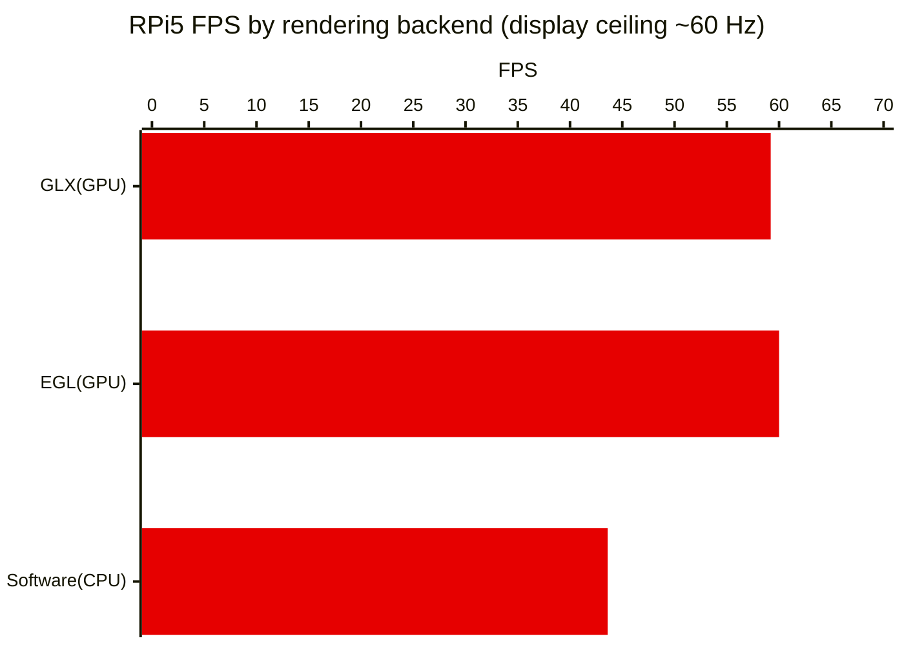
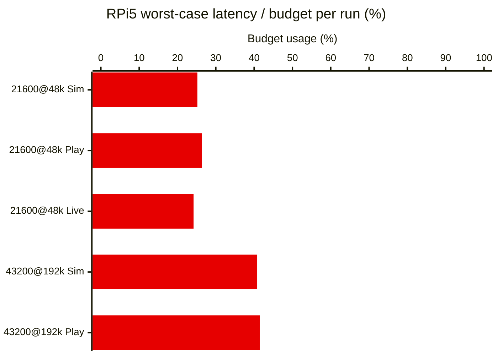
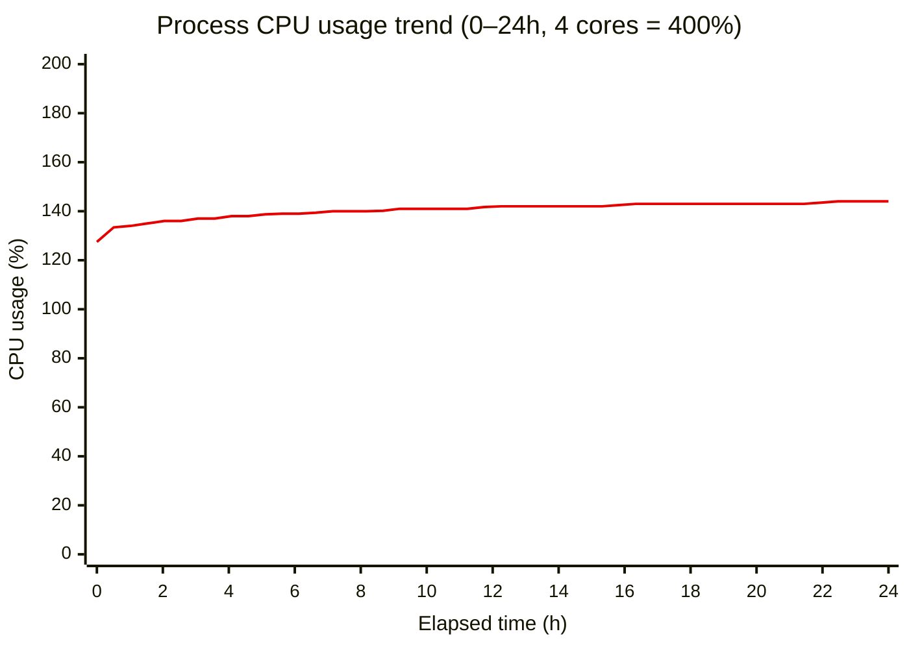
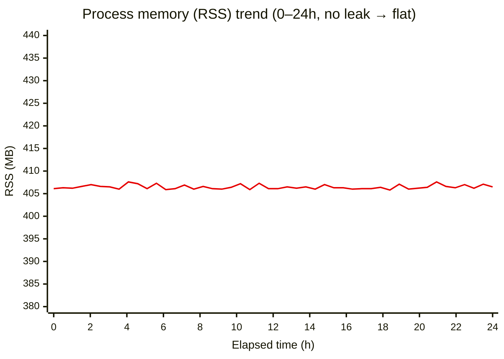

# Planned Experiments

**Contents** — [Risk-to-Experiment Map](#risk-to-experiment-map) · [EXP-01](#exp-01-avalonia-rendering-backend-on-the-rpi5) · [EXP-02](#exp-02-rpi5-real-time-sample-rate-ceiling) · [EXP-03](#exp-03-gui-real-time-rendering-design-patterns) · [EXP-04](#exp-04-on-device-tinyml-inference-feasibility) · [EXP-05](#exp-05-long-run-stability-24h) · [Integrated Schedule](#integrated-schedule) · [Common Approval Criteria](#common-approval-criteria)

## Terminology

The terms used in this document are defined in the consolidated [Glossary](6-Glossary.md).

## Risk-to-Experiment Map

> Priority: **High** / **Mid** (no Low-priority experiments in this milestone).

| Experiment | Risks Addressed | Related QAS | Priority | Core Question |
|---|---|---|---|---|
| [EXP-01](#exp-01-avalonia-rendering-backend-on-the-rpi5) | [R-05](3-Risk-Assessment.md#a-real-time-performance-rpi) | [QAS-2](2-Architectural-Drivers.md#qas-2--performance-latency--from-sound-input-to-screen-display) | **High** | If we choose C#, how do we remove the Avalonia-on-RPi5 rendering risk? |
| [EXP-02](#exp-02-rpi5-real-time-sample-rate-ceiling) | [R-01](3-Risk-Assessment.md#a-real-time-performance-rpi), [R-03](3-Risk-Assessment.md#a-real-time-performance-rpi) | [QAS-2](2-Architectural-Drivers.md#qas-2--performance-latency--from-sound-input-to-screen-display) | **High** | What is the highest sample rate the RPi5 can process in real time? |
| [EXP-03](#exp-03-gui-real-time-rendering-design-patterns) | [R-02](3-Risk-Assessment.md#a-real-time-performance-rpi) | [QAS-2](2-Architectural-Drivers.md#qas-2--performance-latency--from-sound-input-to-screen-display), [QAS-5](2-Architectural-Drivers.md#qas-5--modifiability-extensibility--adding-a-new-measurementfiltergraph) | **High** | Which design patterns should we apply first to improve GUI real-time performance? |
| [EXP-04](#exp-04-on-device-tinyml-inference-feasibility) | [R-17](3-Risk-Assessment.md#f-project--process) | [QAS-2](2-Architectural-Drivers.md#qas-2--performance-latency--from-sound-input-to-screen-display), [QAS-3](2-Architectural-Drivers.md#qas-3) | Mid | Can we add TinyML inference and still hold real-time behavior and trustworthiness? |
| [EXP-05](#exp-05-long-run-stability-24h) | [R-04](3-Risk-Assessment.md#a-real-time-performance-rpi) | [QAS-2](2-Architectural-Drivers.md#qas-2--performance-latency--from-sound-input-to-screen-display) | Mid | Do memory/latency degrade over long runs? |

## EXP-01: Avalonia rendering backend on the RPi5

**Risks:** [R-05](3-Risk-Assessment.md#a-real-time-performance-rpi) · **QAS:** [QAS-2](2-Architectural-Drivers.md#qas-2--performance-latency--from-sound-input-to-screen-display) · **Priority:** High

### Results & Recommendations

**Complete — keep the default (GPU-first).** The reported "~80 ms GPU-acceleration slowdown" did not reproduce in our app (details: [result_renderer.md](../../TestResult/result_renderer.md)).

- **Pi5 measurement**: GLX 59.2 FPS (mean 16.9 ms) · EGL 60.0 FPS (16.7 ms) · Software 43.6 FPS (22.9 ms). Both GPU backends hit the display refresh ceiling (~60 Hz, 16.7 ms vsync), and Software was actually slower.
- **HW acceleration confirmed**: the GL renderer logged as `V3D 7.1.10.2` (the RPi5 GPU) — not an llvmpipe fallback.
- **Recommendation**: keep Avalonia's default (GPU-first, Software fallback); no config change. Software is slower and also brings tearing and CPU contention with the audio thread.
- (Reference) On Windows all three backends hit the ~60 Hz ceiling — no difference.

**FPS by backend (Raspberry Pi 5, higher is better)**

### Objective

When adopting the C# path, use a technical experiment to resolve the risk that — as in numerous Avalonia GitHub issues — a bug makes GPU-accelerated rendering on the RPi5 *slower* than even SW rendering, stuttering the real-time graphs. Core question:

- On the RPi5, is GPU-accelerated rendering (GLX/EGL) actually slower than software rendering? (Community reports: ~80 ms accelerated vs 6–12 ms software — if true, the real-time graphs stutter.)

The answer drives the design decision **"which Avalonia rendering backend to lock for RPi5 deployment."** Impact scope: app startup config and the RPi deployment guide.

**Why this experiment:** multiple community reports flag slow GPU-accelerated rendering on RPi/embedded Linux (Avalonia GitHub `#18807, #18942, #19288, #18127`), but the causes differ across reports (app-side bugs, resolution, driver path) and none measure our workload's conditions. The backend can only be fixed by measuring on the real device.

### Status

Complete — GPU acceleration confirmed faster than Software; keep the default (GPU-first) rendering

### Expected Deliverables

- A reusable benchmark test
- Per-backend (GLX / EGL / Software) frame-time comparison table (FPS, mean, p95, p99)
- Determination of HW acceleration vs software fallback, based on the actually-active renderer
- Rendering-backend recommendation (keep the default, or force Software)

### Resources Needed

- Raspberry Pi 5 (monitor connected, SSH access) — shared team device
- Windows dev PC (cross-build for the RPi)
- Effort: ~1.0 person-day

### Experiment Description

1. **Build the benchmark test** — add a diagnostic measurement mode to the app: lock each rendering backend (GLX/EGL/Software) with no fallback, drive the real graph pipeline under a heavy per-frame redraw load (using a synthetic Sim signal), and collect frame intervals over a fixed window — while recording which GL renderer is actually active to tell HW acceleration from software fallback.
2. **Verify the benchmark on Windows** with a short measurement (end-to-end sanity check).
3. **Deploy to the RPi5 and measure** — run each of the three backends with a warmup followed by ~30 s of measurement.
4. **Compare results → derive the backend recommendation** — record it here and in [Risk Assessment (R-05)](3-Risk-Assessment.md#a-real-time-performance-rpi).

**Completion criteria:** the experiment will be complete once ① all three backends are measured, ② the active-renderer (HW-acceleration) status is confirmed, and ③ a backend recommendation is derived.

### Duration

- D1–D2 (~1 person-day)

### Links & References

- [Rendering-backend A/B measurement results — result_renderer.md](../../TestResult/result_renderer.md)
- Original report: [Avalonia Discussion #18807 — Poor Linux performance when using hardware acceleration](https://github.com/AvaloniaUI/Avalonia/discussions/18807)
- Related case: [Discussion #18942 — RPi high-resolution full-repaint degradation](https://github.com/AvaloniaUI/Avalonia/discussions/18942)
- [Avalonia docs — Running on Raspberry Pi via DRM](https://docs.avaloniaui.net/docs/guides/platforms/rpi/running-on-raspbian-lite-via-drm)

## EXP-02: RPi5 real-time sample-rate ceiling

**Risks:** [R-01](3-Risk-Assessment.md#a-real-time-performance-rpi), [R-03](3-Risk-Assessment.md#a-real-time-performance-rpi) · **QAS:** [QAS-2](2-Architectural-Drivers.md#qas-2--performance-latency--from-sound-input-to-screen-display) · **Priority:** High

### Results & Recommendations

**Both conditions pass.** The two conditions were measured across input modes (details: [result_latency.md](../../TestResult/result_latency.md)).

- **Conditions & matrix**: 21600 BPH @ 48 kHz (166.7 ms), 43200 BPH @ 192 kHz (83.3 ms) × Simulation/Playback/Live = 5 runs per platform (43200 excludes Live — no high-beat movement). Measured on Raspberry Pi 5 (primary) and Windows (reference).
- **Result**: both conditions within budget, drop·miss 0. Even the tightest, 43200@192k, is ~41 % of budget on the Pi (worst 34.6 / 83.3 ms). The 43200 Playback used a verified synthetic WAV (`WatchSynthStream`) since no real recording exists.
- **Recommendation (Go)**: fix the base at **48 kHz** and the top at **192 kHz**. 192k passes with margin, so [R-01](3-Risk-Assessment.md#a-real-time-performance-rpi)'s 192k concern is resolved (no longer a stretch). 96 kHz was not measured but is considered supportable as an in-between value.
- **Limits**: verdict is on the Rate/Scope tab by latency/drop·miss. CPU/RAM, image tabs (Spectrogram/Sound Print), and the 43200 real-acoustic Live path need separate evaluation.

**Worst-case E2E latency as % of beat-period budget (Raspberry Pi 5, lower is better, 100% = budget)**

### Objective

Confirm whether the input → analysis → display pipeline meets real-time requirements in the RPi5 Live environment. Core questions:

- Q1. Which sample rate runs stably without block drop?
- Q2. Does worst-case total end-to-end latency stay within one beat period? (83.3 ms at 43200 BPH · 166.7 ms at 21600 BPH)

### Status

Complete — both conditions measured over 5 runs each (Raspberry Pi 5 and Windows both pass); recommended sample rate fixed (48 kHz base / 192 kHz top)

### Expected Deliverables

- Per-condition / per-input-mode / per-platform latency comparison table (avg/p95/p99/worst)
- Block-drop / missed-beat statistics table
- Input-mode (Sim/Playback/Live) and platform (Pi/Windows) comparison table
- Sample-rate target proposal (Go/No-Go)

### Resources Needed

- 1× Raspberry Pi 5 (primary), Windows dev PC (reference)
- Live input (real movement + USB microphone), Playback WAV (21600 BPH from the Live recording, 43200 BPH synthetic)
- Latency/drop logging code
- Effort: 1.5 person-days

### Experiment Description

1. Measure both conditions (21600@48k, 43200@192k) across Simulation/Playback/Live — 43200 excludes Live, 5 runs per platform, on Raspberry Pi 5 (primary) and Windows (reference).
2. Compare total latency (avg/p95/p99/worst), block drop, and missed beat per condition / input mode / platform. Truncate to the common-minimum frame count across CSVs.
3. Judge worst-case E2E ≤ one beat period and drop=0 / miss=0 on the Raspberry Pi 5 (Windows is reference).

### Duration

- D1–D2: Prepare instrumentation code
- D3: Run measurements
- D4: Analyze results and derive the recommendation

### Links & References

- [QAS-2 latency measurement results — result_latency.md](../../TestResult/result_latency.md)

## EXP-03: GUI real-time rendering design patterns

**Risks:** [R-02](3-Risk-Assessment.md#a-real-time-performance-rpi) · **QAS:** [QAS-2](2-Architectural-Drivers.md#qas-2--performance-latency--from-sound-input-to-screen-display), [QAS-5](2-Architectural-Drivers.md#qas-5--modifiability-extensibility--adding-a-new-measurementfiltergraph) · **Priority:** High

### Results & Recommendations

TO-DO: Record the priority and application scope of the design patterns chosen for GUI performance improvement.

### Objective

Compare the candidate design patterns for the rendering/refresh path and decide which to apply first this milestone, to improve GUI real-time performance. Core questions:

- Q1. For the current GUI bottleneck, which pattern (e.g., Producer-Consumer, Double Buffering, Object Pool) is effective?
- Q2. Once applied, how do the patterns rank in frame stability, latency, and implementation difficulty?
- Q3. Can the team agree on a first-priority pattern set that fits the short schedule?

### Status

Planned

### Expected Deliverables

- GUI-performance pattern comparison table (effect, application difficulty, schedule impact)
- Priority pattern set (1st / 2nd) and the list of target modules
- technical experiment scope and verification checklist for the pattern application

### Resources Needed

- TimeGrapher_v10.4 source code
- Concurrency/rendering pattern references
- Profiling / frame-time measurement tools
- Code-review session participants (2–4 people)
- Effort: 2.0 person-days

### Experiment Description

1. Identify the GUI refresh-path bottleneck and shortlist applicable design-pattern candidates.
2. Compare candidate patterns with technical experiments, measuring latency, frame stability, and implementation difficulty.
3. Per SAP criteria, finalize the first-priority pattern set and decide the milestone application scope.

### Duration

- D1–D2: Bottleneck analysis and candidate-pattern shortlist
- D3–D4: Pattern technical experiment and comparative measurement
- D5: SAP judgment and application-priority finalization

### Links & References

- NA

## EXP-04: On-device TinyML inference feasibility

**Risks:** [R-17](3-Risk-Assessment.md#f-project--process) · **QAS:** [QAS-2](2-Architectural-Drivers.md#qas-2--performance-latency--from-sound-input-to-screen-display), [QAS-3](2-Architectural-Drivers.md#qas-3) · **Priority:** Mid

### Results & Recommendations

TO-DO: Record the TinyML feature decision (Adopt / Conditional / Hold) and the adoption conditions.

### Objective

Verify whether adding TinyML-based classification (e.g., signal-quality, bad-data rejection) on-device on the RPi keeps real-time behavior and measurement trustworthiness. Core questions:

- Q1. After adding TinyML inference, are end-to-end latency and frame-refresh stability still within the allowed range?
- Q2. Does TinyML classification help reduce mis-display in weak-signal / noisy segments?

### Status

In progress

### Expected Deliverables

- Model size / inference time / CPU-usage comparison table
- TinyML on/off performance comparison table (latency, frame time, mis-display rate, confusion matrix)
- Adoption decision memo (Go / Conditional / No-Go)

### Resources Needed

- 1× Raspberry Pi 5 (physical device)
- TinyML inference runtime (TFLite or equivalent)
- Labeled validation dataset (Sim/Playback)
- Performance logging tools (latency, frame time, CPU/RAM)
- Effort: 1.5 person-days

### Experiment Description

1. Run TinyML off/on with the same input and measure the baseline and the change in latency, frame stability, and resource usage.
2. Compare classification accuracy and mis-display rate (weak-signal / noisy segments) together to weigh feature value against performance cost.
3. Per SAP criteria, judge whether real-time behavior is preserved and finalize the Adopt / Conditional / Hold decision and the fallback path.

### Duration

- D7–D8

### Links & References

- NA

## EXP-05: Long-run stability (24h+)

**Risks:** [R-04](3-Risk-Assessment.md#a-real-time-performance-rpi) · **QAS:** [QAS-2](2-Architectural-Drivers.md#qas-2--performance-latency--from-sound-input-to-screen-display) · **Priority:** Mid

### Results & Recommendations

24h+ continuous-run stability is judged **Pass**. On the RPi5 (`cmu.local`), `TimeGrapher.App` (PID 2111) was run continuously for 24 hours while logging the process CPU/memory at a 0.5 s interval, collecting roughly 172,800 samples.

- **Memory (RSS): no leak.** RSS stayed flat at about **406 MB** across the whole run; all 48 thirty-minute segment means were within 405–408 MB (first 405.5 MB → last 403.9 MB, change **-1.6 MB**). A single transient peak of 447 MB occurred and recovered immediately. → **Q1 = not at a leak-suspect level.**
- **CPU: no late-run degradation.** Instantaneous usage held nearly constant at about **144%** (≈1.4 of the RPi5's 4 cores). The rising curve in the graph is an artifact of `ps`'s **cumulative average** converging from its start value (111%) to steady state (~144%), not real degradation. Standard deviation was 6.5%. → **Q2 = no late-run latency/throughput degradation.**

**Recommended policy**

- For the current version, memory operation can **stay as-is (no extra cap/aggregation)** and still meet 24h stability (flat RSS, no leak).
- When new computations, filters, graphs, or AI Features are added, **re-measure** with the same procedure (0.5 s RSS/CPU long-term logging) to check for regression.
- Since CPU stays at ~1.4 cores, manage the remaining core headroom (~2.6 cores) as a budget when introducing additional load.

**Trend over time (0–24h)**

> Data collected during the 24-hour continuous run, shown as 30-minute segment means.

### Objective

Check for memory growth, latency degradation, and crash risk under long continuous runs (24h+). Core questions:

- Q1. Is the RSS growth trend at a leak-suspect level?
- Q2. Does latency/performance degrade in the later part of a long run?

### Status

Done (Pass)

### Expected Deliverables

- 6h/24h resource-usage trend graphs ✓ (trend graphs above)
- Long-run stability report ✓ (flat RSS / no leak, no CPU degradation)
- Buffer-cap / object-lifetime management policy ✓ (keep as-is, re-measure when new load is added)

### Resources Needed

- A Pi (or equivalent) capable of long continuous runs
- Long-term RSS/CPU/latency logging tools
- Effort: 1.0 person-day (setup) + run wait

### Experiment Description

1. After a 6h preliminary check, run 24h continuously and collect memory, latency, and error trends continuously.
2. Compare early vs late performance to check for leak suspicion, throughput drop, and latency degradation.
3. Per SAP criteria, judge stability pass/fail and finalize the buffer/memory operating policy.

### Duration

- D8–D10

### Links & References

- NA

## Integrated Schedule

- Week 1: EXP-01, EXP-02, EXP-03
- Week 2: EXP-04
- Week 3: EXP-05, and re-runs of unresolved items

## Common Approval Criteria

- Pass/fail judgment completed for the High-priority experiments (performance/robustness)
- QAS-2, QAS-3 threshold values finalized
- Adoption/rejection decision rationale recorded together with the experiment logs
