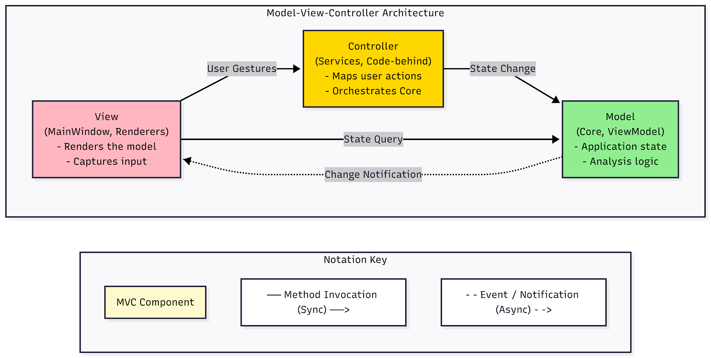
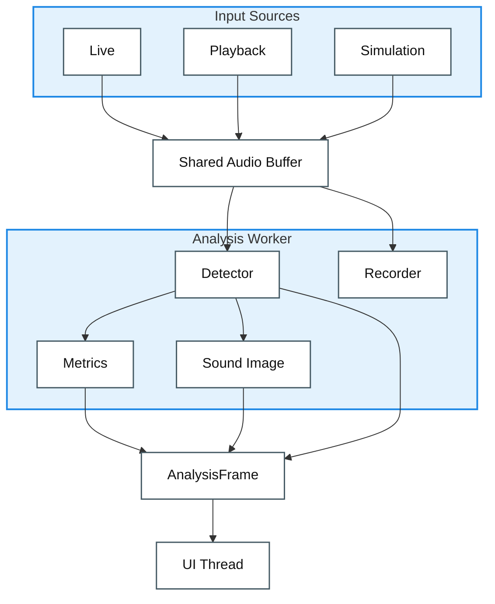

# Architectural Approaches

> Pre-implementation: the structure we plan to build, and why.

## 1. LAYERED VIEW – Permission-Based Architecture

**Purpose:** Shows which layers are permitted to use which lower layers. Defines allowed dependencies, not implementation details.

**Key Concept:**
- **Relaxed Layering**: Upper layers can skip intermediate layers and use any lower layer they need.
- **Upward Dependency Forbidden**: Only downward flow (App → Core; never Core → App).
- **Sidecar Layer**: Common external utilities and frameworks are placed in a sidecar layer accessible by permitted layers.

**Layers:**
1. **Layer 1 – Entry Points & UI**: App (Avalonia UI), Verify (console), Test Suites
2. **Layer 2 – Platform Adapters**: WindowsAudio (NAudio), LinuxAudio (PipeWire/ALSA tools)
3. **Layer 3 – Portable Core**: `TimeGrapher.Core` (analysis, detection, metrics – no external dependencies)
- **Sidecar Layer – External Tech**: Avalonia, ScottPlot, NAudio, xUnit

**Permission Rules:**
```text
App → Platform Adapters
App → Core
Platform Adapters → Core
App & Platform Adapters → External Tech
Core → Nothing (zero dependencies)
```


---
## 2. MODULE USES VIEW – Project Level Actual Dependencies

**Purpose:** Documents real `ProjectReference` and `using` statements at the project level. Shows what code actually couples to what.

**Key Principle:**
- Graph is **code-based**: every arrow represents an existing syntactic reference in .csproj or .cs files.
- Defines the concrete dependency graph; whereas the Layered View defines design permissions.
- Zero dependencies mean no connection lines are drawn.

**Project-Level Uses:**
- `App` → `Core` (required)
- `App` → `WindowsAudio` / `LinuxAudio` (conditional on OS)
- `Verify` → `Core`
- Platform adapters → `Core`
- `App` & Platform adapters → `External Libs`
- `Core` has no dependencies on other projects or external libraries.

*(Note: Internal folder and namespace usage details for Level 2 & 3 are documented in separate sub-module views.)*


## 3. MVC VIEW – Responsibility Separation

**Purpose:** Divides TimeGrapher into Model (data), View (display), and Controller (logic), clarifying who owns what and how they interact to maintain separation of concerns.

**Key Roles:**

| MVC Component | Owns | Example |
|---|---|---|
| **Model** | Application state & domain logic. Responds to state queries and notifies views of changes. | Core analysis engine, MainWindowViewModel, BeatMetricsHistorySnapshot |
| **View** | Renders the model and captures user input. | MainWindow.axaml, renderers, plot controls |
| **Controller** | Defines application behavior. Maps user gestures to model updates. | MainWindow code-behind, RunCommandService, AudioBackend selection |

**Interaction Flow (Control Flow):**
1. **User Gestures:** View captures user input and invokes the Controller.
2. **State Change:** Controller translates actions into method invocations to update the Model's state.
3. **Change Notification:** Model fires an event/notification to the View that its state has changed (typically via Observer pattern).
4. **State Query:** View synchronously queries the Model for the updated data to render the display.

**Key Constraint:**
- **Core is UI-agnostic**: The Model (Core) has zero dependencies on the View or Controller. It communicates outward only via decoupled event notifications $\rightarrow$ highly portable and testable.
- **App is mixed**: Views and Controllers may intertwine with Avalonia framework specifics, but they rely on the agnostic Model.



**Contents** — [The Architecture at a Glance](#the-architecture-at-a-glance) · [Software Architecture Tactics to Apply](#software-architecture-tactics-to-apply) · [Software Design Patterns to Apply](#software-design-patterns-to-apply)

## The Architecture at a Glance

**input → shared buffer → analysis (worker thread) → one result bundle (AnalysisFrame) → screen (UI thread)**

### Runtime Data Flow View

**Elements** are runtime processing elements and data artifacts. **Relations** are one-way data-flow relations from input to screen.



**Legend**

| Symbol | Meaning |
|---|---|
| Box | Runtime element or data artifact |
| Group box | Related runtime elements grouped by purpose |
| Arrow | One-way data flow |

- **A one-way flow** — sound in, numbers out — so a pipeline is the natural shape.
- **Heavy analysis on a worker thread; the UI only draws** → the screen never freezes while measuring. (Performance)
- **Every value computed once, delivered as one bundle** → no display ever disagrees with another. (Consistency)
- **Keep measuring while the signal is good enough; below the threshold, show "signal weak" and handle the input appropriately** → a wrong number never reaches the screen. (Reliability)

> **Why this shape?** The legacy code lumps capture, analysis, and drawing into one piece, which can't respond within one beat period (83.3 ms at 43200 BPH) or absorb new features. So we split it by purpose.

## Software Architecture Tactics to Apply

Each quality goal is linked to tactics from the reference implementation or QAS-specific design choices and their purpose.

| QAS | Quality goal | Tactic | Purpose |
|:---:|--------------|--------|---------|
| [QAS-2](./2-Architectural-Drivers.md#qas-2--performance-latency--from-sound-input-to-screen-display) | Performance | introduce concurrency<br>limit queue/buffer size<br>limit event response | Separate analysis into worker threads, keep buffers finite, and when overloaded, skip stale frames and render only the latest one. |
| [QAS-3](./2-Architectural-Drivers.md#qas-3) | Reliability | signal-quality gating<br>quality-degradation handling<br>fault detection and exception handling | Keep measuring when the signal is good enough despite noise; below the quality threshold, show "signal weak" and handle the input appropriately. |
| [QAS-4](./2-Architectural-Drivers.md#qas-4--consistency--consistent-values-across-displays) | Consistency | single source principle<br>compute once -> immutable frame | Compute all values once and feed every display from one immutable frame so displayed values cannot diverge. |
| [QAS-5](./2-Architectural-Drivers.md#qas-5--modifiability-extensibility--adding-a-new-measurementfiltergraph) | Modifiability | increase cohesion<br>encapsulation<br>restrict dependencies | Fix extension points so new features do not spread changes across existing code. |
| [QAS-6](./2-Architectural-Drivers.md#qas-6--usability--reading-and-operating-on-the-touchscreen) | Usability | at-a-glance layout<br>centralize physical-size rules<br>touch-target sizing | Keep rate, beat error, and amplitude readable without scroll/zoom, and enforce text and touch-target sizes in physical millimeters for the small touchscreen. |

## Software Design Patterns to Apply

| Pattern | Where | Purpose |
|---------|-------|---------|
| Strategy | Input sources · filter stages | Mic/playback/Sim and each filter plug in behind one interface, swappable |
| Adapter | Platform audio | Windows (WASAPI) and RPi (ALSA) unified to one capture interface |
| State | Session control | Idle → Measuring ⇄ Paused transitions as state objects (no scattered flags) |
| Observer | Signals/slots (e.g., Qt) | Producers don't know consumers; displays subscribe to the result frame |
| Facade | Detector | Lets callers drive the multi-stage detection modules through one clean Process() call |
| Producer–Consumer | Input ↔ analysis (shared buffer) | Input writes, analysis reads — decoupled so neither waits on the other's pace |
| Pipe-and-Filter | Whole flow | Input → analysis → rendering wired as one-way stages |
