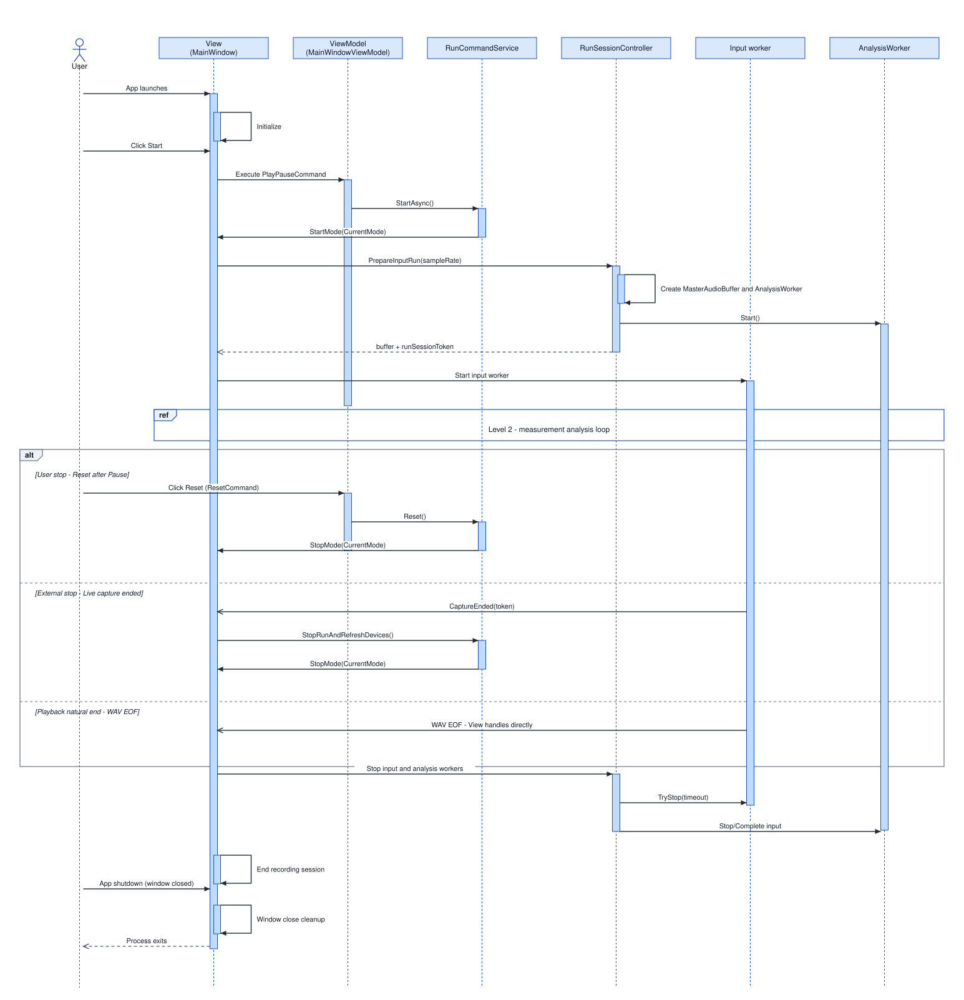
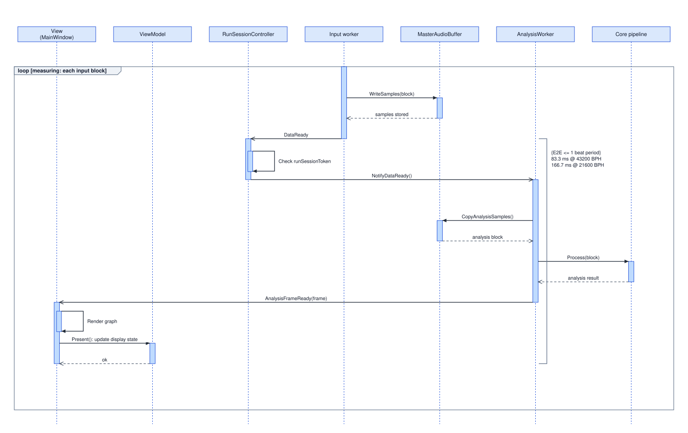
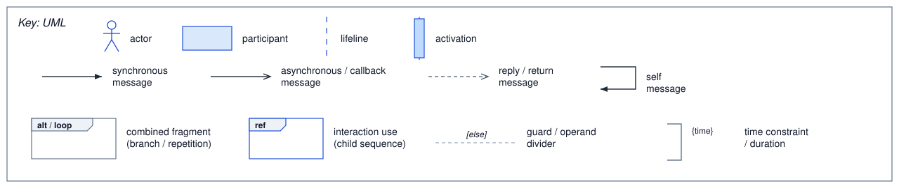

# TIMEGRAPHER UNIFIED ARCHITECTURAL VIEW

> This view summarizes TimeGrapher's static module dependencies, MVVM layer structure, run lifecycle behavior (state transitions and call sequences), and external deployment environment in a single context.

## 1. Primary Presentation

The subsections below present the MVVM structure and Module Uses views individually.

- **1-1. TIMEGRAPHER MVVM VIEW – Responsibility Separation:** Downward one-way dependencies («use») among View Layer, ViewModel Layer, and Model Layer — illustrates responsibility separation across components.
- **1-2. TIMEGRAPHER MODULE USES VIEW – Actual Dependencies & Internal Decomposition:** Syntactic use dependencies among project-level modules (App, Core, platform adapters) and Core-internal submodules.

### 1-1. TIMEGRAPHER MVVM VIEW – Responsibility Separation

**Notation:** Each layer is colored (View Layer / ViewModel Layer / Model Layer); a gray box is a **module** (a group of related classes). Every dependency is a dotted **«use»** arrow drawn from the *using* module to the *used* one.

**Dependency Flow («use» arrows):**
- The three View Layer modules **use** `MainWindowViewModel`.
- `MainWindowViewModel` **uses** the two coordination modules.
- The coordination modules **use** the Core modules; `Core.Analysis · Detection` and `Platform.*` ultimately **use** `Core.Shared`.

**Key Constraint:**
- **One-way dependency:** View Layer → ViewModel Layer → Model Layer. The ViewModel holds no Avalonia/View type (locked by `ViewModelPurityTests`), and the Model (`Core`) has zero dependencies, so it builds and tests without the UI.
- **Binding inverts control, not dependency:** at runtime UI updates flow Model Layer → ViewModel Layer → View Layer through events and binding, but that is *data flow*, not a compile-time dependency — so the «use» graph stays acyclic and downward.


### 1-2. TIMEGRAPHER MODULE USES VIEW – Actual Dependencies & Internal Decomposition

Shows module uses relations among App, Core, platform adapters, and Verify. Here, platform adapters refer to `WindowsAudio` and `LinuxAudio` in the diagram; they isolate OS-specific audio dependencies from `TimeGrapher.Core`.


- `TimeGrapher.App` uses `TimeGrapher.Core`.
- `TimeGrapher.App` conditionally uses `WindowsAudio` or `LinuxAudio`.
- `WindowsAudio` and `LinuxAudio` use `TimeGrapher.Core`.
- `TimeGrapher.Verify` uses `TimeGrapher.Core`.
- `TimeGrapher.Core` does not use App, Verify, or platform adapters.

### Core-Internal Module Uses

Decomposes `TimeGrapher.Core` into its major domain modules and shows which Core-internal modules each one uses.


| Module | Responsibility | Uses |
|---|---|---|
| `Analysis` | coordinates the analysis worker and result-frame creation | `Detection`, `Detection.Scoring`, `Metrics`, `Imaging`, `AudioIo`, `Shared` |
| `Detection` | detects watch-signal events and sync state | `Shared` |
| `Detection.Scoring` | provides candidate-event acceptance criteria | `Detection` |
| `Metrics` | computes rate, amplitude, and beat error | `Shared` |
| `Imaging` | builds sound-image and time-frequency spectrogram data for visualizing watch audio | `Shared` |
| `AudioIo` | provides writer contracts and implementations for saving recordings as WAV files | `Shared` |
| `Sim` | provides a synthetic input source | `Shared` |
| `Shared` | provides common data types and contracts shared by Core-internal modules | none |

---

## 2. Element Catalog

The table below lists every element's layer, module name, and primary responsibility as referenced in the Primary Presentation.

| Layer | Module | What it does |
|---|---|---|
| **View Layer** | Main Window | The main window — overall layout, controls, and window lifecycle. |
| | Graph Tabs Window | Hosts the measurement tabs and routes each analysis frame to the active tab. |
| | Graph Rendering | Draws the graphs and numeric readouts from the frame data. |
| **ViewModel Layer** | MainWindowViewModel | Holds the UI state and binding properties the View binds to, and exposes the commands. |
| | Run · session coordination | Drives start / stop / pause and the analysis-session lifecycle (`RunCommandService`, `RunSessionController`). |
| | Input · display coordination | Enumerates and selects audio input devices and prepares display state (`AudioDeviceController`). |
| **Model Layer** | Core.Analysis · Detection | The analysis engine — detects tick/tock beats and computes BPH and sync. |
| | Core.Metrics · AudioIo · Imaging | Computes rate / amplitude / beat error, reads & writes WAV, and builds sound images. |
| | Core.Shared | Common contracts and data types (frames, buffers) shared by every module. Does not depend on any other module. |
| | Platform.WindowsAudio · LinuxAudio | Captures live audio from the OS (WASAPI on Windows, ALSA / PipeWire on Linux). |

---

## 3. Behavior

This section complements the structural elements defined in section 1 by explaining how they interact at runtime.

### 3-1. TIMEGRAPHER RUN LIFECYCLE C&C VIEW – Measurement Analysis Loop

Covers the object call flow from User → View → ViewModel → RunCommandService → Model (RunSessionController and Workers). The measurement analysis loop is detailed in a Level 2 child view because it contains the recurring cycle that requires the most precision.

| Page | Contents |
| --- | --- |
| Level 1 | Run lifecycle overview |
| Level 2 | Measurement analysis loop, expanded from the Level 1 `ref` |

**Level 1 · Run Lifecycle Overview**

Level 1 keeps the whole lifecycle on one page. The detailed analysis loop is folded behind a `ref` and expanded in Level 2.



**Level 2 · Measurement Analysis Loop**

Level 2 expands the measurement `ref` from Level 1. The loop condition and timing constraint are shown inside the diagram.



**Notation**

The common notation follows the legend below.



Label rule: User-to-system arrows describe user intent or action; object-to-object arrows use operation signatures.

**Lifeline Catalog**

Roles and code references for each lifeline. `MasterAudioBuffer` and `Core pipeline` appear only in Level 2.

| Lifeline | MVVM layer | Responsibility |
| --- | --- | --- |
| User | (actor) | User |
| View (`MainWindow`) | View | Receives UI events, renders, marshals to the UI thread, drives input/analysis worker lifecycle through `RunSessionController`, and implements the service's `IRunCommandOperations` callback port |
| ViewModel (`MainWindowViewModel`) | ViewModel | Exposes `PlayPauseCommand`/`ResetCommand` and observable `RunState`/`StatusText`; does not call the domain directly |
| RunCommandService | App service (State Pattern) | Orchestrates start/pause/stop, updates ViewModel state, and calls the View through `IRunCommandOperations` |
| RunSessionController | Model boundary | Owns run session tokens, input worker attach/stop, and analysis worker lifecycle |
| Input worker | Model | Live=`AudioCaptureWorker`, Playback=`PlaybackWorker`, Simulation=`SimWorker` |
| MasterAudioBuffer | Model | Shared input/analysis audio ring buffer |
| AnalysisWorker | Model | Analysis thread |
| Core pipeline | Model | Detection / Metrics / Projectors |

### 3-2. TIMEGRAPHER RUN LIFECYCLE BEHAVIOR VIEW – Control State Transitions

Defines the transition rules among Stopped, Starting, Running, Paused, Stopping, and StopFailed states.


**Scope**

The base state value for this state machine is `RunUiState`. `RunCommandService` selects the state object matching the current `RunUiState` (`StoppedState`, `RunningState`, and so on), and each state object allows or ignores `StartAsync`, `TogglePause`, `StopRunWithoutReset`, `StopRunAndRefreshDevices`, and `Reset`.

Actual worker creation, worker stop, recording close, and device restoration are delegated to the View implementation through the `IRunCommandOperations` port. This view therefore shows which state the app moves to, while detailed input worker and analysis worker calls remain in the sequence view.

**States**

| State | Code-level meaning |
| --- | --- |
| `Stopped` | Default non-measuring state. Run settings can be changed, and `StartAsync` is allowed. |
| `Starting` | Start is in progress. Duplicate start, stop, and reset commands are ignored. |
| `Running` | Input and analysis workers are active. Pause or stop intent is allowed. |
| `Paused` | Workers remain alive, but input is held by the pause gate. Resume or Reset is allowed. |
| `Stopping` | Stop intent is being processed. If stop is not finished yet, the Stop/Reset retry surface remains available. |
| `StopFailed` | Full stop failed because worker stop timed out or recording close failed. Stop/Reset retry repeats the same pending intent. |

**Notation**

The common state-machine notation follows the legend below.


---

## 4. TIMEGRAPHER SYSTEM DEPLOYMENT VIEW – Hardware & External Signal Path

Shows the external entities and boundaries the system interacts with. The deployment view below covers both the software delivery path and the runtime audio signal path.


**Deploy Targets (Releases):** <https://github.com/lgcmu2026-team5/TimeGrapher-Net/releases>

**Deployment Flow (3 stages):**

1. **Develop & Share** — Multiple developers work on their own PCs in C#/.NET and collect the code on the Git server via `git push`.
2. **Verify & Build** — On each push the Git server runs build/test verification through CI/CD, and on `tag v*` it builds per-target (Windows / Raspberry Pi) deploy Targets.
3. **Deploy & Install** — The built Targets are distributed and installed onto each connected node over the Git server network (LAN).

**External Signal Path:** At runtime, the mechanical watch's acoustic beat signal is captured via microphone/pickup, converted to an electrical signal, and delivered to each node's audio input through USB audio — an input path independent of the software deployment flow above.

---

## 5. Variability Guide

**OS and Deployment Target:** `WindowsAudio` or `LinuxAudio` adapter is used conditionally depending on the OS environment, and deploy targets are built separately for Windows and Raspberry Pi.

**Input Source:** Runtime behavior branches on the `CurrentMode` value: Live (real capture), Playback (file playback), or Simulation (synthetic signal) worker.

---

## 6. Design Rationale

- **Decision**: Split the UI state, commands, and run orchestration that had been mixed into the old MVC-style `MainWindow` into three MVVM roles: View for rendering/platform/session wiring, ViewModel for bindable state and commands, and RunCommandService for the State Pattern-based run state machine.
- **Rationale**: The separation improves modifiability and testability. The ViewModel can be unit-tested without a window because it does not call the domain directly. Service-to-View coupling is inverted through `IRunCommandRunner` for command bodies and `IRunCommandOperations` for service-to-View callbacks.
- **Rejected alternative**: The MVC remnant where the View injected command bodies into the ViewModel through `Func`/`Action` delegates. This was replaced by injecting `IRunCommandRunner`, so command bodies belong to the ViewModel-side command path.
- **Intentional exception**: Playback natural completion and application shutdown are handled directly by the View because they originate from worker completion or window closing callbacks, bypassing `RunCommandService`.

---

## 7. Related Views

The TIMEGRAPHER LAYERED VIEW defines the permission rules that govern all module dependencies shown in the Primary Presentation. It establishes which layers may depend on which, and in which direction — forming the foundational constraint of the entire architecture.

### TIMEGRAPHER LAYERED VIEW – Permission-Based Architecture

**Purpose:** Shows which layers are permitted to use which lower layers. Defines allowed dependencies, not implementation details.

**Key Concept:**
- **Relaxed Layering**: Upper layers can skip intermediate layers and use any lower layer they need.
- **Upward Dependency Forbidden**: Only downward flow (App → Core; never Core → App).
- **Sidecar Layer**: Common external utilities and frameworks are placed in a sidecar layer accessible by permitted layers.

**Layers:**
1. **Layer 1 – Entry Points & UI**: App (Avalonia UI), Verify (console), Test Suites
2. **Layer 2 – Platform Adapters**: WindowsAudio (NAudio), LinuxAudio (PipeWire/ALSA tools)
3. **Layer 3 – Portable Core**: `TimeGrapher.Core` (analysis, detection, metrics – no external dependencies)
- **External dependency – External Tech**: Avalonia, ScottPlot, NAudio, xUnit

**Permission Rules:**
```text
App → Platform Adapters
App → Core
Platform Adapters → Core
App & Platform Adapters → External Tech
Core → Nothing (zero dependencies)
```


