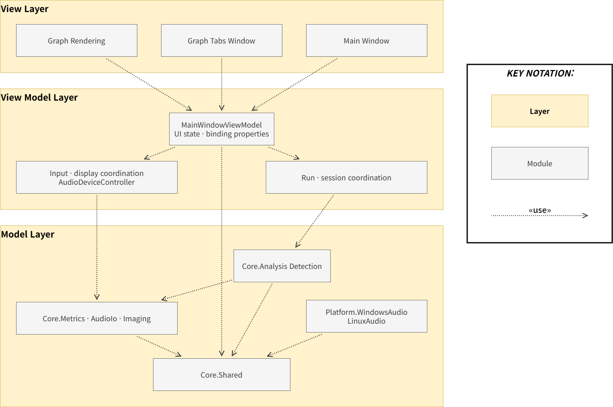

# TIMEGRAPHER MVVM VIEW – Responsibility Separation

This view shows the downward, one-way «use» dependencies among the View Layer, ViewModel Layer, and Model Layer inside the App, illustrating how responsibility is separated across components.

**Notation:** Each layer is colored (View Layer / ViewModel Layer / Model Layer); a gray box is a **module** (a group of related classes). Every dependency is a dotted **«use»** arrow drawn from the *using* module to the *used* one.

**Dependency flow («use» arrows):**

- The three View Layer modules **use** `MainWindowViewModel`.
- `MainWindowViewModel` **uses** the two coordination modules.
- The coordination modules **use** the Core modules; `Core.Analysis · Detection` and `Platform.*` ultimately **use** `Core.Shared`.

**Key constraint:**

- **One-way dependency:** View Layer → ViewModel Layer → Model Layer. The ViewModel holds no Avalonia/View type (locked by `ViewModelPurityTests`), and the Model (`Core`) has zero dependencies, so it builds and tests without the UI.
- **Binding inverts control, not dependency:** at runtime UI updates flow Model Layer → ViewModel Layer → View Layer through events and binding, but that is *data flow*, not a compile-time dependency — so the «use» graph stays acyclic and downward.

## Element Catalog

The table below lists every element's layer, module name, and primary responsibility.

| Layer | Module | What it does |
|---|---|---|
| **View Layer** | Main Window | The main window — overall layout, controls, and window lifecycle. |
| | Graph Tabs Window | Hosts the measurement tabs and routes each analysis frame to the active tab. |
| | Graph Rendering | Draws the graphs and numeric readouts from the frame data. |
| **ViewModel Layer** | MainWindowViewModel | Holds the UI state and binding properties the View binds to, and exposes the commands. |
| | Run · session coordination | Drives start / stop / pause and the analysis-session lifecycle (`RunCommandService`, `RunSessionController`). |
| | Input · display coordination | Enumerates and selects audio input devices and prepares display state (`AudioDeviceController`). |
| **Model Layer** | Core.Analysis · Detection | The analysis engine — detects tick/tock beats and computes BPH and sync. |
| | Core.Metrics · AudioIo · Imaging | Computes rate / amplitude / beat error, reads & writes WAV, and builds sound images. |
| | Core.Shared | Common contracts and data types (frames, buffers) shared by every module. Does not depend on any other module. |
| | Platform.WindowsAudio · LinuxAudio | Captures live audio from the OS (WASAPI on Windows, ALSA / PipeWire on Linux). |

## Behavior

N/A in this view. The runtime interaction of these elements is documented in the [Run Lifecycle Sequence View](5-4-Run-Lifecycle-Sequence-View.md) (call sequences) and the [Run Lifecycle State Machine View](5-5-Run-Lifecycle-State-Machine-View.md) (control states).

## Related ADRs

- [ADR-003 — Adopt the MVVM Pattern for the App's UI](../ADR/ADR-003.md): the decision recorded in this ADR is realized by the structure above.

**Design rationale (summary)**

- **Decision**: Split the UI state, commands, and run orchestration that had been mixed into the old MVC-style `MainWindow` into three MVVM roles — View for rendering/platform/session wiring, ViewModel for bindable state and commands, and `RunCommandService` for the State Pattern-based run state machine.
- **Rationale**: The separation improves modifiability and testability. The ViewModel can be unit-tested without a window because it does not call the domain directly. Service-to-View coupling is inverted through `IRunCommandRunner` for command bodies and `IRunCommandOperations` for service-to-View callbacks.
- **Rejected alternative**: The MVC remnant where the View injected command bodies into the ViewModel through `Func`/`Action` delegates. This was replaced by injecting `IRunCommandRunner`, so command bodies belong to the ViewModel-side command path.
- **Intentional exception**: Playback natural completion and application shutdown are handled directly by the View because they originate from worker completion or window-closing callbacks, bypassing `RunCommandService`.

## Related views

- [Module Uses View](5-2-Module-Uses-View.md) — the project-level modules these App roles belong to.
- [Run Lifecycle Sequence View](5-4-Run-Lifecycle-Sequence-View.md) — the runtime call flow across these layers.
- [Run Lifecycle State Machine View](5-5-Run-Lifecycle-State-Machine-View.md) — the run-control states orchestrated by `RunCommandService`.
