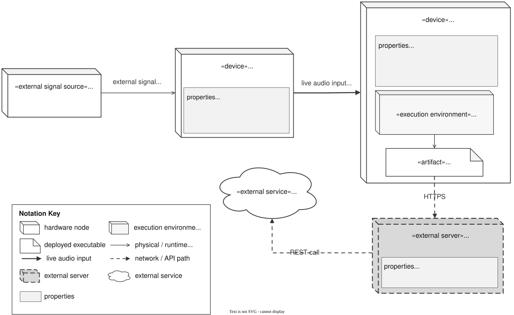

# TimeGrapher Deployment View - Runtime Infrastructure

This view shows the runtime computing infrastructure for TimeGrapher: hardware nodes, deployed runtime elements, the external signal path, and the connection properties used during measurement.

## Primary Presentation

## Element Catalog

**Runtime infrastructure**

1. **Mechanical Watch** produces the acoustic tick/tock signal.
2. **Watch Measurement Microphone** captures the signal and presents it to the Raspberry Pi as live mono PCM audio.
3. **Raspberry Pi 5** hosts Raspberry Pi OS (`arm64`), the bundled .NET 8 / Avalonia / PipeWire / ALSA execution environment, and the deployed `TimeGrapher.App` executable.
4. **Approved AI Backend** is an external reverse proxy reached over HTTPS; it relays measurement logs and keeps the API credential outside the device.
5. **Gemini API** is the external LLM analysis service reached from the approved backend through a REST call. This network path is for explanation only; local measurement and TinyML signal-quality classification do not depend on it.

**Key runtime properties**

- **Raspberry Pi:** Raspberry Pi 5, CPU architecture ARM64, Raspberry Pi OS `arm64`, 16 GB RAM, external microphone input.
- **Microphone connection:** USB audio connection into the Pi; measured configuration is mono PCM at 48 kHz. At 16-bit mono this is about 96 KB/s, well below USB 2.0 bandwidth.
- **Runtime environment:** bundled .NET 8 runtime, Avalonia UI, PipeWire / ALSA tools, `TimeGrapher.App`.
- **Network / API path:** optional HTTPS from `TimeGrapher.App` to the Approved AI Backend, protected with Basic Auth; the backend holds the API credential and relays a REST call to Gemini API.
- **TinyML runtime boundary:** ONNX inference is optional and isolated outside `TimeGrapher.Core`; if model loading fails, the app uses the heuristic signal-quality classifier.

## Behavior

N/A. This is a deployment/infrastructure view; the runtime measurement flow that executes on these nodes is documented in the [Run Lifecycle Sequence View](5-4-Run-Lifecycle-Sequence-View.md).

## Related ADRs

- [ADR-001 — Switch the UI Framework to Avalonia UI + .NET + C#](../ADR/ADR-001.md): rationale for the .NET 8 + Avalonia runtime that targets the Raspberry Pi 5 node.

## Related views

- [Layered View](5-1-Layered-View.md) — the layers whose binaries are deployed to this node.
- [Worker Pipeline View](5-7-Worker-Pipeline-View.md) — the runtime worker path that executes on the Raspberry Pi.
