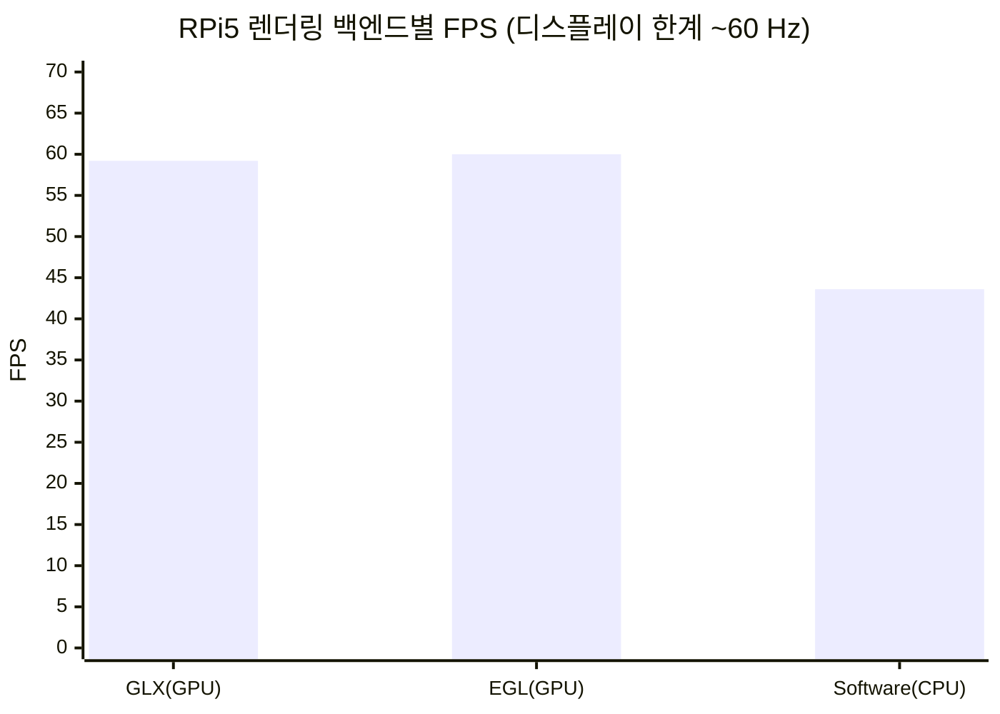
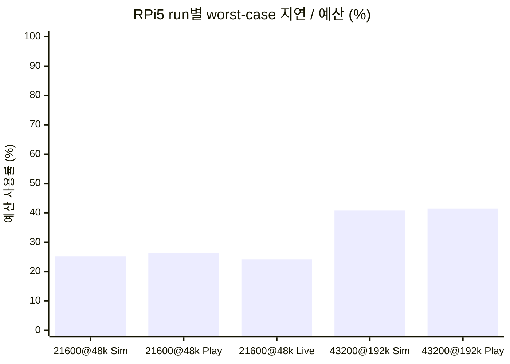
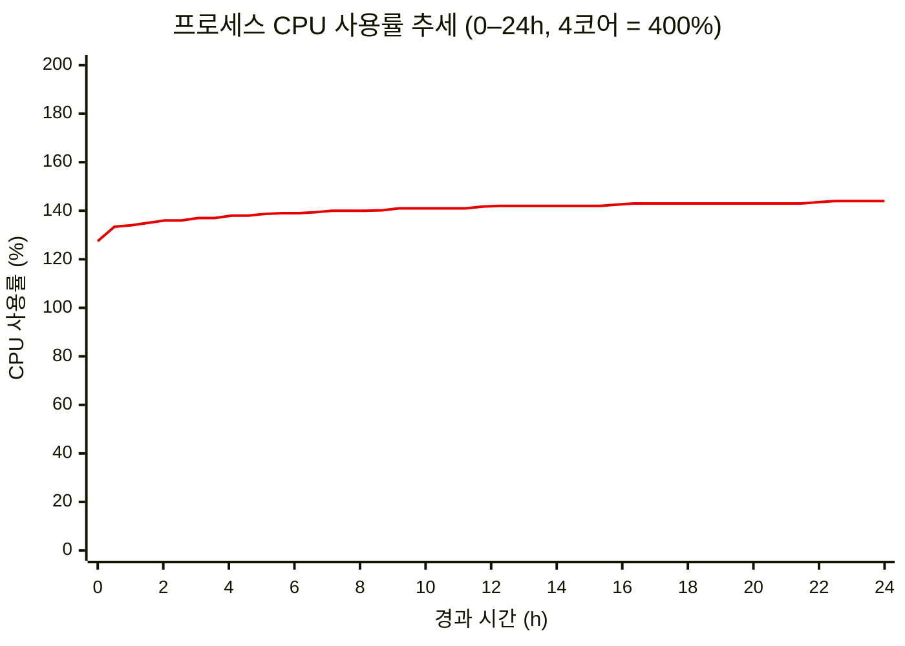
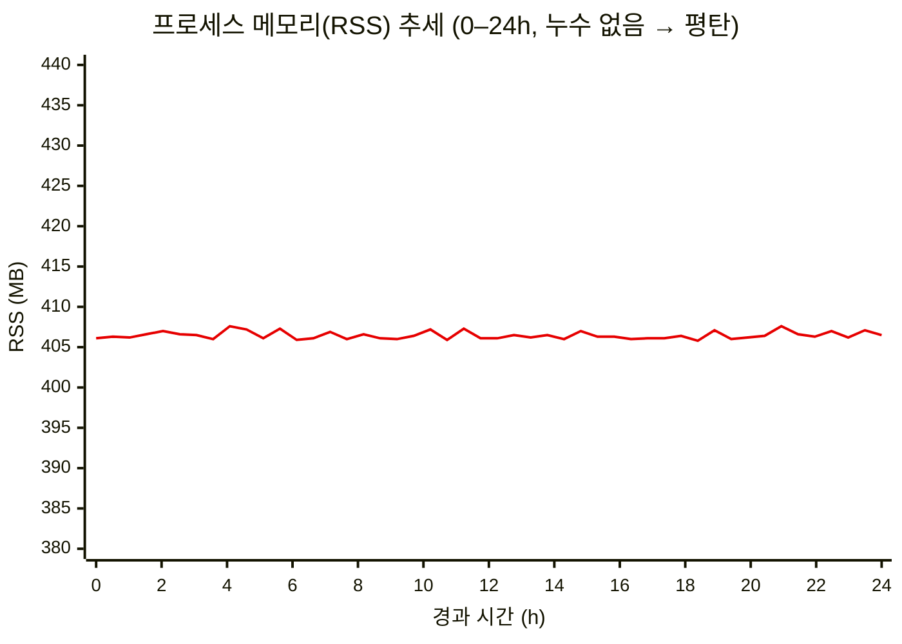

# Planned Experiments

**목차** — [리스크-실험 매핑](#리스크-실험-매핑) · [EXP-01](#exp-01-rpi5-avalonia-렌더링-백엔드) · [EXP-02](#exp-02-rpi5-실시간-샘플레이트-상한) · [EXP-03](#exp-03-gui-실시간-렌더링-디자인-패턴) · [EXP-04](#exp-04-온디바이스-tinyml-추론-타당성) · [EXP-05](#exp-05-장시간-24h-실행-안정성) · [통합 일정](#통합-일정) · [공통 승인 기준](#공통-승인-기준)

## 용어 설명

이 문서에서 사용되는 용어는 통합 [Glossary](6-Glossary.md)에 정의되어 있다.

## 리스크-실험 매핑

> 우선순위: **High** / **Mid** (이번 Milestone에 Low 우선순위 실험은 없음).

| 실험 | 대응 리스크 | 관련 QAS | 우선순위 | 핵심 질문 |
|---|---|---|---|---|
| [EXP-01](#exp-01-rpi5-avalonia-렌더링-백엔드) | [R-05](3-Risk-Assessment.md#a-실시간-성능-rpi) | [QAS-2](2-Architectural-Drivers.md#qas-2--performance-latency--소리-입력에서-화면-표시까지) | **High** | C# 선택 시 Avalonia의 RPi5 렌더링 리스크를 어떻게 해소할 것인가? |
| [EXP-02](#exp-02-rpi5-실시간-샘플레이트-상한) | [R-01](3-Risk-Assessment.md#a-실시간-성능-rpi), [R-03](3-Risk-Assessment.md#a-실시간-성능-rpi) | [QAS-2](2-Architectural-Drivers.md#qas-2--performance-latency--소리-입력에서-화면-표시까지) | **High** | RPi5에서 실시간 처리 가능한 샘플레이트 상한은? |
| [EXP-03](#exp-03-gui-실시간-렌더링-디자인-패턴) | [R-02](3-Risk-Assessment.md#a-실시간-성능-rpi) | [QAS-2](2-Architectural-Drivers.md#qas-2--performance-latency--소리-입력에서-화면-표시까지), [QAS-5](2-Architectural-Drivers.md#qas-5--modifiability-extensibility--새-측정필터그래프-추가) | **High** | GUI 실시간 성능 개선을 위해 어떤 디자인 패턴을 우선 적용할 것인가? |
| [EXP-04](#exp-04-온디바이스-tinyml-추론-타당성) | [R-17](3-Risk-Assessment.md#f-프로젝트--프로세스) | [QAS-2](2-Architectural-Drivers.md#qas-2--performance-latency--소리-입력에서-화면-표시까지), [QAS-3](2-Architectural-Drivers.md#qas-3) | Mid | TinyML 추론을 추가해도 실시간성과 신뢰성을 유지할 수 있는가? |
| [EXP-05](#exp-05-장시간-24h-실행-안정성) | [R-04](3-Risk-Assessment.md#a-실시간-성능-rpi) | [QAS-2](2-Architectural-Drivers.md#qas-2--performance-latency--소리-입력에서-화면-표시까지) | Mid | 장시간 실행에서 메모리/지연 열화가 발생하는가? |

## EXP-01: RPi5 Avalonia 렌더링 백엔드

**리스크:** [R-05](3-Risk-Assessment.md#a-실시간-성능-rpi) · **QAS:** [QAS-2](2-Architectural-Drivers.md#qas-2--performance-latency--소리-입력에서-화면-표시까지) · **우선순위:** High

### 결과 및 권장 사항

**완료 — 기본값(GPU 우선) 유지 권장.** 보고된 "GPU 가속 ~80 ms 저하"는 우리 앱에서 재현되지 않았다(상세: [result_renderer.md](../../TestResult/result_renderer.md)).

- **Pi5 측정**: GLX 59.2 FPS(평균 16.9 ms) · EGL 60.0 FPS(16.7 ms) · Software 43.6 FPS(22.9 ms). GPU 두 백엔드는 화면 주사율(~60 Hz, vsync 16.7 ms) 한계까지 도달했고 SW가 오히려 더 느렸다.
- **하드웨어 가속 확인**: GL 렌더러가 `V3D 7.1.10.2`(RPi5 GPU)로 기록 — llvmpipe 폴백 아님.
- **권장**: Avalonia 기본값(GPU 우선, Software 폴백) 유지, 설정 변경 없음. SW는 더 느린 데다 tearing·CPU 경쟁(오디오 스레드)까지 있어 불리.
- (참고) Windows는 세 백엔드 모두 ~60 Hz 한계로 차이 없음.

**백엔드별 FPS (Raspberry Pi 5, 높을수록 좋음)**

### 목적

C# 경로 채택 시 Avalonia Github의 다수 이슈처럼 RPi5에서 GPU 가속 렌더링의 버그로 SW 방식보다도 *느려* 실시간 그래프가 끊길 수 있는 리스크를 technical experiment로 해소한다. 핵심 질문:

- RPi5에서 GPU 가속 렌더링(GLX/EGL)이 소프트웨어 렌더링보다 느린가? (커뮤니티 보고: 가속 약 80 ms vs 소프트웨어 6–12 ms — 사실이면 실시간 그래프가 끊긴다.)

이 답으로 **"RPi5 배포 시 Avalonia 렌더링 백엔드를 무엇으로 고정할 것인가"** 라는 설계 결정이 내려진다. 영향 범위: 앱 시작 설정, RPi 배포 가이드.

**실험 배경:** RPi/임베디드 Linux에서 GPU 가속 렌더링 성능 저하 보고가 여러 건 있으나(Avalonia GitHub `#18807, #18942, #19288, #18127`) 원인이 제각각(앱 측 버그, 해상도, 드라이버 경로)이고 우리 워크로드와 같은 조건의 측정은 없다. 따라서 실기기에서 직접 측정해야 백엔드를 확정할 수 있다.

### 상태

완료 — GPU 가속이 SW보다 빠름을 확인, 렌더링 기본값(GPU 우선) 유지 권장

### 예상 산출물

- 재사용 가능한 벤치마크 테스트
- 백엔드별(GLX / EGL / Software) 프레임타임 비교표(FPS, 평균, p95, p99)
- 실제 활성 렌더러 기준 HW 가속 여부(가속 vs SW 폴백) 판별 결과
- 렌더링 백엔드 선택 권장안(기본값 유지 또는 Software 강제)

### 필요한 자원

- Raspberry Pi 5(모니터 연결, SSH 접근) — 팀 공용 장비
- Windows 개발 PC(RPi용 크로스 빌드)
- 작업 공수: 약 1 person-day

### 실험 설명

1. **벤치마크 테스트 구현** — 앱에 진단용 측정 모드를 추가한다. 렌더링 백엔드(GLX/EGL/Software)를 각각 폴백 없이 고정하고, 합성 신호(Sim) 부하로 실제 그래프 파이프라인을 매 프레임 강제 갱신하며 프레임 간격을 일정 시간 수집한다. 동시에 실제 활성화된 GL 렌더러 정보를 기록해 HW 가속 여부를 판별한다.
2. **Windows에서 벤치마크 동작 검증** — 짧은 측정으로 종단 확인.
3. **RPi5 배포 및 측정** — 실기기에 배포해 3개 백엔드를 각각 워밍업 후 약 30초 측정한다.
4. **결과 비교 → 백엔드 권장안 도출** — 본 문서와 [Risk Assessment(R-05)](3-Risk-Assessment.md#a-실시간-성능-rpi)에 기록한다.

**완료 기준:** ① 3개 백엔드 모두 측정, ② GL 렌더러 정보로 HW 가속 여부 확인, ③ 백엔드 선택 권장안 도출 — 세 조건이 모두 충족되면 실험을 완료한다.

### 기간

- D1–D2 (약 1 person-day)

### 링크 및 참고 자료

- [렌더링 백엔드 A/B 측정 결과 — result_renderer.md](../../TestResult/result_renderer.md)
- 원 보고: [Avalonia Discussion #18807 — Poor Linux performance when using hardware acceleration](https://github.com/AvaloniaUI/Avalonia/discussions/18807)
- 관련 사례: [Discussion #18942 — RPi 고해상도 전체 리페인트 저하](https://github.com/AvaloniaUI/Avalonia/discussions/18942)
- [Avalonia 공식 — Raspberry Pi에서 DRM으로 실행](https://docs.avaloniaui.net/docs/guides/platforms/rpi/running-on-raspbian-lite-via-drm)

## EXP-02: RPi5 실시간 샘플레이트 상한

**리스크:** [R-01](3-Risk-Assessment.md#a-실시간-성능-rpi), [R-03](3-Risk-Assessment.md#a-실시간-성능-rpi) · **QAS:** [QAS-2](2-Architectural-Drivers.md#qas-2--performance-latency--소리-입력에서-화면-표시까지) · **우선순위:** High

### 결과 및 권장 사항

**두 조건 모두 Pass.** 두 조건을 입력 모드별로 측정했다(상세: [result_latency.md](../../TestResult/result_latency.md)).

- **조건·매트릭스**: 21600 BPH @ 48 kHz(166.7 ms), 43200 BPH @ 192 kHz(83.3 ms) × Simulation/Playback/Live = 플랫폼당 5 run(43200은 하이비트 무브먼트가 없어 Live 제외). Raspberry Pi 5(주)·Windows(참고)에서 각각 측정.
- **결과**: 두 조건 모두 예산 안 Pass, drop·miss 0. 가장 빡빡한 43200@192k도 Pi worst-case가 예산의 약 41%(34.6 / 83.3 ms). 43200 Playback은 실녹음이 없어 검증된 합성 WAV(`WatchSynthStream`)을 썼다.
- **권장(Go)**: 기본 **48 kHz**, 최고 지원 **192 kHz** 확정. 192k가 여유 있게 통과해 [R-01](3-Risk-Assessment.md#a-실시간-성능-rpi)의 192k 우려는 해소(격하 불필요). 96 kHz는 미측정이나 48k·192k 사이라 지원 가능으로 본다.
- **한계**: Rate/Scope 탭·latency/drop·miss 기준 판정. CPU/RAM, 이미지 탭(Spectrogram/Sound Print), 43200 실음향 Live는 별도 평가 필요.

**worst-case E2E 지연의 비트 주기 예산 사용률 (Raspberry Pi 5, 낮을수록 여유, 100% = 예산)**

### 목적

RPi5 Live 환경에서 입력 → 분석 → 표시 파이프라인이 실시간 요구를 만족하는지 확인한다. 핵심 질문은 다음과 같다.

- Q1. 어떤 샘플레이트가 block drop 없이 안정적으로 동작하는가?
- Q2. total end-to-end latency의 worst-case가 한 비트 주기 안에 들어오는가? (43200 BPH: 83.3 ms · 21600 BPH: 166.7 ms)

### 상태

완료 — 두 조건 5 run 측정(Raspberry Pi 5·Windows 모두 Pass), 권장 샘플레이트 확정(48 kHz 기본 / 192 kHz 최고 지원)

### 예상 산출물

- 조건·입력 모드·플랫폼별 latency 비교표(avg/p95/p99/worst)
- block drop / missed beat 통계표
- 입력 모드(Sim/Playback/Live)·플랫폼(Pi/Windows) 비교 결과표
- 샘플레이트 목표안(Go/No-Go)

### 필요한 자원

- Raspberry Pi 5 실장비 1대(주 대상), Windows 개발 PC(참고)
- Live 입력(실제 무브먼트 + USB 마이크), Playback WAV(21600 BPH는 Live 녹음 WAV, 43200 BPH는 합성 WAV)
- 지연/드롭 로깅 코드
- 작업 공수: 1.5 person-days

### 실험 설명

1. 두 조건(21600@48k·43200@192k)을 Simulation/Playback/Live로 측정한다 — 43200은 Live 제외, 플랫폼당 5 run, Raspberry Pi 5(주)·Windows(참고).
2. 조건·입력 모드·플랫폼별 total latency(avg/p95/p99/worst)·block drop·missed beat를 비교한다. 길이는 CSV 공통 최소 프레임 수로 맞춘다.
3. worst-case E2E ≤ 비트 주기, drop=0·miss=0 충족 여부를 Raspberry Pi 5 기준으로 판정한다(Windows 참고).

### 기간

- D1–D2: 계측 코드 준비
- D3: 측정 실행
- D4: 결과 분석 및 권고안 도출

### 링크 및 참고 자료

- [QAS-2 latency 측정 결과 — result_latency.md](../../TestResult/result_latency.md)

## EXP-03: GUI 실시간 렌더링 디자인 패턴

**리스크:** [R-02](3-Risk-Assessment.md#a-실시간-성능-rpi) · **QAS:** [QAS-2](2-Architectural-Drivers.md#qas-2--performance-latency--소리-입력에서-화면-표시까지), [QAS-5](2-Architectural-Drivers.md#qas-5--modifiability-extensibility--새-측정필터그래프-추가) · **우선순위:** High

### 결과 및 권장 사항

TO-DO: GUI 성능 개선용 디자인 패턴 우선순위와 적용 범위를 기록한다.

### 목적

GUI 실시간 성능 개선을 위해 렌더링/갱신 경로에 적용할 디자인 패턴을 비교하고, 이번 Milestone에 우선 적용할 패턴을 확정한다. 핵심 질문은 다음과 같다.

- Q1. 현재 GUI 병목에 대해 어떤 패턴(예: Producer-Consumer, Double Buffering, Object Pool)이 효과적인가?
- Q2. 패턴 적용 시 프레임 안정성, 지연, 구현 난이도 관점에서 우선순위는 어떻게 되는가?
- Q3. 팀이 단기 일정 내 적용 가능한 1순위 패턴 조합으로 합의할 수 있는가?

### 상태

계획됨

### 예상 산출물

- GUI 성능 개선 패턴 비교표(효과, 적용 난이도, 일정 영향)
- 우선 적용 패턴 세트(1순위/2순위)와 적용 대상 모듈 목록
- 패턴 적용 technical experiment 범위 및 검증 체크리스트

### 필요한 자원

- TimeGrapher_v10.4 소스코드
- 동시성/렌더링 패턴 레퍼런스
- 프로파일링/프레임타임 측정 도구
- 코드 리뷰 세션 참여 인원(2–4명)
- 작업 공수: 2.0 person-days

### 실험 설명

1. GUI 갱신 경로 병목을 식별하고 적용 가능한 디자인 패턴 후보를 추린다.
2. 후보 패턴을 technical experiments로 비교해 지연, 프레임 안정성, 구현 난이도를 측정한다.
3. SAP 기준으로 1순위 패턴 조합을 확정하고 Milestone 적용 범위를 결정한다.

### 기간

- D1–D2: 병목 분석 및 패턴 후보 도출
- D3–D4: 패턴 technical experiment 및 비교 측정
- D5: SAP 판정 및 적용 우선순위 확정

### 링크 및 참고 자료

- NA

## EXP-04: 온디바이스 TinyML 추론 타당성

**리스크:** [R-17](3-Risk-Assessment.md#f-프로젝트--프로세스) · **QAS:** [QAS-2](2-Architectural-Drivers.md#qas-2--performance-latency--소리-입력에서-화면-표시까지), [QAS-3](2-Architectural-Drivers.md#qas-3) · **우선순위:** Mid

### 결과 및 권장 사항

TO-DO: TinyML 기능 채택 여부(채택/조건부 채택/보류)와 채택 조건을 기록한다.

### 목적

TinyML 기반 분류(예: signal-quality, bad-data-rejection)를 RPi 온디바이스로 추가했을 때 실시간성과 측정 신뢰성을 유지할 수 있는지 검증한다. 핵심 질문은 다음과 같다.

- Q1. TinyML 추론 추가 후에도 end-to-end 지연과 프레임 갱신 안정성이 허용 범위에 있는가?
- Q2. TinyML 분류가 약신호/잡음 구간의 오표시를 줄이는 데 기여하는가?

### 상태

진행 중

### 예상 산출물

- 모델 크기/추론시간/CPU 점유율 비교표
- TinyML on/off 성능 비교표(지연, 프레임타임, 오표시율, confusion matrix)
- 채택 여부 결정 메모(Go/Conditional/No-Go)

### 필요한 자원

- Raspberry Pi 5 실장비 1대
- TinyML 추론 런타임(TFLite 또는 동등 도구)
- 검증용 라벨 데이터셋(Sim/Playback)
- 성능 로깅 도구(지연, 프레임타임, CPU/RAM)
- 작업 공수: 1.5 person-days

### 실험 설명

1. TinyML off/on 상태를 동일 입력으로 실행해 지연, 프레임 안정성, 자원 사용량의 기준선과 변화를 측정한다.
2. 분류 정확도와 오표시율(약신호/잡음 구간)을 함께 비교해 기능 가치와 성능 비용을 동시에 평가한다.
3. SAP 기준으로 실시간성 유지 여부를 판정해 채택/조건부 채택/보류와 폴백 경로를 확정한다.

### 기간

- D7–D8

### 링크 및 참고 자료

- NA

## EXP-05: 장시간 24h+ 실행 안정성

**리스크:** [R-04](3-Risk-Assessment.md#a-실시간-성능-rpi) · **QAS:** [QAS-2](2-Architectural-Drivers.md#qas-2--performance-latency--소리-입력에서-화면-표시까지) · **우선순위:** Mid

### 결과 및 권장 사항

24h+ 연속 실행 안정성을 **Pass**로 판정한다. RPi5(`cmu.local`)에서 `TimeGrapher.App`(PID 2111)을 24시간 연속 가동하며 프로세스 CPU/메모리를 0.5초 간격으로 장기 로깅했고, 약 172,800개 샘플을 수집했다.

- **메모리(RSS): 누수 징후 없음.** RSS는 전 구간 약 **406 MB**로 평탄했고, 30분 단위 48개 구간 평균이 모두 405~408 MB 범위였다(처음 405.5 MB → 마지막 403.9 MB, 변화 **-1.6 MB**). 일시 최대 447 MB 스파이크가 1회 있었으나 즉시 회복됐다. → **Q1 = 누수 의심 수준 아님.**
- **CPU: 후반부 열화 없음.** 순간 점유율은 거의 일정하게 약 **144%**(RPi5 4코어 중 약 1.4코어)에 머물렀다. 그래프의 상승 곡선은 `ps`의 **누적 평균**이 시작값(111%)에서 정상상태(~144%)로 수렴하는 특성이며 실제 성능 저하가 아니다. 표준편차 6.5%로 변동이 작다. → **Q2 = 후반부 지연/처리량 열화 없음.**

**권고 정책**

- 현 버전 기준 메모리 운영은 **추가 상한/집계 없이 현행 유지**해도 24h 안정성 충족(RSS 평탄, 누수 없음).
- 신규 연산·필터·그래프·AI Feature 추가 시 동일 절차(0.5초 RSS/CPU 장기 로깅)로 **재측정**하여 회귀 여부를 확인한다.
- CPU가 ~1.4코어로 지속 점유되므로, 추가 부하 도입 시 코어 헤드룸(잔여 ~2.6코어)을 예산 기준으로 관리한다.

**시간대별 추세(0–24h)**

> 24시간 연속 실행 동안 수집한 데이터를 30분 단위 구간 평균으로 표시.

### 목적

장시간 실행(24h+)에서 메모리 증가, 지연 악화, 크래시 위험을 확인한다. 핵심 질문은 다음과 같다.

- Q1. RSS 증가 추세가 누수 의심 수준인가?
- Q2. 장시간 후반부에서 지연/성능 열화가 발생하는가?

### 상태

완료 (Pass)

### 예상 산출물

- 6h/24h 자원 사용 추세 그래프 ✓ (위 시간대별 추세 그래프)
- 장시간 안정성 리포트 ✓ (RSS 평탄·누수 없음, CPU 열화 없음)
- 버퍼 상한/객체 수명 관리 정책 ✓ (현행 유지, 신규 부하 추가 시 재측정)

### 필요한 자원

- 장시간 실행 가능한 Pi 또는 동등 환경
- RSS/CPU/지연 장기 로깅 도구
- 작업 공수: 1.0 person-day(셋업) + 실행 대기

### 실험 설명

1. 6h 예비 검증 후 24h 장시간 실행으로 메모리, 지연, 오류 추세를 연속 수집한다.
2. 전반부/후반부 성능을 비교해 누수 의심, 처리량 저하, 지연 악화 여부를 확인한다.
3. SAP 기준으로 안정성 합격 여부를 판정하고 버퍼/메모리 운영 정책을 확정한다.

### 기간

- D8–D10

### 링크 및 참고 자료

- NA

## 통합 일정

- Week 1: EXP-01, EXP-02, EXP-03
- Week 2: EXP-04
- Week 3: EXP-05, 미해결 항목 재실험

## 공통 승인 기준

- High 우선순위 실험(성능/강건성) pass/fail 판정 완료
- QAS-2, QAS-3 임계값 수치 확정
- 채택/기각 의사결정 근거가 실험 로그와 함께 기록됨
