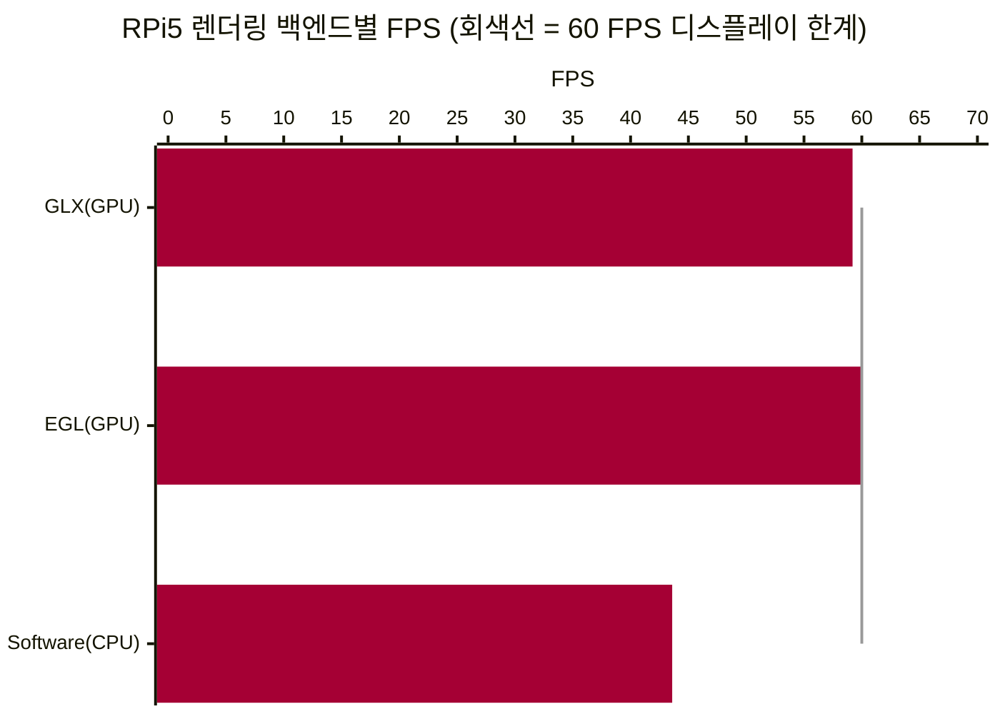
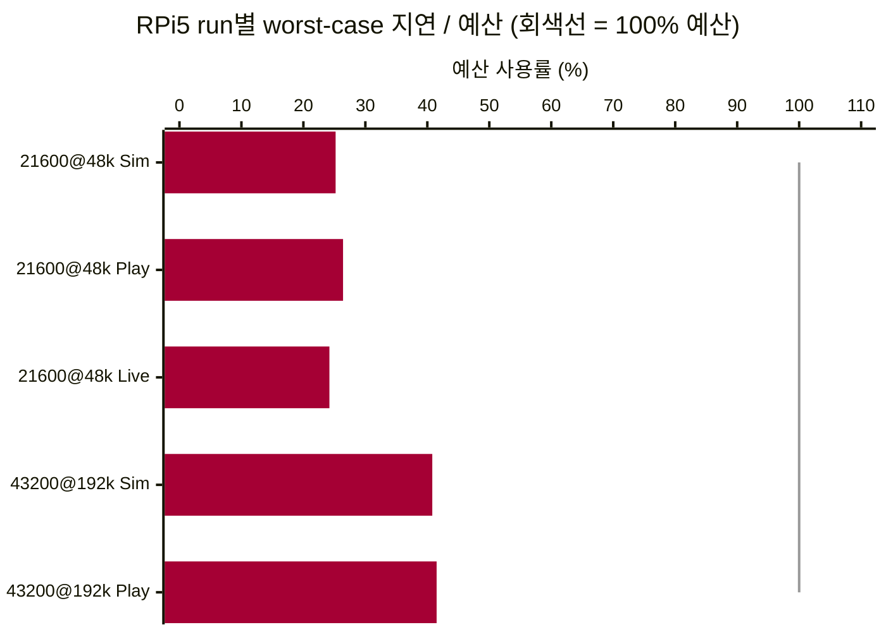
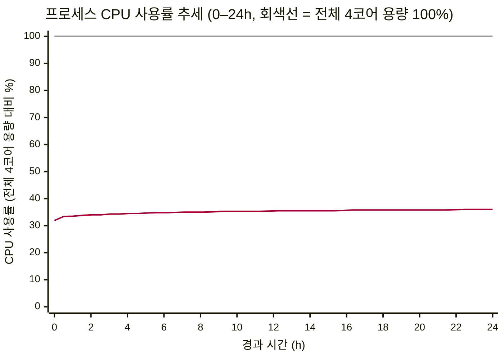
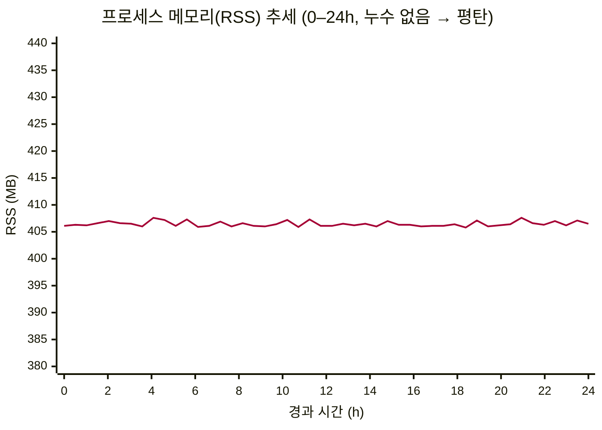

# Planned Experiments

**목차** — [리스크-실험 매핑](#리스크-실험-매핑) · [EXP-01](#exp-01-rpi5-avalonia-렌더링-백엔드) · [EXP-02](#exp-02-rpi5-실시간-샘플레이트-상한) · [EXP-03](#exp-03-gui-실시간-렌더링-디자인-패턴) · [EXP-04](#exp-04-온디바이스-tinyml-추론-타당성) · [EXP-05](#exp-05-장시간-24h-실행-안정성) · [EXP-06](#exp-06-측정-정확도) · [통합 일정](#통합-일정) · [공통 승인 기준](#공통-승인-기준)

## 용어 설명

이 문서에서 사용되는 용어는 통합 [Glossary](7-Glossary.md)에 정의되어 있다.

## 리스크-실험 매핑

> 우선순위: **High** / **Mid** (이번 Milestone에 Low 우선순위 실험은 없음).

| 실험 | 대응 리스크 | 관련 QAS | 우선순위 | 핵심 질문 |
|---|---|---|---|---|
| [EXP-01](#exp-01-rpi5-avalonia-렌더링-백엔드) | [R-05](3-Risk-Assessment.md#a-실시간-성능-rpi) | [QAS-2](2-Architectural-Drivers.md#qas-2--performance-latency--소리-입력에서-화면-표시까지) | **High** | C# 선택 시 Avalonia의 RPi5 렌더링 리스크를 어떻게 해소할 것인가? |
| [EXP-02](#exp-02-rpi5-실시간-샘플레이트-상한) | [R-01](3-Risk-Assessment.md#a-실시간-성능-rpi), [R-03](3-Risk-Assessment.md#a-실시간-성능-rpi) | [QAS-2](2-Architectural-Drivers.md#qas-2--performance-latency--소리-입력에서-화면-표시까지) | **High** | RPi5에서 실시간 처리 가능한 샘플레이트 상한은? |
| [EXP-03](#exp-03-gui-실시간-렌더링-디자인-패턴) | [R-02](3-Risk-Assessment.md#a-실시간-성능-rpi) | [QAS-2](2-Architectural-Drivers.md#qas-2--performance-latency--소리-입력에서-화면-표시까지), [QAS-5](2-Architectural-Drivers.md#qas-5--modifiability-extensibility--새-측정필터그래프-추가) | **High** | GUI 실시간 성능 개선을 위해 어떤 디자인 패턴을 우선 적용할 것인가? |
| [EXP-04](#exp-04-온디바이스-tinyml-추론-타당성) | [R-17](3-Risk-Assessment.md#f-프로젝트--프로세스) | [QAS-2](2-Architectural-Drivers.md#qas-2--performance-latency--소리-입력에서-화면-표시까지), [QAS-3](2-Architectural-Drivers.md#qas-3) | Mid | TinyML 추론을 추가해도 실시간성과 신뢰성을 유지할 수 있는가? |
| [EXP-05](#exp-05-장시간-24h-실행-안정성) | [R-04](3-Risk-Assessment.md#a-실시간-성능-rpi) | [QAS-2](2-Architectural-Drivers.md#qas-2--performance-latency--소리-입력에서-화면-표시까지) | Mid | 장시간 실행에서 메모리/지연 열화가 발생하는가? |
| [EXP-06](#exp-06-측정-정확도) | [R-06](3-Risk-Assessment.md#b-신호처리--측정-신뢰성) | [QAS-1](2-Architectural-Drivers.md#qas-1--accuracy--음향-이벤트-검출에서-시계-지표-계산까지의-정확도) | **High** | Realistic Off 시뮬레이션으로 1차 확인한 측정 정확도가 상용 Weishi Timegrapher 비교에서도 허용오차 이내로 일치하는가? |

## EXP-01: RPi5 Avalonia 렌더링 백엔드

**리스크:** [R-05](3-Risk-Assessment.md#a-실시간-성능-rpi) · **QAS:** [QAS-2](2-Architectural-Drivers.md#qas-2--performance-latency--소리-입력에서-화면-표시까지) · **우선순위:** High

### 결과 및 결정 사항

- **결정 사항**: GPU 가속이 SW보다 빠름을 확인함, Avalonia 기본값(GPU 우선, Software 폴백)을 유지 한다
- **Pi5 측정 결과**: GLX 59.2 FPS(평균 16.9 ms) · EGL 60.0 FPS(16.7 ms) · Software 43.6 FPS(22.9 ms). GPU 두 백엔드는 화면 주사율(~60 Hz, vsync 16.7 ms) 한계까지 도달했고 SW가 오히려 더 느려짐.
- **하드웨어 가속 확인 결과**: GL 렌더러가 `V3D 7.1.10.2`(RPi5 GPU)로 기록 — llvmpipe 폴백 아님.

- **실험 결과 Data**
 -> 백엔드별 FPS (Raspberry Pi 5, 높을수록 좋음)

- (참고) Windows는 세 백엔드 모두 ~60 Hz 한계로 차이 없음.

### 목적

C# 경로 채택 시 Avalonia Github의 다수 이슈처럼 RPi5에서 GPU 가속 렌더링의 버그로 SW 방식보다도 *느려* 실시간 그래프가 끊길 수 있는 리스크를 technical experiment로 해소한다. 

**핵심 질문**:

- RPi5에서 GPU 가속 렌더링(GLX/EGL)이 소프트웨어 렌더링보다 느린가? (커뮤니티 보고: 가속 약 80 ms vs 소프트웨어 6–12 ms — 사실이면 실시간 그래프가 끊긴다.)

**영향 범위**: 앱 시작 설정, RPi 배포 가이드.

**실험 배경:** RPi/임베디드 Linux에서 GPU 가속 렌더링 성능 저하 보고가 여러 건 있으나(Avalonia GitHub `#18807, #18942, #19288, #18127`) 원인이 제각각(앱 측 버그, 해상도, 드라이버 경로)이고 우리 워크로드와 같은 조건의 측정은 없다. 따라서 실제 기기에서 직접 측정해야 백엔드를 확정할 수 있다.

### 상태

완료

### 산출물

- 백엔드별(GLX / EGL / Software) 프레임타임 비교표(FPS, 평균, p95, p99)
- 실제 활성 렌더러 기준 HW 가속 여부(가속 vs SW 폴백) 판별 결과
- 렌더링 백엔드 선택 결(기본값 유지 또는 Software 강제)

### 필요한 자원

- Raspberry Pi 5(모니터 연결, SSH 접근) — 팀 공용 장비
- Windows 개발 PC(RPi용 크로스 빌드)
- 작업 공수: 약 1 person-day

### 실험 설명

1. **벤치마크 테스트 구현** — 앱에 진단용 측정 모드를 추가한다. 렌더링 백엔드(GLX/EGL/Software)를 각각 폴백 없이 고정하고, 합성 신호(Sim) 부하로 실제 그래프 파이프라인을 매 프레임 강제 갱신하며 프레임 간격을 일정 시간 수집한다. 동시에 실제 활성화된 GL 렌더러 정보를 기록해 HW 가속 여부를 판별한다.
2. **Windows에서 벤치마크 동작 검증** — 짧은 측정으로 종단 확인.
3. **RPi5 배포 및 측정** — 실기기에 배포해 3개 백엔드를 각각 워밍업 후 약 30초 측정한다.
4. **결과 비교 → 백엔드 권장안 도출** — 본 문서와 [Risk Assessment(R-05)](3-Risk-Assessment.md#a-실시간-성능-rpi)에 기록한다.

### 기간
- 6/9 - 6-10 수행

### 링크 및 참고 자료

- [렌더링 백엔드 A/B 측정 결과 — result_renderer.md](../../TestResult/result_renderer.md)
- 원 보고: [Avalonia Discussion #18807 — Poor Linux performance when using hardware acceleration](https://github.com/AvaloniaUI/Avalonia/discussions/18807)
- 관련 사례: [Discussion #18942 — RPi 고해상도 전체 리페인트 저하](https://github.com/AvaloniaUI/Avalonia/discussions/18942)
- [Avalonia 공식 — Raspberry Pi에서 DRM으로 실행](https://docs.avaloniaui.net/docs/guides/platforms/rpi/running-on-raspbian-lite-via-drm)

## EXP-02: RPi5 실시간 샘플레이트 상한

**리스크:** [R-01](3-Risk-Assessment.md#a-실시간-성능-rpi), [R-03](3-Risk-Assessment.md#a-실시간-성능-rpi) · **QAS:** [QAS-2](2-Architectural-Drivers.md#qas-2--performance-latency--소리-입력에서-화면-표시까지) · **우선순위:** High

### 결과 및 결정 사항

- **결정 사항** : 샘플레이트의 경우 기본 48 kHz, 최고 지원 192kHz으로  확정한다
- **측정 결과** : Worst-case E2E 지연의 비트 주기 예산 사용률이 약 41%(34.6 / 83.3 ms)이므로 요구사항 구현(192khz 샘플레이트 지원)에 문제 없음을 확인함
  -> 43200@192k Pi . 43200 Playback은 실녹음이 없어 검증된 합성 WAV(`WatchSynthStream`)을 사용함

- **실험 결과 Data**
 : 비트 주기 예산 사용률 (Raspberry Pi 5, 낮을수록 여유, 100% = 예산)

- 한계 : Rate/Scope 탭·latency/drop·miss 기준 판정. CPU/RAM, 이미지 탭(Spectrogram/Sound Print), 43200 실음향 Live는 별도 평가 필요하나, 추가 시험은 진행하지 않음

### 목적

RPi5 Live 환경에서 입력 → 분석 → 표시 파이프라인이 실시간 요구를 만족하는지 확인한다.

- Q1. 어떤 샘플레이트가 block drop 없이 안정적으로 동작하는가?
- Q2. total end-to-end latency의 worst-case가 한 비트 주기 안에 들어오는가? (43200 BPH: 83.3 ms · 21600 BPH: 166.7 ms)

### 상태

완료

### 산출물

- 조건·입력 모드·플랫폼별 latency 비교표(avg/p95/p99/worst)
- 입력 모드(Sim/Playback/Live)·플랫폼(Pi/Windows) 비교 결과표
- 샘플레이트 목표 설정

### 필요한 자원

- Raspberry Pi 5 실장비 1대(주 대상), Windows 개발 PC(참고)
- Live 입력(실제 무브먼트 + USB 마이크), Playback WAV(21600 BPH는 Live 녹음 WAV, 43200 BPH는 합성 WAV)
- 지연/드롭 로깅 코드
- 작업 공수: 1.5 person-days

### 실험 설명

1. 두 조건(21600@48k·43200@192k)을 Simulation/Playback/Live로 측정한다 — 43200은 Live 제외, 플랫폼당 5 run, Raspberry Pi 5(주)·Windows(참고).
2. 조건·입력 모드·플랫폼별 total latency(avg/p95/p99/worst)·block drop·missed beat를 비교한다. 길이는 CSV 공통 최소 프레임 수로 맞춘다.
3. worst-case E2E ≤ 비트 주기, drop=0·miss=0 충족 여부를 Raspberry Pi 5 기준으로 판정한다(Windows 참고).

### 기간

- 6/9–6/10: 계측 코드 준비
- 6/11: 측정 실행
- 6/12-6/13: 결과 분석 및 권고안 도출

### 링크 및 참고 자료

- [QAS-2 latency 측정 결과 — result_latency.md](../../TestResult/result_latency.md)

## EXP-03: GUI 실시간 렌더링 디자인 패턴

**리스크:** [R-02](3-Risk-Assessment.md#a-실시간-성능-rpi) · **QAS:** [QAS-2](2-Architectural-Drivers.md#qas-2--performance-latency--소리-입력에서-화면-표시까지), [QAS-5](2-Architectural-Drivers.md#qas-5--modifiability-extensibility--새-측정필터그래프-추가) · **우선순위:** High

### 결과 및 결정 사항

단일 스레드 동기 구조의 UI 병목을 제거했다.

- **결정 사항** : Pipe-and-Filter 흐름 + 동시성 택틱(Producer–Consumer · Observer · Latest-Wins · 고정 버퍼 풀) 채택한다.
- **분석**: 입력 → 분석 → 표시를 `Pipe-and-Filter` 단방향 흐름으로 정형화하고, `AnalysisWorker`를 전용 스레드(`ThreadPriority.Highest`)로 격리해 UI는 렌더링만 전단 하도록 한.
- **실험 결과**: QAS-2의 최고 목표 조건(**43200 BPH @ 192 kHz, 비트 주기 83.3 ms**) 대비, 실측 부하 조건인 **28800 BPH(비트당 125 ms)** 에서 UI 차단 없이 캡처 → 분석 → 프레임 라우팅 연쇄가 마감 시간 내에 안정 수렴확인함. end-to-end 비트 예산(QAS-2)과 별개로 활성 탭 UI 렌더 스로틀 예산(**33 ms / 100 ms**) 내에서 렌더링 블로킹 타임 통제됨.
- **조치 사항** : 실시간성이 중요한 렌더링 경로·데이터 수집 코어는 검증된 격리 구조(워커 스레드 분리 + 유한 버퍼 + Latest-Wins)를 유지하고, 파이프라인 확장 시 필터 단위 분할 규칙을 준수한다.

> 각 패턴·택틱의 이점과 트레이드오프 상세는 아래 [실험 결과 및 분석](#실험-결과-및-분석) 참조.

### 목적

 기존 단일 스레드 동기 호출 구조로 인해 데이터 처리 부하가 UI 주 스레드로 전이되어 화면이 얼어붙던 성능 병목을 해결하고자 한다. Bass·Clements·Kazman의 *Software Architecture in Practice (SAP)* 이론을 기반으로, 이식성(Portability)과 변경용이성(Modifiability)을 해치지 않으면서 실시간성을 확보하는 패턴·택틱 조합을 검증한다. 

- Q1. 28800 BPH(비트당 125 ms) 부하에서 UI 스레드를 차단하지 않는 동시성·데이터 복사 구조는 무엇인가?
- Q2. 대용량 스냅샷(사운드프린트 ~2.67 MB, 스펙트로그램 ~1.92 MB) churn으로 인한 LOH 오염·GC 스파이크를 원천 차단할 수 있는가?
- Q3. UI 렌더 주기 분리와 신규 탭/그래프 확장성(변경용이성)을 동시에 만족하는 구조는 무엇인가?

### 상태

완료

### 산출물

- Pipe-and-Filter 데이터 흐름 중심의 오디오 분석-시각화 파이프라인 아키텍처 정의
- 동시성 격리용 렌더링 스케줄러(Latest-Wins) 및 데이터 복사 버퍼링(고정 버퍼 풀) 구조 설계안
- 장기 가동 메모리/집계 바운딩 구조(`DecimatingSeries`) 정의
- 패턴·택틱 도입에 따른 아키텍처 트레이드오프 분석 결과

### 필요한 자원

- **하드웨어**: Raspberry Pi 5 (CanaKit 16GB RAM), Windows 11 빌드 PC
- **대상 소스**: `AnalysisFrameRouter.cs`, `SoundPrintFrameProjector.cs`, `AnalysisWorker.cs`, `DecimatingSeries.cs` 코어 모듈
- **계측 툴**: 내장 Stopwatch 연계 실시간 레이턴시 추적 시스템 (`--analysis-log`)
- **작업 공수**: 2.0 person-days

### 실험 설명

본 technical experiment에서는 GUI 실시간 렌더링 속도 개선을 위해 적용한 아키텍처 패턴·택틱의 유효성을 다음 세 항목으로 검증한다.

1. **Pipe-and-Filter 데이터 흐름 검증** — 시계 소리 신호는 `입력(Capture) → 검출(Detection) → 측정(Measurement) → 화면 표시(Visualization)` 순서의 스트리밍 흐름을 가진다. 오디오 캡처 버퍼가 각 분석 단계를 거쳐 최종 시각화 아티팩트(`SoundPrint`, `Spectrogram`)로 전달되는 파이프라인을 빌드하고 단계의 독립적 교체 가능성을 테스트한다. 
2. **동시성 격리 택틱 검증** — `AnalysisWorker`를 `ThreadPriority.Highest` 전용 스레드로 격리하고 UI 스레드는 렌더링만 전담하도록 분리한다. 입력↔분석은 공유 버퍼 기반 **Producer–Consumer**로, 결과 프레임은 소비자(탭)들이 구독하는 **Observer**(`AnalysisFrameRouter`의 `ObserveFrame`/`RenderFrame` 팬아웃)로 전달한다. 스레드 간 간섭 방지를 위해 **고정 버퍼 풀(PublishBufferCount = 3) 로테이션**과 주사율 초과 프레임을 폐기하는 **Latest-Wins 스케줄러**(`AnalysisFrameRenderScheduler`)를 결합 적용한다. 28800 BPH(125 ms) 부하에서 분석 워커의 마감 시간이 UI 지연에 종속되지 않고 격리되는지 계측한다.
3. **DecimatingSeries 데이터 바운딩 검증** — 실행 시간에 비례해 그래프 점 개수가 누적되는 문제를 막기 위해, 고정 용량 한계 도달 시 인접 포인트 쌍을 병합해 해상도를 반감하되 버킷의 min/max를 보존하는 집계 구조의 정상 동작을 분석한다.

### 실험 결과 및 분석

본 실험은 SAP 이론에 근거해 채택한 패턴·택틱이 어떤 품질 속성을 어떻게 얻는지, 그리고 그 대가로 무엇을 감수하는지를 이점·트레이드오프 관점에서 분석한다.

#### 1. Pipe-and-Filter 데이터 흐름 — 이점과 트레이드오프

- **이점**
  - **변경용이성·확장성 극대화 (QAS-5)**: 각 처리 단계가 표준 인터페이스(`IAnalysisFrameConsumer` 등) 기반의 독립 단계로 캡슐화되어, UI 탭 구조나 신규 분석 필터(예: 신규 측정 그래프)를 추가할 때 기존 코드를 수정하지 않고 주입할 수 있다.
  - **재사용성·이식성 향상**: 비즈니스 로직과 GUI 프레임워크(Avalonia) 간 의존성이 분리되어, 백엔드 분석 파이프라인 코드를 재사용하거나 다른 OS 환경으로 포팅하기 용이하다.
- **트레이드오프**
  - **데이터 복사 오버헤드**: 단계와 단계 사이를 통과할 때마다 대용량 신호 스냅샷(사운드프린트 ~2.67 MB, 스펙트로그램 ~1.92 MB)이 전달되어 복사 비용이 증가한다.
  - **완화 전략**: 정상 상태(Normal execution)에서 매번 힙을 할당하는 대신 고정 크기 버퍼 블록을 재사용해, GC 스파이크와 LOH(Large Object Heap) 오염을 원천 차단했다(Zero Churn).

#### 2. 동시성 격리 택틱 — 이점과 트레이드오프

- **이점**
  - **UI 차단 근본 해결 (QAS-2)**: 무거운 그래픽 연산이나 프레임 렌더링이 수행되어도 코어 분석 스레드의 주기를 침범하지 않는 비동기 장벽이 형성된다.
  - **Latest-Wins를 통한 성능 방어**: UI 주사율이 밀려도 단일 슬롯에 보관된 이전 프레임을 최신 프레임으로 합류·폐기하므로, 백로그 누적에 따른 연쇄 지연이 발생하지 않는다.
- **트레이드오프**
  - **프레임 유실·최신성 편향**: UI 렌더 주기에 맞춰 중간 프레임을 폐기하고 최신 데이터만 표시하므로, 순간적으로 중간 프레임이 유실되는 현상이 발생한다.
  - **완화 전략 및 타당성**: 실시간 모니터링 시스템 특성상 과거 프레임을 지연 표시하는 것보다 '현재 상태의 최신성'을 밀림 없이 표현하는 것이 핵심 품질 속성(성능·사용성)에 부합하므로, 본 유실은 아키텍처적으로 용인 가능한 트레이드오프다. 단, 장기 메트릭 히스토리는 Latest-Wins 합류에도 손실 없이 집계되도록 `DecimatingSeries` 구조를 별도 결합해 보완했다.

### 기간

- 6/8–6/9: 병목 분석 및 패턴 후보 도출
- 6/10–6/13: 패턴 technical experiment 및 비교 측정
- 6/15: SAP 판정 및 적용 우선순위 확정

### 링크 및 참고 자료
- NA

## EXP-04: 온디바이스 TinyML 추론 타당성

**리스크:** [R-17](3-Risk-Assessment.md#f-프로젝트--프로세스) · **QAS:** [QAS-2](2-Architectural-Drivers.md#qas-2--performance-latency--소리-입력에서-화면-표시까지), [QAS-3](2-Architectural-Drivers.md#qas-3) · **우선순위:** Mid

### 결과 및 결정 사항

TO-DO: TinyML 기능 채택 여부(채택/조건부 채택/보류)와 채택 조건을 기록한다.

### 목적

TinyML 기반 분류(예: signal-quality, bad-data-rejection)를 RPi 온디바이스로 추가했을 때 실시간성과 측정 신뢰성을 유지할 수 있는지 검증한다.

- Q1. TinyML 추론 추가 후에도 end-to-end 지연과 프레임 갱신 안정성이 허용 범위에 있는가?
- Q2. TinyML 분류가 약신호/잡음 구간의 오표시를 줄이는 데 기여하는가?

### 상태

진행 중

### 산출물

- 모델 크기/추론시간/CPU 점유율 비교표
- TinyML on/off 성능 비교표(지연, 프레임타임, 오표시율, confusion matrix)
- 채택 여부 결정 메모(Go/Conditional/No-Go)

### 필요한 자원

- Raspberry Pi 5 실장비 1대
- TinyML 추론 런타임(TFLite 또는 동등 도구)
- 검증용 라벨 데이터셋(Sim/Playback)
- 성능 로깅 도구(지연, 프레임타임, CPU/RAM)
- 작업 공수: 1.5 person-days

### 실험 설명

1. TinyML off/on 상태를 동일 입력으로 실행해 지연, 프레임 안정성, 자원 사용량의 기준선과 변화를 측정한다.
2. 분류 정확도와 오표시율(약신호/잡음 구간)을 함께 비교해 기능 가치와 성능 비용을 동시에 평가한다.
3. SAP 기준으로 실시간성 유지 여부를 판정해 채택/조건부 채택/보류와 폴백 경로를 확정한다.

### 기간

- D7–D8

### 링크 및 참고 자료

- NA

## EXP-05: 장시간 24h+ 실행 안정성

**리스크:** [R-04](3-Risk-Assessment.md#a-실시간-성능-rpi) · **QAS:** [QAS-2](2-Architectural-Drivers.md#qas-2--performance-latency--소리-입력에서-화면-표시까지) · **우선순위:** Mid

### 결과 및 결정 사항

24h+ 연속 실행 안정성을 **Pass**로 판정한다. RPi5(`cmu.local`)에서 `TimeGrapher.App`(PID 2111)을 24시간 연속 가동하며 프로세스 CPU/메모리를 0.5초 간격으로 장기 로깅했고, 약 172,800개 샘플을 수집했다.

- **메모리(RSS): 누수 징후 없음.** RSS는 전 구간 약 **406 MB**로 평탄했고, 30분 단위 48개 구간 평균이 모두 405~408 MB 범위였다(처음 405.5 MB → 마지막 403.9 MB, 변화 **-1.6 MB**). 일시적으로 447 MB까지 오른 값이 1회 있었으나 즉시 회복됐다. → **Q1 = 누수 의심 수준 아님.**
- **CPU: 후반부 열화 없음.** 전체 4코어 용량을 100%로 정규화한 순간 점유율은 거의 일정하게 약 **36%**(RPi5 4코어 중 약 1.4코어)에 머물렀다. 그래프의 상승 곡선은 `ps`의 **누적 평균**이 시작값(27.8%)에서 정상상태(~36%)로 수렴하는 특성이며 실제 성능 저하가 아니다. 표준편차 1.6%p로 변동이 작다. → **Q2 = 후반부 지연/처리량 열화 없음.**

**권고 정책**

- 현 버전 기준 메모리 운영은 **추가 상한/집계 없이 현행 유지**해도 24h 안정성 충족(RSS 평탄, 누수 없음).
- 신규 연산·필터·그래프·AI Feature 추가 시 동일 절차(0.5초 RSS/CPU 장기 로깅)로 **재측정**하여 회귀 여부를 확인한다.
- CPU가 전체 4코어 용량의 ~36%(~1.4코어)를 지속 점유하므로, 추가 부하 도입 시 헤드룸(잔여 ~64%, 약 2.6코어)을 예산 기준으로 관리한다.

**시간대별 추세(0–24h)**

> 24시간 연속 실행 동안 수집한 데이터를 30분 단위 구간 평균으로 표시.

### 목적

장시간 실행(24h+)에서 메모리 증가, 지연 악화, 크래시 위험을 확인한다. 핵심 질문은 다음과 같다.

- Q1. RSS 증가 추세가 누수 의심 수준인가?
- Q2. 장시간 후반부에서 지연/성능 열화가 발생하는가?

### 상태

완료 (Pass)

### 산출물

- 6h/24h 자원 사용 추세 그래프 ✓ (위 시간대별 추세 그래프)
- 장시간 안정성 리포트 ✓ (RSS 평탄·누수 없음, CPU 열화 없음)
- 버퍼 상한/객체 수명 관리 정책 ✓ (현행 유지, 신규 부하 추가 시 재측정)

### 필요한 자원

- 장시간 실행 가능한 Pi 또는 동등 환경
- RSS/CPU/지연 장기 로깅 도구
- 작업 공수: 1.0 person-day(셋업) + 실행 대기

### 실험 설명

1. 6h 예비 검증 후 24h 장시간 실행으로 메모리, 지연, 오류 추세를 연속 수집한다.
2. 전반부/후반부 성능을 비교해 누수 의심, 처리량 저하, 지연 악화 여부를 확인한다.
3. SAP 기준으로 안정성 합격 여부를 판정하고 버퍼/메모리 운영 정책을 확정한다.

### 기간

- D8–D10

### 링크 및 참고 자료

- NA

## EXP-06: 측정 정확도

**리스크:** [R-06](3-Risk-Assessment.md#b-신호처리--측정-신뢰성) · **QAS:** [QAS-1](2-Architectural-Drivers.md#qas-1--accuracy--음향-이벤트-검출에서-시계-지표-계산까지의-정확도) · **우선순위:** High

### 결과 및 결정 사항

1차로 **Realistic Off** 시뮬레이션(깨끗한 신호)에서 일오차·진폭·비트 에러가 정상 측정됨을 확인했다. 추후 상용 제품 **Weishi Timegrapher**와의 비교 테스트로 측정값을 검증할 예정이다.

### 목적

기준값을 아는 신호로 검출·계산 정확도를 검증해 [R-06](3-Risk-Assessment.md#b-신호처리--측정-신뢰성)(A·C 이벤트를 0.1 ms 정밀도로 못 찾으면 모든 지표가 오염됨)을 확인한다. **Realistic을 끄면** 합성 신호에 잡음·변동이 없어, 생성기에 설정한 일오차·진폭·비트 에러가 곧 기준값이 된다. Pass/Fail은 상용 Weishi Timegrapher의 오차범위를 기준으로 한다 — **일오차 ±1 s/d · 진폭 ±1° · 비트 에러 ±0.1 ms** (세 기준 모두 Weishi 스펙에서 가져왔으며, 일오차 ±1 s/d는 [QAS-1](2-Architectural-Drivers.md#qas-1--accuracy--음향-이벤트-검출에서-시계-지표-계산까지의-정확도) 목표와도 부합).

- Q1. (1차) Realistic Off 시뮬레이션에서 일오차·진폭·비트 에러가 위 허용오차 이내인가?
- Q2. (후속) 동일 시계를 상용 Weishi Timegrapher와 비교했을 때 같은 허용오차 이내로 일치하는가?

### 상태

진행 중 — 1차(Realistic Off 시뮬레이션) 확인 완료, 상용 비교 테스트 예정

### 산출물

- 지표별(일오차·진폭·비트 에러) 기준값 대비 오차표 + Pass/Fail
- (후속) Weishi Timegrapher 비교 결과표

### 필요한 자원

- Raspberry Pi 5(주), Windows PC(참고)
- Sim 생성기(Realistic Off), 측정 기준값
- 상용 비교용 Weishi Timegrapher + 동일 시계
- 오차 로깅 코드
- 작업 공수: 약 1.5 person-days

### 실험 설명

기준값을 아는 시뮬레이션으로 1차 확인한 뒤 상용 제품과 비교한다. Pass/Fail은 두 단계 모두 동일 허용오차(일오차 ±1 s/d·진폭 ±1°·비트 에러 ±0.1 ms)로 판정한다.

1. **Realistic Off 시뮬레이션 (1차):** 깨끗한 합성 신호로 1,000비트 이상 측정해 일오차·진폭·비트 에러가 각각 허용오차 이내인지 Pass/Fail을 판정한다.
2. **상용 비교 (후속):** 동일 시계를 Weishi Timegrapher와 본 시스템으로 측정해, 같은 허용오차 기준으로 두 측정값의 일치 여부를 판정한다.

각 단계를 Raspberry Pi 5에서 판정하고(Windows 참고) 결과를 [R-06](3-Risk-Assessment.md#b-신호처리--측정-신뢰성)에 기록한다.

### 기간

- D1–D2: 1차(Realistic Off 시뮬레이션) / 후속: 상용 비교 테스트

### 링크 및 참고 자료

- NA

## 통합 일정

- Week 1: EXP-01, EXP-02, EXP-03, EXP-06
- Week 2: EXP-04
- Week 3: EXP-05, 미해결 항목 재실험

## 공통 승인 기준

- High 우선순위 실험(성능/강건성) pass/fail 판정 완료
- QAS-2, QAS-3 임계값 수치 확정
- 채택/기각 의사결정 근거가 실험 로그와 함께 기록됨
