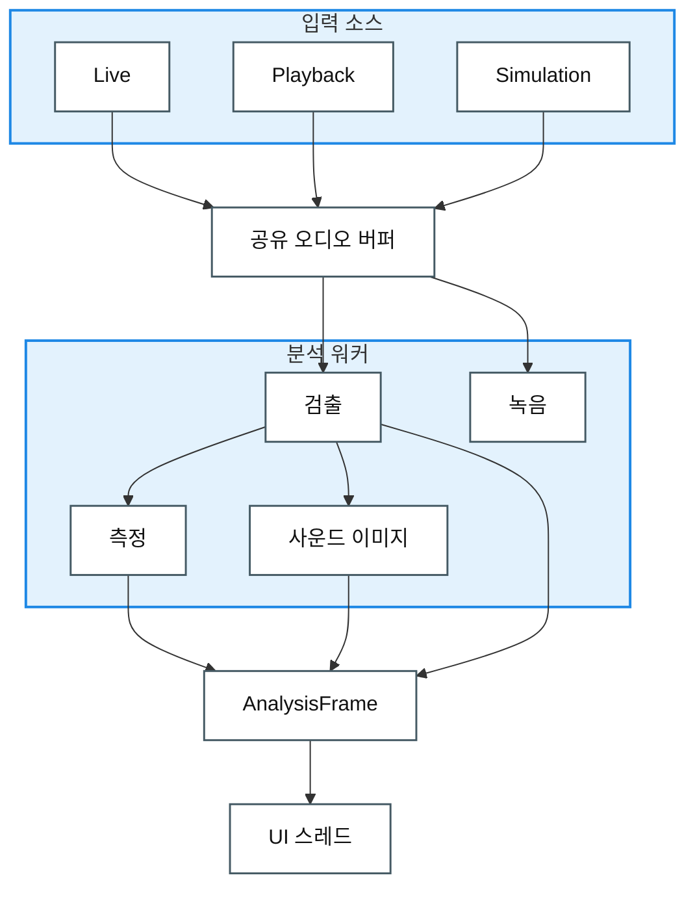

# Architectural Approaches

> 아직 구현 전 단계로, 어떤 구조를 왜 그렇게 만들지에 대한 설계 방향이다.

## 1. LAYERED VIEW – 권한 기반 아키텍처

**목적:** 어떤 레이어가 어떤 하위 레이어를 사용할 수 있는지 보여준다. 구현 세부사항이 아니라 허용되는 의존성을 정의한다.

**핵심 개념:**
- **Relaxed Layering**: 상위 레이어는 중간 레이어를 건너뛰고 필요한 하위 레이어를 직접 사용할 수 있다.
- **Upward Dependency Forbidden**: 의존성 흐름은 아래 방향만 허용한다(App → Core, Core → App 금지).
- **Sidecar Layer**: 공통 외부 유틸리티와 프레임워크는 허용된 레이어가 접근할 수 있는 sidecar 레이어에 둔다.

**레이어:**
1. **Layer 1 – Entry Points & UI**: App(Avalonia UI), Verify(console), Test Suites
2. **Layer 2 – Platform Adapters**: WindowsAudio(NAudio), LinuxAudio(PipeWire/ALSA tools)
3. **Layer 3 – Portable Core**: `TimeGrapher.Core`(analysis, detection, metrics – 외부 의존성 없음)
- **External dependency – External Tech**: Avalonia, ScottPlot, NAudio, xUnit

**권한 규칙:**
```text
App → Platform Adapters
App → Core
Platform Adapters → Core
App & Platform Adapters → External Tech
Core → Nothing (zero dependencies)
```


---

## 2. TIMEGRAPHER MODULE USES VIEW

**목적:** 이 view는 TimeGrapher의 module uses 관계를 두 수준에서 보여준다. 2-1은 project-level module uses를, 2-2는 `TimeGrapher.Core` 내부 decomposition을 보여준다. App 내부 UI 구조는 MVVM View에서 다루고, 이 view는 project-level module uses와 Core 내부 module uses에 집중한다.

> **발표 스크립트:** 이 view는 실행 중 데이터가 흐르는 순서가 아니라, 어떤 모듈이 어떤 모듈을 사용하도록 구조화되어 있는지를 보여줍니다. 먼저 전체 프로젝트 수준에서 App, Core, 플랫폼 오디오 어댑터, Verify의 관계를 보고, 다음으로 Core 내부를 한 단계 확대해서 분석 도메인의 분해 구조를 설명하겠습니다.

**2-1 Project-Level Module Uses:**

App, Core, platform adapters, Verify 사이의 module uses 관계를 보여준다. 여기서 platform adapters는 그림의 `WindowsAudio`와 `LinuxAudio`를 의미하며, OS-specific audio dependency가 `TimeGrapher.Core`로 들어오지 않도록 분리된 modules이다.


> **발표 스크립트:** 이 그림에서 핵심은 Core가 중심에 있고, App과 Verify, WindowsAudio, LinuxAudio가 Core를 사용한다는 점입니다. WindowsAudio와 LinuxAudio가 여기서 말하는 platform adapters이며, OS별 오디오 의존성이 Core 안으로 들어오지 않게 경계를 만듭니다.

- `TimeGrapher.App` uses `TimeGrapher.Core`.
- `TimeGrapher.App` conditionally uses `WindowsAudio` or `LinuxAudio`.
- `WindowsAudio`와 `LinuxAudio`는 `TimeGrapher.Core`를 사용한다.
- `TimeGrapher.Verify` uses `TimeGrapher.Core`.
- `TimeGrapher.Core`는 App, Verify, platform adapters를 사용하지 않는다.

**2-2 TimeGrapher.Core Decomposition:**

`TimeGrapher.Core`를 주요 domain modules로 분해하고, 각 module이 어떤 Core 내부 module을 사용하는지 보여준다.


> **발표 스크립트:** 두 번째 그림은 Core만 확대해서 본 것입니다. Analysis가 분석 흐름을 조정하고, Detection, Metrics, Imaging, AudioIo 같은 도메인 모듈을 사용합니다. Shared는 이 내부 모듈들이 공유하는 frame, buffer, 상태 type을 제공하는 공통 계약 영역입니다.

| Module | 책임 | Uses |
|---|---|---|
| `Analysis` | 분석 worker와 결과 frame 생성을 조정한다. | `Detection`, `Detection.Scoring`, `Metrics`, `Imaging`, `AudioIo`, `Shared` |
| `Detection` | watch signal event와 sync 상태를 검출한다. | `Shared` |
| `Detection.Scoring` | candidate event의 채택/거절 기준을 제공한다. | `Detection` |
| `Metrics` | rate, amplitude, beat error를 계산한다. | `Shared` |
| `Imaging` | sound image와 spectrogram model을 만든다. | `Shared` |
| `AudioIo` | recording writer 계약과 구현을 제공한다. | `Shared` |
| `Sim` | synthetic input source를 제공한다. | `Shared` |
| `Shared` | frame, snapshot, buffer, worker contract, 공통 상태 type을 제공한다. | 없음 |


## 3. MVVM VIEW – 책임 분리

**목적:** App의 UI를 세 계층 — **View**(표시), **ViewModel**(UI 상태·표현 로직), **Model**(도메인/데이터) — 으로 나눈다. 의존성은 **View → ViewModel → Model** 한 방향으로만 흐르며, 하위 계층은 상위 계층을 모른다.
- Loose Coupling & Parallel Development
- Modifiability
- Testability (ViewModel은 UI 없이 동작)

**표기:** 계층마다 색을 칠하고(View / ViewModel / Model), 회색 상자는 **모듈**(관련 클래스 묶음)이다. 모든 의존성은 *사용하는* 모듈에서 *사용되는* 모듈로 향하는 점선 **«use»** 화살표로 그린다.

**모듈 (그림 기준):**

| 계층 | 모듈 | 하는 일 |
|---|---|---|
| **View** (Avalonia) | Main Window | 메인 창 — 전체 레이아웃·컨트롤, 창 열고 닫기. |
| | Graph Tabs Window | 측정 탭을 호스팅하고 분석 프레임을 활성 탭으로 보낸다. |
| | Graph Rendering | 프레임 데이터로 그래프와 수치 표시를 그린다. |
| **ViewModel** (Avalonia 무의존) | MainWindowViewModel | View가 바인딩하는 UI 상태·바인딩 속성을 보유하고 커맨드를 노출한다. |
| | Run · session coordination | 분석을 시작·정지·일시정지하고, 시작부터 끝까지 진행을 관리한다(`RunCommandService`, `RunSessionController`). |
| | Input · display coordination | 오디오 입력 장치를 열거·선택하고 표시 상태를 준비한다(`AudioDeviceController`). |
| **Model** (도메인 · 데이터) | Core.Analysis · Detection | 분석 엔진 — tick/tock 비트를 검출하고 BPH·sync를 계산한다. |
| | Core.Metrics · AudioIo · Imaging | 일오차/진폭/비트에러 계산, WAV 입출력, 사운드 이미지 생성. |
| | Core.Shared | 모든 모듈이 공유하는 공통 계약·데이터 타입(프레임, 버퍼). |
| | Platform.WindowsAudio · LinuxAudio | OS에서 라이브 오디오를 캡처한다(Windows WASAPI, Linux ALSA/PipeWire). |

**의존 흐름(«use» 화살표):**
- View의 세 모듈은 `MainWindowViewModel`을 **사용**한다.
- `MainWindowViewModel`은 두 조정 모듈을 **사용**한다.
- 조정 모듈은 Core 모듈을 **사용**하고, `Core.Analysis · Detection`과 `Platform.*`은 결국 `Core.Shared`를 **사용**한다.

**핵심 제약:**
- **단방향 의존:** View → ViewModel → Model. ViewModel은 Avalonia/View 타입을 갖지 않으며(`ViewModelPurityTests`가 잠금), Model(`Core`)은 의존성이 0이라 UI 없이 빌드·테스트된다.
- **바인딩은 의존이 아니라 제어를 역전한다:** 런타임에 UI 갱신은 Model → ViewModel → View로 흐르지만 이는 이벤트·바인딩을 통한 *데이터 흐름*이지 컴파일 의존이 아니므로, «use» 그래프는 비순환·하향을 유지한다.


**목차** — [한 장으로 보는 아키텍처](#한-장으로-보는-아키텍처) · [적용할 소프트웨어 아키텍처 택틱](#적용할-소프트웨어-아키텍처-택틱) · [적용할 소프트웨어 디자인 패턴](#적용할-소프트웨어-디자인-패턴)

## 한 장으로 보는 아키텍처

**입력 → 공유 버퍼 → 분석(워커 스레드) → 결과 한 묶음(AnalysisFrame) → 화면(UI 스레드)**

### 런타임 데이터 흐름 뷰 (Runtime Data Flow View)

**요소**는 실행 중 동작하는 처리 요소와 데이터 산출물이다. **관계**는 입력에서 화면까지 이어지는 단방향 데이터 흐름이다.



**범례**

| 기호 | 의미 |
|---|---|
| 상자 | 런타임 요소 또는 데이터 산출물 |
| 그룹 상자 | 목적별로 묶은 관련 런타임 요소 |
| 화살표 | 단방향 데이터 흐름 |

- **소리가 들어와 숫자로 나가는 한 방향 흐름** — 그래서 파이프라인이 가장 자연스럽다.
- **무거운 분석은 워커 스레드, UI는 그리기만** → 측정 중에도 화면이 멈추지 않는다. (성능)
- **모든 값은 한 번만 계산해 한 묶음으로 전달** → 화면마다 값이 어긋나지 않는다. (일관성)
- **잡음이 있어도 신호가 충분하면 측정을 유지하고, 임계 미만이면 "신호 약함"을 표시하고 적절히 처리한다** → 틀린 숫자가 화면에 나오지 않는다. (신뢰성)

> **왜 이렇게?** 레거시 코드는 입력·분석·그리기를 한 덩어리에 몰아넣어, 한 비트 주기(43200 BPH 기준 83.3 ms) 안의 응답과 기능 추가를 감당하기 어렵다. 그래서 목적별로 분리했다.

## 적용할 소프트웨어 아키텍처 택틱

품질 목표마다 참고 구현의 택틱 또는 QAS에 맞춘 설계 선택과 적용 목적을 연결했다.

| QAS | 품질 목표 | 택틱 | 목적 |
|:---:|-----------|------|------|
| [QAS-2](./2-Architectural-Drivers.md#qas-2--performance-latency--소리-입력에서-화면-표시까지) | 성능 (Performance) | 동시성 도입<br>큐/버퍼 크기 제한<br>이벤트 응답 제한 | 분석을 워커 스레드로 분리하고, 버퍼를 유한하게 두며, 밀리면 오래된 프레임은 건너뛰고 최신 것만 그린다. |
| [QAS-3](./2-Architectural-Drivers.md#qas-3) | 신뢰성 (Reliability) | 신호 품질 판정<br>품질 저하 처리<br>오류 감지와 예외 처리 | 신호가 충분하면 잡음이 있어도 수용해 측정을 유지하고, 품질 임계 미만이면 "신호 약함"을 표시하고 적절히 처리한다. |
| [QAS-4](./2-Architectural-Drivers.md#qas-4--consistency--표시-간-값-일치) | 일관성 (Consistency) | 단일 소스 원칙<br>한 번 계산 -> 불변 프레임 | 모든 값을 한 번만 계산해 불변 프레임 하나로 모든 표시에 공급해 표시 간 값이 어긋나지 않게 한다. |
| [QAS-5](./2-Architectural-Drivers.md#qas-5--modifiability-extensibility--새-측정필터그래프-추가) | 변경 용이성 (Modifiability) | 응집도 증가<br>캡슐화<br>의존성 제한 | 확장 지점을 고정해 기능 추가가 기존 코드로 번지지 않게 한다. |
| [QAS-6](./2-Architectural-Drivers.md#qas-6--usability--터치스크린에서-읽기조작) | 사용성 (Usability) | 한눈에 읽는 레이아웃<br>물리 크기 규칙 중앙화<br>터치 타깃 크기 보장 | 작은 화면에서도 일오차·비트 에러·진폭을 스크롤/확대 없이 읽게 하고, 글자·터치 타깃 크기를 mm 기준으로 보장한다. |

## 적용할 소프트웨어 디자인 패턴

| 패턴 | 적용 위치 | 목적 |
|------|-----------|------|
| Strategy | 입력 소스 · 필터 단계 | 마이크/재생/Sim과 각 필터를 하나의 인터페이스 뒤에 꽂아 교체 가능하게 |
| Adapter | 플랫폼 오디오 | Windows(WASAPI)와 RPi(ALSA)를 하나의 캡처 인터페이스로 통일 |
| State | 세션 제어 | Idle → Measuring ⇄ Paused 전이를 상태 객체로 (흩어진 플래그 제거) |
| Observer | 시그널/슬롯 (예: Qt) | 생산자는 소비자를 모르고, 화면이 결과 프레임을 구독 |
| Facade | Detector | 호출자가 다단계 검출 모듈들을 깔끔한 Process() 호출 하나로 구동하게 함 |
| Producer–Consumer | 입력 ↔ 분석 (공유 버퍼) | 입력은 버퍼에 쓰고 분석은 읽어, 서로의 속도에 묶이지 않게 분리 |
| Pipe-and-Filter | 전체 흐름 | 입력 → 분석 → 렌더링을 단방향 단계로 연결 |
