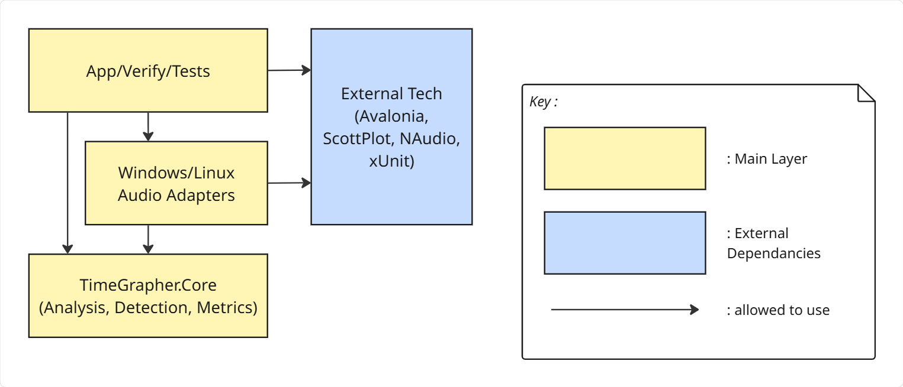
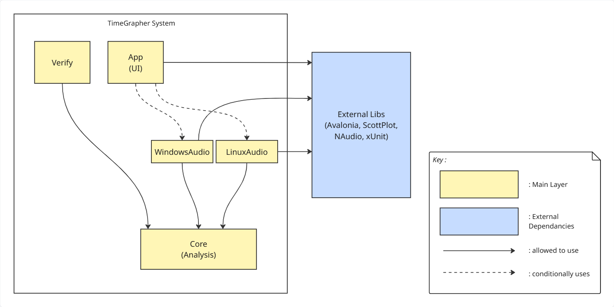
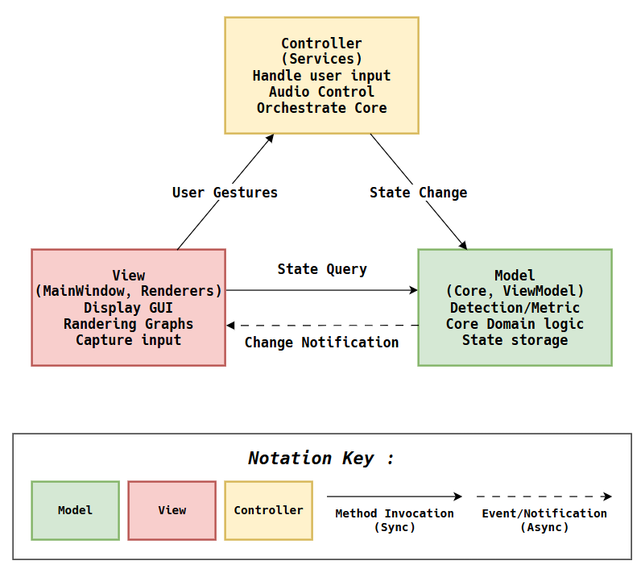
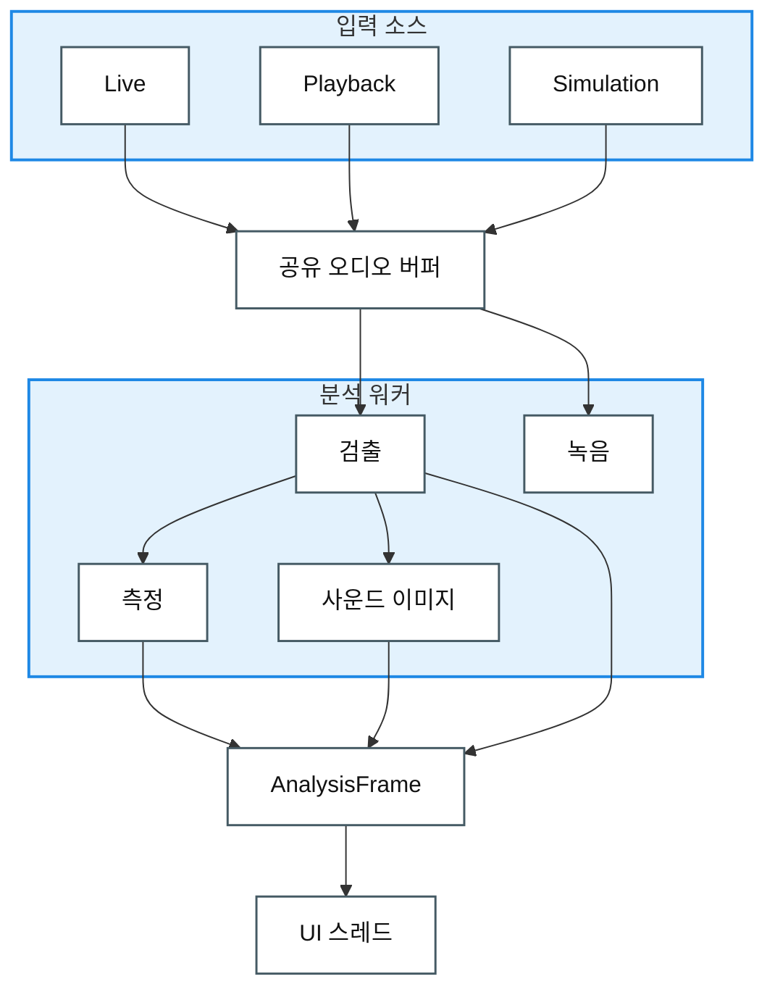

# Architectural Approaches

> 아직 구현 전 단계로, 어떤 구조를 왜 그렇게 만들지에 대한 설계 방향이다.

## 1. LAYERED VIEW – 권한 기반 아키텍처

**목적:** 어떤 레이어가 어떤 하위 레이어를 사용할 수 있는지 보여준다. 구현 세부사항이 아니라 허용되는 의존성을 정의한다.

**핵심 개념:**
- **Relaxed Layering**: 상위 레이어는 중간 레이어를 건너뛰고 필요한 하위 레이어를 직접 사용할 수 있다.
- **Upward Dependency Forbidden**: 의존성 흐름은 아래 방향만 허용한다(App → Core, Core → App 금지).
- **Sidecar Layer**: 공통 외부 유틸리티와 프레임워크는 허용된 레이어가 접근할 수 있는 sidecar 레이어에 둔다.

**레이어:**
1. **Layer 1 – Entry Points & UI**: App(Avalonia UI), Verify(console), Test Suites
2. **Layer 2 – Platform Adapters**: WindowsAudio(NAudio), LinuxAudio(PipeWire/ALSA tools)
3. **Layer 3 – Portable Core**: `TimeGrapher.Core`(analysis, detection, metrics – 외부 의존성 없음)
- **External dependency – External Tech**: Avalonia, ScottPlot, NAudio, xUnit

**권한 규칙:**
```text
App → Platform Adapters
App → Core
Platform Adapters → Core
App & Platform Adapters → External Tech
Core → Nothing (zero dependencies)
```



---

## 2. MODULE USES VIEW – 실제 의존성 구조

**목적:** 이 view는 runtime source projects와 `TimeGrapher.Core` 내부 주요 modules의 uses 관계를 보여준다. `TimeGrapher.Core`는 domain decomposition을 담고 있어 project-level view에서 한 단계 더 확장한다. App 내부 UI 구조, build outputs, generated files, test project detail, 전체 file inventory는 이 view에서 제외한다.

**핵심 원칙:**
- Layered View는 허용되는 의존성을 정의한다.
- Module Uses View는 현재 source structure의 의존성 그래프를 정의한다.
- 의존성이 없으면 연결선을 그리지 않는다.

**2-1 Project-Level Module View:**

이 view는 runtime source projects 사이의 uses 관계를 보여준다. Platform adapters는 OS-specific audio dependency가 Core로 들어오지 않게 하는 경계이고, `TimeGrapher.Core`는 외부 project/package에 의존하지 않는다.



Element Catalog:

| Element | 책임 | Uses |
|---|---|---|
| `TimeGrapher.App` | UI 실행과 화면 구성을 담당한다. | `TimeGrapher.Core`, `WindowsAudio` / `LinuxAudio` |
| `TimeGrapher.Core` | 분석 domain을 담당한다. | 없음 |
| `WindowsAudio` | Windows audio adapter를 담당한다. | `TimeGrapher.Core` |
| `LinuxAudio` | Linux/Raspberry Pi audio adapter를 담당한다. | `TimeGrapher.Core` |
| `TimeGrapher.Verify` | headless detector verification을 담당한다. | `TimeGrapher.Core` |

**2-2 TimeGrapher.Core Decomposition Module View:**

이 view는 `TimeGrapher.Core`를 주요 domain modules로 분해하고, 각 module이 어떤 Core 내부 module을 사용하는지 보여준다.

Element Catalog:

| Element | 책임 | Uses |
|---|---|---|
| `Analysis` | 분석 worker와 결과 frame 생성을 조정한다. | `Detection`, `Detection.Scoring`, `Metrics`, `Imaging`, `AudioIo`, `Shared` |
| `Detection` | watch signal event와 sync 상태를 검출한다. | `Shared` |
| `Detection.Scoring` | candidate event의 채택/거절 기준을 제공한다. | `Detection` |
| `Metrics` | rate, amplitude, beat error를 계산한다. | `Shared` |
| `Imaging` | sound image와 spectrogram model을 만든다. | `Shared` |
| `AudioIo` | recording writer 계약과 구현을 제공한다. | `Shared` |
| `Sim` | synthetic input source를 제공한다. | `Shared` |
| `Shared` | frame, snapshot, buffer, worker contract, 공통 상태 type을 제공한다. | 없음 |


## 3. MVC VIEW – 책임 분리

**목적:** TimeGrapher를 Model(데이터), View(표시), Controller(로직)로 나누어 누가 무엇을 소유하고 어떻게 상호작용하는지 명확히 하며 관심사 분리를 유지한다.
- Loose Coupling & Parallel Development
- Modifiability
- Consistency

**핵심 역할:**

| MVC Component | 소유 책임 | 예시 |
|---|---|---|
| **Model** | 애플리케이션 상태와 도메인 로직. 상태 질의에 응답하고 변경을 View에 알린다. | Core analysis engine, MainWindowViewModel, BeatMetricsHistorySnapshot |
| **View** | Model을 렌더링하고 사용자 입력을 수집한다. | MainWindow.axaml, renderers, plot controls |
| **Controller** | 애플리케이션 동작을 정의한다. 사용자 제스처를 Model 업데이트로 매핑한다. | MainWindow code-behind, RunCommandService, AudioBackend selection |

**상호작용 흐름(Control Flow):**
1. **User Gestures:** View가 사용자 입력을 수집하고 Controller를 호출한다.
2. **State Change:** Controller가 동작을 Model 상태 업데이트 메서드 호출로 변환한다.
3. **Change Notification:** Model이 상태 변경 이벤트/알림을 View에 보낸다(일반적으로 Observer 패턴).
4. **State Query:** View가 갱신된 데이터를 동기적으로 Model에 질의해 화면을 렌더링한다.

**핵심 제약:**
- **Core is UI-agnostic**: Model(Core)은 View 또는 Controller에 대한 의존성이 0이다. 분리된 이벤트 알림으로만 바깥과 통신한다 → 이식성과 테스트 용이성이 높다.
- **App is mixed**: View와 Controller는 Avalonia 프레임워크 세부사항과 섞일 수 있지만, UI에 독립적인 Model에 의존한다.



**목차** — [한 장으로 보는 아키텍처](#한-장으로-보는-아키텍처) · [적용할 소프트웨어 아키텍처 택틱](#적용할-소프트웨어-아키텍처-택틱) · [적용할 소프트웨어 디자인 패턴](#적용할-소프트웨어-디자인-패턴)

## 한 장으로 보는 아키텍처

**입력 → 공유 버퍼 → 분석(워커 스레드) → 결과 한 묶음(AnalysisFrame) → 화면(UI 스레드)**

### 런타임 데이터 흐름 뷰 (Runtime Data Flow View)

**요소**는 실행 중 동작하는 처리 요소와 데이터 산출물이다. **관계**는 입력에서 화면까지 이어지는 단방향 데이터 흐름이다.



**범례**

| 기호 | 의미 |
|---|---|
| 상자 | 런타임 요소 또는 데이터 산출물 |
| 그룹 상자 | 목적별로 묶은 관련 런타임 요소 |
| 화살표 | 단방향 데이터 흐름 |

- **소리가 들어와 숫자로 나가는 한 방향 흐름** — 그래서 파이프라인이 가장 자연스럽다.
- **무거운 분석은 워커 스레드, UI는 그리기만** → 측정 중에도 화면이 멈추지 않는다. (성능)
- **모든 값은 한 번만 계산해 한 묶음으로 전달** → 화면마다 값이 어긋나지 않는다. (일관성)
- **잡음이 있어도 신호가 충분하면 측정을 유지하고, 임계 미만이면 "신호 약함"을 표시하고 적절히 처리한다** → 틀린 숫자가 화면에 나오지 않는다. (신뢰성)

> **왜 이렇게?** 레거시 코드는 입력·분석·그리기를 한 덩어리에 몰아넣어, 한 비트 주기(43200 BPH 기준 83.3 ms) 안의 응답과 기능 추가를 감당하기 어렵다. 그래서 목적별로 분리했다.

## 적용할 소프트웨어 아키텍처 택틱

품질 목표마다 참고 구현의 택틱 또는 QAS에 맞춘 설계 선택과 적용 목적을 연결했다.

| QAS | 품질 목표 | 택틱 | 목적 |
|:---:|-----------|------|------|
| [QAS-2](./2-Architectural-Drivers.md#qas-2--performance-latency--소리-입력에서-화면-표시까지) | 성능 (Performance) | 동시성 도입<br>큐/버퍼 크기 제한<br>이벤트 응답 제한 | 분석을 워커 스레드로 분리하고, 버퍼를 유한하게 두며, 밀리면 오래된 프레임은 건너뛰고 최신 것만 그린다. |
| [QAS-3](./2-Architectural-Drivers.md#qas-3) | 신뢰성 (Reliability) | 신호 품질 판정<br>품질 저하 처리<br>오류 감지와 예외 처리 | 신호가 충분하면 잡음이 있어도 수용해 측정을 유지하고, 품질 임계 미만이면 "신호 약함"을 표시하고 적절히 처리한다. |
| [QAS-4](./2-Architectural-Drivers.md#qas-4--consistency--표시-간-값-일치) | 일관성 (Consistency) | 단일 소스 원칙<br>한 번 계산 -> 불변 프레임 | 모든 값을 한 번만 계산해 불변 프레임 하나로 모든 표시에 공급해 표시 간 값이 어긋나지 않게 한다. |
| [QAS-5](./2-Architectural-Drivers.md#qas-5--modifiability-extensibility--새-측정필터그래프-추가) | 변경 용이성 (Modifiability) | 응집도 증가<br>캡슐화<br>의존성 제한 | 확장 지점을 고정해 기능 추가가 기존 코드로 번지지 않게 한다. |
| [QAS-6](./2-Architectural-Drivers.md#qas-6--usability--터치스크린에서-읽기조작) | 사용성 (Usability) | 한눈에 읽는 레이아웃<br>물리 크기 규칙 중앙화<br>터치 타깃 크기 보장 | 작은 화면에서도 일오차·비트 에러·진폭을 스크롤/확대 없이 읽게 하고, 글자·터치 타깃 크기를 mm 기준으로 보장한다. |

## 적용할 소프트웨어 디자인 패턴

| 패턴 | 적용 위치 | 목적 |
|------|-----------|------|
| Strategy | 입력 소스 · 필터 단계 | 마이크/재생/Sim과 각 필터를 하나의 인터페이스 뒤에 꽂아 교체 가능하게 |
| Adapter | 플랫폼 오디오 | Windows(WASAPI)와 RPi(ALSA)를 하나의 캡처 인터페이스로 통일 |
| State | 세션 제어 | Idle → Measuring ⇄ Paused 전이를 상태 객체로 (흩어진 플래그 제거) |
| Observer | 시그널/슬롯 (예: Qt) | 생산자는 소비자를 모르고, 화면이 결과 프레임을 구독 |
| Facade | Detector | 호출자가 다단계 검출 모듈들을 깔끔한 Process() 호출 하나로 구동하게 함 |
| Producer–Consumer | 입력 ↔ 분석 (공유 버퍼) | 입력은 버퍼에 쓰고 분석은 읽어, 서로의 속도에 묶이지 않게 분리 |
| Pipe-and-Filter | 전체 흐름 | 입력 → 분석 → 렌더링을 단방향 단계로 연결 |
