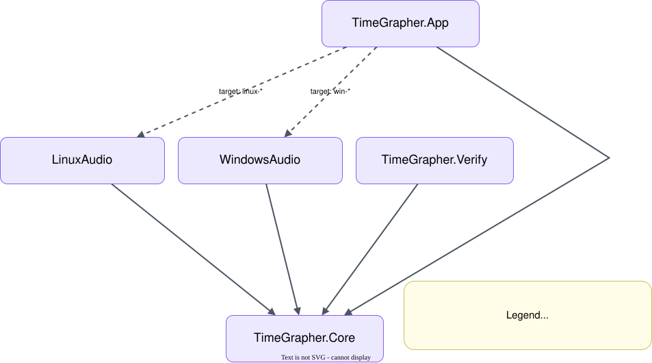
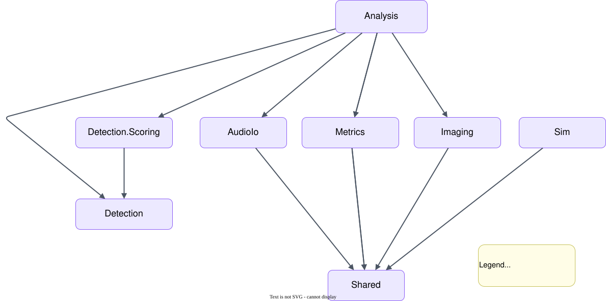

# TIMEGRAPHER MODULE USES VIEW – Actual Dependencies & Internal Decomposition

이 뷰는 프로젝트 수준 모듈(App, Core, platform adapters, Verify) 간의 구문적(syntactic) «use» 의존성을 보여주고, 이어서 `TimeGrapher.Core`를 Core 내부 서브모듈로 분해한다. [Layered View](5-1-Layered-View.md)에서 정의한 권한 규칙을 구체적으로 실현한 뷰다. 여기서 platform adapters는 그림의 `WindowsAudio`와 `LinuxAudio`를 의미하며, OS-specific audio dependency가 `TimeGrapher.Core`로 들어오지 않도록 분리된 modules이다.

## Element Catalog

**프로젝트 수준 module uses**

- `TimeGrapher.App` uses `TimeGrapher.Core`.
- `TimeGrapher.App` conditionally uses `WindowsAudio` or `LinuxAudio`.
- `WindowsAudio`와 `LinuxAudio`는 `TimeGrapher.Core`를 사용한다.
- `TimeGrapher.Verify` uses `TimeGrapher.Core`.
- `TimeGrapher.Core`는 App, Verify, platform adapters를 사용하지 않는다.

### Core-Internal Module Uses

`TimeGrapher.Core`를 주요 domain modules로 분해하고, 각 module이 어떤 Core 내부 module을 사용하는지 보여준다.

| Module | 책임 | Uses |
|---|---|---|
| `Analysis` | 분석 worker와 결과 frame 생성을 조정한다. | `Detection`, `Detection.Scoring`, `Metrics`, `Imaging`, `AudioIo`, `Shared` |
| `Detection` | watch signal event와 sync 상태를 검출한다. | `Shared` |
| `Detection.Scoring` | candidate event의 채택/거절 기준을 제공한다. | `Detection` |
| `Metrics` | rate, amplitude, beat error를 계산한다. | `Shared` |
| `Imaging` | 시계 소리의 시각화용 sound image와 시간-주파수 spectrogram 데이터를 만든다. | `Shared` |
| `AudioIo` | 오디오 녹음을 WAV 파일로 저장하는 writer 계약과 구현을 제공한다. | `Shared` |
| `Sim` | synthetic input source를 제공한다. | `Shared` |
| `Shared` | Core 내부 모듈들이 함께 쓰는 공통 데이터 타입과 계약을 제공한다. | 없음 |

**가변성 — 운영체제 및 배포 타겟**

OS 환경에 따라 `WindowsAudio` 또는 `LinuxAudio` 어댑터를 조건부로 사용하며, 배포 타겟 역시 Windows와 Raspberry Pi용으로 나뉘어 빌드된다. 프로젝트 수준 «use» 그래프가 플랫폼에 따라 분기하는 유일한 지점이다.

## Behavior

N/A. 이 뷰는 구조적 뷰다. 이 모듈들을 통과하는 런타임 데이터 흐름은 [Run Lifecycle Sequence View](5-4-Run-Lifecycle-Sequence-View.md)에서 다룬다.

## Related ADRs

- [ADR-004 — AI 활용, TDD 지원, 팀 협업을 위한 App, Test, Verify 모듈 구조 분리](../ADR/ADR-004.md): App / Test / Verify 분리와 Core 무의존 경계의 근거.
- [ADR-002 — Worker-Level Partial Pipe-and-Filter 적용](../ADR/ADR-002.md): Core 내부를 파이프라인 단계로 분해한 근거.

## Related views

- [Layered View](5-1-Layered-View.md) — 이 의존성들이 따라야 하는 권한 규칙.
- [MVVM View](5-3-MVVM-View.md) — App 쪽 모듈을 View / ViewModel / Model 역할로 구성한 방식.
