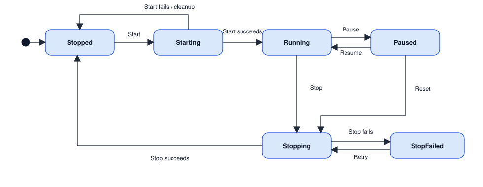
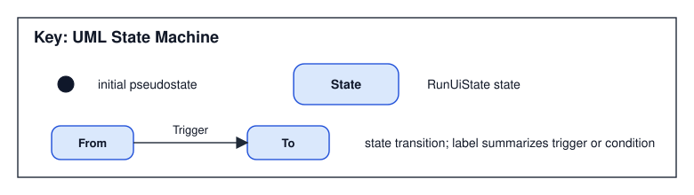

# TIMEGRAPHER RUN LIFECYCLE STATE MACHINE VIEW – Control State Transitions

이 런타임 뷰는 `Stopped`, `Starting`, `Running`, `Paused`, `Stopping`, `StopFailed` 상태 간의 전이 규칙을 정의한다. *어떤 상태로 넘어가는가*를 표현하며, 입력 worker/분석 worker의 상세 호출 순서는 [Run Lifecycle Sequence View](5-4-Run-Lifecycle-Sequence-View.md)에 둔다.

**범위.** 이 상태 머신의 기준 상태 값은 `RunUiState`다. `RunCommandService`는 현재 `RunUiState`에 맞는 상태 객체(`StoppedState`, `RunningState` 등)를 선택하고, 각 상태 객체가 `StartAsync`, `TogglePause`, `StopRunWithoutReset`, `StopRunAndRefreshDevices`, `Reset` 명령을 허용하거나 무시한다. 실제 worker 생성·정지·recording close·장치 복원은 `IRunCommandOperations` 포트를 통해 View 쪽 구현으로 위임된다.

## Element Catalog

| State | 코드 기준 의미 |
| --- | --- |
| `Stopped` | 측정 중이 아닌 기본 상태. 시작 전 설정을 바꿀 수 있고, `StartAsync`가 허용된다. |
| `Starting` | 시작 절차 진행 중. 중복 시작·정지·리셋 명령은 무시된다. |
| `Running` | 입력 worker와 분석 worker가 동작 중인 상태. Pause 또는 stop intent가 허용된다. |
| `Paused` | worker는 살아 있고 입력만 pause gate에 걸린 상태. Resume 또는 Reset이 허용된다. |
| `Stopping` | stop intent를 수행 중인 상태. 정지가 아직 끝나지 않은 경우 Stop/Reset 재시도 표면이 유지된다. |
| `StopFailed` | worker stop timeout 또는 recording close 실패로 완전 정지에 실패한 상태. Stop/Reset 재시도로 같은 pending intent를 다시 수행한다. |

## Behavior

위 상태 머신 다이어그램 자체가 이 뷰의 동작 모델이다. 상태 머신 공통 표기는 아래 범례 이미지를 따른다.

## Related ADRs

- [ADR-003 — App 화면 구조에 MVVM 패턴 채택](../ADR/ADR-003.md): 이 상태 머신이 기술하는, `RunCommandService`가 구현한 State Pattern의 근거.

## Related views

- [Run Lifecycle Sequence View](5-4-Run-Lifecycle-Sequence-View.md) — 이 상태들 안에서 일어나는 호출 시퀀스.
- [MVVM View](5-3-MVVM-View.md) — `RunCommandService`가 계층 구조에서 위치하는 지점.
