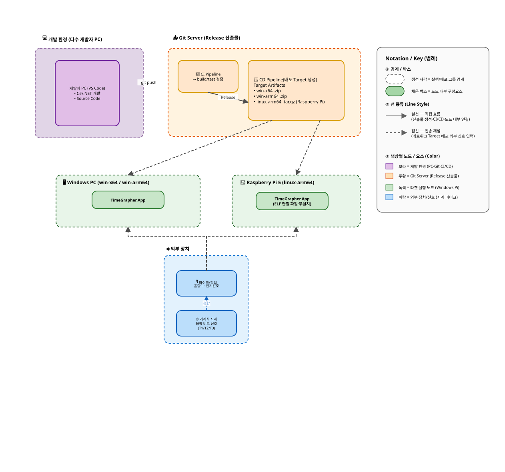

# TimeGrapher Deployment View - Runtime Infrastructure

이 뷰는 TimeGrapher의 런타임 computing infrastructure를 보여준다. 핵심은 하드웨어 노드, 배포되어 실행되는 runtime element, 외부 신호 경로, 측정 중 사용되는 연결 속성이다.

## Primary Presentation

## Element Catalog

**런타임 인프라**

1. **Mechanical Watch**가 acoustic tick/tock signal을 만든다.
2. **Watch Measurement Microphone**이 신호를 캡처하고 Raspberry Pi에 live mono PCM audio로 전달한다.
3. **Raspberry Pi 5**가 Raspberry Pi OS(`arm64`), bundled .NET 8 / Avalonia / PipeWire / ALSA execution environment, 배포된 `TimeGrapher.App` executable을 호스팅한다.
4. **Approved AI Backend**는 HTTPS로 접근하는 external reverse proxy다. measurement log를 중계하고 API credential을 device 밖에 보관한다.
5. **Gemini API**는 approved backend가 REST call로 접근하는 external LLM analysis service다. 이 network path는 설명 기능용일 뿐이며, local measurement와 TinyML signal-quality classification은 여기에 의존하지 않는다.

**주요 런타임 속성**

- **Raspberry Pi:** Raspberry Pi 5, CPU architecture ARM64, Raspberry Pi OS `arm64`, 16 GB RAM, external microphone input.
- **마이크 연결:** Pi의 USB audio connection으로 들어오며, 측정 구성은 mono PCM 48 kHz다. 16-bit mono 기준 약 96 KB/s로 USB 2.0 bandwidth보다 충분히 낮다.
- **Runtime environment:** bundled .NET 8 runtime, Avalonia UI, PipeWire / ALSA tools, `TimeGrapher.App`.
- **Network / API path:** `TimeGrapher.App`에서 Approved AI Backend로 가는 선택적 HTTPS 경로이며 Basic Auth로 보호된다. backend는 API credential을 보관하고 Gemini API로 REST call을 중계한다.
- **TinyML runtime boundary:** ONNX inference는 선택 기능이며 `TimeGrapher.Core` 밖에 격리된다. 모델 로드 실패 시 heuristic signal-quality classifier를 사용한다.

## Behavior

N/A. 이 뷰는 배포/인프라 뷰다. 이 노드 위에서 실행되는 런타임 측정 흐름은 [Run Lifecycle Sequence View](5-4-Run-Lifecycle-Sequence-View.md)에서 다룬다.

## Related ADRs

- [ADR-001 — UI 프레임워크를 Avalonia UI + .NET + C# 로 전환](../ADR/ADR-001.md): 배포 노드를 겨냥한 .NET + Avalonia 런타임의 근거.

## Related views

- [Layered View](5-1-Layered-View.md) — 이 노드에 배포되는 바이너리들의 레이어.
- [Worker Pipeline View](5-7-Worker-Pipeline-View.md) — Raspberry Pi에서 실행되는 런타임 worker 경로.
