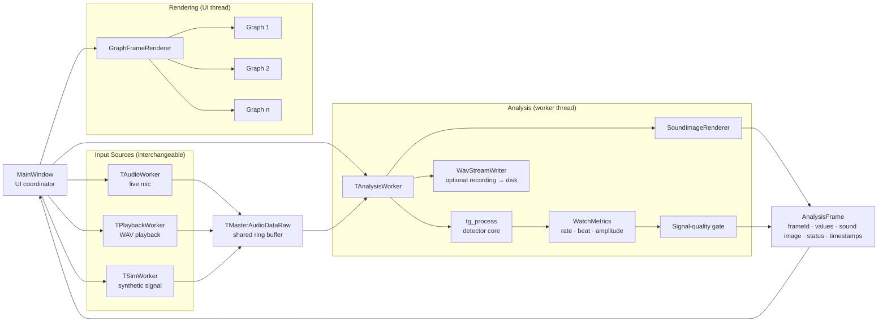
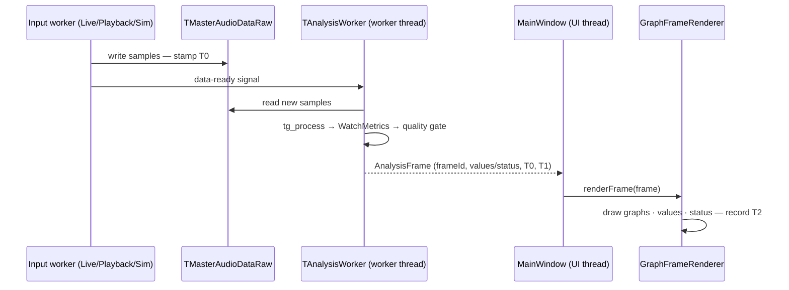
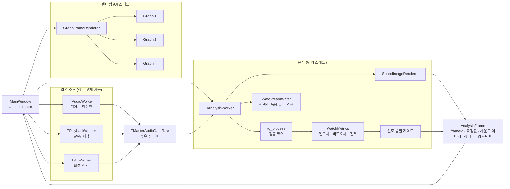
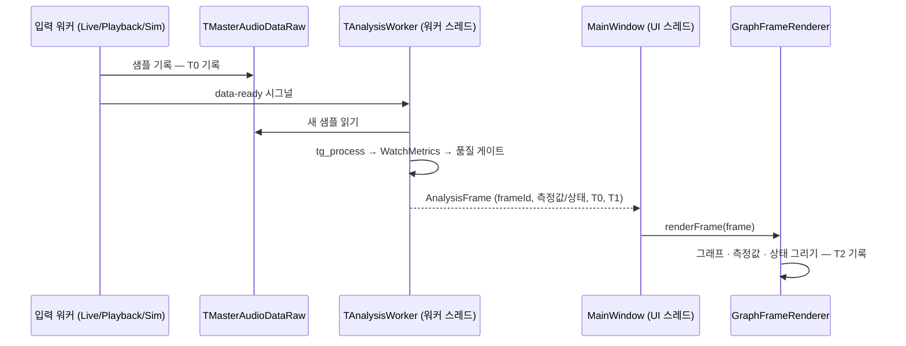

# Milestone1 — Architectural Approaches

> English version above, Korean version below. (위쪽은 영어 버전, 아래쪽은 한국어 버전입니다.)

> **What this is.** Nothing is implemented yet. We studied the legacy baseline code and the drivers (QAS-1…5, C-1…4 — see *Milestone1_Architectural_Drivers_QAS.md*), and this is the structure we decided to build — and why.

## Terminology

| Term | Meaning |
|------|---------|
| UI thread / worker thread | The thread that draws the screen and handles touch / a background thread doing the heavy work |
| Ring buffer | A fixed-size circular buffer — memory never grows; sized so unread samples are never overwritten |
| AnalysisFrame (DTO) | One analysis pass's complete result, packed into a single data bundle |
| Sample domain | Time counted in sample numbers — at 96,000 SPS, one sample ≈ 0.0104 ms |

## The Architecture in One Picture

**input → shared buffer → analysis (worker thread) → AnalysisFrame → rendering (UI thread)**

- **Three input sources** — live mic, WAV playback, Sim generator — write into one shared buffer (one active per run).
- **One analysis worker** detects beats (`tg_process`), computes all values once (`WatchMetrics`), checks signal quality, and packs everything into one `AnalysisFrame`.
- **The UI thread only draws** what the frame says. `MainWindow` just coordinates (mode select, start/stop).

**Why this shape?**

- An acoustic measurement app *is* a one-way stream — samples in, numbers out. A pipeline is its natural form.
- Each driver then has exactly one place to act: latency = stage budgets (QAS-1), degradation = one gate (QAS-2), consistency = one fan-out point (QAS-3).
- The legacy code puts capture, analysis, and drawing all in one UI class. Under a 500 ms latency gate (QAS-1) and a "≤ 1 module changed per feature" budget (QAS-4), that cannot hold — so we decomposed it.

## Six Key Decisions

One decision per remaining driver, plus the shared input abstraction — what we decided, and why it works.

### AP-1 · Analysis runs on its own thread — Performance (QAS-1)
> **In one line: heavy work never runs on the UI thread, and nothing piles up.**

- **Decision** — All detection and measurement run on a worker thread. The capture buffer is bounded (unread samples are never overwritten); if drawing falls behind, stale frames are skipped and only the newest is drawn.
- **Why** — What kills a p99 target is backlog, not average speed. If nothing can pile up, the worst 1 % stays close to normal. Each frame also carries timestamps (**T0** captured · **T1** analyzed · **T2** drawn), so QAS-1's three latency reports are built in, not bolted on.
- *Tactics: introduce concurrency · bound queue sizes · limit event response*

### AP-2 · A quality gate in front of the screen — Availability (QAS-2)
> **In one line: below the quality threshold, the frame says "signal weak" — never a wrong number.**

- **Decision** — Every analysis window gets a signal-quality estimate. Below threshold, the frame's status becomes **SignalWeak** and its value fields stay empty. Displays draw only what the frame says.
- **Why** — The gate sits in front of the single data source feeding every display, so a rejected value *cannot* reach the screen — guaranteed by structure, not by per-widget care. (Reaching 95 % detection at 14 dB is a detector-tuning target, verified on the noise bench.)
- *Tactic: graceful degradation*

### AP-3 · Compute once, fan out one frame — Consistency (QAS-3)
> **In one line: every number and graph in one screen update comes from the same AnalysisFrame.**

- **Decision** — `WatchMetrics` computes rate / beat error / amplitude once; nothing downstream recomputes. The frame is immutable and carries a **frameId**; one frame feeds every display.
- **Why** — Displays can only disagree if they compute separately. With one frame as the only source, "0 mismatches" holds by construction — and each display can show its frameId, so the claim is checkable, exactly as QAS-3 demands.

### AP-4 · Adding a feature = new code + one registration — Modifiability (QAS-4)
> **In one line: a new graph, filter, or measurement never requires surgery on existing code.**

- **Decision** — Fixed extension points: **new graph** → register in `GraphFrameRenderer` · **new filter** → register in the analysis chain · **new measurement** → one computation + one frame field · **new summary/alert** → a new reader of existing frame fields.
- **Why** — 12 features in 3 weeks (8 person-days each) only fit if additions never cascade. The "≤ 1 existing module changed" budget becomes a property of the structure, not of developer discipline.
- *Tactics: increase cohesion · encapsulate · restrict dependencies*

### AP-5 · The UI only draws, and all size rules live in one place — Usability (QAS-5)
> **In one line: uppercase letters ≥ 2.9 mm and touch targets ≥ 9 mm are shared constants in one renderer.**

- **Decision** — `GraphFrameRenderer` is the only place a frame is mapped onto graphs and labels; QAS-5's mm rules (and "rate / beat error / amplitude always visible") are shared constants there.
- **Why** — On a fixed 1280×800 panel, sizes are global rules; kept in one file, compliance is checked in one look. And since analysis never touches the UI thread (AP-1), touch stays responsive while measuring.

### AP-6 · Three swappable input sources — Verification & Portability (C-3·4)
> **In one line: the system cannot tell whether it is hearing a mic, a file, or a simulator.**

- **Decision** — All three sources write the same sample format into the same buffer; everything downstream is identical.
- **Why — two payoffs.** ① The pass criteria of QAS-2·3 are defined against Sim/Playback runs with known answers — those tests run without a Pi, a watch, or a microphone. ② All platform audio code (Windows / RPi OS, C-3) and the AGC-off check (C-4) live in `TAudioWorker` alone.
- *Tactics: abstract data sources · defer binding time*

## Design Patterns in the Design

The decisions above land on familiar design patterns — listed in order of how naturally they fit and how much they pay off:

| Pattern | Where | Role in one line |
|---------|-------|------------------|
| Strategy | Input sources (AP-6) · filter stages (AP-4) | Mic / playback / Sim — and each filter — plug in behind one interface; swap without touching the rest |
| Adapter | Platform audio inside `TAudioWorker` (C-3) | WASAPI (Windows) and ALSA (RPi OS) are adapted to one capture interface |
| State | Session control in `MainWindow` — Idle → Measuring ⇄ Paused | Start/pause/stop transitions live in state objects — no scattered boolean flags |
| Observer | Qt signals/slots — data-ready, frame delivery (AP-1·3) | Producers don't know their consumers; displays subscribe to frames |
| Facade | Wrapper around the C detector core | One clean call hides the C structs and configuration of `tg_process` |

Already named elsewhere: Producer–Consumer (AP-1), immutable DTO (AP-3), and the pipe-and-filter backbone — patterns too, just not GoF. Considered and left out: Factory (three workers created once — a switch is enough) and Mediator (a name for MainWindow's role, not something extra to build).

## How It Runs

- QAS-1's three reports come straight from the timestamps: **processing = T1−T0 · display = T2−T1 · total = T2−T0** (p99 over a 10-min run).
- When the signal is weak, the same flow runs — the frame just carries status instead of values.

## Driver ↔ Decision Map

| Driver | Decision | Support in one line |
|--------|----------|---------------------|
| QAS-1 Latency | AP-1 | No UI-thread work, no backlog; latency reporting built in |
| QAS-2 Availability | AP-2 (+AP-6) | A wrong number structurally cannot reach the screen |
| QAS-3 Consistency | AP-3 | One frame feeds everything; frameId makes "0 mismatches" checkable |
| QAS-4 Modifiability | AP-4 | Every addition = new code + 1 registration |
| QAS-5 Usability | AP-5 (+AP-1) | mm rules in one place; touch never blocked |
| C-1 Raspberry Pi 5 | AP-1 | Bounded buffers; the budget is measured on the target early |
| C-2 1280×800 | AP-5 | Layout rules centralized in one renderer |
| C-3 Windows + RPi OS | AP-6 | Platform code confined to one module |
| C-4 AGC off | AP-6 | Checked once at capture start |

## Components — who does what

| Component | Responsibility |
|-----------|---------------|
| `MainWindow` | Coordination only — mode select, start/stop, wiring |
| `TAudioWorker` | Live mic capture; the only platform-dependent module; AGC-off check |
| `TPlaybackWorker` | WAV playback sample supply |
| `TSimWorker` | Synthetic signal with known beat positions (ground truth) |
| `TMasterAudioDataRaw` | Shared ring buffer between input and analysis |
| `TAnalysisWorker` | Runs detector → metrics → gate; builds the `AnalysisFrame` |
| `tg_process` | Detector core — plain C, sample-domain output |
| `WatchMetrics` | Rate / beat error / amplitude — computed once per pass |
| Signal-quality gate | Quality estimate per window; sets frame status (OK / SignalWeak) |
| `SoundImageRenderer` | Sound image — packed into the frame |
| `WavStreamWriter` | Optional recording to disk (not part of the display path) |
| `AnalysisFrame` | Immutable DTO — frameId, values, sound image, status, timestamps |
| `GraphFrameRenderer` | Maps one frame to all graphs/labels; mm layout rules |

## What We Verify First

A few numbers in this design are still assertions, not measurements — so they are the first implementation targets:

1. **The 500 ms budget on the Pi 5** — build a thin skeleton of the pipeline first and measure T0→T2 on the target.
2. **The gate threshold** — 14 dB / 95 % are provisional; calibrate on the noise bench.
3. **The 1280×800 layout** — check the mm rules with a paper mock before writing widget code.
4. **The capture chain** — confirm 96k/48k capture with AGC off on both platforms (fallback: 48k only).

---

# Milestone1 — Architectural Approaches (한국어)

> **이 문서의 성격.** 아직 구현된 것은 없다. 레거시 베이스라인 코드와 드라이버(QAS-1…5, C-1…4 — *Milestone1_Architectural_Drivers_QAS.md* 참고)를 검토해서, 앞으로 구현할 구조를 결정했다 — 무엇을, 왜 그렇게 결정했는지를 담았다.

## 용어 설명

| 용어 | 설명 |
|------|------|
| UI 스레드 / 워커 스레드 | 화면을 그리고 터치를 받는 스레드 / 무거운 일을 하는 백그라운드 스레드 |
| 링 버퍼 (ring buffer) | 고정 크기 순환 버퍼 — 메모리가 늘지 않고, 읽지 않은 샘플이 덮어써지지 않게 크기를 잡는다 |
| AnalysisFrame (DTO) | 분석 1회의 완결된 결과를 담은 단일 데이터 묶음 |
| 샘플 도메인 | 시각을 샘플 번호로 세는 것 — 96,000 SPS에서 1샘플 ≈ 0.0104 ms |

## 한 장으로 보는 아키텍처

**입력 → 공유 버퍼 → 분석 (워커 스레드) → AnalysisFrame → 렌더링 (UI 스레드)**

- **입력 소스 3종** — 라이브 마이크, WAV 재생, Sim 생성기 — 이 하나의 공유 버퍼에 기록한다 (실행당 1개만 활성).
- **분석 워커 하나**가 비트를 검출하고(`tg_process`), 모든 측정값을 한 번만 계산하고(`WatchMetrics`), 신호 품질을 검사한 뒤, 전부를 하나의 `AnalysisFrame`에 담는다.
- **UI 스레드는 프레임에 담긴 것만 그린다.** `MainWindow`는 조정만 한다 (모드 선택, 시작/중지).

**왜 이 모양인가?**

- 음향 계측 앱은 그 자체로 단방향 스트림이다 — 샘플이 들어오고 숫자가 나간다. 파이프라인이 가장 자연스러운 형태다.
- 그러면 각 드라이버를 다룰 자리가 하나씩 정해진다: 지연시간 = 단계별 예산(QAS-1), 성능 저하 대응 = 게이트 하나(QAS-2), 일관성 = 분배 지점 하나(QAS-3).
- 레거시 코드는 캡처·분석·그리기를 전부 UI 클래스 하나에 몰아넣었다. 500 ms 지연 게이트(QAS-1)와 "기능당 모듈 1개 변경" 예산(QAS-4) 아래서 그 구조는 버틸 수 없다 — 그래서 위처럼 분해했다.

## 핵심 결정 6가지

남은 드라이버 하나당 결정 하나와 공유 입력 추상화 — 무엇을 결정했고, 왜 통하는지.

### AP-1 · 분석은 전용 스레드에서 돈다 — Performance (QAS-1)
> **한 줄 요약: 무거운 작업은 UI 스레드에서 절대 돌지 않고, 아무것도 쌓이지 않는다.**

- **결정** — 모든 검출·측정은 워커 스레드에서. 캡처 버퍼는 유한하고(읽지 않은 샘플은 덮어쓰지 않음), 그리기가 밀리면 오래된 프레임은 건너뛰고 최신 것만 그린다.
- **이유** — p99 목표를 죽이는 건 평균 속도가 아니라 적체다. 쌓일 곳이 없으면 최악 1%도 평소 수준에 머문다. 프레임마다 타임스탬프(**T0** 캡처 · **T1** 분석 완료 · **T2** 그리기 완료)를 실어, QAS-1의 3구간 지연 보고가 설계에 내장된다.
- *전술: 동시성 도입 · 큐 크기 제한 · 이벤트 응답 제한*

### AP-2 · 화면 앞의 품질 게이트 — Availability (QAS-2)
> **한 줄 요약: 품질 임계 미만이면 프레임은 "신호 약함" 상태가 된다 — 틀린 숫자는 절대 내보내지 않는다.**

- **결정** — 분석 윈도마다 신호 품질을 추정한다. 임계 미만이면 프레임 상태가 **SignalWeak**가 되고 측정값 필드는 빈 채로 남는다. 표시는 프레임에 담긴 것만 그린다.
- **이유** — 게이트가 모든 표시의 유일한 데이터 소스 앞에 있으므로, 기각된 값은 화면에 *도달할 수 없다* — 위젯마다 주의를 기울여서가 아니라 구조가 보장한다. (14 dB에서 검출률 95% 달성은 검출기 튜닝 목표이며, 잡음 벤치로 검증한다.)
- *전술: 우아한 성능 저하 (graceful degradation)*

### AP-3 · 한 번 계산해서, 한 프레임으로 분배 — Consistency (QAS-3)
> **한 줄 요약: 한 화면 갱신 안의 모든 숫자와 그래프는 같은 AnalysisFrame에서 나온다.**

- **결정** — `WatchMetrics`가 일오차/비트오차/진폭을 한 번만 계산한다; 이후 단계에서는 아무도 재계산하지 않는다. 프레임은 불변이고 **frameId**를 가지며, 한 프레임이 모든 표시에 데이터를 공급한다.
- **이유** — 표시들이 따로 계산할 때만 불일치가 생긴다. 프레임 하나가 유일한 소스이면 "불일치 0회"는 구조적으로 성립하고 — 각 표시가 자기 frameId를 보여줄 수 있으므로, QAS-3이 요구하는 대로 검사도 가능하다.

### AP-4 · 기능 추가 = 새 코드 + 등록 1곳 — Modifiability (QAS-4)
> **한 줄 요약: 새 그래프·필터·측정값 때문에 기존 코드를 수술하는 일은 없다.**

- **결정** — 고정된 확장 지점: **새 그래프** → `GraphFrameRenderer`에 등록 · **새 필터** → 분석 체인에 등록 · **새 측정값** → 계산 1개 + 프레임 필드 1개 · **새 요약/경보** → 기존 프레임 필드를 읽는 새 소비자.
- **이유** — 3주에 기능 12종(기능당 8 person-days)은 추가가 연쇄되지 않아야만 가능하다. "기존 모듈 변경 ≤ 1개" 예산이 개발자가 신경 써서 지키는 약속이 아니라 구조 자체의 속성이 된다.
- *전술: 응집도 증가 · 캡슐화 · 의존성 제한*

### AP-5 · UI는 그리기만, 크기 규칙은 한 곳에 — Usability (QAS-5)
> **한 줄 요약: 대문자 ≥ 2.9 mm, 터치 ≥ 9 mm는 렌더러 한 곳의 공유 상수다.**

- **결정** — 프레임을 그래프와 라벨로 매핑하는 곳은 `GraphFrameRenderer` 하나뿐이고, QAS-5의 mm 규칙("일오차·비트오차·진폭 상시 표시" 포함)은 그곳의 공유 상수다.
- **이유** — 고정된 1280×800 패널에서 크기는 전역 규칙이다. 한 파일에 모이면 준수 여부를 한눈에 검사할 수 있다. 그리고 분석이 UI 스레드를 건드리지 않으므로(AP-1) 측정 중에도 터치가 계속 반응한다.

### AP-6 · 갈아 끼우는 입력 소스 3종 — 검증과 이식성 (C-3·4)
> **한 줄 요약: 시스템은 자기가 듣는 것이 마이크인지, 파일인지, 시뮬레이터인지 모른다.**

- **결정** — 세 소스 모두 같은 샘플 형식을 같은 버퍼에 쓴다; 이후 단계는 완전히 동일하다.
- **이유 — 효용 두 가지.** ① QAS-2·3의 합격 기준은 정답을 아는 Sim/Playback 실행으로 정의되어 있다 — 그 시험에는 Pi도, 시계도, 마이크도 필요 없다. ② 플랫폼 오디오 코드(Windows / RPi OS, C-3)와 AGC-off 확인(C-4)은 전부 `TAudioWorker` 한 곳에만 모여 있다.
- *전술: 데이터 소스 추상화 · 바인딩 시점 지연*

## 설계에 녹아 있는 디자인 패턴

위 결정들은 익숙한 디자인 패턴 위에 서 있다 — 자연스럽게 맞고 실효가 큰 순서로:

| 패턴 | 위치 | 역할 한 줄 요약 |
|------|------|-----------|
| Strategy | 입력 소스(AP-6) · 필터 단계(AP-4) | 마이크/재생/Sim도, 각 필터도 하나의 인터페이스 뒤에 꽂힌다; 나머지를 건드리지 않고 교체 |
| Adapter | `TAudioWorker` 안의 플랫폼 오디오 (C-3) | WASAPI(Windows)와 ALSA(RPi OS)를 하나의 캡처 인터페이스에 맞춘다 |
| State | `MainWindow`의 세션 제어 — Idle → Measuring ⇄ Paused | 시작/일시정지/정지 전이가 상태 객체에 모인다 — 흩어진 boolean 플래그가 없다 |
| Observer | Qt 시그널/슬롯 — data-ready, 프레임 전달 (AP-1·3) | 생산자는 소비자를 모른다; 표시들이 프레임을 구독한다 |
| Facade | C 검출 코어를 감싸는 래퍼 | `tg_process`의 C 구조체와 설정을 깔끔한 호출 하나 뒤에 숨긴다 |

이미 이름 붙인 것들 — Producer–Consumer(AP-1), 불변 DTO(AP-3), pipe-and-filter 골격 — 도 패턴이다. GoF가 아닐 뿐. 고려했지만 뺀 것 — Factory(워커 3개를 한 번 만들 뿐이라 switch면 충분)와 Mediator(MainWindow 역할의 이름일 뿐, 따로 만들 게 없음).

## 실행 흐름

- QAS-1의 세 보고값은 타임스탬프에서 그대로 나온다: **처리 = T1−T0 · 표시 = T2−T1 · 전체 = T2−T0** (10분 실행의 p99).
- 신호가 약할 때도 같은 흐름이 돈다 — 프레임이 측정값 대신 상태를 담아 보낼 뿐이다.

## 드라이버 ↔ 결정 매핑

| 드라이버 | 결정 | 한 줄 요약 |
|----------|------|-----------|
| QAS-1 Latency | AP-1 | UI 스레드 작업 없음, 적체 없음; 지연 보고 내장 |
| QAS-2 Availability | AP-2 (+AP-6) | 틀린 숫자는 구조적으로 화면에 도달할 수 없음 |
| QAS-3 Consistency | AP-3 | 한 프레임이 모든 표시에 공급됨; frameId로 "불일치 0회" 검사 가능 |
| QAS-4 Modifiability | AP-4 | 모든 추가 = 새 코드 + 등록 1곳 |
| QAS-5 Usability | AP-5 (+AP-1) | mm 규칙은 한 곳에; 터치는 멈추지 않음 |
| C-1 Raspberry Pi 5 | AP-1 | 유한 버퍼; 예산은 타깃에서 조기 측정 |
| C-2 1280×800 | AP-5 | 레이아웃 규칙을 렌더러 하나에 중앙화 |
| C-3 Windows + RPi OS | AP-6 | 플랫폼 코드를 모듈 하나에 격리 |
| C-4 AGC off | AP-6 | 캡처 시작 시 한 번 확인 |

## 컴포넌트 — 누가 무엇을 하나

| 컴포넌트 | 책임 |
|----------|------|
| `MainWindow` | 조정만 — 모드 선택, 시작/중지, 연결 |
| `TAudioWorker` | 라이브 마이크 캡처; 유일한 플랫폼 의존 모듈; AGC-off 확인 |
| `TPlaybackWorker` | WAV 재생 샘플 공급 |
| `TSimWorker` | 비트 위치를 미리 아는 합성 신호 (ground truth) |
| `TMasterAudioDataRaw` | 입력과 분석 사이의 공유 링 버퍼 |
| `TAnalysisWorker` | 검출 → 지표 → 게이트 구동; `AnalysisFrame` 생성 |
| `tg_process` | 검출 코어 — 순수 C, 샘플 도메인 출력 |
| `WatchMetrics` | 일오차 / 비트오차 / 진폭 — 분석 1회당 한 번 계산 |
| 신호 품질 게이트 | 윈도별 품질 추정; 프레임 상태(OK / SignalWeak) 설정 |
| `SoundImageRenderer` | 사운드 이미지 — 프레임에 담김 |
| `WavStreamWriter` | 디스크 녹음(선택) — 표시 경로 아님 |
| `AnalysisFrame` | 불변 DTO — frameId, 측정값, 사운드 이미지, 상태, 타임스탬프 |
| `GraphFrameRenderer` | 한 프레임을 모든 그래프/라벨로 매핑; mm 레이아웃 규칙 |

## 먼저 확인할 것

이 설계의 몇 가지 숫자는 아직 측정이 아니라 단언이다 — 그래서 구현의 첫 타깃이다:

1. **Pi 5에서의 500 ms 예산** — 파이프라인의 얇은 뼈대를 먼저 만들어 타깃에서 T0→T2를 측정한다.
2. **게이트 임계값** — 14 dB / 95 %는 잠정값; 잡음 벤치로 보정한다.
3. **1280×800 레이아웃** — 위젯 코드 전에 페이퍼 목업으로 mm 규칙을 확인한다.
4. **캡처 체인** — 두 플랫폼에서 AGC를 끈 채 96k/48k 캡처가 되는지 확인한다 (대비책: 48k 전용).
