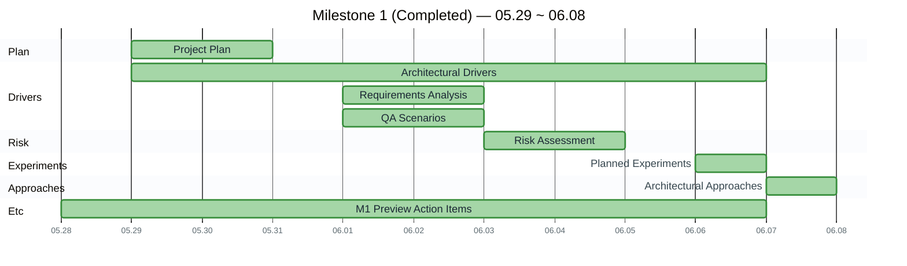
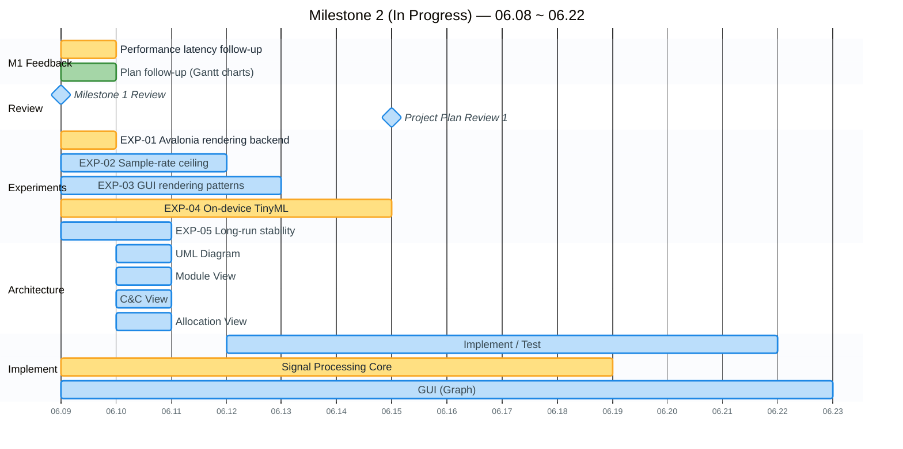
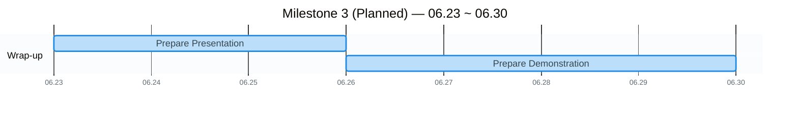

# Project Plan

## Team Roles

- **Team Lead**: Sungjun Yoon
- **System (dataflow, pipeline)**: Junsung Kim, Jongdae Baek
- **Algorithm (functionality, calculation)**: Sunyoung Oh, Junyoung Park
- **GUI**: Jaehong Oh, Sungjun Yoon

## ARCHI-265 Schedule

### 🟩 Milestone 1 — `05.29 ~ 06.08`

### 🟨 Milestone 2 — `06.08 ~ 06.22`

### 🟦 Milestone 3 — `06.23 ~ 06.30`

🔗 [Quire URL](https://quire.io/w/SUNYOUNG_OH/40?filter=all&share=ud59lcpw1fx35wkwjcub6tdurt5iyg&view=timeline)

## Legend

- 🟩 Completed · 🟨 In Progress · 🟦 Planned · ◆ review milestone (charts) · red vertical line = today (charts)
- "All" in assignments = all six team members

## Schedule

- 🟩 **Milestone 1** — `05.29 ~ 06.08`
  - 🟩 Project Plan — `05.29 ~ 05.31`
  - 🟩 **Architectural Drivers** — `05.29 ~ 06.07`
    - 🟩 Requirements Analysis — `06.01 ~ 06.03` _(Assigned: All)_
    - 🟩 QA Scenarios — `06.01 ~ 06.03` _(Assigned: All)_
  - 🟩 **Risk Assessment** — `06.03 ~ 06.05`
    - 🟩 List up Technical Risks — `06.03 ~ 06.05` _(Assigned: All)_
    - 🟩 List up Non-Technical Risks — `06.03 ~ 06.05` _(Assigned: All)_
  - 🟩 Planned Experiments — `06.06 ~ 06.07` _(Assigned: YUN, JunSung)_
  - 🟩 **Architectural Approaches** — `06.07 ~ 06.08` _(Assigned: Jaehong, D)_
    - 🟩 Describe Overview-level architecture _(Assigned: All)_
  - 🟩 Etc — `05.28 ~ 06.07` (Milestone 1 Preview Action Items, All)
- 🟨 **Milestone 2** — `06.08 ~ 06.22`
  - 🟨 **M1 Feedback** — `06.09 ~ 06.10`
    - 🟨 Performance latency follow-up — `06.09 ~ 06.10` _(Assigned: Jaehong, JunSung)_ — latency measurement data, QAS-1/Risk/Test story link, and threshold rationale done; architecture-tactics supplement remains
    - 🟩 Plan follow-up (insert Gantt charts) — `06.09 ~ 06.10` _(Assigned: Jaehong)_
  - 🟦 **Project Plan Review**
    - 🟦 Milestone 1 Review — `06.09`
    - 🟦 Project Plan Review #1 — `06.15` _(Assigned: JunSung)_
  - 🟨 **Experiments/Results** — `06.08 ~ 06.17`
    - 🟨 EXP-01 Avalonia rendering backend on the RPi5 — `06.09 ~ 06.10` _(Assigned: Jaehong)_
    - 🟦 EXP-02 RPi5 real-time sample-rate ceiling — `06.09 ~ 06.12` _(Assigned: Junyoung Park)_
    - 🟦 EXP-03 GUI real-time rendering design patterns — `06.09 ~ 06.13` _(Assigned: YUN)_
    - 🟨 EXP-04 On-device TinyML inference feasibility — `06.09 ~ 06.15` _(Assigned: SUNYOUNG OH)_
    - 🟦 EXP-05 Long-run stability (24h+) — `06.09 ~ 06.11` _(Assigned: D)_
  - 🟦 **Architecture** — `06.10 ~ 06.11`
    - 🟦 UML Diagram — `06.10 ~ 06.11` _(Assigned: YUN, SUNYOUNG OH)_
    - 🟦 Module View — `06.10 ~ 06.11` _(Assigned: YUN, SUNYOUNG OH, Jaehong)_
    - 🟦 C&C View — `06.10 ~ 06.11` _(Assigned: JunSung, YUN)_ — includes the signal-processing pipe-and-filter view plus peer-to-peer and performance-tactic review
    - 🟦 Allocation View — `06.10 ~ 06.11` _(Assigned: D, Jaehong)_
  - 🟦 **Implement / Test** — `06.12 ~ 06.22` _(Assigned: All)_
    - 🟨 Signal Processing Core — `06.09 ~ 06.19` — Block diagram (in progress) → Phase 1 Core DSP → Phase 2 Measurement → Phase 3 Waveform → Phase 4 Frequency
    - 🟦 GUI (Graph) — `06.09 ~ 06.23` — G01–G12 graphs split across 3 groups (Sungjun Yoon·Junsung Kim / Jaehong Oh·Jongdae Baek / Junyoung Park·Sunyoung Oh)
  - 🟦 Etc — `06.10 ~ 06.22`
- 🟦 **Milestone 3** — `06.23 ~ 06.30`
  - 🟦 Prepare Presentation — `06.23 ~ 06.26` _(Assigned: SUNYOUNG OH, YUN)_
  - 🟦 Prepare Demonstration — `06.26 ~ 06.30` _(Assigned: Jaehong, Junyoung Park, D)_
