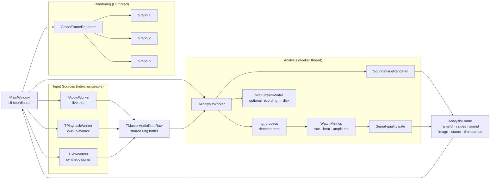

# Architectural Approaches

> Pre-implementation: the structure we plan to build, and why.

## The Architecture at a Glance

**input → shared buffer → analysis (worker thread) → one result bundle (AnalysisFrame) → screen (UI thread)**

- **A one-way flow** — sound in, numbers out — so a pipeline is the natural shape.
- **Heavy analysis on a worker thread; the UI only draws** → the screen never freezes while measuring. (Performance)
- **Every value computed once, delivered as one bundle** → no display ever disagrees with another. (Consistency)
- **When the signal is weak, the bundle carries a "signal weak" status** → a wrong number never reaches the screen. (Availability)

> **Why this shape?** The legacy code lumps capture, analysis, and drawing into one piece, which can't meet a 0.5 s response target or absorb new features. So we split it by role.

## Software Architecture Tactics to Apply

One tactic anchored to each quality goal.

| Quality goal | Tactic | In one line |
|--------------|--------|-------------|
| Performance | introduce concurrency · bound queue/buffer sizes · limit event response | Analysis on a worker thread; bounded buffers; if drawing falls behind, skip stale frames and draw only the newest |
| Availability | graceful degradation | A quality gate in front of the screen — when the signal is weak, show "signal weak" instead of a wrong number |
| Modifiability | increase cohesion · encapsulate · restrict dependencies | Fixed extension points, so a new feature never spreads into existing code |
| Portability & verification | abstract data sources · defer binding | Three inputs unified to one format and swappable; platform-dependent code kept in one place |

## Software Design Patterns to Apply

| Pattern | Where | Role |
|---------|-------|------|
| Strategy | Input sources · filter stages | Mic/playback/Sim and each filter plug in behind one interface, swappable |
| Adapter | Platform audio | Windows (WASAPI) and RPi (ALSA) unified to one capture interface |
| State | Session control | Idle → Measuring ⇄ Paused transitions as state objects (no scattered flags) |
| Observer | Qt signals/slots | Producers don't know consumers; displays subscribe to the result frame |
| Facade | C detector-core wrapper | Hides the complex C detector core behind one clean call |
| Producer–Consumer | Input ↔ analysis (shared buffer) | Input writes, analysis reads — decoupled so neither waits on the other's pace |
| Pipe-and-Filter | Whole flow | Input → analysis → rendering wired as one-way stages |
