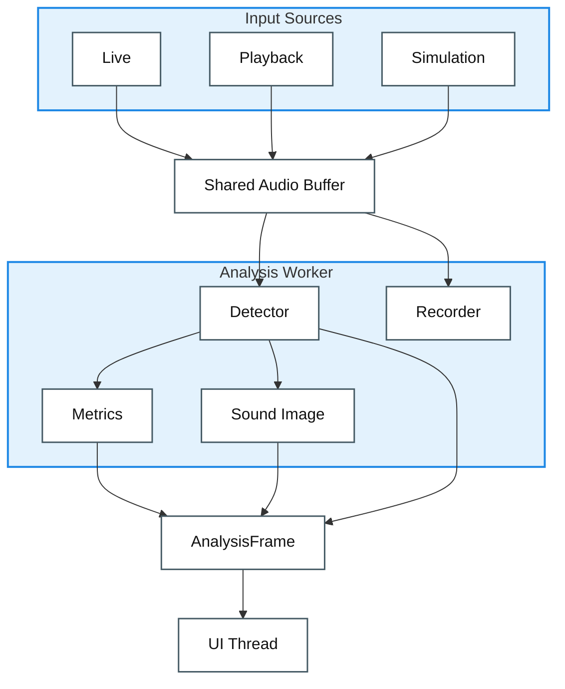

# Architectural Approaches

> Pre-implementation: the structure we plan to build, and why.

**Contents** — [The Architecture at a Glance](#the-architecture-at-a-glance) · [Software Architecture Tactics to Apply](#software-architecture-tactics-to-apply) · [Software Design Patterns to Apply](#software-design-patterns-to-apply)

## The Architecture at a Glance

**input → shared buffer → analysis (worker thread) → one result bundle (AnalysisFrame) → screen (UI thread)**

### Runtime Data Flow View

**Elements** are runtime processing elements and data artifacts. **Relations** are one-way data-flow relations from input to screen.

**Legend**

| Symbol | Meaning |
|---|---|
| Box | Runtime element or data artifact |
| Group box | Related runtime elements grouped by purpose |
| Arrow | One-way data flow |

- **A one-way flow** — sound in, numbers out — so a pipeline is the natural shape.
- **Heavy analysis on a worker thread; the UI only draws** → the screen never freezes while measuring. (Performance)
- **Every value computed once, delivered as one bundle** → no display ever disagrees with another. (Consistency)
- **Keep measuring while the signal is good enough; below the threshold, show "signal weak" and handle the input appropriately** → a wrong number never reaches the screen. (Availability)

> **Why this shape?** The legacy code lumps capture, analysis, and drawing into one piece, which can't meet a 0.5 s response target or absorb new features. So we split it by purpose.

## Software Architecture Tactics to Apply

One tactic anchored to each quality goal.

| QAS | Quality goal | Tactic |
|:---:|--------------|--------|
| [QAS-1](./Milestone1_2-Architectural-Drivers.md#qas-1) | Performance |  |
| [QAS-2](./Milestone1_2-Architectural-Drivers.md#qas-2) | Availability |  |
| [QAS-3](./Milestone1_2-Architectural-Drivers.md#qas-3) | Consistency |  |
| [QAS-4](./Milestone1_2-Architectural-Drivers.md#qas-4) | Modifiability |  |
| [QAS-5](./Milestone1_2-Architectural-Drivers.md#qas-5) | Usability | pause/resume |

## Software Design Patterns to Apply

| Pattern | Where | Purpose |
|---------|-------|---------|
| Strategy | Input sources · filter stages | Mic/playback/Sim and each filter plug in behind one interface, swappable |
| Adapter | Platform audio | Windows (WASAPI) and RPi (ALSA) unified to one capture interface |
| State | Session control | Idle → Measuring ⇄ Paused transitions as state objects (no scattered flags) |
| Observer | Signals/slots (e.g., Qt) | Producers don't know consumers; displays subscribe to the result frame |
| Facade | C detector-core wrapper | Hides the complex C detector core behind one clean call |
| Producer–Consumer | Input ↔ analysis (shared buffer) | Input writes, analysis reads — decoupled so neither waits on the other's pace |
| Pipe-and-Filter | Whole flow | Input → analysis → rendering wired as one-way stages |
