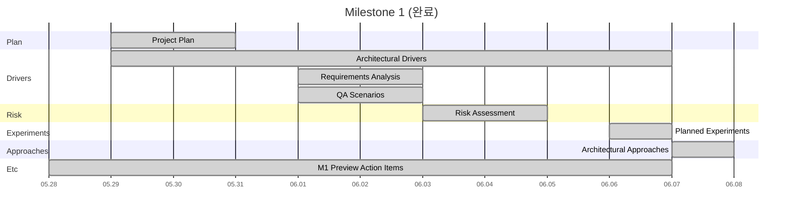
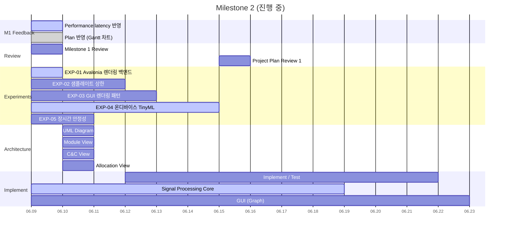
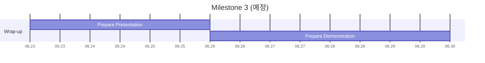

# Project Plan

## 팀 역할

- **팀리더**: 윤성준
- **시스템(dataflow, pipeline)**: 김준성, 백종대
- **알고리즘(기능, 계산식)**: 오선영, 박준영
- **GUI**: 오재홍, 윤성준

## ARCHI-265 일정

### ✅ Milestone 1 — `05.29 ~ 06.08`

### 🟡 Milestone 2 — `06.08 ~ 06.22`

### ⬜ Milestone 3 — `06.23 ~ 06.30`

🔗 [Quire URL](https://quire.io/w/SUNYOUNG_OH/40?filter=all&share=ud59lcpw1fx35wkwjcub6tdurt5iyg&view=timeline)

## 범례

- 🟡 진행 중
- ⬜ 예정
- ✅ 완료
- 담당의 "전원" = 팀원 6명 전체

## 일정

- ✅ **Milestone 1** — `05.29 ~ 06.08`
  - ✅ Project Plan — `05.29 ~ 05.31`
  - ✅ **Architectural Drivers** — `05.29 ~ 06.07`
    - ✅ Requirements Analysis — `06.01 ~ 06.03` _(담당: 전원)_
    - ✅ QA Scenarios — `06.01 ~ 06.03` _(담당: 전원)_
  - ✅ **Risk Assessment** — `06.03 ~ 06.05`
    - ✅ List up Technical Risks — `06.03 ~ 06.05` _(담당: 전원)_
    - ✅ List up Non-Technical Risks — `06.03 ~ 06.05` _(담당: 전원)_
  - ✅ Planned Experiments — `06.06 ~ 06.07` _(담당: YUN, JunSung)_
  - ✅ **Architectural Approaches** — `06.07 ~ 06.08` _(담당: 재홍, D)_
    - ✅ Describe Overview-level architecture _(담당: 전원)_
  - ✅ Etc — `05.28 ~ 06.07` (Milestone 1 Preview Action Items, 전원)
- 🟡 **Milestone 2** — `06.08 ~ 06.22`
  - 🟡 **M1 Feedback** — `06.09 ~ 06.10`
    - 🟡 Performance latency 반영 — `06.09 ~ 06.10` _(담당: 재홍, JunSung)_ — latency 실측 자료·QAS-1/Risk/Test 스토리 연결·기준 근거 완료, 아키텍처 택틱 보완 남음
    - ✅ Plan 반영 (Gantt 차트 삽입) — `06.09 ~ 06.10` _(담당: 재홍)_
  - ⬜ **Project Plan Review**
    - ⬜ Milestone 1 Review — `06.09`
    - ⬜ Project Plan Review #1 — `06.15` _(담당: JunSung)_
  - 🟡 **Experiments/Results** — `06.08 ~ 06.17`
    - 🟡 EXP-01 RPi5 Avalonia 렌더링 백엔드 — `06.09 ~ 06.10` _(담당: 재홍)_
    - ⬜ EXP-02 RPi5 실시간 샘플레이트 상한 — `06.09 ~ 06.12` _(담당: Junyoung Park)_
    - ⬜ EXP-03 GUI 실시간 렌더링 디자인 패턴 — `06.09 ~ 06.13` _(담당: YUN)_
    - 🟡 EXP-04 온디바이스 TinyML 추론 타당성 — `06.09 ~ 06.15` _(담당: SUNYOUNG OH)_
    - ⬜ EXP-05 장시간(24h+) 실행 안정성 — `06.09 ~ 06.11` _(담당: D)_
  - ⬜ **Architecture** — `06.10 ~ 06.11`
    - ⬜ UML Diagram — `06.10 ~ 06.11` _(담당: YUN, SUNYOUNG OH)_
    - ⬜ Module View — `06.10 ~ 06.11` _(담당: YUN, SUNYOUNG OH, 재홍)_
    - ⬜ C&C View — `06.10 ~ 06.11` _(담당: JunSung, YUN)_ — 신호처리 pipe & filter view, peer-to-peer·performance tactic 검토 포함
    - ⬜ Allocation View — `06.10 ~ 06.11` _(담당: D, 재홍)_
  - ⬜ **Implement / Test** — `06.12 ~ 06.22` _(담당: 전원)_
    - 🟡 Signal Processing Core — `06.09 ~ 06.19` — Block diagram(진행 중) → Phase 1 Core DSP → Phase 2 Measurement → Phase 3 Waveform → Phase 4 Frequency
    - ⬜ GUI (Graph) — `06.09 ~ 06.23` — G01–G12 그래프를 3개 그룹(윤성준·김준성 / 오재홍·백종대 / 박준영·오선영)으로 분담
  - ⬜ Etc — `06.10 ~ 06.22`
- ⬜ **Milestone 3** — `06.23 ~ 06.30`
  - ⬜ Prepare Presentation — `06.23 ~ 06.26` _(담당: SUNYOUNG OH, YUN)_
  - ⬜ Prepare Demonstration — `06.26 ~ 06.30` _(담당: 재홍, Junyoung Park, D)_
