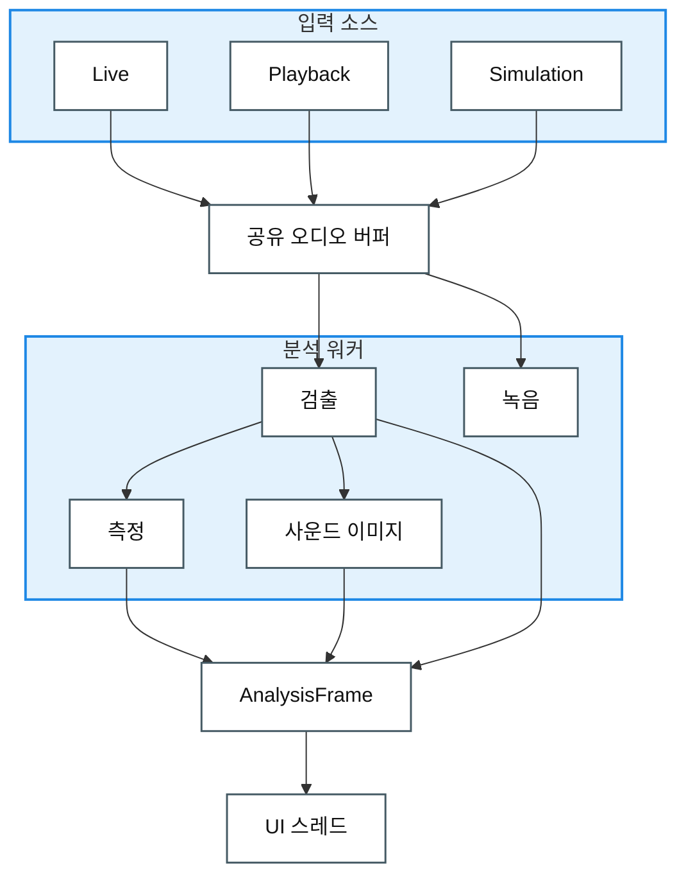

# Architectural Approaches

> 아직 구현 전 단계로, 어떤 구조를 왜 그렇게 만들지에 대한 설계 방향이다.

**목차** — [한 장으로 보는 아키텍처](#한-장으로-보는-아키텍처) · [적용할 소프트웨어 아키텍처 택틱](#적용할-소프트웨어-아키텍처-택틱) · [적용할 소프트웨어 디자인 패턴](#적용할-소프트웨어-디자인-패턴)

## 한 장으로 보는 아키텍처

**입력 → 공유 버퍼 → 분석(워커 스레드) → 결과 한 묶음(AnalysisFrame) → 화면(UI 스레드)**

### 런타임 데이터 흐름 뷰 (Runtime Data Flow View)

**요소**는 실행 중 동작하는 처리 요소와 데이터 산출물이다. **관계**는 입력에서 화면까지 이어지는 단방향 데이터 흐름이다.

**범례**

| 기호 | 의미 |
|---|---|
| 상자 | 런타임 요소 또는 데이터 산출물 |
| 그룹 상자 | 목적별로 묶은 관련 런타임 요소 |
| 화살표 | 단방향 데이터 흐름 |

- **소리가 들어와 숫자로 나가는 한 방향 흐름** — 그래서 파이프라인이 가장 자연스럽다.
- **무거운 분석은 워커 스레드, UI는 그리기만** → 측정 중에도 화면이 멈추지 않는다. (성능)
- **모든 값은 한 번만 계산해 한 묶음으로 전달** → 화면마다 값이 어긋나지 않는다. (일관성)
- **잡음이 있어도 신호가 충분하면 측정을 유지하고, 임계 미만이면 "신호 약함"을 표시하고 적절히 처리한다** → 틀린 숫자가 화면에 나오지 않는다. (신뢰성)

> **왜 이렇게?** 레거시 코드는 입력·분석·그리기를 한 덩어리에 몰아넣어, 빠른 응답(0.5초)과 기능 추가를 감당하기 어렵다. 그래서 목적별로 분리했다.

## 적용할 소프트웨어 아키텍처 택틱

품질 목표마다 참고 구현에서 확인된 핵심 SAP 택틱과 적용 목적을 연결했다.

| QAS | 품질 목표 | 택틱 | 목적 |
|:---:|-----------|------|------|
| [QAS-1](./Milestone1_2-Architectural-Drivers.md#qas-1) | 성능 (Performance) | introduce concurrency limit event response schedule resources reduce overhead | 입력·분석·렌더링을 분리하고 최신 프레임/활성 화면만 무겁게 처리해 UI 정지 없이 0.5초 p99 목표를 지킨다. |
| [QAS-2](./Milestone1_2-Architectural-Drivers.md#qas-2) | 신뢰성 (Reliability) | degradation exception handling / detection | 잡음·약신호나 입력 오류 상황에서 틀린 수치를 내지 않고, "신호 약함" 또는 실패 상태로 격리해 신뢰 가능한 결과만 표시한다. |
| [QAS-3](./Milestone1_2-Architectural-Drivers.md#qas-3)| 일관성 (Consistency) | maintain multiple copies of data | 분석 결과를 `AnalysisFrame` 같은 한 묶음의 스냅샷으로 전달해 여러 화면이 같은 계산 결과를 읽게 한다. |
| [QAS-4](./Milestone1_2-Architectural-Drivers.md#qas-4)| 변경 용이성 (Modifiability) | restrict dependencies encapsulate use an intermediary increase semantic coherence | Core·Platform·UI 책임을 분리하고 인터페이스 뒤에 구현을 숨겨 새 입력·필터·그래프를 국소 변경으로 추가한다. |
| [QAS-5](./Milestone1_2-Architectural-Drivers.md#qas-5)| 사용성 (Usability) | pause/resume | 측정 중에도 사용자가 터치로 멈춤·재개를 예측 가능하게 수행하고, 정지 요청에는 빠르게 반응하게 한다. |

## 적용할 소프트웨어 디자인 패턴

| 패턴 | 적용 위치 | 목적 |
|------|-----------|------|
| Strategy | 입력 소스 · 필터 단계 | 마이크/재생/Sim과 각 필터를 하나의 인터페이스 뒤에 꽂아 교체 가능하게 |
| Adapter | 플랫폼 오디오 | Windows(WASAPI)와 RPi(ALSA)를 하나의 캡처 인터페이스로 통일 |
| State | 세션 제어 | Idle → Measuring ⇄ Paused 전이를 상태 객체로 (흩어진 플래그 제거) |
| Observer | 시그널/슬롯 (예: Qt) | 생산자는 소비자를 모르고, 화면이 결과 프레임을 구독 |
| Facade | C 검출 코어 래퍼 | 복잡한 C 검출 코어를 깔끔한 호출 하나 뒤에 숨김 |
| Producer–Consumer | 입력 ↔ 분석 (공유 버퍼) | 입력은 버퍼에 쓰고 분석은 읽어, 서로의 속도에 묶이지 않게 분리 |
| Pipe-and-Filter | 전체 흐름 | 입력 → 분석 → 렌더링을 단방향 단계로 연결 |
