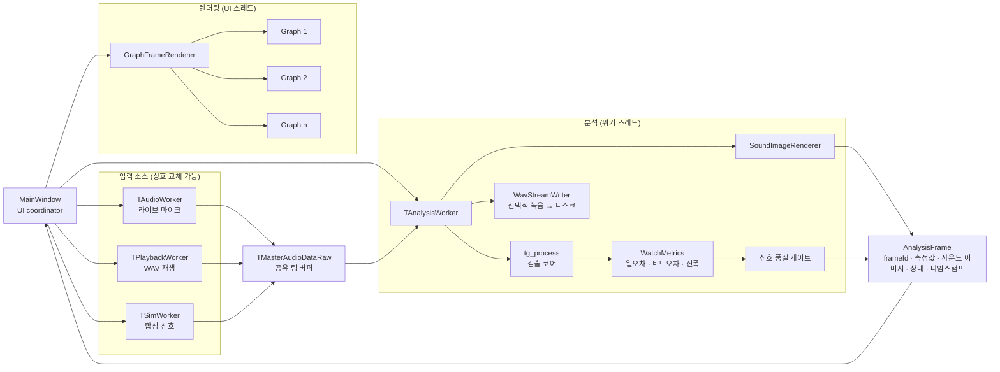

# Architectural Approaches

> 아직 구현 전 단계로, 어떤 구조를 왜 그렇게 만들지에 대한 설계 방향이다.

## 한 장으로 보는 아키텍처

**입력 → 공유 버퍼 → 분석(워커 스레드) → 결과 한 묶음(AnalysisFrame) → 화면(UI 스레드)**

- **소리가 들어와 숫자로 나가는 한 방향 흐름** — 그래서 파이프라인이 가장 자연스럽다.
- **무거운 분석은 워커 스레드, UI는 그리기만** → 측정 중에도 화면이 멈추지 않는다. (성능)
- **모든 값은 한 번만 계산해 한 묶음으로 전달** → 화면마다 값이 어긋나지 않는다. (일관성)
- **신호가 약하면 그 묶음이 "신호 약함" 상태를 싣는다** → 틀린 숫자가 화면에 나오지 않는다. (가용성)

> **왜 이렇게?** 레거시 코드는 입력·분석·그리기를 한 덩어리에 몰아넣어, 빠른 응답(0.5초)과 기능 추가를 감당하기 어렵다. 그래서 역할별로 분리했다.

## 적용할 소프트웨어 아키텍처 택틱

품질 목표마다 그것을 떠받치는 택틱을 하나씩 고정했다.

| 품질 목표 | 택틱 | 한 줄 설명 |
|-----------|------|-----------|
| 성능 (Performance) | 동시성 도입 · 큐/버퍼 크기 제한 · 이벤트 응답 제한 | 분석을 워커 스레드로 분리하고, 버퍼를 유한하게 두며, 밀리면 오래된 프레임은 건너뛰고 최신 것만 그린다 |
| 가용성 (Availability) | 우아한 성능 저하 (graceful degradation) | 화면 앞에 품질 게이트 — 신호가 약하면 틀린 숫자 대신 "신호 약함"을 표시한다 |
| 변경 용이성 (Modifiability) | 응집도 증가 · 캡슐화 · 의존성 제한 | 확장 지점을 고정해, 기능 추가가 기존 코드로 번지지 않게 한다 |
| 이식성·검증 (Portability) | 데이터 소스 추상화 · 바인딩 시점 지연 | 입력 3종을 같은 형식으로 통일해 갈아 끼우고, 플랫폼 의존 코드는 한 곳에 모은다 |

## 적용할 소프트웨어 디자인 패턴

| 패턴 | 적용 위치 | 역할 |
|------|-----------|------|
| Strategy | 입력 소스 · 필터 단계 | 마이크/재생/Sim과 각 필터를 하나의 인터페이스 뒤에 꽂아 교체 가능하게 |
| Adapter | 플랫폼 오디오 | Windows(WASAPI)와 RPi(ALSA)를 하나의 캡처 인터페이스로 통일 |
| State | 세션 제어 | Idle → Measuring ⇄ Paused 전이를 상태 객체로 (흩어진 플래그 제거) |
| Observer | Qt 시그널/슬롯 | 생산자는 소비자를 모르고, 화면이 결과 프레임을 구독 |
| Facade | C 검출 코어 래퍼 | 복잡한 C 검출 코어를 깔끔한 호출 하나 뒤에 숨김 |
| Producer–Consumer | 입력 ↔ 분석 (공유 버퍼) | 입력은 버퍼에 쓰고 분석은 읽어, 서로의 속도에 묶이지 않게 분리 |
| Pipe-and-Filter | 전체 흐름 | 입력 → 분석 → 렌더링을 단방향 단계로 연결 |
