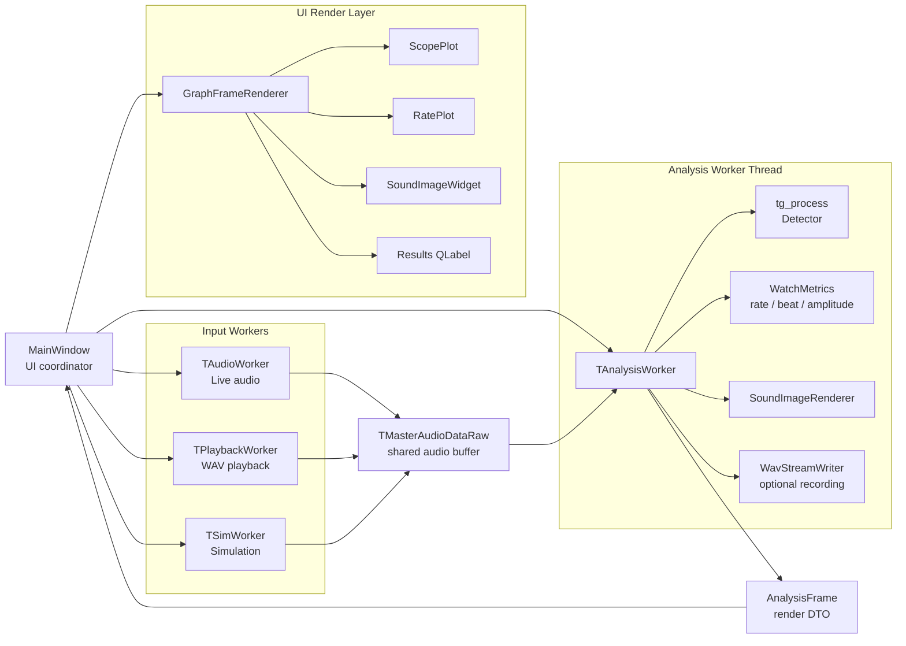
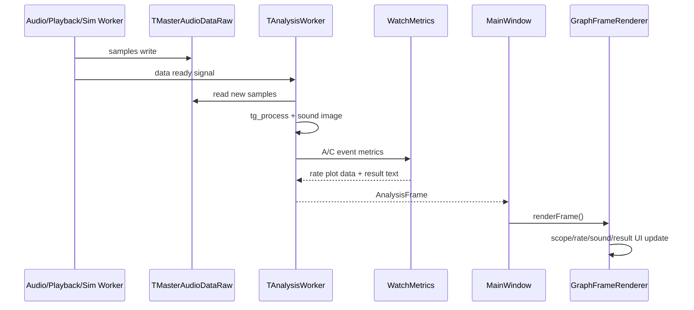

# TimeGrapher Architecture

이 문서는 리팩터링 이후 TimeGrapher의 주요 실행 구조와 책임 분리를 설명한다.
핵심 목표는 `MainWindow`가 분석 연산과 그래프 세부 처리를 직접 수행하지 않고,
각 책임을 별도 컴포넌트에 위임하도록 만드는 것이다.

## Component Structure

`MainWindow`는 전체 실행 흐름을 조정하는 UI coordinator 역할만 맡는다.
입력 소스 시작/중지, 모드 전환, UI enable/disable 같은 화면 수준의 제어는
`MainWindow`에 남아 있지만, 샘플 분석과 그래프 데이터 계산은 직접 수행하지 않는다.

`TAudioWorker`, `TPlaybackWorker`, `TSimWorker`는 입력 소스별 샘플 공급 책임을 가진다.
세 입력 소스는 공통으로 `TMasterAudioDataRaw` 공유 버퍼에 샘플을 기록한다.

`TAnalysisWorker`는 공유 버퍼에서 새 샘플을 읽고 `tg_process`를 실행한다.
또한 detector 결과를 바탕으로 sound image 처리, optional WAV recording,
render DTO 생성을 수행한다.

`WatchMetrics`는 rate error, beat error, amplitude 계산을 담당한다.
이 계산은 그래프마다 중복 수행되지 않고 하나의 metric component에서 수행된 뒤
`AnalysisFrame`에 담겨 UI render layer로 전달된다.

`GraphFrameRenderer`는 `AnalysisFrame`을 받아 QCustomPlot, sound image, result label에 반영한다.
그래프 생성, marker 생성, history purge 같은 QCustomPlot 세부 작업은 이 클래스에 격리된다.

## Runtime Sequence

샘플 입력은 입력 worker에서 시작된다. 입력 worker는 공유 버퍼에 샘플을 기록하고,
data-ready signal을 analysis worker로 보낸다.

analysis worker는 새 샘플을 읽어 detector와 metric 계산을 수행한다.
이 단계에서 생성된 그래프 데이터, marker 정보, sound image, 결과 문자열은
`AnalysisFrame`으로 묶인다.

UI 스레드의 `MainWindow`는 `AnalysisFrame`을 수신한 뒤 `GraphFrameRenderer`에 전달한다.
따라서 UI 스레드에는 도메인 분석 루프가 남지 않고, 화면 반영 책임만 남는다.

## Architectural Rationale

이 구조는 다음 소프트웨어 아키텍처 원칙에 근거한다.

- Separation of Concerns: 입력, 분석, 지표 계산, 렌더링 책임을 분리한다.
- Single Responsibility Principle: `MainWindow`가 모든 계산과 렌더링 세부를 갖는 god class가 되지 않도록 한다.
- Presentation Model: analysis worker가 UI에 필요한 `AnalysisFrame` DTO를 만들고, renderer는 이를 화면에 반영한다.
- UI Thread Responsiveness: detector 처리와 metric 계산을 UI event loop에서 분리해 GUI 응답성을 보존한다.

## Current Responsibility Map

| Component | Responsibility |
| --- | --- |
| `MainWindow` | 모드 선택, 시작/중지, worker wiring, 상태바 갱신 |
| `TAudioWorker` | live audio capture |
| `TPlaybackWorker` | WAV playback sample supply |
| `TSimWorker` | synthetic sample supply |
| `TAnalysisWorker` | sample consumption, detector execution, sound image processing, frame DTO creation |
| `WatchMetrics` | rate error, beat error, amplitude calculation |
| `GraphFrameRenderer` | graph setup, marker rendering, history purge, result/sound image rendering |
| `TMasterAudioDataRaw` | input worker와 analysis worker 사이의 shared audio buffer |

