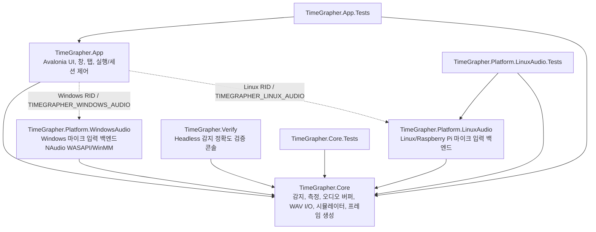
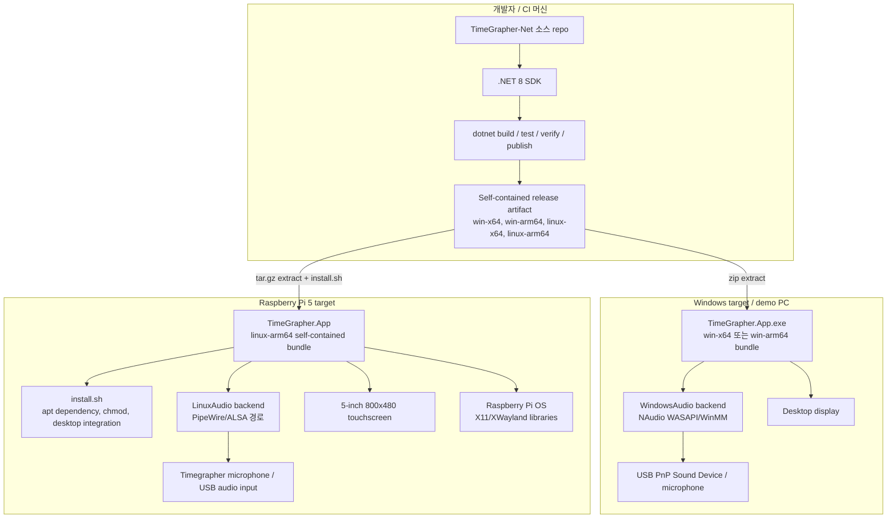

# Milestone 2 아키텍처 뷰

소스코드 기준 위치: `D:\swa\TimeGrapher-Net`  
문서 작성 위치: `D:\swa\TimeGrapher-Reference\Milestone2`  
범위: C# / Avalonia / .NET 8 기반 TimeGrapher-Net의 Milestone 2 아키텍처 설명

이 문서는 기존 Qt/C++ baseline이 아니라, 현재 구현된 C# 프로젝트인 `TimeGrapher-Net`의 아키텍처를 기준으로 작성했다.

## 1. 모듈 뷰

모듈 뷰는 코드 단위의 구성과 컴파일 타임 의존성을 보여준다. 핵심 설계 결정은 `TimeGrapher.Core`를 UI와 운영체제에 의존하지 않는 분석 엔진으로 분리하고, `TimeGrapher.App`이 Avalonia UI와 플랫폼별 오디오 백엔드를 연결한다는 점이다.

### 모듈별 책임

| 모듈 | 책임 | 주요 의존성 |
|---|---|---|
| `TimeGrapher.App` | Avalonia 데스크톱 앱, 실행 제어, 탭 렌더링, 녹음 흐름, 플랫폼 오디오 선택 | `TimeGrapher.Core`, Avalonia, ScottPlot, 선택된 플랫폼 오디오 프로젝트 |
| `TimeGrapher.Core` | UI/OS 독립 분석 엔진: ring buffer, 입력 contract, detector, metrics, sound image, playback/simulation worker, WAV I/O | .NET 기본 라이브러리 |
| `TimeGrapher.Platform.WindowsAudio` | Windows live audio capture와 입력 장치/볼륨 설정 | `TimeGrapher.Core`, NAudio |
| `TimeGrapher.Platform.LinuxAudio` | Linux/Raspberry Pi live audio capture adapter | `TimeGrapher.Core` |
| `TimeGrapher.Verify` | 생성 신호와 WAV fixture 기반 headless 검증 | `TimeGrapher.Core` |

### 코드 근거

- `src/TimeGrapher.App/TimeGrapher.App.csproj`는 `TimeGrapher.Core`를 참조하고, Runtime Identifier 조건에 따라 `WindowsAudio` 또는 `LinuxAudio`를 참조한다.
- `src/TimeGrapher.Core/TimeGrapher.Core.csproj`는 다른 프로젝트를 참조하지 않는다.
- `src/TimeGrapher.Verify/TimeGrapher.Verify.csproj`는 `TimeGrapher.Core`만 참조한다.
- `src/TimeGrapher.App/Audio/LiveAudioBackend.cs`는 Windows에서는 `AudioCaptureWorker`, Linux에서는 `LinuxLiveAudioWorker`를 선택한다.

## 2. Runtime / C&C 뷰

Runtime / C&C 뷰는 측정 실행 중의 컴포넌트와 커넥터를 보여준다. Live, Playback, Simulation 모드는 서로 다른 입력 worker를 사용하지만, 이후 분석 파이프라인은 동일하다. 입력 worker는 `MasterAudioBuffer`에 sample block을 쓰고 `DataReady` 이벤트를 발생시키며, `AnalysisWorker`는 buffer의 sample을 읽어 `AnalysisFrame`을 만든다. UI는 frame을 coalescing한 뒤 활성 tab renderer에 전달한다.

```mermaid
flowchart LR
    User["사용자"] --> UI["MainWindow / ViewModel\nStart, Stop, Pause, 모드 선택"]
    UI --> RunCmd["RunCommandService\n모드별 start/stop 처리"]
    RunCmd --> Session["RunSessionController\nrun token, worker 생명주기 관리"]

    subgraph Inputs["입력 Worker"]
        Live["LiveAudioWorker\nWindowsAudio 또는 LinuxAudio"]
        Playback["PlaybackWorker\nWAV 파일 입력"]
        Sim["SimWorker\n합성 시계 신호"]
    end

    Session --> Live
    Session --> Playback
    Session --> Sim

    Live -- "float sample block" --> Buffer["MasterAudioBuffer\n공유 ring buffer"]
    Playback -- "float sample block" --> Buffer
    Sim -- "float sample block" --> Buffer

    Live -- "DataReady 이벤트" --> Session
    Playback -- "DataReady 이벤트" --> Session
    Sim -- "DataReady 이벤트" --> Session
    Session -- "NotifyDataReady" --> Worker["AnalysisWorker\n전용 분석 thread"]

    Buffer -- "CopyAnalysisSamples" --> Worker

    subgraph CorePipeline["Core 분석 파이프라인"]
        Detector["DetectorMetricsEngine\nBPH sync, rate, amplitude, beat error"]
        ScopeProjector["ScopeRateFrameProjector\nrate/scope 데이터"]
        SoundProjector["SoundPrintFrameProjector\nsound image 데이터"]
    end

    Worker --> Detector
    Worker --> ScopeProjector
    Worker --> SoundProjector
    Detector --> Frame["AnalysisFrame"]
    ScopeProjector --> Frame
    SoundProjector --> Frame

    Frame -- "AnalysisFrameReady" --> Scheduler["AnalysisFrameRenderScheduler\nUI dispatch, frame coalescing, refresh interval 제어"]
    Scheduler --> Handler["MainWindow.HandleAnalysisFrame"]
    Handler --> Results["GraphFrameRenderer.UpdateResults\n상단 측정값 갱신"]
    Handler --> Router["AnalysisFrameRouter"]
    Router --> RateScope["RateScopeFrameConsumer / RateScopeRenderer"]
    Router --> SoundPrint["SoundPrintFrameConsumer / SoundPrintRenderer"]
    Router --> InfoTabs["Placeholder / info tab consumer"]
    RateScope --> Display["Avalonia + ScottPlot 화면 표시"]
    SoundPrint --> Display
    InfoTabs --> Display

    Recorder["QueuedRecordingWriter\n선택적 WAV 녹음"]
    Worker -. "ISampleWriter" .-> Recorder
```

### Runtime 커넥터

| 커넥터 | 출발 | 도착 | Runtime 의미 |
|---|---|---|---|
| 실행 명령 | `MainWindowViewModel` / UI | `RunCommandService` | 사용자가 run lifecycle을 제어한다. |
| Worker 생명주기 | `RunCommandService` | `RunSessionController` | 입력 worker와 분석 worker를 생성/중지한다. |
| Sample stream | Live/Playback/Sim worker | `MasterAudioBuffer` | 정규화된 float sample block을 ring buffer에 기록한다. |
| Data-ready 이벤트 | 입력 worker | `RunSessionController` | 새 sample이 도착했음을 알린다. |
| 분석 wakeup | `RunSessionController` | `AnalysisWorker.NotifyDataReady()` | 분석 thread를 깨운다. |
| Frame 이벤트 | `AnalysisWorker` | `AnalysisFrameRenderScheduler` | 계산된 측정값과 그래프 데이터를 전달한다. |
| UI dispatch | `AnalysisFrameRenderScheduler` | `MainWindow.HandleAnalysisFrame` | UI thread에서 렌더링되도록 frame을 전달하고 오래된 frame을 병합/드롭한다. |
| 탭 라우팅 | `AnalysisFrameRouter` | 활성 `IAnalysisFrameConsumer` | 활성 탭을 렌더링하고 모든 consumer가 frame을 관찰하게 한다. |

### 코드 근거

- `RunCommandService`는 `Live`, `Playback`, `Simulation` 모드별 start/stop 경로를 분기한다.
- `MainWindow.RunLifecycle.cs`는 `AudioCaptureWorker`/`LinuxLiveAudioWorker`, `PlaybackWorker`, `SimWorker`를 생성한다.
- `RunSessionController`는 입력 worker의 `DataReady` handler를 붙이고 `AnalysisWorker.NotifyDataReady()`를 호출한다.
- `AnalysisWorker`는 `MasterAudioBuffer`를 읽고 detector/projector를 실행한 뒤 `AnalysisFrameReady` 이벤트를 발생시킨다.
- `AnalysisFrameRenderScheduler`는 frame을 UI thread로 넘기며, refresh interval에 맞게 frame을 병합하거나 drop한다.
- `AnalysisFrameRouter`는 frame을 활성 탭 renderer로 전달한다.

## 3. Deployment 뷰

Deployment 뷰는 target deployment topology와 artifact allocation을 보여준다. 동일한 소스 solution이 Windows와 Raspberry Pi/Linux용 self-contained bundle을 생성한다. 개발/CI 머신은 build, test, verify, publish를 수행하고, target 장치는 publish된 `TimeGrapher.App`과 플랫폼별 live audio backend를 실행한다.

### Deployment node

| Node | 배치되는 artifact / 책임 |
|---|---|
| 개발자 / CI 머신 | 소스코드와 .NET 8 SDK를 보유하고 build/test/verify/publish를 수행한다. |
| Windows target | `TimeGrapher.App.exe` bundle과 `TimeGrapher.Platform.WindowsAudio`를 실행해 live capture를 수행한다. |
| Raspberry Pi 5 target | `TimeGrapher.App` linux-arm64 self-contained bundle과 `TimeGrapher.Platform.LinuxAudio`를 실행한다. |
| Audio input device | 기계식 시계 tick audio를 선택된 live backend에 공급한다. |
| Display / touchscreen | Avalonia UI, graph, sound print, control을 표시한다. |

### 코드 및 README 근거

- `TimeGrapher.App.csproj`는 `RuntimeIdentifiers`로 `win-x64`, `win-arm64`, `linux-x64`, `linux-arm64`를 선언한다.
- README는 Windows release zip을 풀고 `TimeGrapher.App.exe`를 실행하는 절차를 설명한다.
- README는 Raspberry Pi용 `linux-arm64` publish, release tarball 추출, `install.sh` 실행 절차를 설명한다.
- `LiveAudioBackend.cs`는 실행 OS에 따라 플랫폼별 live audio 구현을 선택한다.

## Milestone 2 제출 관점 정리

- 공식 요구사항의 Module View는 1장에서 충족한다.
- 공식 요구사항의 Runtime/C&C View는 2장에서 충족한다.
- 공식 요구사항의 Deployment View는 3장에서 충족한다.
- 이 architecture의 핵심 tradeoff는 UI/OS 독립적인 Core와 얇은 플랫폼 audio adapter를 분리한 것이다. 이 구조는 portability와 testability를 높이는 대신, 실시간 성능 리스크가 UI rendering boundary와 live audio boundary에 집중된다.
