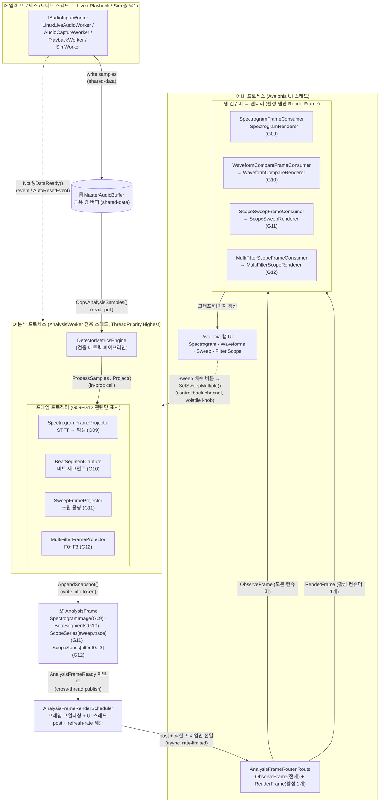

# Component-and-Connector View — G09 · G10 · G11 · G12

이 문서는 음향 신호 시각화 디스플레이 4종(G09 스펙트로그램 · G10 파형 비교 · G11 스코프 스윕 · G12 다중 필터 스코프)을 **C&C(Component-and-Connector, 런타임) 관점**으로 그린 것이다. 모듈(코드 단위)이 아니라 **실행 시점의 컴포넌트(동시 실행 단위·데이터 저장소)와 그들 사이의 커넥터(상호작용 메커니즘)**를 보여준다.

네 디스플레이는 동일한 **단일 분석 파이프라인**을 공유한다 — 오디오 입력 → 공유 버퍼 → 분석 스레드(검출 + 프로젝터들) → `AnalysisFrame` 1개 발행 → 렌더 스케줄러(코얼레싱·UI 마샬링) → 활성 탭 컨슈머/렌더러. 따라서 G09~G12는 "분기되는 4개의 프로젝터/컨슈머 쌍"으로만 갈라진다.

## C&C 다이어그램

> 범례: `⟳` = 동시 실행 단위(스레드/프로세스), `🗄` = 공유 데이터 저장소, `📦` = 스레드 간 전달되는 데이터 토큰, 실선 = 데이터/호출 커넥터, 점선 = 이벤트/제어 커넥터.

## 컴포넌트 카탈로그

| 컴포넌트 | 타입 | 역할 | 근거 파일 |
|---|---|---|---|
| 입력 워커 | 동시 실행 단위 | Live/Playback/Sim 중 하나로 오디오 샘플을 공유 버퍼에 기록 | [src/TimeGrapher.Core/Shared/IAudioInputWorker.cs](../../../../TimeGrapher-Net/src/TimeGrapher.Core/Shared/IAudioInputWorker.cs), [src/TimeGrapher.Core/AudioIo/PlaybackWorker.cs](../../../../TimeGrapher-Net/src/TimeGrapher.Core/AudioIo/PlaybackWorker.cs), [src/TimeGrapher.Core/Sim/SimWorker.cs](../../../../TimeGrapher-Net/src/TimeGrapher.Core/Sim/SimWorker.cs) |
| MasterAudioBuffer | 공유 데이터 저장소 | 입력↔분석을 분리하는 링 버퍼(repository). 캡처 타임스탬프 링 포함 | [src/TimeGrapher.Core/Shared/MasterAudioBuffer.cs](../../../../TimeGrapher-Net/src/TimeGrapher.Core/Shared/MasterAudioBuffer.cs) |
| AnalysisWorker | 동시 실행 단위 | 전용 스레드에서 검출·프로젝터를 구동, 패스당 `AnalysisFrame` 1개 발행 | [src/TimeGrapher.Core/Analysis/AnalysisWorker.cs](../../../../TimeGrapher-Net/src/TimeGrapher.Core/Analysis/AnalysisWorker.cs) |
| DetectorMetricsEngine | 처리 컴포넌트(filter) | 비트 검출·동기화·메트릭 산출 → 프로젝터 입력 제공 | [src/TimeGrapher.Core/Analysis/DetectorMetricsEngine.cs](../../../../TimeGrapher-Net/src/TimeGrapher.Core/Analysis/DetectorMetricsEngine.cs) |
| **SpectrogramFrameProjector** (G09) | 처리 컴포넌트 | 원본 블록에 STFT를 적용해 시간-주파수 픽셀 컬럼 생성 | [src/TimeGrapher.Core/Analysis/SpectrogramFrameProjector.cs](../../../../TimeGrapher-Net/src/TimeGrapher.Core/Analysis/SpectrogramFrameProjector.cs) |
| **BeatSegmentCapture** (G10) | 처리 컴포넌트 | 비트별 엔벨로프 세그먼트를 링 버퍼로 적재(파형 비교·비트노이즈 공용) | [src/TimeGrapher.Core/Analysis/BeatSegmentCapture.cs](../../../../TimeGrapher-Net/src/TimeGrapher.Core/Analysis/BeatSegmentCapture.cs) |
| **SweepFrameProjector** (G11) | 처리 컴포넌트 | 정류 신호를 고정 스윕 윈도우로 폴딩(`sweep.trace` 시리즈) | [src/TimeGrapher.Core/Analysis/SweepFrameProjector.cs](../../../../TimeGrapher-Net/src/TimeGrapher.Core/Analysis/SweepFrameProjector.cs) |
| **MultiFilterFrameProjector** (G12) | 처리 컴포넌트 | F0~F3 필터 시리즈 생성(공유 시간축) | [src/TimeGrapher.Core/Analysis/MultiFilterFrameProjector.cs](../../../../TimeGrapher-Net/src/TimeGrapher.Core/Analysis/MultiFilterFrameProjector.cs), [src/TimeGrapher.Core/Detection/ScopeFilters.cs](../../../../TimeGrapher-Net/src/TimeGrapher.Core/Detection/ScopeFilters.cs) |
| AnalysisFrame | 데이터 토큰 | 한 패스의 결과(이미지·시리즈·스냅샷·진단)를 담아 UI로 전달 | [src/TimeGrapher.Core/Shared/AnalysisFrame.cs](../../../../TimeGrapher-Net/src/TimeGrapher.Core/Shared/AnalysisFrame.cs) |
| AnalysisFrameRenderScheduler | 커넥터 컴포넌트 | 분석→UI 스레드 마샬링, 프레임 코얼레싱, 화면 갱신율 제한 | [src/TimeGrapher.App/Services/AnalysisFrameRenderScheduler.cs](../../../../TimeGrapher-Net/src/TimeGrapher.App/Services/AnalysisFrameRenderScheduler.cs) |
| AnalysisFrameRouter | 커넥터 컴포넌트 | 전체 컨슈머 `ObserveFrame` + 활성 탭만 `RenderFrame` 라우팅 | [src/TimeGrapher.App/Tabs/AnalysisFrameRouter.cs](../../../../TimeGrapher-Net/src/TimeGrapher.App/Tabs/AnalysisFrameRouter.cs) |
| **각 FrameConsumer + Renderer** (G09~G12) | 처리/표현 컴포넌트 | 프레임 데이터를 받아 탭 그래프/이미지로 표현 | [src/TimeGrapher.App/Rendering/SpectrogramRenderer.cs](../../../../TimeGrapher-Net/src/TimeGrapher.App/Rendering/SpectrogramRenderer.cs), [WaveformCompareRenderer.cs](../../../../TimeGrapher-Net/src/TimeGrapher.App/Rendering/WaveformCompareRenderer.cs), [ScopeSweepRenderer.cs](../../../../TimeGrapher-Net/src/TimeGrapher.App/Rendering/ScopeSweepRenderer.cs), [MultiFilterScopeRenderer.cs](../../../../TimeGrapher-Net/src/TimeGrapher.App/Rendering/MultiFilterScopeRenderer.cs) |

## 커넥터 카탈로그

| 커넥터 | 종류 | 양단 | 설명 |
|---|---|---|---|
| 샘플 기록 | shared-data | 입력 워커 → MasterAudioBuffer | 입력과 분석을 시간적으로 분리(생산자-소비자) |
| `NotifyDataReady()` | event / signal | 입력 → AnalysisWorker | `AutoResetEvent`로 분석 스레드 1회 wake-up |
| `CopyAnalysisSamples()` | read (pull) | AnalysisWorker → MasterAudioBuffer | 분석 스레드가 새 블록을 당겨감 |
| `ProcessSamples` / `Project` | in-proc call | Engine → 프로젝터 | 같은 스레드 내 직접 호출(파이프-앤-필터) |
| `AppendSnapshot()` | write-into-token | 프로젝터 → AnalysisFrame | 각 프로젝터가 자기 결과를 프레임에 채움 |
| `AnalysisFrameReady` | event (cross-thread) | AnalysisWorker → RenderScheduler | 분석 스레드에서 프레임 발행 |
| post + coalesce | async, rate-limited | RenderScheduler → UI 스레드 | 밀린 프레임은 **최신 1개만** 렌더(드롭 카운트 유지) |
| `ObserveFrame` | call (fan-out 전체) | Router → 모든 컨슈머 | 모든 탭이 "마지막 프레임"을 보유(탭 전환·일시정지 재그리기 대비) |
| `RenderFrame` | call (활성 1개) | Router → 활성 컨슈머 | **활성 탭만** 실제 렌더(자원 스케줄링 전술) |
| `SetSweepMultiple()` 등 | control back-channel | UI → AnalysisWorker | volatile knob에 저장 후 다음 패스 시작 시 적용(G11 1x/2x/4x) |

## 기능별 런타임 데이터 경로

- **G09 스펙트로그램** — `SpectrogramFrameProjector`가 원본 블록의 STFT 컬럼을 픽셀 버퍼에 적재 → `AnalysisFrame.SpectrogramImage`(+`SpectrogramImageUpdated`) → `SpectrogramFrameConsumer` → `SpectrogramRenderer`. (이미지형 페이로드: 코얼레싱 시 `SpectrogramImageUpdated` 신호가 보존된다.)
- **G10 파형 비교** — `BeatSegmentCapture`가 비트별 엔벨로프 세그먼트 링을 구성 → `AnalysisFrame.BeatSegments`(`BeatSegmentsSnapshot`) → `WaveformCompareFrameConsumer` → `WaveformCompareRenderer`가 정렬 레인·가이드로 표현. (비트노이즈 탭과 동일 스냅샷 공유.)
- **G11 스코프 스윕** — `SweepFrameProjector`가 정류 신호를 고정 윈도우로 폴딩 → `AnalysisFrame.ScopeSeries`의 `sweep.trace` 시리즈 → `ScopeSweepFrameConsumer` → `ScopeSweepRenderer`. 윈도우 길이는 UI의 `SetSweepMultiple` 제어 채널로 조정.
- **G12 다중 필터** — `MultiFilterFrameProjector`가 동일 시간축에서 `filter.f0`~`filter.f3` 시리즈 생성 → `AnalysisFrame.ScopeSeries` → `MultiFilterScopeFrameConsumer` → `MultiFilterScopeRenderer`가 4개 레인 동시 표시.

## 이 뷰가 드러내는 런타임 전술

| 전술 | C&C 상 표현 | 품질 속성 |
|---|---|---|
| **자원 스케줄링** | `ObserveFrame`(전체)와 `RenderFrame`(활성 1개) 분리 — 보이지 않는 탭은 렌더 비용 미지출 | 성능 / 실시간성 |
| **프레임 코얼레싱** | RenderScheduler가 밀린 프레임을 최신 1개로 합치고 갱신율 제한, 일회성 신호(overrun·이미지 갱신)는 머지로 보존 | 성능 / 정확성 |
| **단계적 성능 저하(graceful degradation)** | `AnalysisDeadlineMonitor`가 지연을 감지하면 라이브 프리뷰 중단 → publish 간격 확장 → 디시메이션 강화/세그먼트 일시중단 순으로 강등(G09 스펙트로그램·G11 스윕·G12 필터의 publish 플로어 포함) | 성능 / 가용성 |
| **공유 데이터로 생산자-소비자 분리** | MasterAudioBuffer 링 버퍼가 입력 지터를 흡수, 분석은 pull 방식 | 성능 / 견고성 |
| **단일 스레드 픽셀 소유** | 스펙트로그램·사운드프린트 픽셀 버퍼는 분석 스레드만 기록(테마 recolor도 분석 스레드에서 적용) | 동시성 안전성 |

## 참고

- 데이터 토큰 상세: [요구사항 발췌](요구사항_발췌_G09_G10_G11_G12.md) · [요구사항 체크리스트](G09_G10_G11_G12_REQUIREMENTS_CHECKLIST.md)
- 관련 아키텍처 뷰: [docs/MVC_VIEW.md](../../../../TimeGrapher-Net/docs/MVC_VIEW.md), [docs/MODULE_USES_VIEW.md](../../../../TimeGrapher-Net/docs/MODULE_USES_VIEW.md), [docs/LAYERED_VIEW.md](../../../../TimeGrapher-Net/docs/LAYERED_VIEW.md)

> 본 뷰는 G09~G12에 한정한 런타임 뷰다. 프로젝트 공식 런타임/C&C 뷰로 승격하려면 `docs/`로 이동하고 전체 탭(Rate/Scope·Sound Print·Trace·Vario·Beat Error·Long-Term·Positions·Beat Noise·Escapement 등)을 포함해 확장하면 된다.
