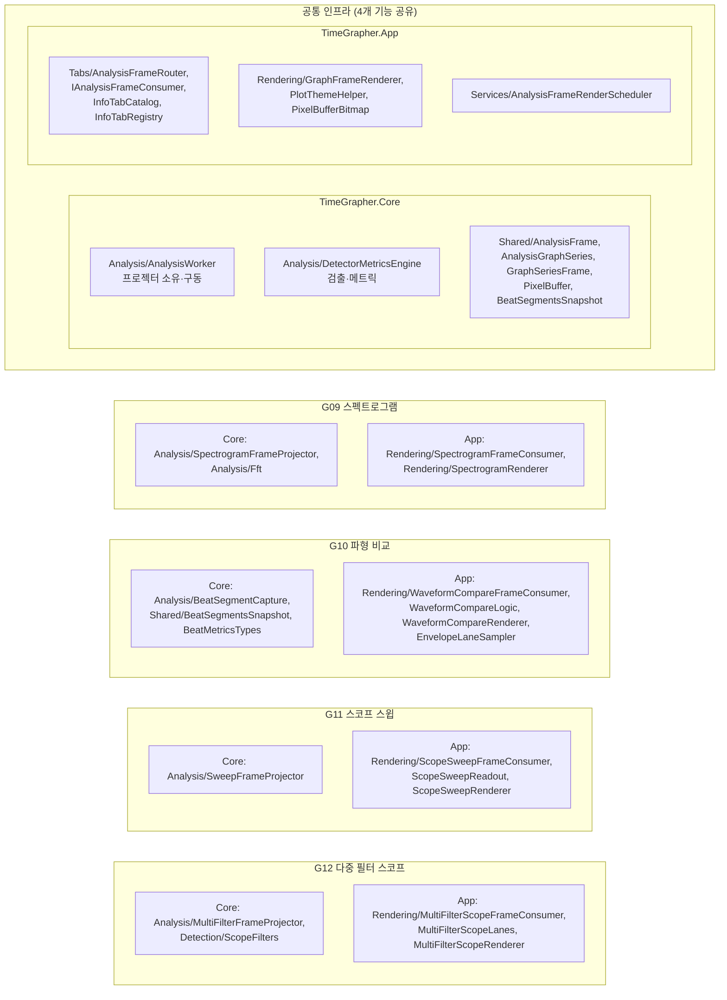
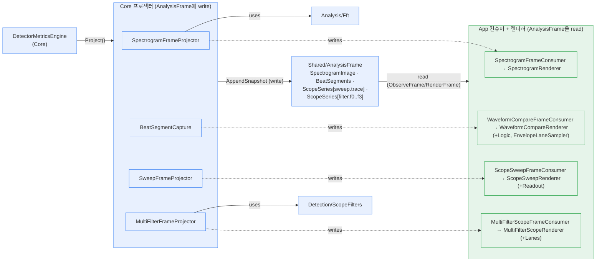

# Module View — G09 · G10 · G11 · G12

이 문서는 음향 시각화 디스플레이 4종(G09 스펙트로그램 · G10 파형 비교 · G11 스코프 스윕 · G12 다중 필터)을 **모듈(코드 단위) 관점**으로 보여준다. [CnCView.md](CnCView.md)가 런타임 컴포넌트·커넥터를 다룬다면, 본 문서는 **정적 코드 구조**를 다룬다 — 어떤 소스 모듈이 각 기능을 구현하며(분해, decomposition), 모듈 간 의존(사용, uses) 방향이 어떻게 흐르는가.

네 기능은 모두 동일한 **3단 구조**로 분해된다: ① `TimeGrapher.Core`의 **프레임 프로젝터**(신호→데이터 산출), ② `TimeGrapher.Core.Shared`의 **데이터 계약**(`AnalysisFrame` 등), ③ `TimeGrapher.App.Rendering`의 **프레임 컨슈머 + 렌더러**(데이터→화면). 핵심 규칙은 **Core는 App을 절대 의존하지 않는다**는 것이다.

## 1. 분해 다이어그램 (Decomposition)

## 2. 사용 다이어그램 (Uses / 의존 방향)

각 기능의 의존은 한 방향으로만 흐른다: **App 컨슈머/렌더러 → (읽기) `AnalysisFrame` ← (쓰기) Core 프로젝터 → 검출·신호 헬퍼**. App은 Core를 참조하지만 Core는 App을 참조하지 않는다.

> 파란색 = `TimeGrapher.Core`(UI/OS 독립), 초록색 = `TimeGrapher.App`. 점선(writes)은 "프로젝터가 채운 데이터를 해당 컨슈머가 읽는다"는 기능 매핑이며, 실제 의존은 양쪽 모두 `AnalysisFrame`(Core.Shared)을 향한다.

## 3. 모듈 요약

| 기능 | Core 모듈 | App 모듈 | 데이터 계약(Shared) |
|---|---|---|---|
| **G09** 스펙트로그램 | [SpectrogramFrameProjector](../../../../TimeGrapher-Net/src/TimeGrapher.Core/Analysis/SpectrogramFrameProjector.cs), [Fft](../../../../TimeGrapher-Net/src/TimeGrapher.Core/Analysis/Fft.cs) | [SpectrogramFrameConsumer](../../../../TimeGrapher-Net/src/TimeGrapher.App/Rendering/SpectrogramFrameConsumer.cs), [SpectrogramRenderer](../../../../TimeGrapher-Net/src/TimeGrapher.App/Rendering/SpectrogramRenderer.cs) | `AnalysisFrame.SpectrogramImage` (PixelBuffer) |
| **G10** 파형 비교 | [BeatSegmentCapture](../../../../TimeGrapher-Net/src/TimeGrapher.Core/Analysis/BeatSegmentCapture.cs) | [WaveformCompareFrameConsumer](../../../../TimeGrapher-Net/src/TimeGrapher.App/Rendering/WaveformCompareFrameConsumer.cs), [WaveformCompareLogic](../../../../TimeGrapher-Net/src/TimeGrapher.App/Rendering/WaveformCompareLogic.cs), [WaveformCompareRenderer](../../../../TimeGrapher-Net/src/TimeGrapher.App/Rendering/WaveformCompareRenderer.cs), [EnvelopeLaneSampler](../../../../TimeGrapher-Net/src/TimeGrapher.App/Rendering/EnvelopeLaneSampler.cs) | [BeatSegmentsSnapshot](../../../../TimeGrapher-Net/src/TimeGrapher.Core/Shared/BeatSegmentsSnapshot.cs) |
| **G11** 스코프 스윕 | [SweepFrameProjector](../../../../TimeGrapher-Net/src/TimeGrapher.Core/Analysis/SweepFrameProjector.cs) | [ScopeSweepFrameConsumer](../../../../TimeGrapher-Net/src/TimeGrapher.App/Rendering/ScopeSweepFrameConsumer.cs), [ScopeSweepReadout](../../../../TimeGrapher-Net/src/TimeGrapher.App/Rendering/ScopeSweepReadout.cs), [ScopeSweepRenderer](../../../../TimeGrapher-Net/src/TimeGrapher.App/Rendering/ScopeSweepRenderer.cs) | `AnalysisFrame.ScopeSeries["sweep.trace"]` |
| **G12** 다중 필터 | [MultiFilterFrameProjector](../../../../TimeGrapher-Net/src/TimeGrapher.Core/Analysis/MultiFilterFrameProjector.cs), [ScopeFilters](../../../../TimeGrapher-Net/src/TimeGrapher.Core/Detection/ScopeFilters.cs) | [MultiFilterScopeFrameConsumer](../../../../TimeGrapher-Net/src/TimeGrapher.App/Rendering/MultiFilterScopeFrameConsumer.cs), [MultiFilterScopeLanes](../../../../TimeGrapher-Net/src/TimeGrapher.App/Rendering/MultiFilterScopeLanes.cs), [MultiFilterScopeRenderer](../../../../TimeGrapher-Net/src/TimeGrapher.App/Rendering/MultiFilterScopeRenderer.cs) | `AnalysisFrame.ScopeSeries["filter.f0".."filter.f3"]` |
| **공통** | [AnalysisWorker](../../../../TimeGrapher-Net/src/TimeGrapher.Core/Analysis/AnalysisWorker.cs), [DetectorMetricsEngine](../../../../TimeGrapher-Net/src/TimeGrapher.Core/Analysis/DetectorMetricsEngine.cs), [AnalysisFrame](../../../../TimeGrapher-Net/src/TimeGrapher.Core/Shared/AnalysisFrame.cs) | [AnalysisFrameRouter](../../../../TimeGrapher-Net/src/TimeGrapher.App/Tabs/AnalysisFrameRouter.cs), [InfoTabRegistry](../../../../TimeGrapher-Net/src/TimeGrapher.App/Tabs/InfoTabRegistry.cs), [GraphFrameRenderer](../../../../TimeGrapher-Net/src/TimeGrapher.App/Rendering/GraphFrameRenderer.cs), [AnalysisFrameRenderScheduler](../../../../TimeGrapher-Net/src/TimeGrapher.App/Services/AnalysisFrameRenderScheduler.cs) | [IAnalysisFrameConsumer](../../../../TimeGrapher-Net/src/TimeGrapher.App/Tabs/IAnalysisFrameConsumer.cs) |

## 4. 모듈 분해 패턴 (네 기능 공통)

각 기능은 동일한 3단 모듈 패턴을 따른다 — 신기능 추가 시 이 패턴을 복제하면 된다(**확장성** 전술).

1. **`*FrameProjector` (Core/Analysis)** — `DetectorMetricsBlockUpdate`/원본 블록을 입력받아 자기 기능의 결과를 산출하고 `AnalysisFrame`에 `AppendSnapshot`. UI·OS 비의존.
2. **데이터 계약 (Core/Shared)** — 산출물은 `AnalysisFrame`의 필드(이미지/시리즈/스냅샷)로만 표현. 프로젝터와 컨슈머의 유일한 접점.
3. **`*FrameConsumer` + `*Renderer` (App/Rendering)** — `IAnalysisFrameConsumer` 구현체가 프레임을 받아 렌더러에 위임. 보조 로직(`*Logic`, `*Lanes`, `*Readout`, `EnvelopeLaneSampler`)은 계산을 분리해 테스트 가능성을 높인다.

## 5. 의존성 규칙 (제약)

| 규칙 | 본 기능에서의 준수 방식 |
|---|---|
| Core는 App/UI/OS를 의존하지 않음 | 프로젝터·`ScopeFilters`·`Fft`는 순수 신호 처리. `AnalysisFrame`/`PixelBuffer`도 Core.Shared의 POCO |
| App은 Core를 의존 (역방향 불가) | 컨슈머·렌더러가 `AnalysisFrame`·스냅샷·시리즈를 읽음. Core는 컨슈머의 존재를 모름 |
| 프로젝터↔컨슈머 직접 의존 금지 | 둘은 오직 `AnalysisFrame` 데이터 계약으로만 결합(간접 결합) → 한쪽 변경이 다른 쪽으로 전파되지 않음 |
| 탭 등록 단일 출처 | `InfoTabCatalog.All` → `InfoTabRegistry.FromCatalog`가 탭당 컨슈머 1개 생성 |

## 참고

- 런타임 관점: [CnCView.md](CnCView.md)
- 요구사항: [요구사항_발췌_G09_G10_G11_G12.md](요구사항_발췌_G09_G10_G11_G12.md) · [체크리스트](G09_G10_G11_G12_REQUIREMENTS_CHECKLIST.md)
- 프로젝트 전체 모듈 뷰: [docs/MODULE_DECOMPOSITION_VIEW.md](../../../../TimeGrapher-Net/docs/MODULE_DECOMPOSITION_VIEW.md), [docs/MODULE_USES_VIEW.md](../../../../TimeGrapher-Net/docs/MODULE_USES_VIEW.md)

> 본 뷰는 G09~G12에 한정한다. 프로젝트 공식 모듈 뷰는 위 `docs/` 문서를 따른다.
