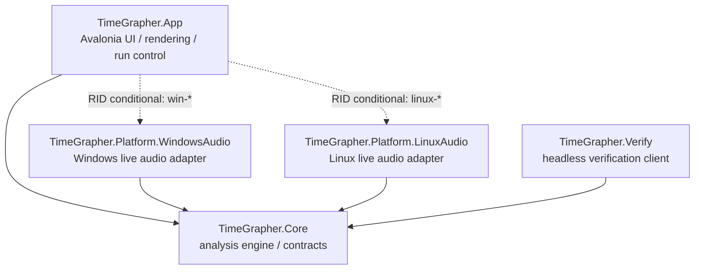
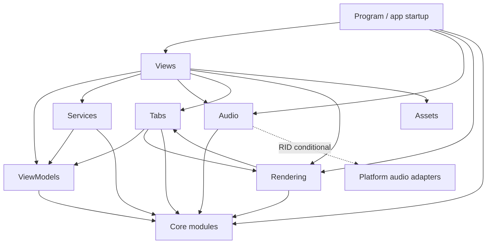
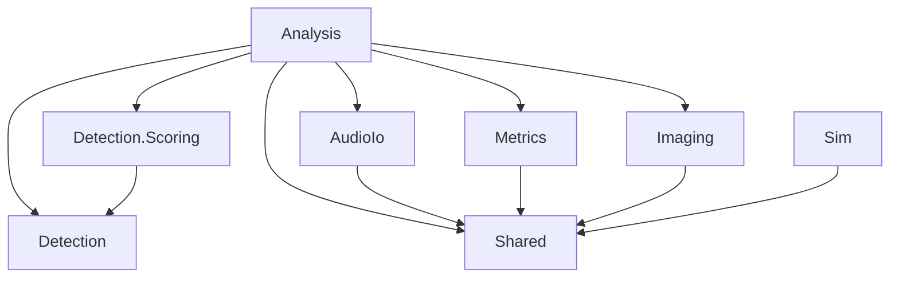

# TimeGrapher Module Uses View - JD 한글 초안

## 1. Primary Presentation

이 view는 숙제의 source dependency diagram 요구를 TimeGrapher의 C#/.NET 구조에 맞게 번역한 것이다. 모든 source file을 전부 나열하는 방식이 아니라, 먼저 architecture dependency 방향을 보여주고 주요 project를 folder/module 단위로 세분화한다.

Notation:

- `A --> B`: A가 B를 사용한다.
- `-. RID conditional .->`: runtime identifier 조건에 따라 포함되는 dependency다.
- `Core --> none`: Core가 UI, platform, external package에 의존하지 않는다는 의미다.



Core dependency rule:

```text
TimeGrapher.Core -> project reference 없음, package reference 없음
```

근거 파일:

- `src/TimeGrapher.App/TimeGrapher.App.csproj`
- `src/TimeGrapher.Core/TimeGrapher.Core.csproj`
- `src/TimeGrapher.Platform.WindowsAudio/TimeGrapher.Platform.WindowsAudio.csproj`
- `src/TimeGrapher.Platform.LinuxAudio/TimeGrapher.Platform.LinuxAudio.csproj`
- `src/TimeGrapher.Verify/TimeGrapher.Verify.csproj`

## 2. Element Catalog

| Element | Responsibility | Uses |
|---|---|---|
| `TimeGrapher.App` | Avalonia UI, graph rendering, tabs, run lifecycle, user settings | `Core`, RID 조건부 platform audio adapters, Avalonia, ScottPlot |
| `TimeGrapher.Core` | detection, metrics, audio contracts, simulation, frame/projector logic | project/package level에서는 없음 |
| `TimeGrapher.Platform.WindowsAudio` | Windows audio capture 구현 | `Core.Shared`, NAudio |
| `TimeGrapher.Platform.LinuxAudio` | Linux/Pi audio capture 구현 | `Core.Shared`, Linux audio CLI stack |
| `TimeGrapher.Verify` | headless detector-quality verification | `Core` |

## 3. Folder / Module-Level Refinement

### App 내부 module



### Core 내부 module



## 4. Context / Scope

Included:

- `src/` 아래 runtime source projects.
- runtime과 관련된 folder/module dependencies.
- `.csproj` project/package reference 근거.

Excluded:

- `bin/`
- `obj/`
- generated files
- publish output
- 모든 개별 `.cs` file inventory
- 별도 testability view가 필요하지 않은 이상 test project detail

## 5. Variability Guide

Platform audio는 RID 조건에 따라 binding된다.

| RID condition | Included adapter |
|---|---|
| development/no RID | WindowsAudio + LinuxAudio |
| `win-*` | WindowsAudio |
| `linux-*` | LinuxAudio |

이 구조는 OS-specific audio code가 `Core`로 새지 않게 하면서, 하나의 App project가 Windows와 Raspberry Pi/Linux target으로 publish될 수 있게 한다.

## 6. Design Rationale / ADR Links

- `Core`는 testability, portability, modifiability를 위해 dependency-free 상태를 유지한다.
- Platform audio는 adapter project로 격리해 OS API가 `Core`로 새지 않게 한다.
- Analysis flow는 partial Pipe-and-Filter로 문서화한다. 관련 ADR은 `ADR-002-partial-pipe-and-filter.ko.md`를 참고한다.

## 7. Related Views

- `TempDocs/JD/ADR-002-partial-pipe-and-filter.ko.md`
- `TempDocs/ADR/ADR_CREATE_GUIDE.md`
