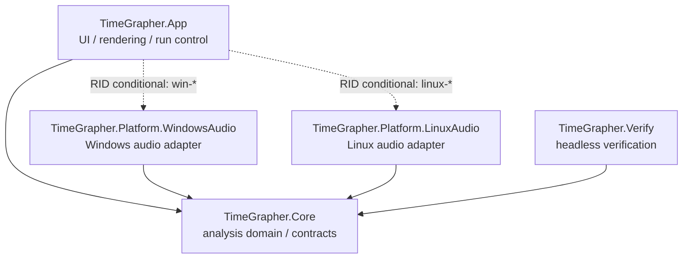
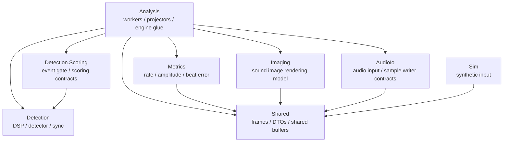

# TimeGrapher Module Uses View - JD

## 1. Primary Presentation

이 view는 TimeGrapher runtime source의 compile-time uses 관계를 보여준다. 범위는 `src/` 아래 runtime projects이며, 개별 `.cs` 파일 전수 목록이 아니라 architecture-level dependency와 Core 내부 주요 module dependency에 초점을 둔다.

Notation:

- `A --> B`: A가 B를 사용한다.
- `-. RID conditional .->`: Runtime Identifier 조건에 따라 포함되는 dependency다.
- `Core --> none`: `TimeGrapher.Core`가 project/package level에서 외부 dependency를 갖지 않는다는 뜻이다.



Core dependency rule:

```text
TimeGrapher.Core -> no project reference, no package reference
```

## 2. Element Catalog

| Element | Responsibility | Uses |
|---|---|---|
| `TimeGrapher.App` | UI, rendering, run lifecycle, settings, runtime composition | `TimeGrapher.Core`, RID 조건부 platform adapters, Avalonia, ScottPlot |
| `TimeGrapher.Core` | detection, metrics, analysis workers, audio contracts, simulation, frame/projector model | none at project/package level |
| `TimeGrapher.Platform.WindowsAudio` | Windows live audio adapter | `TimeGrapher.Core`, NAudio |
| `TimeGrapher.Platform.LinuxAudio` | Linux/Raspberry Pi live audio adapter | `TimeGrapher.Core` |
| `TimeGrapher.Verify` | headless detector-quality verification | `TimeGrapher.Core` |

## 3. Core Internal Uses

Core는 외부 dependency가 없는 분석 domain project지만, 내부 module 간 uses 관계는 다음처럼 정리된다.



이 diagram은 `using TimeGrapher.Core.*` 관계와 주요 module 책임을 기준으로 한 요약이다. Core 내부의 모든 file-level dependency를 표현하지 않는다.

## 4. Scope

Included:

- Runtime source projects under `src/`.
- Project-level uses from `.csproj` references.
- Core 내부 주요 folder/module uses.

Excluded:

- `bin/`, `obj/`, generated files, publish outputs.
- 개별 `.cs` 파일 전체 inventory.
- Test project detail.
- App 내부 UI folder 간 세부 uses. UI layer는 파일 수가 많고 양방향 협력이 있어 별도 UI view에서 다루는 편이 적합하다.

## 5. Variability

Platform audio adapter는 publish RID에 따라 binding된다.

| RID condition | Included adapter |
|---|---|
| development / no RID | WindowsAudio + LinuxAudio |
| `win-*` | WindowsAudio |
| `linux-*` | LinuxAudio |

이 구조는 OS-specific audio code가 `Core`로 새지 않게 하면서 하나의 App project가 Windows와 Raspberry Pi/Linux target으로 publish될 수 있게 한다.

## 6. Design Rationale / Related Decisions

- `Core`는 testability, portability, modifiability를 위해 project/package dependency-free 상태를 유지한다.
- Platform audio는 adapter project로 격리해 OS API와 external audio package dependency가 `Core`로 새지 않게 한다.
- Worker-level Pipe-and-Filter 결정은 `TimeGrapher-Net/docs/ADR/ADR-002(ko).md`에 기록한다.

## 7. Evidence

- `src/TimeGrapher.App/TimeGrapher.App.csproj`
- `src/TimeGrapher.Core/TimeGrapher.Core.csproj`
- `src/TimeGrapher.Platform.WindowsAudio/TimeGrapher.Platform.WindowsAudio.csproj`
- `src/TimeGrapher.Platform.LinuxAudio/TimeGrapher.Platform.LinuxAudio.csproj`
- `src/TimeGrapher.Verify/TimeGrapher.Verify.csproj`
