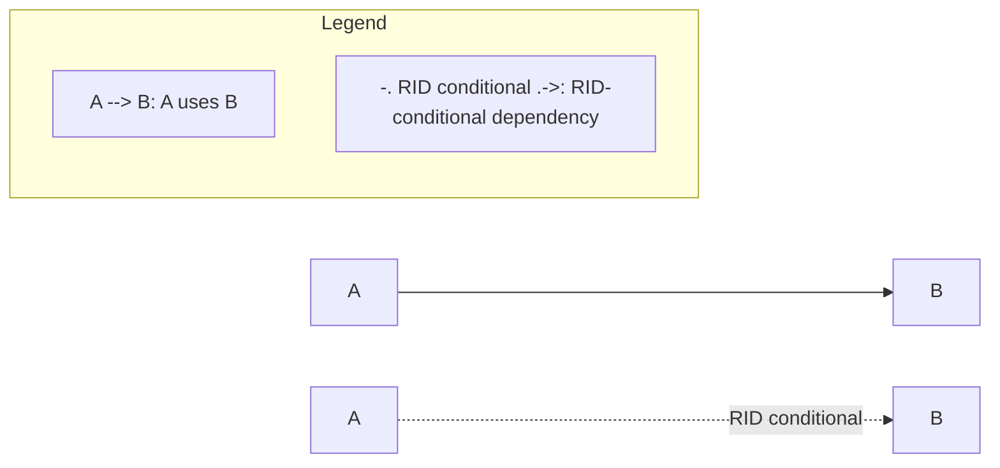
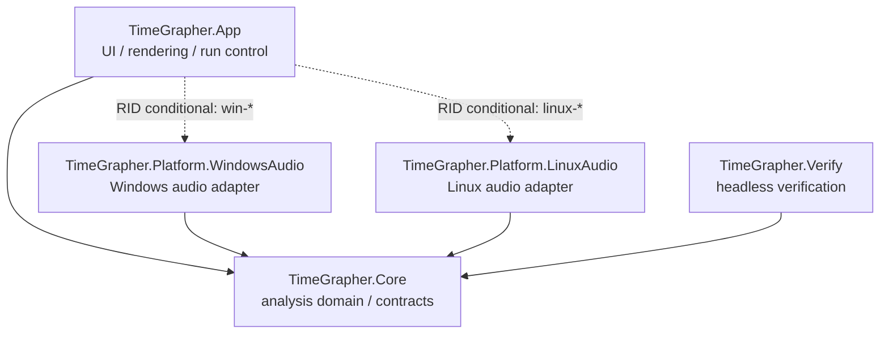
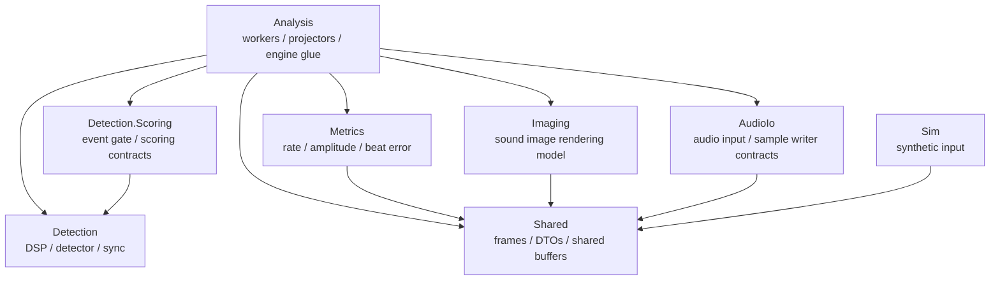

# TimeGrapher Module Uses View - JD

## 1. Primary Presentation

This view shows compile-time uses relationships for TimeGrapher runtime source. The scope is runtime projects under `src/`; it does not enumerate every `.cs` file. The focus is architectural dependency direction and major Core-internal module dependencies.

Notation:

## 2. Element Catalog

| Element | Responsibility | Uses |
|---|---|---|
| `TimeGrapher.App` | UI, rendering, run lifecycle, settings, runtime composition | `TimeGrapher.Core`, platform adapters by RID, Avalonia, ScottPlot |
| `TimeGrapher.Core` | detection, metrics, analysis workers, audio contracts, simulation, frame/projector model | none at project/package level |
| `TimeGrapher.Platform.WindowsAudio` | Windows live audio adapter | `TimeGrapher.Core`, NAudio |
| `TimeGrapher.Platform.LinuxAudio` | Linux/Raspberry Pi live audio adapter | `TimeGrapher.Core` |
| `TimeGrapher.Verify` | headless detector-quality verification | `TimeGrapher.Core` |

## 3. Core Internal Uses

Core is an external-dependency-free analysis domain project, but its internal modules use one another as follows.

This diagram summarizes `using TimeGrapher.Core.*` relationships and major module responsibilities. It is not a complete file-level dependency graph.

## 4. Scope

Included:

- Runtime source projects under `src/`.
- Project-level uses from `.csproj` references.
- Major Core-internal folder/module uses.

Excluded:

- `bin/`, `obj/`, generated files, publish outputs.
- Full inventory of individual `.cs` files.
- Test project detail.
- App-internal UI folder dependencies. The UI layer has many collaborating files and is better handled by a separate UI view.

## 5. Variability

Platform audio adapters are bound by publish RID.

| RID condition | Included adapter |
|---|---|
| development / no RID | WindowsAudio + LinuxAudio |
| `win-*` | WindowsAudio |
| `linux-*` | LinuxAudio |

This keeps OS-specific audio code outside `Core` while allowing one App project to publish for Windows and Raspberry Pi/Linux targets.

## 6. Design Rationale / Related Decisions

- `Core` remains project/package dependency-free to preserve testability, portability, and modifiability.
- Platform audio is isolated in adapter projects so OS APIs and external audio package dependencies do not leak into `Core`.
- The worker-level Pipe-and-Filter decision is recorded in `TimeGrapher-Net/docs/ADR/ADR-002.md`.

## 7. Evidence

- `src/TimeGrapher.App/TimeGrapher.App.csproj`
- `src/TimeGrapher.Core/TimeGrapher.Core.csproj`
- `src/TimeGrapher.Platform.WindowsAudio/TimeGrapher.Platform.WindowsAudio.csproj`
- `src/TimeGrapher.Platform.LinuxAudio/TimeGrapher.Platform.LinuxAudio.csproj`
- `src/TimeGrapher.Verify/TimeGrapher.Verify.csproj`
